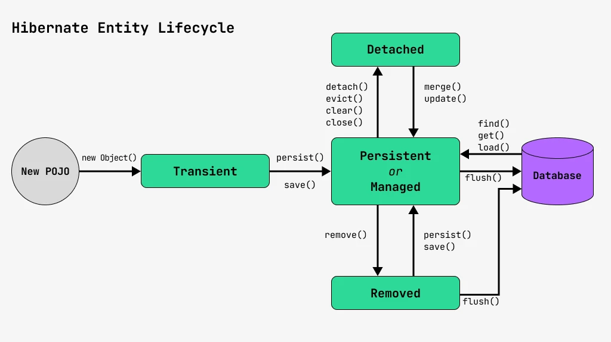

В JPA (Java Persistence API) состояние сущностей управляется различными жизненными циклами, через которые проходят объекты сущностей. Эти состояния определяют, как сущности взаимодействуют с контекстом персистентности и базой данных. Вот основные состояния сущностей в JPA:

### Состояния сущностей в JPA

1. Новый (Transient)
2. Персистентный (Persistent)
3. Отсоединённый (Detached)
4. Удалённый (Removed)



#### 1. Новый (Transient)

Сущность находится в этом состоянии, если она создана, но ещё не привязана к контексту персистентности. Статус Transient значит, что Hibernate понятия не имеет об этом объекте, и никакие действия с объектом не влияют на Hibernate, как и работа Hibernate на этот объект.

**Характеристики**:

- Не управляется JPA, и не связано с базой данных.
- Не имеет идентификатора, который был присвоен базой данных.
- Не будет сохранено или обновлено в базе данных, пока не будет сохранено вручную.

```java
User user = new User(); // Новый объект, не привязан к контексту персистентности
user.setName("Alice");
```

#### 2. Персистентный (Persistent)

Сущность находится в этом состоянии, когда она привязана к текущему контексту персистентности (EntityManager).

- Загрузить объект из Hibernate.
- Сохранить объект в Hibernate.

**Характеристики**:

- Управляется JPA и синхронизируется с базой данных.
- Любые изменения, сделанные с сущностью, будут отслеживаться и синхронизироваться с базой данных при коммите транзакции.
- Объект может быть загружен из базы данных, и любые изменения будут сохранены при завершении транзакции.

```java
EntityManager em = entityManagerFactory.createEntityManager();
em.getTransaction().begin();
User user = new User();
user.setName("Alice");
em.persist(user); // Сущность становится персистентной
em.getTransaction().commit(); // Сущность будет сохранена в базе данных
em.close();
```


#### 3. Отсоединённый (Detached)

Сущность находится в этом состоянии, когда она была удалена из контекста персистентности. 

То есть когда-то объект был присоединен к сессии Hibernate, но затем сессия закрылась или транзакция завершилась, и Hibernate больше не следит за этим объектом.

**Характеристики**:

- Все изменения сделанные в этом состоянии не будут автоматически синхронизироваться с базой данных.
- Сущность может быть вновь привязана к контексту персистентности с помощью метода `merge()`.

```java
EntityManager em = entityManagerFactory.createEntityManager();
User user;
em.getTransaction().begin();
user = em.find(User.class, 1L); // Загружаем сущность в персистентный контекст
em.getTransaction().commit();
em.close(); // Сущность теперь отсоединена
user.setName("Bob"); // Изменения не будут синхронизированы с базой данных
```

#### 4. Удалённый (Removed)

Сущность находится в этом состоянии, когда она была удалена из контекста персистентности и будет удалена из базы данных при следующей транзакции.

**Характеристики**:

- Сущность будет удалена из базы данных при завершении текущей транзакции.
- Можно вернуть сущность в состояние персистентности до завершения транзакции, если необходимо.

```java
EntityManager em = entityManagerFactory.createEntityManager();
em.getTransaction().begin();
User user = em.find(User.class, 1L); // Загружаем сущность
em.remove(user); // Сущность помечена для удаления
em.getTransaction().commit(); // Сущность будет удалена из базы данных
em.close();
```

### Примеры и сценарии в проекте Nihongo Nexus и трекинга времени

#### Пример из проекта Nihongo Nexus:

В проекте, где пользователи исследуют планеты и решают головоломки, сущности могут быть следующими:

- **Новый**: Когда новый `Quest` или `UserProfile` создается, но ещё не сохранен в базе данных.
- **Персистентный**: Когда `UserProfile` загружен в контексте персистентности, и изменения в профиле пользователя будут автоматически сохранены.
- **Отсоединённый**: Когда пользовательская сессия завершена, и изменения в `UserProfile` не будут автоматически сохранены до следующего сохранения.
- **Удалённый**: Когда пользователь или квест удаляются, и эти объекты будут удалены из базы данных при следующем коммите.

#### Пример из приложения трекинга времени:

- **Новый**: Когда создается новый объект `Task` для отслеживания времени, но ещё не сохранен в базе данных.
- **Персистентный**: Когда объект `Task` загружен для изменения и отслеживается контекстом персистентности.
- **Отсоединённый**: После завершения сессии или закрытия приложения, объекты `Task` могут стать отсоединёнными.
- **Удалённый**: Когда задача завершена и удаляется из системы, эта сущность будет удалена из базы данных в следующей транзакции.

### Resourses

- [Жизненный цикл Hibernate Entity-объектов](https://javarush.com/quests/lectures/questhibernate.level11.lecture00)
- 