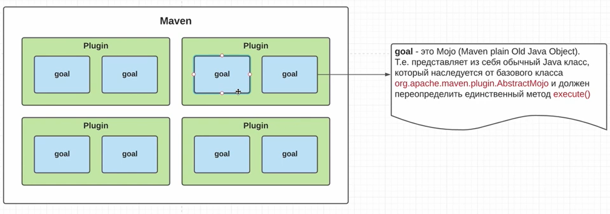

Maven - совокупность плагинов



Goal - Mojo класс, который реализует метод `execute()`, наследуя класс AbstractMojo, который имплементит интерфейс Mojo который содержит - execute, setLog, getLog

Каждый плагин содержит хотя бы help goal - `mvn compiler:help`

#### Goal archetype:generate

[Maven Quickstart Archetype](https://maven.apache.org/archetypes/maven-archetype-quickstart/)
### Plugins

#### Dependency

- dependecy:analyze
- dependecy:tree (-Dverbose)

#### Pom

[Introduction to the POM](https://maven.apache.org/guides/introduction/introduction-to-the-pom.html#Super_POM)


#### [Super Pom](https://maven.apache.org/ref/3.9.9/maven-model-builder/super-pom.html)

Родитель всех pom в мавен

#### Dependency Managment

#### Scopes

- compile
- provided (будет предоставлено, к примеру томкатом jakarta)
- runtime
- system (указываем systemPath)
- test

### Project Lifecycle

#### Default goals

- validate
- compile
- test
- package (make jar, war, ear)
- integration test
- verification (verify created jar)
- install
- site
- deploy


#### Deploy

- distribution-management

```xml
<!-- M2_HOME/donf-->
<!-- ~/.m2/settings.xml-->
<!-- в зависемости от версии, 1.0.0-SNAPSHOT to snapshots, 1.0.0 to release-->
<distributionManagement>
	<snapshotRepository>
		<id>nexus</id>
		<url>http://localhost:9000/repository/maven-snapshots/</url>
	</snapshotRepository>
	<repository>
		<id>nexus</id>
		<url>http://localhost:9000/repository/maven-releases/</url>
	</repository>
</distributionManagement>
```

- settings.xml

```xml
<server>
	<id>nexus</id>
	<username>admin</username>
	<password>123/password>
</server>
```
## Resources

- Курс по Maven от DM dev
- 