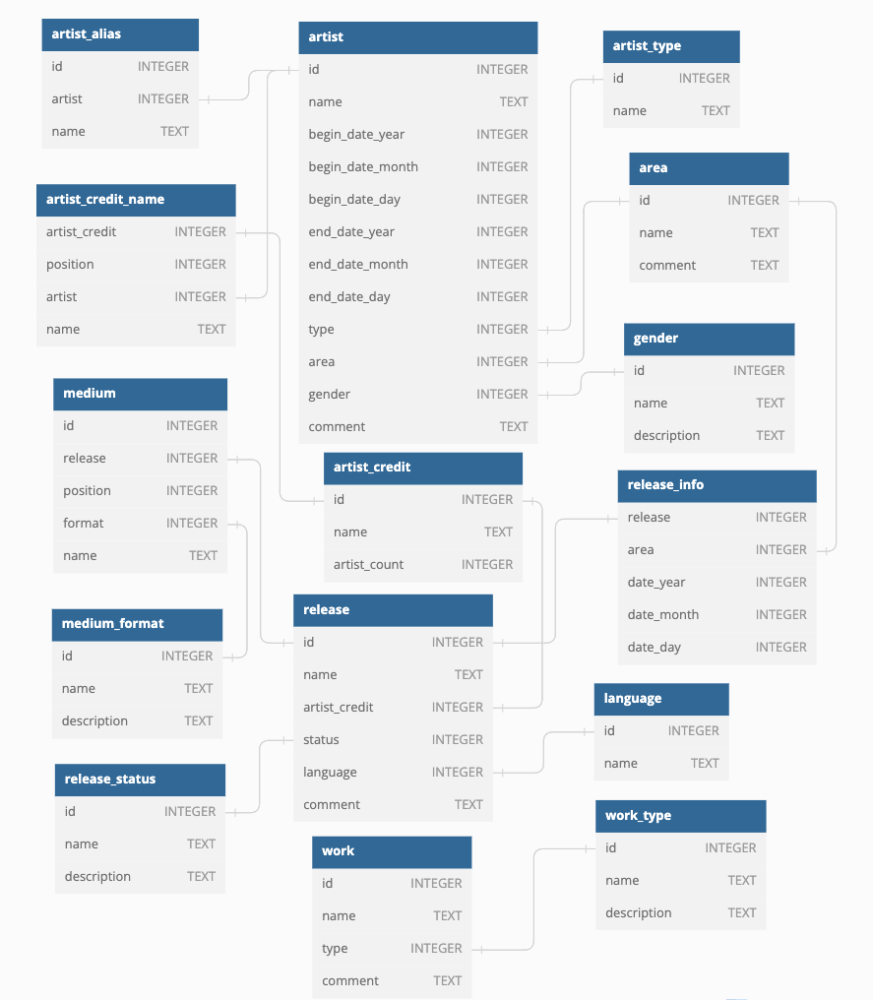
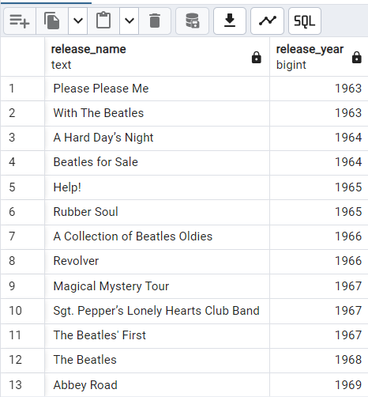
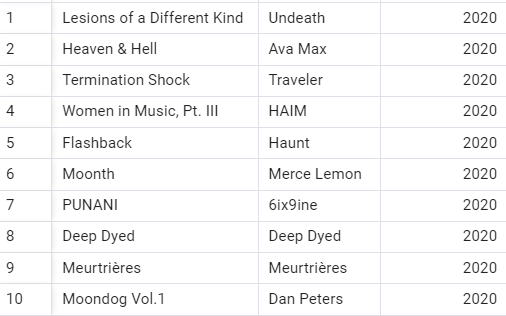
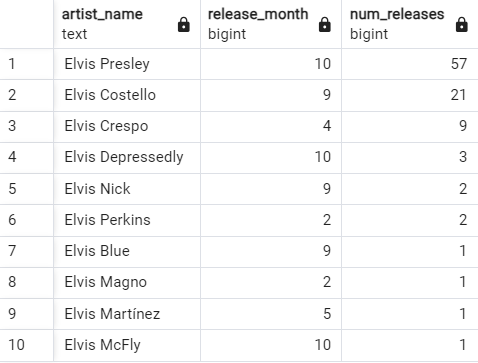
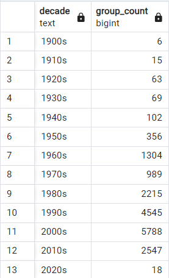
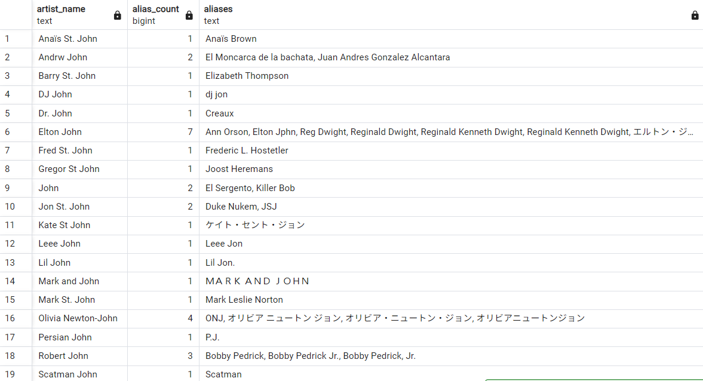

Скачайте дамп базы данных [отсюда](https://disk.yandex.ru/d/BOJi0us734V7PQ). Дальше необходимо восстановить БД в свой PostgreSQL. Инструкции можно найти в этой [статье](https://neon.com/postgresql/postgresql-administration/postgresql-restore-database). 




### Задача 1

#### Описание

Найдите все релизы _The Beatles_ на _12’’ Vinyl_ в United Kingdom до 1970 года.

Укажите название выпуска и год выпуска. Для нескольких выпусков с одинаковым названием следует выбрать тот, который имеет самый ранний год выпуска. Результаты следует упорядочить сначала по году выпуска, а затем по названию выпуска.

_12’’ Vinyl_ - это формат носителя.

Первая строка должна быть такая

```
RELEASE_NAME|RELEASE_YEAR
Please Please Me|1963
```

#### Выполнение

```sql
SELECT
	r.name AS release_name, 
	MIN(r_i.date_year) AS release_year
FROM release r
	JOIN release_info r_i ON r.id = r_i.release
	JOIN area a ON a.id = r_i.area
	JOIN artist_credit ar_cr ON ar_cr.id = r.artist_credit
	JOIN artist_credit_name ar_cr_name ON ar_cr_name.artist_credit = ar_cr.id
	JOIN artist ar ON ar.id = ar_cr_name.artist
	JOIN medium m ON m.release = r.id
	JOIN medium_format m_f ON m_f.id = m.format
WHERE ar.name = 'The Beatles'
AND r_i.date_year < '1970'
AND m_f.name = '12" Vinyl'
AND a.name = 'United Kingdom'
GROUP BY r.name, ar.name
ORDER BY release_year, r.name;
```



### Задача 2

#### Описание

Найдите десять новейших релизов, которые имеют формат носителя _Cassette_.

Выведите название релиза, имя исполнителя, год выпуска. Вы должны отсортировать выходные данные по году выпуска, месяцу и дню в обратном порядке, а затем по названию выпуска и имени исполнителя в алфавитном порядке.

Первая строка должна быть такая

```
RELEASE_NAME|ARTIST_NAME|RELEASE_YEAR
Lesions of a Different Kind|Undeath|2020
```
#### Выполнение

```SQL
SELECT
    r.name AS release_name, 
    ar.name AS artist_name,
    r_i.date_year AS release_year
FROM release r
JOIN release_info r_i ON r.id = r_i.release
JOIN artist_credit ar_cr ON ar_cr.id = r.artist_credit
JOIN artist_credit_name ar_cr_name ON ar_cr_name.artist_credit = ar_cr.id
JOIN artist ar ON ar.id = ar_cr_name.artist
JOIN medium m ON m.release = r.id
JOIN medium_format m_f ON m_f.id = m.format
WHERE m_f.name = 'Cassette'
  AND r_i.date_year IS NOT NULL
ORDER BY 
    r_i.date_year DESC,
    COALESCE(r_i.date_month, 1) DESC,
    COALESCE(r_i.date_day, 1) DESC,
    r.name ASC,
    ar.name ASC
LIMIT 10;
```


### Задача 3

Для каждого исполнителя, который является Person и имя которого начинается с Elvis, найдите месяц с наибольшим количеством релизов. Если есть совпадения по количеству релизов, то следует выбрать более ранний месяц. Окончательный результат должен быть отсортирован в порядке убывания количества релизов, а затем по имени исполнителя в алфавитном порядке. Исключить релизы, в которых месяц не указан.

Первая строка должна быть такая

```
ARTIST_NAME|RELEASE_MONTH|NUM_RELEASES
Elvis Presley|10|57
```

#### Выполнение

```SQL
WITH artist_monthly_stats AS (
    SELECT
        ar.id AS artist_id,
        ar.name AS artist_name,
        r_i.date_month AS release_month,
        COUNT(r.id) AS num_releases,
        ROW_NUMBER() OVER (
            PARTITION BY ar.id 
            ORDER BY COUNT(r.id) DESC, r_i.date_month ASC
        ) AS month_rank
    FROM release r
    JOIN release_info r_i ON r.id = r_i.release
    JOIN artist_credit ar_cr ON ar_cr.id = r.artist_credit
    JOIN artist_credit_name ar_cr_name ON ar_cr_name.artist_credit = ar_cr.id
    JOIN artist ar ON ar.id = ar_cr_name.artist
    JOIN artist_type a_t ON a_t.id = ar.type 
    WHERE ar.name LIKE 'Elvis%'
    AND r_i.date_month IS NOT NULL
    AND a_t.name = 'Person'
    GROUP BY ar.id, ar.name, r_i.date_month
)
SELECT
    artist_name,
    release_month,
    num_releases
FROM artist_monthly_stats
WHERE month_rank = 1
ORDER BY
    num_releases DESC,
    artist_name ASC;
```


### Задача 4

#### Описание

Выведите количество групп, которые формировались в США в каждое десятилетие с 1900 по 2023 год. Распечатайте десятилетие в более удобном формате, создав строку, которая выглядит следующим образом: 2000s. Упорядочите результаты по десятилетиям.

Первая строка должна быть такая

```
DECADE|NUM_ARTIST_GROUP
1900s|6
```
#### Выполнение

```sql
WITH us_groups AS (
    SELECT 
        a.id,
        a.name,
        a.begin_date_year
    FROM 
        artist a
    JOIN 
        artist_type at ON a.type = at.id
    JOIN 
        area ar ON a.area = ar.id
    WHERE 
        at.name = 'Group'
        AND ar.name = 'United States'
        AND a.begin_date_year BETWEEN 1900 AND 2023
        AND a.begin_date_year IS NOT NULL
),
decade_counts AS (
    SELECT 
        (FLOOR(begin_date_year / 10) * 10) AS decade_start,
        (FLOOR(begin_date_year / 10) * 10 || 's') AS decade_display,
        COUNT(*) AS group_count
    FROM 
        us_groups
    GROUP BY 
        (FLOOR(begin_date_year / 10) * 10)
)

SELECT 
    decade_display AS decade,
    group_count
FROM 
    decade_counts
ORDER BY 
    decade_start;
```


### Задача 5

#### Описание

Найдите всех исполнителей, имена которых заканчиваются на _John_. Укажите количество псевдонимов, которые они имеют, и строку, разделенную запятыми, содержащую их псевдонимы. Псевдонимы должны быть объединены в алфавитном порядке. Исключите артистов, чьи псевдонимы содержат слово _John_ (заглавные или строчные). Также исключите артистов, у которых нет псевдонима. Упорядочите результаты по имени исполнителя в алфавитном порядке.

Первая строка должна быть такая

```
ARTIST_NAME|NUM_ALIASES|COMMA_SEPARATED_LIST_OF_ALIASES
Anaïs St. John|1|Anaïs Brown
```

#### Выполнение

```sql
WITH artist_aliases AS (
    SELECT 
        a.id AS artist_id,
        a.name AS artist_name,
        aa.name AS alias_name
    FROM 
        artist a
    JOIN 
        artist_alias aa ON a.id = aa.artist
    WHERE 
        a.name LIKE '%John'
        AND aa.name NOT ILIKE '%John%'
),
filtered_artists AS (
    SELECT 
        artist_id,
        artist_name,
        alias_name
    FROM 
        artist_aliases
    WHERE 
        artist_id IN (
            SELECT artist_id 
            FROM artist_aliases 
            GROUP BY artist_id 
            HAVING COUNT(*) > 0
        )
)
SELECT 
    artist_name,
    COUNT(alias_name) AS alias_count,
    STRING_AGG(alias_name, ', ' ORDER BY alias_name) AS aliases
FROM 
    filtered_artists
GROUP BY 
    artist_id, artist_name
ORDER BY 
    artist_name;
```



