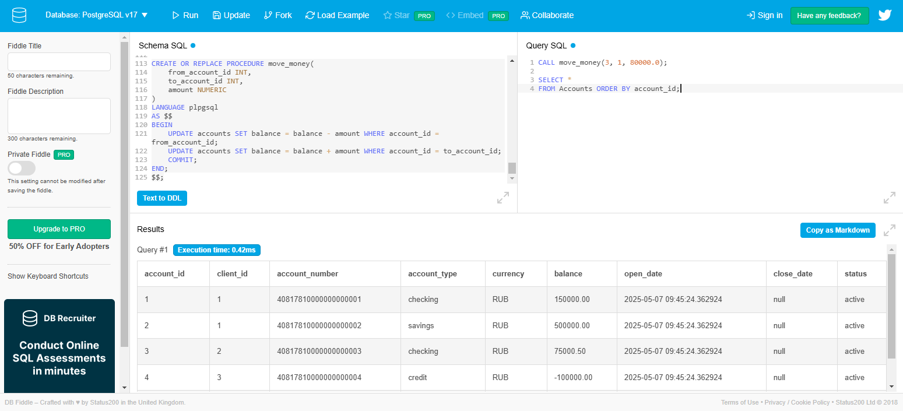

1. Переходим на сайт https://www.db-fiddle.com
2. Меняем базу данных на соответствующую в левом верхнем углу
3. Копируем схему в левое окно, пишем запросы в правом (уточнение, написание процедур, функций, ограничейни и тд пишем также в левом)
 

