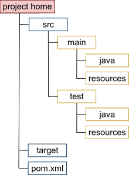

#### Что такое Maven [X]

Apache Maven — это инструмент для управления проектами и сборки программного обеспечения, ориентированный на Java-проекты (хотя может использоваться и для других языков). Он упрощает процесс сборки, управление зависимостями, документацию и развертывание.

1. Управление зависимостями
    - Автоматически загружает библиотеки (JAR-файлы) из репозиториев (например, Maven Central).
    - Устраняет необходимость ручного добавления зависимостей.
2. Стандартизированная структура проекта
    - Предлагает единый шаблон размещения исходного кода, тестов и ресурсов.
3. Жизненный цикл сборки (Build Lifecycle)
    - Определяет этапы компиляции, тестирования, упаковки и развертывания.
    - Основные фазы: `compile`, `test`, `package`, `install`, `deploy`.
4. Плагины (Plugins)
    - Расширяет функциональность (например, компиляция, создание JAR/WAR, генерация отчетов).
5. POM (Project Object Model)
    - Файл `pom.xml` — это сердце Maven, где описываются настройки проекта, зависимости и плагины.

#### Что такое Gradle ? [X]

Gradle — это современный инструмент автоматизации сборки (build tool), который управляет компиляцией, тестированием, упаковкой и развертыванием кода. Он используется в Java, Kotlin, Android и других экосистемах.

- Инкрементальные сборки (пересобирает только измененные части).
- Кеширование результатов задач.
- Параллельное выполнение задач (ускоряет сборку).
- Конфигурация пишется на Groovy (лаконичный синтаксис) или Kotlin (типобезопасность).
- Можно создавать кастомные задачи (tasks) и плагины.

#### Опишите структура pom файла ? [X]

В среде Maven «собранные» проекты называются артефактами, а не приложениями или программами. Термин выбран потому, что готовый проект не всегда является исполняемым приложением — он может быть модулем, плагином или библиотекой.

Для описания структуры проектов Apache Maven применяет разновидность языка XML под названием POM (сокращение от Project Object Model, «объектная модель проекта»). Основные теги POM:

- project — базовый тег, содержит всю информацию о приложении;
- modelVersion — генерируется автоматически, текущая версия — 4.0.0;
- groupId — пакет, к которому принадлежит приложение, с добавлением имени домена;
- artifactId — уникальный ID артефакта;
- version — создается и обновляется автоматически, во время разработки к номеру версии добавляется суффикс -SNAPSHOT.

Информация, заключенная в тегах, является минимально необходимым описанием проекта (minimal POM), представленным в файле pom.xml. Пример POM-файла выглядит так:

```xml
<project>
  <modelVersion>4.0.0</modelVersion>
  <groupId>com.mycompany.app</groupId>
  <artifactId>my-app</artifactId>
  <version>1</version>
</project>
```

#### Что такое Super POM ? [X]

Super POM - это POM по умолчанию в Maven. Все POM расширяют Super POM, если они явно не заданы, это означает, что конфигурация, указанная в Super POM, наследуется POM, созданными вами для ваших проектов.

 [Super POM for the latest Maven 3 release](https://maven.apache.org/maven-model-builder/super-pom.html)

#### Опишите структуру проекта на maven ? [X]



Project home - корневая директория проекта. 
src - папка, в которой лежат исходники проекта - сам исходный код, файлы конфигураций библиотек и прочее, что нужно проекту для запуска и работы приложения или тестов. В целом, ничего принципиально нового здесь нет.

#### Опишите структуру проекта на gradle ? [X]

```
my-project/  
├── build.gradle(.kts)      // Основной файл конфигурации сборки  
├── settings.gradle(.kts)   // Настройки проекта (имя, подпроекты)  
├── gradle/  
│   └── wrapper/           // Gradle Wrapper (версия Gradle)  
│       ├── gradle-wrapper.jar  
│       └── gradle-wrapper.properties  
├── src/  
│   ├── main/              | Основной код  
│   │   ├── java/          |   → Java-классы  
│   │   ├── kotlin/        |   → Kotlin-классы  
│   │   └── resources/     |   → Ресурсы (properties, XML, JSON)  
│   └── test/              | Тесты  
│       ├── java/          |   → Java-тесты  
│       ├── kotlin/        |   → Kotlin-тесты  
│       └── resources/     |   → Тестовые ресурсы  
└── build/                 // Папка сборки (создается после `gradle build`)  
    ├── classes/           // Скомпилированные классы  
    ├── libs/              // Собранные JAR/WAR-файлы  
    └── reports/           // Отчёты (тесты, анализ кода)  
```

#### Как управлять зависимостями ? [X]

Определение зависимостей : В `pom.xml` вы можете добавить зависимости с помощью тега `<dependencies>`. Например:

```java
<dependencies>
    <dependency>
        <groupId>junit</groupId>
        <artifactId>junit</artifactId>
        <version>4.13.2</version>
        <scope>test</scope>
    </dependency>
</dependencies>
```

Здесь:
- groupId — идентификатор организации или группы (например, org.springframework).
- artifactId — имя конкретной библиотеки.
- version — версия библиотеки.
- scope — область видимости зависимости (например, compile, test, provided).

Репозитории : Maven загружает зависимости из репозиториев, таких как Maven Central или частных репозиториев. Если зависимость не найдена локально, Maven скачивает её из удалённого репозитория.
    
Передача зависимостей : Когда вы добавляете зависимость, она может "тянуть" за собой другие библиотеки, от которых зависит сама. Это называется транзитивными зависимостями .

#### Что такое транзитивная зависимость ? [X]

Транзитивная зависимость — это зависимость, которая автоматически добавляется в ваш проект, потому что она требуется одной из явно указанных зависимостей.

Если `library-a` зависит от другой библиотеки, например `library-b`, то Maven автоматически добавит `library-b` в ваш проект. Это и есть транзитивная зависимость.

#### Что такое task в gradle ? [X]

  `Task` (задача) в Gradle — это атомарная операция, выполняемая во время сборки проекта. Примеры стандартных задач:

- `compileJava` — компиляция Java-кода.
- `test` — запуск тестов.
- `jar` — сборка JAR-файла.

Каждая задача:

1. Имеет действия (actions), которые выполняются последовательно.
2. Может зависеть от других задач (`dependsOn`).
3. Может иметь входные (inputs) и выходные (outputs) данные для инкрементальных сборок.

#### Task в Gradle vs goals в Maven ? [X]

1. Гибкость vs Стандартизация
    - В Gradle вы сами определяете порядок выполнения через `dependsOn`.
    - В Maven порядок фиксированный (`clean` → `compile` → `test` → ...).
2. Инкрементальность
    - Gradle оптимизирует сборку, пропуская задачи с неизмененными `inputs/outputs`.
    - Maven всегда выполняет все фазы (если не указан `-DskipTests` и т.д.).
3. Расширяемость
    - В Gradle кастомная задача — это 5 строк кода.
    - В Maven нужно писать плагин на Java/Mojo.

| **Концепция**                  | **Gradle**                                                                        | **Maven**                                                                                                     | **Сходства и различия**                                                                     |
| ------------------------------ | --------------------------------------------------------------------------------- | ------------------------------------------------------------------------------------------------------------- | ------------------------------------------------------------------------------------------- |
| **Минимальная единица работы** | Task (например, `compileJava`, `test`).                                           | Goal плагина (например, `compiler:compile`, `**surefire**:test`).                                             | Оба выполняют конкретные действия, но задачи в Gradle гибче.                                |
| **Жизненный цикл**             | Нет жесткого жизненного цикла. Задачи зависят друг от друга через `dependsOn`.    | Phase (например, `compile`, `test`, `package`). Фазы выполняются последовательно.                             | В Maven фазы — это "шаги", а в Gradle — зависимости между задачами.                         |
| **Плагины**                    | Плагины добавляют новые задачи (например, `java` плагин добавляет `compileJava`). | Плагины привязывают goals к фазам (например, `maven-compiler-plugin` привязывает `compile` к фазе `compile`). | В Gradle плагины расширяют функциональность через задачи, в Maven — через привязку к фазам. |
| **Кастомизация**               | Можно создавать любые кастомные задачи и управлять их зависимостями.              | Кастомизация только через настройку плагинов или создание своих (сложнее).                                    | Gradle дает больше свободы.                                                                 |


#### Как создать свою задачу (custom task) ? [X]

```groovy
abstract class MyTask extends DefaultTask {
    @TaskAction
    def run() {
        println "Custom task executed!"
    }
}

tasks.register('myTask', MyTask)

tasks.register('greet') {
    group = 'Custom'       // Группа для организации задач (видна в `gradle tasks`)
    description = 'Prints a greeting' // Описание задачи

    doFirst {
        println 'Starting greeting...'
    }

    doLast {
        println "Hello, ${project.name}!"
    }
}

tasks.register("buildAll") {
    dependsOn("clean", "compileJava", "test", "jar")
}
```

#### Как решать конфликты зависимостей ? [X]

Конфликты зависимостей в Maven возникают, когда две или более библиотеки требуют разные версии одной и той же зависимости. Это может привести к ошибкам сборки или выполнения, если выбранная версия несовместима с требованиями проекта. Рассмотрим основные способы решения таких конфликтов.

```
[INFO] +- org.springframework.boot:spring-boot-starter-web:jar:2.7.0:compile
[INFO] |  +- org.springframework:spring-core:jar:5.3.10:compile
[INFO] |  \- com.fasterxml.jackson.core:jackson-databind:jar:2.13.0:compile
[INFO] \- com.example:library-a:jar:1.0.0:compile
[INFO]    \- com.fasterxml.jackson.core:jackson-databind:jar:2.12.3:compile
```

Здесь видно, что `jackson-databind` имеет две версии: `2.13.0` и `2.12.3`. Maven выберет версию `2.13.0`, так как она "ближе" к корню дерева зависимостей.

**Использовать `<dependencyManagement>`** (Maven) или `resolutionStrategy` (Gradle):

```xml
<dependencyManagement>
    <dependencies>
        <dependency>
            <groupId>com.example</groupId>
            <artifactId>C</artifactId>
            <version>2.0</version>
        </dependency>
    </dependencies>
</dependencyManagement>
```

Исключить конфликтную зависимость:

```xml
<dependency>
    <groupId>com.example</groupId>
    <artifactId>A</artifactId>
    <exclusions>
        <exclusion>
            <groupId>com.conflict</groupId>
            <artifactId>C</artifactId>
        </exclusion>
    </exclusions>
</dependency>
```

Gradle: принудительно задать версию:

```groovy
configurations.all {
    resolutionStrategy.force("com.example:C:2.0")
}
```

#### Что такое плагины в Maven и как они работают во время сборки ? [X]

Плагины в Maven — это модули, которые выполняют конкретные задачи во время сборки проекта (например, компиляция кода, упаковка в JAR, запуск тестов и т. д.). Они расширяют функциональность Maven и позволяют настраивать процесс сборки.

- Maven имеет стандартные фазы (compile, test, package, install, deploy и др.).
- Плагины привязываются к этим фазам и выполняются автоматически при прохождении соответствующей фазы.
- Например, maven-compiler-plugin выполняется на фазе compile.

#### Какие есть scope у зависимостей ? [X]

|Scope|Описание|
|---|---|
|**compile**|(По умолчанию) Доступна во всех фазах и передается зависимым проектам.|
|**provided**|Зависимость предоставляется средой выполнения (например, Servlet API). Не включается в итоговый артефакт.|
|**runtime**|Требуется только во время выполнения (например, JDBC-драйвер). Не нужна для компиляции.|
|**test**|Только для тестов (например, JUnit). Не включается в production-сборку.|
|**system**|Аналогичен `provided`, но путь к JAR указывается явно (`<systemPath>`). Не рекомендуется.|
|**import**|Используется только в `<dependencyManagement>` для импорта зависимостей из другого POM.|
#### Что такое optional зависимость ? [X]

Optional-зависимость — это зависимость, которая помечена как необязательная (`<optional>true</optional>`). Она не передается транзитивно другим проектам, даже если они зависят от текущего.

Если проект `A` зависит от `B`, а `B` имеет optional-зависимость от `lombok`, то `A` **не** получит `lombok` автоматически.

Используется для зависимостей, которые нужны только для специфической функциональности и не должны навязываться другим проектам.

#### В чем разница между наследованием и агрегацией в Maven ? [X]

| Характеристика      | Наследование (`<parent>`)                                          | Агрегация (многомодульный проект, `<modules>`)                      |
| ------------------- | ------------------------------------------------------------------ | ------------------------------------------------------------------- |
| **Цель**            | Переиспользование конфигурации (например, зависимостей, плагинов). | Управление несколькими модулями как единым проектом.                |
| **Реализация**      | В `pom.xml` указывается `<parent>`.                                | В `pom.xml` корневого проекта перечисляются `<modules>`.            |
| **Общие настройки** | Наследуются свойства, зависимости, плагины и т. д.                 | Каждый модуль имеет свой `pom.xml`, но сборка запускается из корня. |
| **Пример**          | Общий `parent-pom` для компании.                                   | Микросервисный проект с модулями `api`, `service`, `db`.            |
#### Основные фазы жизненный цикл сборщика Maven ? [X]

- Clean Lifecycle (очистка):
    - pre-clean: Фаза, выполняющая действия перед началом очистки.
    - clean: Удаляет все файлы, сгенерированные предыдущими сборками, включая директорию target.
    - post-clean: Фаза, выполняющая действия после завершения очистки.
- Default Lifecycle (основной жизненный цикл):
    - validate: Проверяет, что проект правильно сконфигурирован и готов к сборке.
    - compile: Компилирует исходный код проекта.
    - test: Выполняет модульные тесты, обычно используя фреймворки, такие как JUnit.
    - package: Создаёт исполнимый артефакт (например, JAR, WAR или EAR).
    - verify: Проверяет, что артефакт прошёл все проверки и тесты.
    - install: Устанавливает артефакт в локальный репозиторий, чтобы его могли использовать другие проекты.
    - deploy: Отправляет артефакт в удалённый репозиторий, чтобы его могли использовать другие разработчики.
- Site Lifecycle (создание сайта):
    - pre-site: Фаза перед созданием сайта.
    - site: Генерирует сайт проекта (обычно в формате HTML).
    - post-site: Выполняет действия после создания сайта.
    - site-deploy: Разворачивает сайт проекта на сервере.

[Жизненный цикл сборки в Maven](../../../_inforage/Java/Core/Жизненный%20цикл%20сборки%20в%20Maven.md)
#### Какие таски гредла знаешь ? [X]

- **`clean`** – удаляет папку `build/`.
- **`build`** – компилирует, тестирует и собирает артефакт.
- **`assemble`** – собирает артефакт без тестов.
- **`test`** – запускает unit-тесты.
- **`check`** – запускает проверки (тесты, статический анализ).
- **`publish`** – публикует артефакт в репозиторий (Maven, Ivy).
- **`jar`** – собирает JAR-файл.
- **`compileJava`** / **`compileKotlin`** – компиляция кода.
- **`run`** – запускает приложение (если есть плагин `application`).

Можно посмотреть все задачи в проекте:
```bash
gradle tasks
```

#### Техническая Задача (Архитектура). Спроектировать микросервис. Какой инструмент сборки выберешь?


#### Какие синтаксисы бывают в gradle и какой ты выберешь и почему?

#### Что такое task в контексте gradle? Какие дополнительные вещи можно прописывать в gradle?

#### Расскажи про зависимости библиотек в maven?

#### Подключаем ряд библиотек, каждая за собой тянет еще ряд библиотек. Может получиться ситуация, когда какая-то из библиотек из разных зависимостей подключается, имеет разные версии. Как нам быть?

#### Писали ли кастомные команды в Maven ?  


#### Какие приходилось писать расширения для gradle?

#### Чем отличаются команды implementation и compile?

###### Чем отличается package от install'а?
###### А install от deploy чем отличается?
###### У нас есть Nexus и наш локальный репозиторий. Мы хотим сделать какие-то изменения в своей библиотеке.
###### Я скачаю чужую библиотеку и делаю install, что произойдёт?
###### Я заинсталлил библиотеку, она попала в мой локальный репозиторий. Затем эта библиотека изменилась, что мне сделать чтобы эта обновлённая библиотека появилась у меня?
###### Что если я не хочу постоянно делать install новых версий? Версий у библиотеки нет

###### Что такое транзитивные зависимости?

###### Gradle выполняет задачи асинхронно или синхронно?

###### Как скипнуть тесты с прогонов

###### В чем разница Dependency Management vs Dependencies?

###### Package vs Install

###### Как поменять репозиторий на удаленный

- maven - settings.xml
- gradle - repositories


### Resources

- [Что такое сборщик продукта](https://www.software-testing.ru/library/testing/testing-for-beginners/3750-product-assembler)
- 