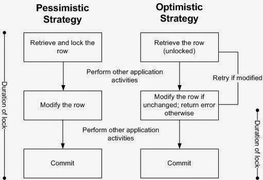
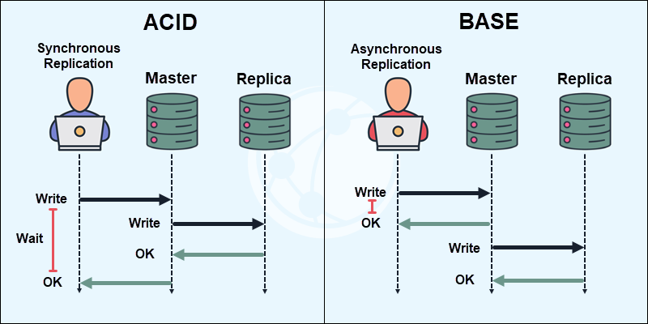
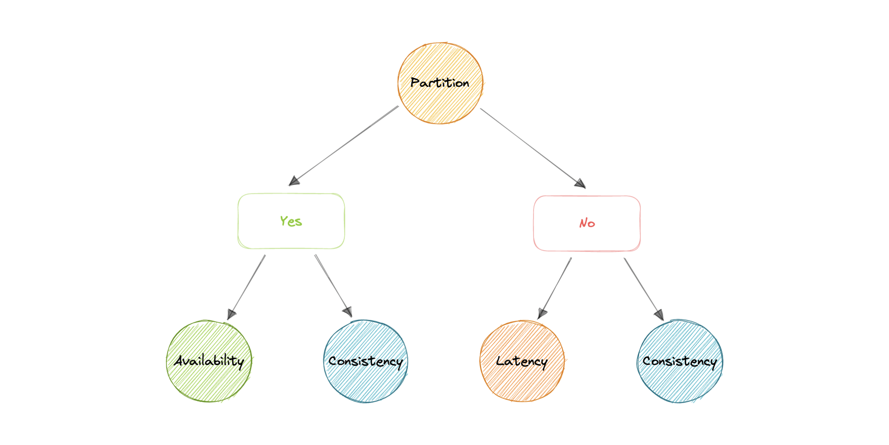
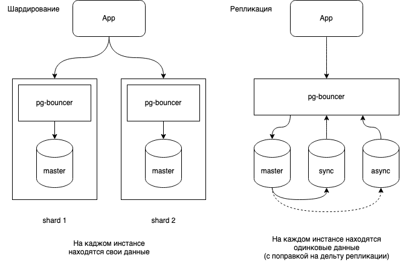

### Нормализация
#### Что такое нормализация базы данных?

Нормализация базы данных — это процесс организации данных в реляционной базе данных для минимизации избыточности и зависимости данных. Этот процесс включает в себя разделение больших таблиц на меньшие и определение отношений между ними, чтобы обеспечить целостность данных.

1. Устранение избыточности данных: Снижение дублирования информации.
2. Устранение аномалий обновления: Предотвращение проблем при добавлении, удалении или изменении данных.
3. Упрощение структуры данных: Облегчение понимания и работы с данными.
4. Обеспечение целостности данных: Поддержание точности и согласованности информации.

#### Какие нормальные формы знаешь? [X]

1. 1НФ: Все атрибуты атомарны (нет массивов/списков в ячейках).
2. 2НФ: 1НФ + нет частичных зависимостей от ключа (все поля зависят от всего PK).

Переменная отношения находится во второй нормальной форме тогда и только тогда, когда она находится в первой нормальной форме, и каждый неключевой атрибут неприводимо (функционально полно) зависит от ее потенциального ключа.

3. 3НФ: 2НФ + нет транзитивных зависимостей (поля зависят только от PK).

Переменная отношения находится в третьей нормальной форме, когда она находится во второй нормальной форме, и отсутствуют транзитивные функциональные зависимости неключевых атрибутов от ключевых. Простыми словами: любой столбец таблицы должен зависеть только от ключевого столбца.

4. BCNF (Бойса-Кодда): Усиленная 3НФ (нет зависимостей атрибутов PK от не-PK полей / все части первичного ключа не зависят от неключевых атрибутов.).
5. 4НФ: Нет многозначных зависимостей.
6. 5НФ: Нет зависимостей соединения (таблицу нельзя разбить на меньшие без потери информации).

Обычно хватает 3НФ или BCNF. 4НФ и 5НФ — для сложных аналитических систем.

#### Проблемы при неправильной нормализации базы данных

1. Избыточность данных: В результате неправильной нормализации может возникнуть дублирование информации, что ведет к увеличению объема хранимых данных.
2. Аномалии обновления: Изменения в одной части базы могут требовать изменений в нескольких местах, что увеличивает риск ошибок.
3. Сложность запросов: Сложные структуры могут привести к затруднениям при написании SQL-запросов.

#### Функциональная зависимость в контексте нормализации БД

Функциональная зависимость — это отношение между атрибутами, где значение одного атрибута (или группы атрибутов) определяет значение другого атрибута. Например, если у нас есть таблица "Студенты", то номер студента (первичный ключ) функционально определяет имя студента.

#### Денормализация и ее полезность

Денормализация — это процесс обратный нормализации, при котором данные объединяются для повышения производительности запросов. Она может быть полезна в ситуациях, когда необходимо оптимизировать чтение данных для отчетов или анализа, особенно в системах с высокой нагрузкой на чтение.
#### Примеры денормализации, в сторону оптимизации [X]

- Хранение имени пользователя в заказе (вместо только `user_id`) — ускоряет выборки без JOIN.
- Добавление колонки `total_amount` в таблицу заказов (сумма всех позиций), чтобы не считать её агрегацией каждый раз.
- Хранение списка тегов товара как JSON-массива в таблице товаров (вместо отдельной таблицы `product_tags`).
- Таблица `users` с полями `order_count` и `last_order_date` — избавляет от частых `COUNT/GROUP BY`.
- [Подробнее](../../../_inforage/Базы_данных/Денормализация.md)

### JOIN
#### Что такое JOIN в контексте SQL?

JOIN в SQL — это операция, которая позволяет объединять строки из двух или более таблиц на основе связанных между ними полей. JOIN используется для извлечения данных из нескольких таблиц, которые имеют логическую связь, что позволяет создавать более сложные и информативные запросы.

- JOIN использует индексы обеих таблиц, что снижает количество сканируемых строк.
- Подзапрос может выполняться для каждой строки, вызывая множественные обращения к данным.
- JOIN позволяет оптимизатору БД строить более эффективный план выполнения, используя сортировку и хеш-таблицы.
- Подзапрос может быть преобразован в JOIN самим оптимизатором, но не всегда.
- JOIN выполняет операцию объединения на этапе выборки, тогда как подзапрос может создавать временные таблицы.

#### Какие есть виды JOIN's

- INNER JOIN. Если не уточнить тип соединения (JOIN), то по умолчанию применяется INNER JOIN. При INNER JOIN (внешнее соединение) выбираются только совпадающие по условию объединения данные из обеих таблиц. Порядок таблиц в запросе не важен.
- LEFT JOIN (левое внешнее объединение) — то же самое, что LEFT OUTER JOIN. В результат попадают совпадающие по ключу данные обеих таблиц и все записи из левой таблицы, для которых не нашлось пары в правой.
- RIGHT JOIN (правое внешнее соединение) — то же самое, что RIGHT OUTER JOIN. В результат объединения попадают совпадающие по ключу записи обеих таблиц и все данные из правой таблицы, для которых не нашлось пары в левой.
- FULL OUTER JOIN (полное внешнее соединение) — то же самое, что FULL JOIN. В результат объединения попадают совпадающие по ключу записи обеих таблиц и все строки из этих двух таблиц, для которых пар не нашлось. Порядок таблиц в запросе не важен.
- CROSS JOIN (перекрёстное объединение) возвращает декартово произведение: все возможные комбинации соединения записей из первой и второй таблиц.

#### Основная разница между INNER JOIN и OUTER JOIN

• INNER JOIN: Возвращает только те строки, которые имеют совпадения в обеих таблицах. Если в одной из таблиц нет соответствующих записей, то эти строки не включаются в результат.

• OUTER JOIN: Возвращает все строки из одной таблицы и соответствующие строки из другой. Если соответствующих строк нет, то в результирующей таблице будут NULL-значения для отсутствующих данных.

#### Объясните, как работает RIGHT JOIN и в каких случаях его лучше использовать?

RIGHT JOIN (или RIGHT OUTER JOIN) возвращает все строки из правой таблицы и соответствующие строки из левой таблицы. Если соответствующих строк в левой таблице нет, то результат будет содержать NULL-значения для столбцов левой таблицы. RIGHT JOIN полезен, когда необходимо получить все данные из правой таблицы, даже если некоторые записи не имеют соответствий в левой таблице.
#### Какие типы OUTER JOIN существуют в SQL?

Существует три основных типа OUTER JOIN:

1. LEFT OUTER JOIN: Возвращает все строки из левой таблицы и соответствующие строки из правой.
2. RIGHT OUTER JOIN: Возвращает все строки из правой таблицы и соответствующие строки из левой.
3. FULL OUTER JOIN: Возвращает все строки из обеих таблиц, включая те, которые не имеют соответствий.

#### LEFT JOIN vs LEFT OUTER JOIN [X]

- `LEFT JOIN` и `LEFT OUTER JOIN` — это одно и то же.
- Возвращает все строки из левой таблицы + совпадения из правой.
- Если совпадений нет, правые поля будут `NULL`.

#### Как реализовать FULL OUTER JOIN, если этот тип JOIN не поддерживается напрямую?

Если FULL OUTER JOIN не поддерживается в вашей системе управления базами данных (СУБД), его можно реализовать с помощью объединения LEFT JOIN и RIGHT JOIN:

```sql
SELECT *
FROM table1
LEFT JOIN table2 ON table1.id = table2.id
UNION
SELECT *
FROM table1
RIGHT JOIN table2 ON table1.id = table2.id;
```

#### Что такое NATURAL JOIN в SQL и как он отличается от INNER JOIN?

NATURAL JOIN автоматически соединяет таблицы по всем столбцам с одинаковыми именами. Это значит, что при использовании NATURAL JOIN не нужно явно указывать условия соединения. В отличие от INNER JOIN, который требует явного указания условий соединения, NATURAL JOIN может привести к неожиданным результатам, если у таблиц есть несколько столбцов с одинаковыми именами.

####  Что такое Lateral join ?

Это тип объединения (JOIN) в SQL, который позволяет подзапросу ссылаться на столбцы из таблиц, уже упомянутых ранее в блоке FROM запроса.

```SQL
SELECT e.name, p.project_name
FROM employees e
JOIN LATERAL (
    SELECT p.project_name
    FROM projects p
    WHERE p.employee_id = e.id -- e. in employees from outer 
    ORDER BY p.id DESC
    LIMIT 1
) AS p;

```

#### JOIN vs UNION ? [X]

Основное различие между JOIN и UNION заключается в том, что JOIN объединяет данные из разных таблиц, создавая новые столбцы, тогда как UNION объединяет результаты нескольких SELECT-запросов, создавая новые строки.

```sql
SELECT first_name, middle_name, "teacher" as role FROM Teacher
UNION
SELECT first_name, middle_name, "student" as role FROM Student
```

Ключевые отличия:
- JOIN работает с отношениями между таблицами, UNION — с аналогичной структурой данных
- JOIN расширяет таблицу вширь (добавляет колонки), UNION — вдоль (добавляет строки)
- UNION требует одинакового числа колонок и совместимых типов данных
    
Когда что использовать:
- JOIN — когда нужно собрать данные из связанных таблиц (например, пользователь + его заказы)
- UNION — когда нужно объединить однотипные данные из разных источников (например, список всех людей в системе)
#### Union vs Union ALL [X]

- UNION — если важно исключить повторы (например, список уникальных городов из разных таблиц).
- UNION ALL — если дубли не мешают (логирование, объединение похожих данных без проверки).

```sql
SELECT name FROM employees
UNION # Вернёт только уникальные имена из обеих таблиц.
SELECT name FROM customers

SELECT name FROM employees
UNION ALL # Вернёт все имена, включая повторяющиеся.
SELECT name FROM customers
```
#### Какие стратегии можно использовать для оптимизации запросов с агрегатными функциями на больших объемах данных?

• Индексы: Создание индексов на колонках, по которым выполняются фильтрации и группировки.
• Сжимаемые таблицы: Использование таблиц сжатия для уменьшения объема данных.
• Партиционирование: Разделение больших таблиц на более мелкие части для ускорения обработки.
• Материализованные представления: Использование предрассчитанных агрегатов в материализованных представлениях.
• Сокращение объема данных: Фильтрация данных перед агрегацией с помощью WHERE.

### Индексы

#### Как реализовать составной первичный ключ в SQL?

Составной первичный ключ создается с использованием нескольких столбцов. Пример:

```sql
CREATE TABLE order_items (
    order_id INT,
    product_id INT,
    quantity INT,
    PRIMARY KEY (order_id, product_id)
);
```
#### Для чего используются индексы в реляционных базах данных?

Индексы в реляционных базах данных используются для ускорения операций поиска и доступа к данным. Они позволяют быстро находить строки в таблице без необходимости сканирования всей таблицы, что значительно повышает производительность запросов, особенно при работе с большими объемами данных.

#### Что такое кластеризованный и некластеризованный индекс?

• Кластеризованный индекс: Это индекс, который определяет физический порядок хранения строк в таблице. В таблице может быть только один кластеризованный индекс, так как строки могут быть упорядочены только одним способом. Кластеризованный индекс обычно создается на первичном ключе.
• Некластеризованный индекс: Это индекс, который хранит указатели на физические строки в таблице, а не сами строки. В таблице может быть несколько некластеризованных индексов. Они содержат значения индекса и ссылки на строки, что позволяет быстро находить данные, но не меняет порядок их хранения.

| **СУБД**           | **Поддержка**                   | **Особенности**                                                                  |
| ------------------ | ------------------------------- | -------------------------------------------------------------------------------- |
| **SQL Server**     | ✅ Да                            | Один кластеризованный индекс на таблицу, обычно PK.                              |
| **MySQL (InnoDB)** | ✅ Да                            | PK всегда кластеризован. Без PK — скрытый `rowid`.                               |
| **PostgreSQL**     | ⚠️ Частично (`CLUSTER` команда) | Требует ручного вызова `CLUSTER`, не поддерживает автоматическое упорядочивание. |
| **Oracle**         | ❌ Нет (есть IOT)                | Index-Organized Tables (IOT) — альтернатива.                                     |
| **SQLite**         | ❌ Нет                           | Использует `rowid` для неявной сортировки.                                       |

#### Какие плюсы и минусы вы можете выделить при использовании индексов?

Плюсы:
• Ускорение операций поиска и выборки данных.
• Улучшение производительности запросов, особенно с условиями WHERE, JOIN и сортировкой (ORDER BY).
• Упрощение выполнения агрегатных функций (например, COUNT, SUM).
Минусы:
• Увеличение времени на операции вставки, обновления и удаления данных, так как индексы также нужно обновлять.
• Дополнительные затраты на хранение индексов.
• Сложность управления индексами, особенно в случае изменения структуры таблицы.

#### Какие принципы нужно соблюдать при проектировании составного индекса?

• Порядок столбцов: Составной индекс должен быть спроектирован с учетом порядка использования столбцов в запросах. Столбцы, которые чаще используются в условиях фильтрации (WHERE), должны располагаться первыми.
• Частота использования (селективность): Индексировать столбцы, которые часто участвуют в запросах, но избегать индексации столбцов с низкой кардинальностью (мало уникальных значений).
• Размер индекса: Учитывать размер данных в индексируемых столбцах, чтобы не увеличивать размер индекса без необходимости.
• Сравнение с другими индексами: Оценить необходимость составного индекса по сравнению с несколькими отдельными индексами.

#### Какие виды индексов есть ? [X]

- Кластерный
- Не кластерный
- Составной (Composite Index) — индекс, который строится по нескольким столбцам таблицы. В данном типе индекса расположение полей является важным.
- Текстовые индексы (Full-Text Search)

```sql
CREATE INDEX idx_full_text_search ON articles USING gin (to_tsvector('english', content));
```

- Частичный (Partial Indexes) — индекс, который состоит из подмножеств строк таблицы по определенному выражению.

```sql
CREATE INDEX idx_active_users ON users (last_name)
WHERE active = true;
```

#### Что такое частичный индекс ? [X]

- Создается только для тех строк таблицы, которые удовлетворяют определенному условию. Это значит, что индекс будет использоваться только для части данных, а не для всей таблицы
- Уменьшить размер индекса (хранится только часть данных).
- Ускорить запросы, которые фильтруют по этому условию.
- Снизить накладные расходы на поддержку индекса (меньше записей → быстрее обновления).

```sql
CREATE INDEX idx_unfinished_orders ON orders (order_date) WHERE status = 'pending';
```

PostgreSQL, SQLite
#### Какие структуры индексов есть ? [X]

- B-tree — стандартная структура для большинства индексов в PostgreSQL. Используется для поиска по диапазонам и равенствам.
- Hash — используется для быстрого поиска по хешированию (работает только с операциями равенства).
- GIN (Generalized Inverted Index) — используется для полнотекстового поиска и индексирования массивов, JSONB и других типов данных.
- GiST (Generalized Search Tree) — используется для индексации географических данных, многомерных данных и других сложных типов данных.
- Bitmap-индексы: Используются в основном в аналитических базах данных для колонок с низкой кардинальностью.
- Полнотекстовый индекс

#### Для чего плоха hash индекс структура в базе [X]

- Годится для точного вычисления хэша, когда мы ищем точно значение по =
- Не подходит для диапазонных значений

#### Как работает составной индекс ? [X]

Составной индекс — это индекс, созданный по нескольким столбцам таблицы. Он ускоряет запросы, которые фильтруют или сортируют данные по этим полям в указанном порядке.

- Индекс хранит данные в отсортированном порядке по комбинации столбцов.
- Запросы используют индекс, только если они обращаются к первым столбцам индекса (правило «левого префикса»).
- Если книга отсортирована по Фамилии → Имени → Городу, то:
    - Быстро найти всех Ивановых (первый столбец).
    - Но поиск по имени «Алексей» без указания фамилии потребует полного сканирования.

#### Опишите разницу между индексами B-дерева и хеш-индексами. В каких случаях предпочтительно использовать каждый из них?

• B-деревья:
  • Подходят для диапазонных запросов и сортировки.
  • Позволяют выполнять операции BETWEEN, >, <.
  • Подходят для больших объемов данных и обеспечивают балансировку.
• Хеш-индексы:
  • Оптимальны для точных совпадений (например, =).
  • Не поддерживают диапазонные запросы.
  • Могут быть более быстрыми для поиска по конкретным значениям.
Предпочтение:
• Используйте B-деревья для общих случаев, особенно когда нужны диапазонные запросы или сортировка.
• Используйте хеш-индексы, когда требуется высокая производительность для точных совпадений.

#### В чем особенности использования индексов в распределенных базах данных?

• Распределение данных: В распределенных базах данных необходимо учитывать, как данные распределяются по узлам. Индексы могут быть локальными (на каждом узле) или глобальными (объединяющими данные со всех узлов).
• Согласованность: Обеспечение согласованности индексов в распределенной среде может быть сложным из-за возможных задержек между узлами.
• Сложность управления: Управление индексами становится более сложным из-за необходимости синхронизации и репликации индексов между узлами.
• Производительность: Индексы могут улучшать производительность запросов, но их эффективность зависит от архитектуры базы данных и способа распределения данных.

Индексы играют важную роль в оптимизации работы с данными в реляционных базах данных, однако их использование требует тщательного планирования и понимания особенностей конкретной системы управления базами данных.

#### Что такое мультиколоночный индекс?

Мультиколоночный индекс (он же составной, композитный индекс) — это индекс, созданный по нескольким столбцам таблицы одновременно. Он оптимизирует запросы, которые фильтруют или сортируют данные по этим столбцам в комбинации.

1. Структура: Данные в индексе упорядочены сначала по первому столбцу, затем по второму и т.д. (как словарь: глава → раздел → страница).
2. Использование: Индекс применяется, если запрос задействует префиксные столбцы (например, для индекса `(A, B, C)` запросы с `A`, `A+B` или `A+B+C` будут эффективны, а с `B` или `C` — нет).

Индекс `(A, B)` ≠ индексу `(B, A)`. Первый столбец должен быть самым селективным.
- Хорошо: `(last_name, age)` (если фамилии уникальнее возраста).
- Плохо: `(gender, last_name)` (индекс почти бесполезен).

### SQL синтаксис

#### Что такое хранимая процедура в контексте SQL?

Хранимая процедура — это набор SQL-операторов, который хранится в базе данных и может быть выполнен по запросу. Она позволяет инкапсулировать бизнес-логику, выполнять сложные операции над данными и управлять транзакциями. Хранимые процедуры могут принимать параметры, что делает их гибкими и многоразовыми.

#### Что такое триггер в базах данных и для чего он используется?

Триггер — это специальный тип хранимой процедуры, который автоматически выполняется (или "срабатывает") в ответ на определенные события в базе данных, такие как INSERT, UPDATE или DELETE. Триггеры используются для:

• Поддержания целостности данных.
• Автоматического выполнения действий (например, ведение журнала изменений).
• Реакции на изменения данных (например, автоматическое обновление связанных таблиц).

```SQL
CREATE [ OR REPLACE ] [ CONSTRAINT ] TRIGGER <имя_триггера> { BEFORE | AFTER | INSTEAD OF } { <событие> [ OR ... ] }
    ON <имя_таблицы>
    [ FROM <ссылающаяся_таблица> ]
    [ NOT DEFERRABLE | [ DEFERRABLE ] [ INITIALLY IMMEDIATE | INITIALLY DEFERRED ] ]
    [ REFERENCING { { OLD | NEW } TABLE [ AS ] <имя> } [ ... ] ]
    [ FOR [ EACH ] { ROW | STATEMENT } ]
    [ WHEN ( <условие> ) ]
    EXECUTE { FUNCTION | PROCEDURE } <имя_функции> ( <аргументы> )
Где событием может быть:
    INSERT
    UPDATE [ OF <имя_столбца> [, ... ] ]
    DELETE
    TRUNCATE
```

```SQL
CREATE OR REPLACE TRIGGER salary_check BEFORE UPDATE OF salary OR INSERT ON personal_salary
    FOR EACH ROW EXECUTE FUNCTION salary_check();
```

[Как работать с триггерами в PostgreSQL](https://selectel.ru/blog/tutorials/trigger-postgresql/)

#### Какие есть триггеры в SQL ? [X]

Триггеры (triggers) — это специальные хранимые процедуры, которые автоматически выполняются при наступлении определенных событий в базе данных (например, вставка, обновление или удаление данных). Они используются для обеспечения целостности данных, аудита, автоматизации бизнес-логики и реакций на изменения.

```SQL
CREATE TRIGGER log_update 
AFTER UPDATE ON orders FOR EACH ROW 
INSERT INTO audit_log VALUES(NEW.id, NOW());
```

| Тип триггера    | Описание                             | Пример                            |
| --------------- | ------------------------------------ | --------------------------------- |
| `BEFORE INSERT` | Выполняется перед вставкой записи    | Проверка данных перед добавлением |
| `AFTER INSERT`  | Выполняется после вставки записи     | Логирование нового пользователя   |
| `BEFORE UPDATE` | Выполняется перед обновлением записи | Проверка изменяемых значений      |
| `AFTER UPDATE`  | Выполняется после обновления записи  | Аудит изменений                   |
| `BEFORE DELETE` | Выполняется перед удалением записи   | Проверка, можно ли удалять        |
| `AFTER DELETE`  | Выполняется после удаления записи    | Сохранение истории удалений       |

#### Что такое триггерная функция ? []

В PostgreSQL срабатывание триггера инициирует выполнение триггерной функции — ее нужно создать до самого триггера. Можно использовать большинство процедурных языков, вплоть до С. А вот функции на чистом SQL не поддерживаются (хотя можно создать на PL/pgSQL).

```SQL
CREATE FUNCTION <имя_функции>()
RETURNS trigger AS
$$
    BEGIN
        <тело функции>
        RETURN [NEW|OLD|NULL]
    END;
$$
LANGUAGE plpgsql;
```

Переменная NEW хранит строку после выполнения операции, а OLD — до.

```SQL
CREATE FUNCTION salary_check() RETURNS trigger AS $salary_check$
    BEGIN
        IF NEW.salary IS NULL THEN
            RAISE EXCEPTION '% Нужно указать зарплату', NEW.name;
        END IF;
        IF NEW.salary < 0 THEN
            RAISE EXCEPTION '% Зарплата должна быть больше нуля', NEW.name;
        END IF;
    RETURN NEW;
    END;
$salary_check$ LANGUAGE plpgsql;
```

#### Какие преимущества использования хранимых процедур перед кодом на стороне клиента?

• Производительность: Хранимые процедуры компилируются и оптимизируются на сервере, что уменьшает сетевой трафик и время выполнения.
• Безопасность: Позволяют ограничить доступ к данным, предоставляя пользователям возможность выполнять процедуры без прямого доступа к таблицам.
• Инкапсуляция логики: Позволяют централизовать бизнес-логику на сервере базы данных, что упрощает поддержку и модификацию.
• Упрощение кода: Снижают сложность клиентского кода, так как бизнес-логика вынесена на сервер.

#### Какие типы триггеров существуют и в чем их основные отличия?

Существуют два основных типа триггеров:

• DML-триггеры (Data Manipulation Language): Срабатывают при изменениях данных (INSERT, UPDATE, DELETE). Они могут быть определены как AFTER (после выполнения операции) или INSTEAD OF (заменяют выполнение операции).
• DDL-триггеры (Data Definition Language): Срабатывают при изменениях структуры базы данных (например, CREATE, ALTER, DROP). Они обычно используются для контроля изменений схемы базы данных.

#### Назови DDL запросы [X]

DDL (Data Definition Language) — это группа операторов SQL, с помощью которых можно управлять объектами базы данных (таблицами, представлениями, индексами и так далее), а именно: создавать, модифицировать и удалять объекты. К основным DDL-операторам относятся: 

- `CREATE` – создание таблиц, баз данных, индексов.
- `ALTER` – изменение структуры таблицы (добавление, удаление, изменение столбцов).
- `DROP` – удаление таблиц, баз данных, индексов.
- `TRUNCATE` – очистка таблицы (удаление всех данных без удаления таблицы).
- `RENAME` – переименование таблиц.

#### Что такое DML (Data Manipulation Language) ? [X]

DML (Data Manipulation Language) — это группа операторов SQL, которые применяются для работы с данными, которые уже хранятся в базе данных. DML-операторы позволяют извлекать, вставлять, обновлять и удалять данные. Основные операторы: SELECT, INSERT INTO, DELETE, UPDATE.

#### Что такое DCL (Data Control Language) [X]

Data Control Language (DCL) — это группа операторов SQL, которые применяются для управления правами доступа к данным в базе данных, а именно: для предоставления и отзыва прав доступа. Основные операторы — GRANT и REVOKE.

#### Что такое TCL (Transaction Control Language) [X]

TCL (Transaction Control Language) — это набор операторов SQL, которые применяются для управления транзакциями: их начала, фиксации и отката. Основные команды: BEGIN/COMMIT и ROLLBACK.

#### Что такое оконные функции

- https://sql-academy.org/ru/guide/windows-functions
- можем использовать агрегации по патрициям
#### Какие есть оконные функции

- SUM(total) OVER (PARTITION BY user_id) AS total_expenses
- SUM(total) OVER (PARTITION BY user_id ORDER BY start_date) AS cumulative_total
- AVG(total) OVER (PARTITION BY user_id ORDER BY start_date) AS avg_expenses
- ROW_NUMBER() OVER (PARTITION BY user_id ORDER BY start_date) AS row_num Присваивает уникальный номер каждой строке в окне (сортировка обязательна).
- RANK() OVER (PARTITION BY user_id ORDER BY total DESC) AS rank Присваивает уникальные ранги строкам в окне, при этом строки с одинаковыми значениями получают одинаковый рейтинг, но пропускается следующий ранг.
#### Чем отличается view от materialist view?

- **View** = "Окно" в реальные данные (всегда актуально, но медленно).
- **Materialized View** = "Снимок" данных (быстро, но требует обновления).

#### Что такое on update, on delete [X]

- `ON DELETE CASCADE`: Удаляет дочерние записи при удалении родителя.
- `ON DELETE SET NULL`: Заменяет внешний ключ на `NULL`.
- `ON UPDATE CASCADE`: Обновляет дочерние записи при изменении родителя.

```sql
CREATE TABLE Orders (
    user_id INT,
    FOREIGN KEY (user_id) REFERENCES Users(id) 
        ON DELETE CASCADE
        ON UPDATE SET NULL
);
```

#### Допускает ли UNIQUE значения множество null значения ? [X] 

- `UNIQUE`: Запрещает дубликаты, но разрешает один `NULL`.
- `UNIQUE + NOT NULL`: Запрещает и дубликаты, и `NULL`.
#### В чем разница DDL, DML, DCL [X]

- DDL (Data Definition): `CREATE`, `ALTER`, `DROP`
- DML (Data Manipulation): `SELECT`, `INSERT`, `UPDATE`, `DELETE`
- DCL (Data Control): `GRANT`, `REVOKE`


#### Что такое CTE (with) in SQL [X]

CTE (Common Table Expression, обобщённое табличное выражение) — это временный результат запроса, который можно использовать в рамках выполнения одного SQL-запроса. CTE улучшает читаемость и структурированность сложных запросов.

- Определяется с помощью ключевого слова **`WITH`**.
- Существует только во время выполнения запроса (не сохраняется в БД).
- Может быть рекурсивным (для обработки иерархических данных).
- Поддерживается в PostgreSQL, MySQL (8.0+), SQL Server, Oracle, SQLite.

```sql
WITH temp AS (SELECT * FROM users WHERE age > 18) 
SELECT * FROM temp;
```
#### Char vs varchar [X]

- CHAR(10) — всегда 10 символов (дополняет пробелами).
- VARCHAR(10) — до 10 символов (экономит место).
#### Виды оконных функций [X]

Агрегатные функции (как оконные)

- SUM() OVER (...)
- AVG() OVER (...)
- COUNT() OVER (...)
- MIN() / MAX() OVER (...)

Ранжирующие функции

- ROW_NUMBER() Уникальный номер строки (1, 2, 3...)
- RANK()	Ранг с пропусками (1, 2, 2, 4...)
- DENSE_RANK() Ранг без пропусков (1, 2, 2, 3...)
- NTILE(n)	Разбивает строки на n групп

Функции смещения (доступа к соседним строкам)

- Функция	Описание
- LAG(column, n)	Значение из строки на n позиций назад
- LEAD(column, n)	Значение из строки на n позиций вперед
- FIRST_VALUE(column)	Первое значение в окне
- LAST_VALUE(column)	Последнее значение в окне

Аналитические функции

- CUME_DIST()	Относительный ранг (доля строк ≤ текущей)
- PERCENT_RANK()	Процентный ранг (от 0 до 1)
- PERCENTILE_CONT(fraction)	Значение, соответствующее процентилю
- PERCENTILE_DISC(fraction)	Дискретный процентиль

#### Как работает GROUP BY?

 Группирует строки по указанным столбцам для агрегации данных (например, подсчёт суммы, среднего значения).

```SQL
SELECT department_id, COUNT(*) as employee_count, AVG(salary) as avg_salary
FROM employees
GROUP BY department_id;
```

#### Что такое ORDER BY?

Сортирует результат запроса по указанным столбцам.

```SQL
SELECT name, salary FROM employees
ORDER BY salary DESC;  -- Сортировка по убыванию
```

#### В чем разница между WHERE и HAVING?

| Критерий           | WHERE                       | HAVING                         |
| ------------------ | --------------------------- | ------------------------------ |
| Когда применяется  | До группировки (`GROUP BY`) | После группировки (`GROUP BY`) |
| Агрегатные функции | Нельзя использовать         | Можно использовать             |
| Пример             | `WHERE salary > 5000`       | `HAVING AVG(salary) > 5000`    |
#### Что такое внешний ключ?

Обеспечивает ссылочную целостность между таблицами.

```SQL
CREATE TABLE orders (
    order_id INT PRIMARY KEY,
    customer_id INT,
    FOREIGN KEY (customer_id) REFERENCES customers(customer_id)
);
```
#### Что такое View? В чем отличие View от Materialized View?

Обычное представление (`View`)
- Виртуальная таблица, основанная на SQL-запросе.
- Данные не хранятся, а вычисляются при каждом обращении.
- Всегда актуальные данные.

```SQL
CREATE VIEW active_users AS
SELECT * FROM users WHERE last_login > CURRENT_DATE - 30;
```

Материализованное представление (`Materialized View`)
- Физически хранит результат запроса (как таблица).
- Требует обновления (`REFRESH`), чтобы данные оставались актуальными.
- Быстрее для сложных запросов.

```SQL
CREATE MATERIALIZED VIEW mv_high_salary AS
SELECT * FROM employees WHERE salary > 10000;
-- Обновление:
REFRESH MATERIALIZED VIEW mv_high_salary;
```
### План запроса

#### Что такое план запроса в контексте SQL?

План запроса — это структура данных, которая описывает последовательность операций, которые оптимизатор базы данных выбрал для выполнения SQL-запроса. Он включает в себя информацию о том, как будут обрабатываться таблицы, какие индексы будут использованы, порядок выполнения операций и другие детали, касающиеся выполнения запроса.

#### Как можно просмотреть план запроса в SQL?

План запроса можно просмотреть с помощью различных команд в зависимости от используемой СУБД:
- SQL Server: Используйте SET SHOWPLAN_ALL ON; или SET STATISTICS PROFILE ON;, чтобы получить текстовый план. Также можно использовать инструмент "SQL Server Management Studio" (SSMS) и выбрать "Include Actual Execution Plan" перед выполнением запроса.
- Oracle: Используйте команду EXPLAIN PLAN FOR <ваш запрос>; и затем выполните запрос к таблице PLAN_TABLE.
- PostgreSQL: Используйте команду EXPLAIN / EXPLAIN ANALYZE <ваш запрос>; для получения плана выполнения.

#### Почему важно понимать план запроса при оптимизации запросов?

Понимание плана запроса позволяет разработчикам и администраторам баз данных:
• Определить узкие места и неэффективные операции.
• Понять, какие индексы используются и как они влияют на производительность.
• Выявить операции с высокой стоимостью, такие как полные сканирования таблиц.
• Внести изменения в запросы или структуру базы данных для улучшения производительности.

#### Какие типы операций можно найти в плане запроса?

В плане запроса можно найти различные типы операций, включая:

• Сканирование таблиц (Table Scan): Полное сканирование таблицы без использования индекса.
• Сканирование индекса (Index Scan): Чтение данных из индекса.
• Поиск индекса (Index Seek): Поиск конкретных строк в индексе, что более эффективно.
• Объединение (Join): Различные методы объединения таблиц (например, Nested Loop, Hash Join).
• Сортировка (Sort): Операция сортировки данных.
• Группировка (Aggregate): Операции агрегации данных.

#### Как индексы влияют на план запроса?

Индексы значительно влияют на план запроса, так как они могут:

• Ускорить операции поиска за счет уменьшения объема данных, которые необходимо просканировать.
• Изменить способ выполнения операций (например, использование Index Seek вместо Table Scan).
• Улучшить производительность объединений и фильтрации данных.
• Однако наличие слишком большого количества индексов может замедлить операции вставки, обновления и удаления, так как индексы также нужно поддерживать.

#### Какие факторы могут влиять на выбор оптимизатора при составлении плана запроса?

Факторы, влияющие на выбор оптимизатора:

• Статистика: Данные о распределении значений в столбцах, которые помогают оптимизатору оценить стоимость выполнения различных операций.
• Индексы: Наличие и типы индексов на таблицах.
• Конфигурация сервера: Параметры памяти, настройки кэша и другие системные параметры.
• Сложность запроса: Количество таблиц, используемых в запросе, и типы операций (например, объединения).
• Версия СУБД: Разные версии могут иметь разные алгоритмы оптимизации.

#### Какие существуют методы оценки стоимости выполнения запроса?

Методы оценки стоимости выполнения запроса включают:

• Оценка на основе статистики: Использование статистики для определения количества строк и стоимости операций.
• Эмпирические модели: Модели, основанные на реальных данных о производительности предыдущих запросов.
• Анализ затрат: Оценка времени выполнения различных операций и их влияния на общую стоимость.

#### Как можно влиять на выбор плана запроса без изменения самого запроса?

Можно влиять на выбор плана запроса следующими способами:

• Создание или изменение индексов: Добавление или удаление индексов может изменить способ выполнения запроса.
• Обновление статистики: Поддержание актуальных статистических данных помогает оптимизатору принимать более обоснованные решения.
• Использование подсказок (hints): В некоторых СУБД можно использовать подсказки для указания оптимизатору определенного метода выполнения.
• Изменение конфигурации сервера: Настройки памяти и другие параметры могут повлиять на выбор плана.

#### Как производится оптимизация запросов на основе плана запроса?

Оптимизация запросов на основе плана запроса включает:

1. Анализ плана: Изучение плана запроса для выявления узких мест и неэффективных операций.
2. Идентификация проблемных участков: Определение операций с высокой стоимостью, таких как полные сканирования таблиц или неэффективные объединения.
3. Внесение изменений:
   • Оптимизация структуры запросов (например, изменение порядка объединений).
   • Добавление или изменение индексов для улучшения производительности.
   • Обновление статистики для обеспечения актуальности информации для оптимизатора.
4. Тестирование изменений: Проверка производительности после внесения изменений с использованием реальных данных и сценариев нагрузки.
5. Мониторинг: Постоянный мониторинг производительности запросов для выявления новых проблем и необходимости дальнейшей оптимизации.

### ACID, CAP, BASE
#### Что такое свойства ACID ? [X]

- [ACID](../../../_inforage/Базы_данных/Транзакции/ACID.md)
- Atomicity - говорит что транзакция, выполниться полностью или не выполниться вообще. Не допустимо выполнение отдельных операций
- Consistency - исходит из первого, не должно быть частичного исполнения операций: списались средства, но кол-во на складе не уменьшилось, из-за ошибки.
	- Это означает, что все ограничения целостности данных, такие как ограничения первичного ключа (отсутствие дублирующихся идентификаторов), ограничения внешнего ключа (связанные записи должны существовать в родительских таблицах) и ограничения проверки (возраст не может быть отрицательным), соблюдаются до и после выполнения транзакции. Если транзакция пытается нарушить эти правила, она не будет зафиксирована, и база данных вернётся в предыдущее состояние.
- Isolation - транзакции могут быть иметь разного уровня изоляции, решающие аномалии при параллельном исполнении нескольких транзакций.
	- По сути, пока транзакция выполняется, её обновления (или промежуточные данные) остаются невидимыми для других параллельно выполняющихся транзакций, создавая иллюзию того, что каждая транзакция выполняется последовательно, одна за другой. Без изоляции две или более транзакции могли бы читать и записывать частичные или незавершённые данные друг от друга, что привело бы к некорректным или несогласованным результатам.
- Durability - если мы за коммитили транзакцию, база данных точно их сохранит в дальнейшем, даже если после коммита база упала, благодаря технологии WAL:
	- Каждая операция записывается в журнал (WAL), прежде чем она будет применена к фактической таблице базы данных.
	- В случае сбоя база данных использует этот журнал для отмены незавершенных изменений.

#### Сравнительная таблица требований ACID в различных транзакционных СУБД

| База данных            | Atomicity (Атомарность)                                                                 | Consistency (Согласованность)                                    | Isolation (Изоляция)                                                                                    | Durability (Надёжность)                                                   |
| ---------------------- | --------------------------------------------------------------------------------------- | ---------------------------------------------------------------- | ------------------------------------------------------------------------------------------------------- | ------------------------------------------------------------------------- |
| MSSQL                  | Использует журналы транзакций (Write-Ahead Logging, WAL), транзакции полностью атомарны | Гарантирует согласованность через строгие ограничения и триггеры | Поддерживает уровни изоляции: Read Uncommitted, Read Committed, Repeatable Read, Serializable, Snapshot | Журнал транзакций обеспечивает сохранность данных даже при сбоях          |
| PostgreSQL             | Использует WAL для атомарности транзакций                                               | Поддерживает строгие ограничения целостности                     | MVCC (многоверсионность), уровни изоляции: Read Committed, Repeatable Read, Serializable                | WAL обеспечивает надежность, данные сохраняются даже при сбое             |
| MySQL (InnoDB)         | InnoDB использует двухфазную фиксацию (2PC) и WAL                                       | Ограничения целостности и внешние ключи поддерживаются           | Поддержка уровней изоляции: Read Uncommitted, Read Committed, Repeatable Read, Serializable             | Использует WAL, поддерживает автоматическое восстановление                |
| Oracle                 | Использует механизмы undo/redo для атомарности                                          | Строгая согласованность через ограничения и триггеры             | Использует MVCC, уровни изоляции: Read Committed, Serializable                                          | Надежное восстановление через redo-логи                                   |
| IBM Db2                | Использует WAL, гарантирует атомарность                                                 | Ограничения целостности, поддержка ACID-совместимых операций     | Поддерживает уровни изоляции: Cursor Stability (CS), Repeatable Read (RR), Serializable                 | Надежность обеспечивается за счет WAL и резервного копирования            |
| MariaDB (InnoDB, Aria) | InnoDB аналогичен MySQL, Aria поддерживает транзакции с журналированием                 | Поддержка ограничений целостности                                | MVCC (InnoDB), разные уровни изоляции                                                                   | Журнал транзакций и восстановление                                        |
| Firebird               | Использует журнал изменений и механизм Undo                                             | Строгая целостность данных                                       | Поддерживает Snapshot Isolation, Read Committed, Serializable                                           | Журнал транзакций защищает данные                                         |
| SQLite                 | Использует механизм журнала транзакций (WAL)                                            | Ограниченная поддержка ограничений целостности                   | Поддерживает уровни: Read Uncommitted, Serializable                                                     | Данные сохраняются в файле базы данных, но надежность зависит от настроек |


#### Как реализовать согласованность?

Ограничения схемы базы данных
- Ограничения NOT NULL, UNIQUE, PRIMARY KEY, FOREIGN KEY, CHECK и другие определения схемы предотвращают ввод недопустимых данных.
Триггеры и хранимые процедуры
- Триггеры могут автоматически проверять дополнительные правила при вставке, обновлении или удалении строк.
- Хранимые процедуры могут содержать логику для проверки данных перед фиксацией изменений.
Защита на уровне приложения
- В то время как база данных обеспечивает соблюдение ограничений на более низком уровне, приложения часто добавляют дополнительные проверки, например, для обеспечения соблюдения бизнес-правил или проверки данных еще до того, как они попадут на уровень базы данных.

#### Что такое транзакция в контексте баз данных?

Транзакция — это последовательность операций, которые выполняются как единое целое. Она начинается с определенной точки и заканчивается либо успешным завершением (commit), либо откатом (rollback) всех изменений, если что-то пошло не так. Транзакции обеспечивают надежность и целостность данных в базе данных.
#### Какие основные уровни изолированности существуют?

Существует четыре основных уровня изолированности транзакций, определенных стандартом SQL:

1. READ UNCOMMITTED: Позволяет читать данные, которые были изменены, но еще не зафиксированы другими транзакциями. Это может привести к "грязным" чтениям.
2. READ COMMITTED: Позволяет читать только зафиксированные данные. Это предотвращает "грязные" чтения, но может привести к "недостаточным" чтениям, когда данные могут изменяться между запросами.
3. REPEATABLE READ: читающая транзакция «не видит» изменения данных, которые были ею ранее прочитаны. При этом никакая другая транзакция не может изменять данные, читаемые текущей транзакцией, пока та не окончена. Возможно фантомное чтение
4. SERIALIZABLE: Самый строгий уровень изолированности, транзакции полностью изолируются друг от друга. Результат выполнения нескольких параллельных транзакций должен быть таким, как если бы они выполнялись последовательно. Исключает фантомное чтение

#### Каковы основные различия между уровнями изолированности транзакций READ UNCOMMITTED и READ COMMITTED?

• READ UNCOMMITTED:
  • Позволяет читать данные, которые были изменены другими незавершенными транзакциями (грязные чтения).
  • Наиболее низкий уровень изолированности, что может привести к несогласованным данным.
• READ COMMITTED:
  • Позволяет читать только зафиксированные данные, предотвращая "грязные" чтения.
  • Однако возможно "недостаточное" чтение, когда данные могут изменяться между запросами внутри одной транзакции.

#### Как SERIALIZABLE уровень изолированности влияет на выполнение транзакций?

Уровень изолированности SERIALIZABLE обеспечивает максимальную защиту от всех видов аномалий при параллельном выполнении транзакций. Он гарантирует:

• Полную изолированность между транзакциями.
• Запрет на все виды чтений (грязные, недостаточные и фантомные).
• Возможное значительное снижение производительности, так как транзакции могут блокировать друг друга и ожидать завершения.

#### Какие стратегии и подходы используются для оптимизации производительности при работе с транзакциями?

Некоторые стратегии для оптимизации производительности включают:

• Использование уровней изолированности: Выбор более низкого уровня изолированности, где это возможно.
• Пакетная обработка: Сгруппирование нескольких операций в одну транзакцию для уменьшения накладных расходов.
• Оптимистическая блокировка: Проверка целостности данных перед фиксацией изменений.
• Индексы: Использование индексов для ускорения операций чтения и записи.
• Управление временем ожидания: Настройка тайм-аутов для предотвращения длительных блокировок.

#### Как можно реализовать механизм оптимистической блокировки в контексте управления транзакциями?

Оптимистическая блокировка включает следующие шаги:
1. Чтение данных: Транзакция считывает данные без блокировки.
2. Изменение данных: Транзакция вносит изменения в локальную копию данных.
3. Проверка перед записью: Перед фиксацией изменений проверяется, были ли данные изменены другими транзакциями с момента их чтения.
4. Фиксация или откат: Если данные не были изменены, изменения фиксируются; если были — транзакция откатывается.

OCC обычно используется в средах с низким уровнем конкуренции данных

#### Какие стратегии и подходы используются для оптимизации производительности при работе с транзакциями в распределенных системах?

В распределенных системах можно использовать следующие подходы:
• Кэширование: Хранение часто запрашиваемых данных в памяти для уменьшения времени доступа.
• Согласованность по времени: Использование временных меток или версий для управления изменениями и предотвращения конфликтов.
• Разделение данных: Распределение данных по различным узлам для уменьшения нагрузки на отдельные базы данных.
• Механизмы репликации: Использование реплик для повышения доступности и масштабируемости.
• Компенсационные транзакции: Использование компенсирующих действий для отмены изменений в случае ошибок.

#### Как можно обеспечить атомарность транзакций, выполняющихся параллельно, без ухудшения производительности?

Чтобы обеспечить атомарность транзакций, базы данных используют механизмы логирования и отката. Логирование позволяет записывать все изменения, внесенные в базу данных во время выполнения транзакции в журнал транзакций. Если транзакция не может быть завершена из-за сбоя системы или других ошибок, то база данных может использовать этот журнал для отмены всех изменений, внесенных в базу данных этой транзакцией.

#### Какие блокировки используются при работе с транзакциями в базах данных? [X]

- Shared (совместная блокировка) (MySQL):

```sql
SELECT * FROM users WHERE user_id = 1 LOCK IN SHARE MODE;
```

Этот запрос позволяет другим транзакциям читать эти данные, но не изменять их, пока блокировка не будет снята.

- Exclusive (эксклюзивная блокировка):

```sql
SELECT * FROM users WHERE user_id = 1 FOR UPDATE;
```

Этот запрос блокирует данные для текущей транзакции, так что никакие другие транзакции не могут ни читать, ни изменять эти данные до снятия блокировки.

#### Как базы данных обеспечивают долговечность

**Журнал транзакций (Write-Ahead Logging, WAL)**

Большинство реляционных баз данных используют журнал упреждающей записи (WAL) для сохранения изменений до их записи в основные файлы данных:

- **Write Changes to WAL (Запись изменений в WAL):** предполагаемые операции (обновления, вставки, удаления) записываются в WAL на долговременном носителе (диске).
- **Commit the Transaction (Зафиксировать транзакцию):** как только запись WAL будет безопасно сохранена, база данных может пометить транзакцию как зафиксированную.
- **Apply Changes to Main Data Files (Применить изменения к основным файлам данных):** обновленные данные в конечном итоге записываются в основные файлы — возможно, сначала в память, а затем сбрасываются на диск.

В случае сбоя базы данных во время восстановления она использует WAL :

- **Redo (Повторить):** любые зафиксированные транзакции, еще не отраженные в основных файлах, применяются повторно.
- **Undo (Отменить):** все незавершенные (незафиксированные) транзакции откатываются для сохранения согласованности базы данных.

#### Оптимистичные и пессимистичные блокировки транзакций [X]



Оптимистичная блокировка предполагает, что конфликты редки. Транзакции выполняются без блокировки данных, и только при попытке сохранения изменений система проверяет, были ли данные изменены другим пользователем. Приложение вручную проверяет, изменились ли данные с момента их чтения (через версии, timestamp или хэши). Если данные изменились, транзакция откатывается. В Hibernate для этого часто используется поле @Version, которое помогает отслеживать изменения в данных. 

Пессимистичная блокировка подразумевает, что данные блокируются сразу при чтении, чтобы другие транзакции не могли ни читать, ни изменять их, пока текущая транзакция не завершена. Это гарантирует целостность данных, но может снижать производительность системы, особенно при большом количестве конкурентных транзакций.

- SELECT FOR UPDATE

```sql
BEGIN;
-- Блокируем строку с id = 1 (другие транзакции ждут разблокировки)
SELECT * FROM accounts WHERE id = 1 FOR UPDATE;
-- Делаем операции (например, списание денег)
UPDATE accounts SET balance = balance - 100 WHERE id = 1;
COMMIT; -- Разблокировка после COMMIT
```

- Блокировка с NOWAIT (не ждать)

```sql
BEGIN;
SELECT * FROM accounts WHERE id = 1 FOR UPDATE NOWAIT;
-- Если строка уже заблокирована — получим ошибку:
-- ERROR: could not obtain lock on row in relation "accounts"
COMMIT;
```

- Блокировка таблицы (LOCK TABLE)

```sql
BEGIN;
LOCK TABLE accounts IN EXCLUSIVE MODE; -- Никто не может изменять таблицу
-- Выполняем массовое обновление...
UPDATE accounts SET status = 'inactive' WHERE last_login < '2023-01-01';
COMMIT; -- Таблица разблокируется
```

- Блокировка с SKIP LOCKED (пропуск заблокированных строк)

```sql
BEGIN;
-- Берём первую незаблокированную задачу
SELECT * FROM tasks 
WHERE status = 'pending' 
ORDER BY created_at 
FOR UPDATE SKIP LOCKED 
LIMIT 1;
-- Помечаем задачу как "в работе"
UPDATE tasks SET status = 'processing' WHERE id = 123;
COMMIT;
```

#### Какие есть виды оптимистичной блокировки ? [X]

- По версии - каждый объект или запись в базе данных имеет версионное поле, которое отслеживает текущую версию данных. Когда транзакция извлекает данные, она также извлекает версию этих данных. При попытке обновить данные, проверяется версия: если версия в базе данных отличается от версии, которая была извлечена транзакцией, это значит, что данные были изменены другой транзакцией, и обновление не может быть выполнено.
- По временным меткам (timestamp) лока работы транзакций с данными
- Вычисление хэша, к примеру исходя из номера счета + текущего баланса

#### Что ты знаешь о проблемах с транзакциями ? [X]

1. Нарушение изоляции (грязное чтение, неповторяющееся чтение, фантомные чтения) — возникают, когда неправильно настроены уровни изоляции транзакций.
2. Неправильная настройка Propagation — вызывает несогласованность данных, если методы, участвующие в транзакции, работают в разных транзакциях.
3. Неправильное управление транзакциями — ошибки при коммите и роллбэке могут привести к сохранению некорректных данных.
4. Нарушение ACID — если транзакции не атомарны, это может вызвать частичное выполнение операций и оставить базу данных в некорректном состоянии.
5. Взаимные блокировки
#### Какие существуют уровни изолированности транзакций ? [X]

1. read uncommitted - позволяет читать данные, измененные другими транзакциями, даже если они еще не были зафиксированы, но запись идет строго последовательно.
2. read committed - транзакция может читать только зафиксированные данные.
3. repeatable read - если транзакция читает данные, то она увидит те же данные при последующих запросах, даже если другие транзакции изменили их
4. serializable - самый строгий уровень изоляции, который заставляет транзакции выполняться последовательно, как если бы они были единственными в системе. Транзакции могут выстраиваться в очередь на уровне строк, страниц или таблиц только при использовании блокировок. При других механизмах (например, MVCC) очередь не формируется, но возможны откаты транзакций

[Подробнее](../../../_inforage/Базы_данных/Изоляции%20транзакций.md)

#### Какие существуют проблемы изоляции транзакций?

- Грязное чтение (Dirty Read): Транзакция читает данные, изменённые другой незавершённой транзакцией.
- Неповторяемое чтение (Non-repeatable Read): Одна транзакция дважды читает одни данные, но между чтениями другая транзакция изменяет их.
- Фантомное чтение (Phantom Read): Транзакция повторно выполняет запрос и обнаруживает новые строки, добавленные другой транзакцией.
- Потерянное обновление (Lost Update): Две транзакции читают одни данные, затем пытаются обновить их, и одно изменение перезаписывает другое.
- Аномалии сериализации: Даже при SERIALIZABLE возможны редкие аномалии в сложных сценариях (например, write skew).  К примеру два врача не могут дежурить одновременно. Транзакции проверяют условие независимо и разрешают оба изменения.

| Isolation Level  | Dirty Read             | Nonrepeatable Read | Phantom Read           | Serialization Anomaly |
| ---------------- | ---------------------- | ------------------ | ---------------------- | --------------------- |
| Read uncommitted | Allowed, but not in PG | Possible           | Possible               | Possible              |
| Read committed   | Not possible           | Possible           | Possible               | Possible              |
| Repeatable read  | Not possible           | Not possible       | Allowed, but not in PG | Possible              |
| Serializable     | Not possible           | Not possible       | Not possible           | Not possible          |

[postgrespro | 13.2. Transaction Isolation](https://postgrespro.ru/docs/enterprise/current/transaction-iso?lang=en)

#### В чем отличие синхронной транзакций от асинхронной ? [X]

Синхронные транзакции:

- Блокировка при ожидании ответа
- Последовательность выполнения, согласованность данных
- Более длительное время ожидания и возможные задержки, особенно в случае медленного соединения или перегрузки сервера.

Асинхронные транзакции:

- Нету блокировки, продолжение выполнение других операций
- Более эффективное использование ресурсов
- Дополнительное обработка, результаты могут приходить в разное время

#### Двухфазная фиксация (2PC — Two-Phase Commit)

Протокол, используемый при распределённых транзакциях. Он работает в два шага:

- **Подготовка** – все узлы подтверждают готовность зафиксировать транзакцию.
- **Фиксация** – если все согласны, транзакция фиксируется. Если хоть один отказывает, транзакция откатывается.

#### В чем разница между Stateful и stateless моделями транзакций [X]

Stateful транзакции:

- Сохраняют состояние между вызовами.
- Используются в приложениях с сессиями (например, веб-приложения).
- Могут усложнить код и масштабируемость.
- пример: сохранение состояние корзины в сессии

Stateless транзакции:

- Не сохраняют состояние между вызовами.
- Используются в RESTful API.
- Упрощают масштабируемость, но могут потребовать больше данных для каждого запроса.

#### Как обеспечиваются свойства ACID в MongoDB и почему это важно?


#### Что такое теорема CAP, и какие базы данных относятся к каждому типу (CA, CP, AP) ? [X]

 CAP Теорема (также известная как Теорема Бэрри) формулирует три основных свойства распределенных систем, из которых одновременно можно гарантировать только два. Трактовка CAP‑теоремы для распределённых систем формулируется в следующем виде: при возникновении сетевого разделения распределённая система может гарантировать либо согласованность (C+P), либо доступность (A+P).

1. C (consistency, согласованность) — в данном контексте это означает, что любые изменения данных мгновенно распространяются между всеми узлами и только после этого запись изменений считается успешной. Таким образом все клиенты видят одни и те же данные в каждый конкретный момент. Слово «согласованность» говорит само за себя — у разных узлов нет расхождений в данных, они согласованы между собой.
2. A (availability, доступность) — все рабочие узлы всегда выполняют запросы и предоставляют ответы, не содержащие ошибок. Другими словами, клиент, который сделал запрос, гарантированно получит ответ на него, даже в случае, если один или несколько узлов не недоступны: система всегда доступна для операций чтения и записи.
3. P (partition tolerance, устойчивость к разделению) — система должна продолжать работать, даже если соединение между двумя и более узлами потеряно/осуществляется со значительными задержками.

- CP‑системы (Consistency + Partition Tolerance) — жертвуют доступностью ради согласованности, применяются там, где критична точность данных (например, в финансовой сфере).
- AP‑системы (Availability + Partition Tolerance) — жертвуют согласованностью ради доступности, применяются там, где временная несогласованность данных вполне допустима (например, в развлекательной сфере).
- CA‑системы (Consistency + Availability) — возможны только при исключении возможности сетевого разделения, то это системы, которые не являются распределёнными.

- CA - PostgreSQL, MySQL, Oracle, MariaDB
- AP - Cassandra, CouchDB, Dynamo
- CP - Redis, MongoDB, Neo4J

[Подробнее](../../../_inforage/Microservices/Storage/CAP%20-%20теорема.md)

#### В чем разница между подходами BASE и ACID в контексте баз данных ? [X]

- ACID - Отлично подходит для банков, бухгалтерии, всех систем, где данные = деньги.
- BASE (NoSQL стиль) - Звучит как “всё будет нормально… когда-нибудь”. Хорошо работает для больших распределённых систем, где скорость и масштаб важнее точности.
- ACID. Масштабирование является сложной задачей, поскольку модель опирается на строгую согласованность. Вертикальное масштабирование (добавление дополнительных процессоров, оперативной памяти или хранилищ данных) помогает справляться с более высокими нагрузками, но существуют аппаратные ограничения.
- BASE. Предназначена для горизонтального масштабирования. Модель распределяет данные по нескольким узлам и эффективна при больших нагрузках.
- ACID. Модель ориентирована на целостность данных. Она имеет жёсткую схему и работает со структурированными данными. Изменение схемы или структуры данных требует значительных усилий или простоя.
- BASE. Модель более гибкая, поскольку использует развивающиеся модели данных. BASE работает с полуструктурированными и неструктурированными данными благодаря своей нестрогой согласованности. Требования к определению схемы не такие строгие, а некоторые базы данных не имеют схемы.
- ACID. Строгая синхронизация гарантирует согласованность всех транзакций на всех узлах до завершения транзакции. Для подтверждения изменений на всех узлах используется синхронная репликация. Такой подход гарантирует согласованность данных, но требует больше времени для завершения.
- BASE. Использует асинхронную репликацию, то есть изменения происходят не сразу, а с течением времени. Такой подход быстрее, но приводит к несогласованности данных между репликами.



| ACID Databases           | BASE Databases   |
| ------------------------ | ---------------- |
| MySQL                    | MongoDB          |
| PostgreSQL               | Apache Cassandra |
| Microsoft MySQL Database | Couchbase        |
| IBM Db2                  | Redis            |
| Oracle Database          | Amazon DynamoDB  |

[ACID vs. BASE Database Model: Differences Explained](https://phoenixnap.com/kb/acid-vs-base)

#### Что такое PACELС ?

Теорема PACELC является расширением теоремы CAP. Теорема CAP утверждает, что в случае сетевого разделения (P) в распределенной системе необходимо выбирать между доступностью (A) и согласованностью (C).

PACELC расширяет теорему CAP, добавляя латентность (L) как дополнительную характеристику распределенной системы. Теорема утверждает, что даже когда система работает нормально, без разделений (E), необходимо выбирать между латентностью (L) и согласованностью (C).

Теорема PACELC была разработана, чтобы устранить ключевое ограничение теоремы CAP, которая не учитывает производительность и латентность.

- P — Partition Tolerance (Устойчивость к разделению сети)
- A — Availability (Доступность)
- C — Consistency (Согласованность)
- L — Latency (Латентность)
- E — Else (Нормальная работа системы, когда нет разделений сети)

Пример:

Согласно теореме CAP, база данных может считаться доступной, если запрос вернет ответ через 30 дней. Очевидно, что такая латентность будет неприемлема для любого реального приложения. Это подчеркивает важность учета латентности (L), даже когда система работает без проблем с разделением, что делает PACELC более практичным и полным подходом.



#### Можно ли в рамках одной транзакции делать действия в разных БД?

- В одной СУБД: Невозможно (например, в PostgreSQL нельзя обратиться к разным БД внутри одной транзакции).
- Распределенные транзакции: Используйте технологии вроде:
    - 2PC (Two-Phase Commit) с координатором (XA-транзакции).
    - Шардинг: Например, через `Citus` (PostgreSQL) или `Vitess` (MySQL).
    - Инструменты: `postgres_fdw` (Foreign Data Wrapper) в PostgreSQL для доступа к другим БД.  
    - Ограничения: Сложность отладки, риски частичных откатов, снижение производительности.

#### Почему мы везде не можем использовать serializable ?

- Производительность: Высокие накладные расходы из-за блокировок или проверок на конфликты (например, в PostgreSQL используется SSI — Serializable Snapshot Isolation).
- Частые отказы транзакций: Уровень `serializable` прерывает транзакции при любом риске аномалий, что требует их перезапуска.
- Избыточность: Для многих сценариев (например, чтение) достаточно `read committed` или `repeatable read`.  

Итог: Используйте `serializable` только для критически важных операций (финансы, бронирования).    

#### MVCC (Многоверсионное управление конкурентным доступом — Multi-Version Concurrency Control)

- Оптимистичный контроль конкурентности (Optimistic Concurrency Control)
- Вместо блокировки чтения база данных хранит несколько версий одной и той же строки.
- Читающие транзакции видят согласованный снимок данных (как если бы они смотрели на состояние в определённый момент времени), а записывающие транзакции создают новую версию строки при обновлении.
- Этот подход уменьшает конфликты блокировок, но требует тщательного управления версиями строк и их очистки (например, механизма vacuum в PostgreSQL).

**Изоляция снапшотов (Snapshot Isolation)**

- Вариант MVCC, при котором каждая транзакция видит данные в том виде, в каком они были в начале её выполнения (или на согласованной точке во времени).
- Предотвращает грязные чтения (Dirty Reads) и неповторяемые чтения (Non-Repeatable Reads).
- Фантомные чтения (Phantom Reads) всё ещё возможны, если уровень изоляции не установлен в Serializable.

#### Чем SQL отличается от NoSQL ? [X] 

| Критерий        | SQL                          | NoSQL                                   |
| --------------- | ---------------------------- | --------------------------------------- |
| Модель данных   | Реляционная (таблицы, схемы) | Нереляционная (документы, графы и т.д.) |
| Схема           | Строгая, предопределенная    | Гибкая (схемо-независимая)              |
| Масштабирование | Вертикальное                 | Горизонтальное                          |
| Транзакции      | ACID-совместимые             | BASE (Eventually Consistent)            |
| Примеры         | PostgreSQL, MySQL            | MongoDB, Cassandra, Redis               |
| Использование   | Сложные JOIN, транзакции     | Большие данные, высокая нагрузка        |
#### Механизмы оценки сложности работы в PostgreSQL [X]

- EXPLAIN: Показывает план выполнения запроса (оценка стоимости, порядок операций).
- EXPLAIN ANALYZE: Выполняет запрос и добавляет реальные метрики (время, строки).
- Планировщик (Planner): Использует статистику из:
    - `pg_statistic` (данные о распределении значений).
    - `pg_class` (информация о размере таблиц/индексов).
- Коэффициенты стоимости: Настраиваются через `seq_page_cost`, `random_page_cost`, `cpu_tuple_cost`.
    
Пример:
EXPLAIN ANALYZE 
SELECT * FROM users WHERE age > 30;

#### Можно ли откатить предпоследнюю миграцию в Liquibase ? [X]

- Требуется тег (tag):
```xml
    <changeSet id="123">
      <!-- Миграция -->
      <tagDatabase tag="v1.2"/>
    </changeSet>
```
    
- Команда:
    liquibase rollback v1.2
- Без тега: Используйте `rollbackCount`, но это откатит последние N миграций:
    liquibase rollbackCount 2  # Откат двух последних
    
#### Механизм для запуска одной миграции при нескольких инстансах [X]

- Локинг:  
    Liquibase/Flyway создают служебную таблицу (например, `databasechangeloglock`).
- Алгоритм:
    1. Инстанс блокирует таблицу (через `SELECT ... FOR UPDATE`).
    2. Проверяет, применены ли миграции.
    3. Применяет недостающие.
    4. Разблокирует таблицу.
- Решение для кластера: Внешние инструменты вроде `Spring Cloud Config` или `Consul`.
    
#### Выбор ID для глобального приложения [X]

- UUIDv4:
    - Плюсы: Уникальность гарантирована, генерация без координации.
    - Минусы: 128 бит, неупорядоченность (фрагментация индексов).
- ULID:
    - Плюсы: Упорядоченность (лексикографически), 128 бит, читаемый формат.
- Snowflake ID (Twitter):
    - Плюсы: 64 бита, упорядоченность по времени.
    - Минусы: Требует координации нод (риск коллизий при масштабировании).  
        Рекомендация: ULID или UUIDv7 (упорядоченные по времени).

#### Что такое шардирование ? []

Шардинг (или шардирование) — это разделение хранилища на несколько независимых частей, шардов (от англ. _shard_ — осколок). Не путайте шардирование с репликацией, в случае которой выделенные экземпляры базы данных являются не составными частями общего хранилища, а копиями друг друга.



Шардирование помогает оптимизировать хранение данных приложения за счёт их распределения между инсталляциями БД (которые находятся на разных железках), что улучшает отзывчивость сервиса, так как размер данных в целом на каждом инстансе станет меньше. 

Шардирование — это разновидность партиционирования (от англ. _partition_ — деление, раздел). Отличие в том, что партиционирование подразумевает разделение данных внутри одной БД, а шардирование распределяет их по разным экземплярам БД.

#### Какие есть виды шардирования ? 

Шардирование на основе ключа (Key-Based Sharding)

- В этом подходе используется **хеш-функция**, которая определяет, в какой физической шарде будет храниться данные, исходя из определенного шард-ключа.
- Преимущество: более равномерное распределение данных при отсутствии хорошего партиционирующего ключа.
- Недостаток: сложность при изменении распределения данных (ресшардинг) и поддержание согласованности.

Шардирование на основе диапазонов (Range-Based Sharding)

- Данные делятся на части в зависимости от диапазонов определённого значения (например, по датам или числовым диапазонам).
- Требует **таблицы поиска**, чтобы определить, в какой шарде должны храниться данные.
- Преимущество: удобно для данных с хорошо определенными диапазонами.
- Недостаток: возможные "горячие точки" (hotspots), если распределение значений неравномерное.

Шардирование на основе отношений (Relationship-Based Sharding)

- Этот метод сохраняет связанные данные в одной физической шарде, например, все данные о пользователе и его постах могут храниться на одном узле.    
- Преимущество: снижает количество кросс-шардовых запросов и поддерживает более сильную согласованность.
- Недостаток: может потребовать сложной логики для правильного определения связанных данных.

Шардирование по вычислениям (Algorithmic Sharding)

- Использует хеширование или другие алгоритми для определения, как распределять данные по шардам.
- Это может быть полезно, когда нет явного ключа для партиционирования, но алгоритм может быть использован для равномерного распределения данных.

Шардирование с использованием таблиц поиска (Lookup Table)

- В этом подходе используется таблица для поиска местоположения данных в разных шардах. Эта таблица должна быть обновляемой и поддерживать консистентность.    

Проблемы и вызовы:

- Горячие точки: проблемы с производительностью, если данные неравномерно распределяются по шардам.    
- Перераспределение данных (ресшардинг): трудности с перераспределением данных между шардами, особенно при изменении схемы.
- Транзакции между шардовыми: необходимы дополнительные механизмы, такие как двухфазное подтверждение (two-phase commit), для обеспечения целостности данных в рамках нескольких шардов.

#### Какие есть способы шардирования ?

1. Средствами БД. Некоторые базы — MongoDB, Elasticsearch, ClickHouse и другие — умеют самостоятельно распределять данные между своими экземплярами, для этого достаточно настроить конфигурацию. На мой взгляд, это лучший вариант.
2. Надстройками к БД. Самый спорный способ — применение надстроек, которые выполняют шардирование, например Vitess или Citus, поскольку при этом есть риск потери данных и производительности.
3. Клиентскими средствами. В этом случае экземпляры БД даже не подозревают о существовании друг друга, шардированием управляет стороннее приложение — со всеми вытекающими рисками.

Методы работы в этих способах схожи: мы выбираем ключ для распределения данных (это может быть идентификатор, временная метка или хеш записи) и в соответствии с ним записываем информацию в нужный шард. Как правило, ключи стараются выбирать так, чтобы данные были равномерно распределены по шардам. Сделать это не сложно — достаточно ориентироваться на текущее содержимое БД. 

Важно учитывать для чего вы делаете шардирование. В случае если требуется распределить нагрузку на запись, необходимо подобрать такой ключ, который обеспечит равномерное распределение запросов между инстансами. Нельзя забывать и о «горячих» данных, запросы к которым происходят чаще, из-за чего нагрузка на шарды оказывается неравномерной. Для этого можно добавить в приложение метрику, показывающую, сколько раз в какой шард будут попадать данные по конкретному ключу.
#### Партиционирование vs Шардирование [X]

|**Критерий**|**Партиционирование**|**Шардирование**|
|---|---|---|
|**Расположение**|Одна БД, разные физические таблицы|Разные серверы/БД|
|**Цель**|Управляемость данных (архивация)|Горизонтальное масштабирование|
|**Плюсы**|Простота запросов, эффективность DDL|Высокая производительность, отказоустойчивость|
|**Минусы**|Ограничение одним сервером|Сложность JOIN, транзакций|
|**Примеры**|`PARTITION BY RANGE` в PostgreSQL|Vitess, Citus|


#### Может ли таблица быть без первичного ключа ? [X]

Да, но:
- Риски:
    - Невозможность однозначно идентифицировать строку.
    - Проблемы с репликацией, ORM, индексацией.
- Альтернатива: Используйте `SERIAL`/`BIGSERIAL` или `UUID` как суррогатный ключ.  
    Исключение: Таблицы-буферы или временные данные.
    
#### Индекс по половому признаку имеет смысл ? [X]

Нет, если:
- Низкая селективность: 2-3 значения (например, М/Ж) — индекс бесполезен (сканирование 50% таблицы).
- Исключение:
    - Составные индексы (например, `(gender, age)`).
    - Дискриминация >90% (например, `gender='X'` встречается редко).
#### INSERT ON CONFLICT (UPSERT) [X]

Пример в PostgreSQL:

INSERT INTO users (id, email) 
VALUES (1, 'test@mail.com')
ON CONFLICT (id) 
DO UPDATE SET email = EXCLUDED.email;  -- Обновить если конфликт

Альтернативы:
- MySQL: `INSERT ... ON DUPLICATE KEY UPDATE`.
- SQL Server: `MERGE`.

#### Составные первичные ключи [X]

- Использовать когда:
    - Естественный ключ состоит из нескольких полей (например, `(student_id, course_id)` для подписки на курс).
    - Таблицы связей ManyToMany.
- Плюсы: Упрощение схемы (не нужен суррогатный ключ).
- Минусы:
    - Громоздкие внешние ключи.
    - Сложности в ORM.
- Что лучше: Суррогатный ключ (например, `id SERIAL`) + уникальный индекс на поля.
    
#### Особенность JSONB в PostgreSQL [X]

- Бинарный формат: Хранит данные в разобранном виде (быстрее операции).
- Индексы: Поддерживает GIN/GiST индексы для поиска по полям.
- Функции: Доступ к полям через `->`, `#>`, `jsonb_set()`.
- Отличие от JSON:
    - `JSON` хранит текст (проверяет валидность).
    - `JSONB` удаляет пробелы/дубликаты, не сохраняет порядок ключей.

#### Хранимые процедуры vs Представления (View) [X]

|**Хранимые процедуры**|**Представления (View)**|
|---|---|
|Выполняют код (DML + логика)|Только `SELECT`|
|Могут возвращать данные|Виртуальная таблица|
|Вызываются через `CALL`|Запрашиваются как таблица|
|Поддержка транзакций|Только для чтения|

#### Оконные функции [X]

Синтаксис:

```sql
SELECT 
  name, 
  department,
  salary,
  RANK() OVER (PARTITION BY department ORDER BY salary DESC) AS rank
FROM employees;

```
Ключевые элементы:
- `PARTITION BY`: Группировка.
- `ORDER BY`: Сортировка внутри окна.
- `ROWS BETWEEN`: Границы окна (например, `UNBOUNDED PRECEDING`).

#### Оконные vs Агрегатные функции [X]

- Агрегатные: Сворачивают множество строк в одну (`SUM()`, `AVG()`).
- Оконные: Вычисляют значение для каждой строки на основе окна (не схлопывают строки).

#### Какие стадии выполнения vacuum существуют?

Инициализация. Начальная фаза. Процедура VACUUM определяет, какие таблицы и индексы нужно обработать. Здесь устанавливается точка входа для обработки данных и определяются параметры выполнения, например, режим работы — обычный или FULL (полный).

Сбор статистики. VACUUM собирает информацию о текущем состоянии таблиц и индексов, включая количество живых и мертвых строк, размер таблиц и уровень фрагментации.

Анализ и маркировка. VACUUM анализирует страницы данных и отмечает мертвые строки, которые следует удалить. На этом этапе могут обновляться карта видимости (VM) и карта свободного пространства (FSM).

Каждая из этих стадий имеет свои особенности и влияет на производительность системы по-разному. Стандартный VACUUM работает в фоновом режиме и не блокирует таблицы, в то время как VACUUM FULL требует эксклюзивной блокировки и может значительно повлиять на производительность, но обеспечивает максимальную очистку и дефрагментацию данных.

#### Как выжать максимум из PostgreSQL

Тестируем БД на разных конфигурациях

](https://selectel.ru/blog/postgresql-testing/)

**Очистка таблицы**. Удаляются мертвые строки, и освобождается пространство для новых данных. При использовании команды VACUUM FULL таблицы перестраиваются полностью. Это значительно сокращает их размер, но при этом требует временной блокировки.

**Очистка индексов**. Индексы, связанные с таблицами, также очищаются от ссылок на удаленные строки. Если используется команда VACUUM FULL, индексы перестраиваются заново.

**Обновление статистики и завершение**. Обновляются внутренние статистические данные, такие как карта видимости и карта свободного пространства. Записываются результаты выполнения процедуры, что помогает оптимизатору запросов более эффективно планировать будущие запросы. Завершается процедура, и освобождаются все временные ресурсы.

#### Autovacuum в PostgreSQL [X]

Эта операция не блокирует транзакции, но может создавать нагрузку на подсистему ввода-вывода. Автоматическая очистка перестанет работать, если отключить любой из двух параметров: autovacuum или track_counts. Может показаться, что такое отключение повысит производительность системы за счет исключения «лишних» операций ввода-вывода. Однако на практике отказ от очистки приводит к серьезным последствиям: неконтролируемому росту размеров файлов, замедлению выполнения запросов и риску аварийной остановки сервера.

- Назначение: Удаление "мертвых" строк (после `UPDATE`/`DELETE`), обновление статистики для планировщика.
- Настройка: Параметры autovacuum_vacuum_scale_factor, autovacuum_analyze_scale_factor.
    
#### Служебные столбцы в PostgreSQL [X]

- `ctid` — Физическое расположение строки.
- `xmin`, `xmax` — Идентификаторы транзакций (для MVCC).
- `oid` — Уникальный идентификатор объекта (если включен).
    
#### BTree [X]

- Структура: Сбалансированное дерево поиска.
- Особенности:
    - Все листья на одном уровне.
    - Высокая скорость поиска (`O(log n)`).
- Использование: Индексы в БД, файловые системы.
    
#### BTree vs Бинарное дерево [X]

|**BTree**|**Бинарное дерево**|
|---|---|
|Много потомков на узел (>2)|Максимум 2 потомка|
|Оптимизировано для диска|Для оперативной памяти|
|Автобалансировка|Может деградировать (до O(n))|

#### BTree vs Красно-черное дерево [X]

|**BTree**|**Красно-черное дерево**|
|---|---|
|Группирует ключи в узлах|Один ключ на узел|
|Эффективен на диске|Эффективен в RAM|
|Используется в БД|В языковых библиотеках (Java TreeMap)|
#### Что такое Bitmap-индексирование ? [X]

Bitmap-индексирование — это методика индексирования данных, использующая битовые карты (bitmap) для обозначения наличия или отсутствия значения в таблице. Это успешная техника индексирования для таблиц с низкой кардинальностью, где количество уникальных значений в столбце довольно мало по сравнению с общим количеством строк.  
  
Bitmap-индексирование может быть очень эффективным для столбцов с низкой кардинальностью, поскольку битовые карты крайне компактны и их можно быстро сканировать для извлечения данных. Bitmap-индексы очень удобны для применения в хранилищах данных, где необходимо быстро сканировать огромные объёмы данных. Кроме того, они полезны для баз данных, в которых много операций чтения, но мало обновлений или вставок.

Если значение присутствует в строке, соответствующему биту в bitmap присваивается значение 1, а если оно отсутствует, то присваивается значение 0. (Представьте таблицу, где столбец «Gender» имеет два уникальных значения, например, «Male» и «Female». Если этот столбец имеет bitmap-индекс, можно создать два bitmap, длина каждого из которых равна количеству строк в таблице. Когда в строке встречается «Male» или «Female», соответствующий бит в bitmap «Male» или «Female» получает значение 1, и наоборот. В случае отсутствия значения «Male» или «Female» соответствующему биту присваивается значение 0.)

#### Что такое Хэш-индекс ? [X]

Хэш-индекс — это разновидность методики индексирования баз данных, использующая хэш-функцию для сопоставления ключей индекса с местоположениями соответствующих записей данных. Это быстрый метод индексирования для запросов точного соответствия в одном столбце.  
  
Сопоставление ключей индекса с местоположениями соответствующих записей данных позволяет выполнять быстрый поиск и вставки за постоянное время O(1). Однако этот метод плохо работает с запросами диапазонов или частичными совпадениями и может страдать от коллизий, с которыми можно справляться при помощи различных техник разрешения коллизий.

#### Что такое GiST ? [X]

GiST (Generalized Search Tree, обобщённое поисковое дерево) — это техника индексирования баз данных, которая может использоваться для индексирования сложных типов данных, например, геометрических объектов, текста или массивов. Это сбалансированная древовидная структура, состоящая из узлов с множественными дочерними узлами. Каждый узел описывает диапазон или множество значений и связан с предикативной функцией, проверяющей, принадлежит ли значение диапазону или множеству. Предикативная функция зависит от типа индексируемых данных и может быть подстроена под разные типы данных.

Для вставки в индекс нового города координаты города сначала при помощи функции преобразования преобразуются в набор ключей. Затем ключи вставляются в соответствующие узлы индекса, начиная с корневого узла. Если узел заполнен, выполняется операция разделения для создания двух новых узлов и ключи распределяются между узлами.

#### Что такое Полнотекстовый индекс ? [X]

Полнотекстовое индексирование — это методика индексирования баз данных, используемая для повышения эффективности поиска текстовых запросов. Это особый вид индекса, спроектированный для работы с текстовыми данными. В отличие от традиционных индексов, хранящих значения отдельных столбцов, полнотекстовый индекс хранит текстовое содержимое одного или нескольких столбцов как множества слов или токенов. Эти слова или токены используются при выполнении поискового запроса для быстрого нахождения релевантных строк.

1. Токенизация: текстовое содержимое индексируемого столбца разбивается на отдельные слова или токены, которые затем сохраняются в индекс. При создании полнотекстового индекса система базы данных сначала анализирует текстовое содержимое индексируемых столбцов, а затем разбивает его на отдельные слова или токены. Этот процесс называется токенизацией, он может включать в себя фильтрацию игнорируемых слов (например, «the», «and», «or») и выделение корней (редуцирование слов до их базовой формы).
2. Индексирование: затем токены индексируются при помощи специальной структуры данных, например, B-дерева или инвертированного индекса. Структура индекса обеспечивает возможность эффективного поиска и извлечения строк, содержащих указанные токены.
3. Построение и выполнение запросов: система базы данных использует полнотекстовый индекс для поиска строк, содержащих релевантные токены. В процессе поиска токены запроса сопоставляются с индексированными токенами и извлекаются строки, соответствующие запросу. Результаты поиска можно ранжировать на основании их релевантности запросу, который вычисляется при помощи алгоритмов наподобие TF-IDF (term frequency-inverse document frequency).

#### Вид Table vs I Table

### Репликация, шардирование, партиционирование

#### Что такое репликация в контексте реляционных баз данных?

Репликация — это процесс создания и поддержания копий данных из одной базы данных (мастера) в одной или нескольких других базах данных (слейвах). Это позволяет обеспечить доступность, отказоустойчивость и масштабируемость системы. Репликация может быть синхронной (изменения применяются одновременно на всех узлах) или асинхронной (изменения применяются на слейвах с некоторой задержкой).

#### Почему шардирование может быть полезным для больших баз данных?

Шардирование — это метод распределения данных по нескольким серверам или узлам, что позволяет:

• Масштабируемость: Легче добавлять новые узлы для обработки увеличивающегося объема данных и запросов.
• Производительность: Запросы могут обрабатываться параллельно на разных шардированных узлах, что снижает нагрузку на отдельные серверы.
• Устойчивость к сбоям: Если один узел выходит из строя, другие узлы продолжают работать, что повышает общую доступность системы.

#### Каковы основные цели партиционирования данных?

Основные цели партиционирования данных:

• Улучшение производительности: Разделение больших таблиц на более мелкие части может ускорить выполнение запросов.
• Упрощение управления данными: Упрощает операции резервного копирования и восстановления, а также администрирование.
• Снижение времени отклика: Позволяет выполнять запросы только к необходимым разделам данных, что уменьшает объем обрабатываемой информации.
• Оптимизация хранения: Разные стратегии хранения могут применяться к различным частям данных в зависимости от их использования.

#### Backups (Резервные копии)

Регулярные резервные копии обеспечивают сеть безопасности за пределами журналов и репликации. В случае серьезного повреждения, человеческой ошибки или катастрофического сбоя:

- **Полные резервные копии:** сохранение всей базы данных на определенный момент времени.
- **Инкрементное/дифференциальное резервное копирование:** сохранение изменений с момента последнего резервного копирования для более быстрого и частого резервного копирования.
- **Внешнее хранение:** обеспечивает сохранность резервных копий в случае локальных сбоев, позволяя восстанавливать данные даже в случае повреждения оборудования.

#### Репликация / Избыточность (Replication / Redundancy)

Помимо WAL, многие системы используют репликацию, чтобы гарантировать сохранность данных даже в случае отказа оборудования или всего центра обработки данных.

- **Синхронная репликация:** записи немедленно копируются на несколько узлов или центров обработки данных. Транзакция помечается как зафиксированная, только если первичный узел и по крайней мере одна реплика подтверждают, что она безопасно сохранена.
- **Асинхронная репликация:** изменения в конечном итоге синхронизируются с другими узлами, но существует (небольшое) окно, в котором может произойти потеря данных, если основной узел выйдет из строя до обновления реплики.

#### Какие существуют типы репликации в реляционных базах данных и в чем их различия?

Существует несколько типов репликации:

• Мастер-слейв репликация: Один узел (мастер) принимает записи, а один или несколько узлов (слейвы) получают обновления. Слейвы могут использоваться для чтения, что разгружает мастер.
• Мастер-мастер репликация: Несколько узлов могут принимать записи и синхронизировать изменения между собой. Это обеспечивает высокую доступность, но может привести к конфликтам при одновременных изменениях.
• Асинхронная репликация: Изменения на мастере отправляются на слейвы с задержкой. Это снижает нагрузку на мастер, но может привести к потере данных в случае сбоя.
• Синхронная репликация: Изменения должны быть подтверждены всеми узлами перед завершением транзакции. Это обеспечивает целостность данных, но может снизить производительность.

#### Какие проблемы могут возникнуть при шардировании базы данных и как их можно решить?

Проблемы при шардировании:

• Горячие точки: Некоторые шарды могут получать больше запросов, чем другие. Решение — использование алгоритмов балансировки нагрузки или динамическое перераспределение данных.
• Сложность запросов: Запросы могут требовать объединения данных из нескольких шардов. Решение — использование распределенных запросов или создание агрегационных таблиц.
• Трудности с транзакциями: Транзакции, затрагивающие несколько шардов, могут быть сложными. Решение — использование распределенных транзакций с протоколами двухфазной фиксации.

#### Какие существуют стратегии партиционирования таблиц в реляционных базах данных?

Основные стратегии партиционирования:

• Партиционирование по диапазону: Данные делятся на основе диапазонов значений (например, по дате).
• Партиционирование по списку: Данные делятся на основе заранее определенных значений (например, по регионам).
• Партиционирование по хешу: Данные распределяются по партициям на основе хеш-функции, что помогает равномерно распределить нагрузку.
• Партиционирование по ключу: Используется для равномерного распределения данных по партициям на основе значения определенного ключа.

#### Опишите процесс настройки мастер-слейв репликации в реляционной базе данных.


#### В чем заключается проблема горячих точек при шардировании и какие подходы могут помочь в ее решении?

Проблема горячих точек возникает, когда определенные шарды обрабатывают значительно больше запросов, чем другие, что приводит к перегрузке и снижению производительности. Подходы к решению:

• Динамическое шардирование: Перераспределение данных между шардированными узлами на основе нагрузки.
• Балансировка нагрузки: Использование алгоритмов для равномерного распределения запросов между шардированными узлами.
• Кэширование: Использование кэша для снижения нагрузки на горячие точки.

#### Как партиционирование данных может влиять на производительность запросов в реляционных базах данных и при каких условиях это эффект наиболее заметен?

Партиционирование может значительно улучшить производительность запросов за счет:
• Уменьшения объема обрабатываемых данных: Запросы могут обращаться только к необходимым партициям, что снижает время выполнения.
• Оптимизации индексов: Индексы могут быть созданы отдельно для каждой партиции, что улучшает скорость поиска.
Эффект наиболее заметен при выполнении запросов, которые фильтруют данные по критериям, соответствующим партиционированию (например, по диапазону дат), а также в случаях, когда таблицы имеют большой объем данных и высокую нагрузку на чтение/запись.

### SQL инъекции и защита от них.

#### Что такое SQL инъекция?

SQL инъекция — это тип уязвимости в веб-приложениях, позволяющий злоумышленнику вставлять или "инъектировать" произвольные SQL-коды в запросы к базе данных. Это происходит, когда приложение не обрабатывает входные данные должным образом и позволяет пользователю модифицировать SQL-запросы.

#### Какие могут быть последствия использования SQL инъекций?

Последствия SQL инъекций могут быть серьезными и включают:

• Неавторизованный доступ к данным: Злоумышленник может получить доступ к конфиденциальной информации, такой как учетные записи пользователей и пароли.
• Изменение или удаление данных: Возможность изменения или удаления данных в базе данных.
• Утечка данных: Кража данных из базы данных, что может привести к утечке личной информации.
• Выполнение произвольного кода: В некоторых случаях возможно выполнение произвольного кода на сервере.

#### В каких случаях приложение может быть уязвимо к SQL инъекциям?

Приложение может быть уязвимо к SQL инъекциям в следующих случаях:

• Неправильная обработка входных данных: Если пользовательские данные не валидируются или не экранируются перед использованием в SQL-запросах.
• Динамическое формирование SQL-запросов: Использование строкового конкатенирования для создания SQL-запросов с пользовательскими входными данными.
• Отсутствие параметризированных запросов: Неиспользование подготовленных выражений (prepared statements) или ORM, которые автоматически обрабатывают входные данные.

#### Как можно предотвратить SQL инъекции при использовании динамически формируемых запросов?

Для предотвращения SQL инъекций можно использовать следующие методы:

• Параметризованные запросы (Prepared Statements): Используйте подготовленные выражения, чтобы отделить SQL-код от данных.
• Хранение процедур: Используйте хранимые процедуры, которые могут ограничивать возможность инъекций.
• Валидация и экранирование входных данных: Проверяйте и экранируйте все пользовательские вводимые данные.
• Минимизация привилегий: Ограничьте права доступа к базе данных, чтобы минимизировать ущерб в случае успешной атаки.

#### Какие методы предотвращения SQL инъекций существуют в Java?

В Java для предотвращения SQL инъекций можно использовать:

• PreparedStatement: Позволяет параметризовать запросы и защищает от инъекций.
• ORM-фреймворки: Используйте фреймворки, такие как Hibernate или JPA, которые автоматически обрабатывают SQL-запросы.
• Валидация входных данных: Реализуйте строгую валидацию и фильтрацию пользовательских данных.

#### Как работает PreparedStatement в Java в контексте предотвращения SQL инъекций?

PreparedStatement в Java позволяет создавать предварительно скомпилированные SQL-запросы с параметрами. При использовании PreparedStatement параметры передаются отдельно от самого SQL-кода, что предотвращает возможность инъекции. Пример:

```java
String sql = "SELECT * FROM users WHERE username = ? AND password = ?";
PreparedStatement pstmt = connection.prepareStatement(sql);
pstmt.setString(1, username);
pstmt.setString(2, password);
ResultSet rs = pstmt.executeQuery();
```

В этом примере значения username и password передаются как параметры, что исключает возможность их интерпретации как части SQL-кода.

#### Какие существуют специфичные техники обнаружения SQL инъекций при проведении тестирования на проникновение?

Техники обнаружения SQL инъекций при тестировании на проникновение включают:

• Инъекция через пользовательский ввод: Попытки вставки SQL-кода в поля ввода (например, формы, URL).
• Использование специальных символов: Тестирование с помощью символов, таких как ', ", ;, --, и других.
• Анализ ответов сервера: Проверка на наличие ошибок базы данных или неожиданных результатов, которые могут указывать на уязвимость.
• Автоматизированные инструменты: Использование инструментов, таких как SQLMap или Burp Suite, для автоматического сканирования на наличие уязвимостей.

#### Как можно использовать Content Security Policy для защиты от SQL инъекций?

Content Security Policy (CSP) в первую очередь предназначен для защиты от атак типа XSS (межсайтовый скриптинг), а не непосредственно от SQL-инъекций. Однако косвенно CSP может помочь защитить приложение от некоторых видов атак, ограничивая источники контента и уменьшая возможность выполнения вредоносного кода, который может быть использован для запуска SQL-инъекций.

#### Какие существуют методы автоматизации обнаружения уязвимостей к SQL инъекциям в больших системах?

Методы автоматизации обнаружения уязвимостей к SQL инъекциям включают:

• Автоматизированные сканеры безопасности: Инструменты, такие как OWASP ZAP, Burp Suite, и Acunetix могут автоматически сканировать веб-приложения на наличие уязвимостей.
• Статический анализ кода: Использование статических анализаторов для поиска уязвимостей в исходном коде приложения.
• Динамическое тестирование приложений: Проведение динамического тестирования с использованием различных входных данных для выявления уязвимостей во время выполнения приложения.
• CI/CD интеграция: Включение тестов на безопасность в процессы непрерывной интеграции и развертывания для регулярного сканирования на наличие уязвимостей при каждом изменении кода.

### Что такое NOSQL

#### Что такое NoSQL и в чем его основные отличия от реляционных баз данных?

NoSQL (Not Only SQL) — это класс систем управления базами данных, которые не используют традиционную реляционную модель. Основные отличия от реляционных баз данных:

• Структура данных: NoSQL базы данных могут хранить данные в различных форматах (документы, ключ-значение, графы и т.д.), в то время как реляционные базы данных используют таблицы с фиксированной схемой.
• Гибкость схемы: NoSQL позволяет использовать динамические схемы, что упрощает работу с изменяющимися данными, в отличие от строгих схем реляционных баз.
• Масштабируемость: NoSQL базы данных обычно обеспечивают горизонтальное масштабирование, добавляя новые узлы, тогда как реляционные базы чаще всего требуют вертикального масштабирования (увеличения ресурсов одного сервера).

#### Перечислите несколько типов NoSQL баз данных.

• Документо-ориентированные базы данных: MongoDB, CouchDB.
• Ключ-значение: Redis, DynamoDB.
• Колонно-ориентированные: Cassandra, HBase.
• Графовые базы данных: Neo4j, ArangoDB.

#### Какие преимущества имеет использование NoSQL баз данных перед реляционными?

• Гибкость: Возможность работы с неструктурированными и полуструктурированными данными.
• Производительность: Высокая скорость записи и чтения данных благодаря оптимизированной архитектуре.
• Горизонтальное масштабирование: Легкость добавления новых узлов для обработки больших объемов данных.
• Отказоустойчивость: Распределенные системы обеспечивают высокую доступность и устойчивость к сбоям.

#### Какие сценарии использования являются наиболее подходящими для NoSQL баз данных?

• Приложения с большими объемами данных и высокой нагрузкой (например, социальные сети).
• Системы, требующие быстрой обработки больших потоков данных (например, IoT).
• Приложения с меняющейся структурой данных (например, стартапы).
• Хранение и анализ неструктурированных данных (например, лог-файлы, медиа-контент).

#### Что такое BASE?

Во второй половине 2000-х годов сформулирован подход к построению распределённых систем, в которых требования целостности и доступности выполнены не в полной мере, названый акронимом BASE (Basically Available, Soft-state, Eventually consistent — базовая доступность, неустойчивое состояние, согласованность в конечном счёте), при этом такой подход напрямую противопоставляется ACID.

**Basically Available (Базовая доступность)**

Базовая доступность означает, что база данных должна быть доступна одновременно для всех пользователей в любое время. Пользователю не нужно ждать, пока завершатся другие транзакции, прежде чем обновлять запись. Например, в случае внезапного роста трафика система электронной коммерции может отдавать предпочтение выдаче списков и приему заказов. Не страшно, если обновление количества запасов будет выполнено с небольшой задержкой, зато пользователи продолжают покупать товары.

- Система гарантирует доступность данных даже в случае частичных отказов.
- Данные могут быть не полностью согласованными, но запросы не блокируются.
- Например, если один сервер недоступен, другой всё равно может выдать старую версию данных.

- Репликация данных – копии хранятся на нескольких узлах.
- Eventual Consistency – данные синхронизируются позже, но система не блокируется.
- Шардирование (разделение данных) – нагрузка делится на множество узлов.

- Cassandra или DynamoDB используют quorum-репликацию, где большинство узлов должны подтвердить запись.
- Redis Cluster распределяет данные по узлам, гарантируя высокую доступность.

**Soft state (Гибкое состояние)**

- Состояние системы может изменяться со временем даже без новых запросов.
- Это значит, что данные в разных узлах могут временно отличаться из-за асинхронной репликации.
- Например, если запись обновилась на одном сервере, изменения могут дойти до других с задержкой.

Гибкое/Мягкое состояние здесь означает, что любые данные могут находиться в промежуточных или временных состояниях и в некоторый момент изменяться «сами по себе», без внешних событий или поступления новых данных. Эта концепция отражает неопределенное состояние записи, которую обновляют несколько приложений одновременно. Значение такой записи будет окончательно определено только после завершения всех транзакций. Например, если пользователи редактируют сообщение в социальной сети, внесенные ими изменения могут быть не сразу видны другим пользователям. Через некоторое время система учтет все внесенные изменения, и произойдет обновление сообщения, хотя ни один пользователь его не инициировал.

**Eventually consistent (Окончательная согласованность)**

- Система со временем достигает согласованности, но не сразу.
- Это позволяет масштабировать базы данных и повышать отказоустойчивость.
- Например, в DynamoDB или Cassandra данные могут быть сначала разными на разных узлах, но через некоторое время синхронизируются.

#### Когда выбирают BASE вместо ACID?

BASE подходит, когда:

- Важнее скорость и отказоустойчивость, чем мгновенная согласованность.
- Данные могут быть временно несогласованными, но постепенно синхронизируются.
- Используются распределённые NoSQL базы (Cassandra, DynamoDB, Riak, CouchDB).

В отличие от ACID, BASE жертвует строгой целостностью ради масштабируемости и высокой доступности.

#### Как принцип BASE обеспечивается в СУБД?

Вместо строгой ACID-согласованности базы BASE обеспечивают «размытую» согласованность, используя асинхронную репликацию, механизмы конфликтного разрешения и компромиссные модели консистентности.

#### Объясните, что такое документо-ориентированная база данных и приведите примеры таких баз.

Документо-ориентированные базы данных хранят данные в виде документов (обычно в формате JSON или BSON). Каждый документ может иметь свою структуру и содержать вложенные данные. Примеры:

• MongoDB: Хранит данные в виде BSON-документов, поддерживает индексацию и агрегацию.
• CouchDB: Использует JSON для хранения документов и HTTP/REST для взаимодействия.

#### Как работает индексация в NoSQL базах данных и чем она отличается от индексации в реляционных базах данных?

В реляционных базах индексация обычно основана на таблицах и требует более строгого определения структуры.

   • Индексы хранятся в специальной коллекции, которая управляется самой базой данных. MongoDB создает отдельные структуры данных (например, B-деревья) для индексов, которые позволяют быстро находить документы по заданным полям.
   • Индексы могут быть реализованы в виде дополнительных структур данных, таких как хеши или сортированные множества. Redis позволяет создавать индексы на основе ключей и значений для быстрого доступа к данным.

#### Объясните концепцию CAP теоремы и как она применяется к NoSQL базам данных.

CAP теорема утверждает, что в распределенной системе невозможно одновременно обеспечить:
• Consistency (Согласованность): Все узлы видят одни и те же данные в одно и то же время.
• Availability (Доступность): Каждый запрос получает ответ (успешный или неуспешный).
• Partition Tolerance (Терпимость к разделению): Система продолжает работать, даже если некоторые узлы не могут общаться друг с другом.

NoSQL базы данных часто делают выбор между согласованностью и доступностью в условиях сетевых разделений. Например:

• Cassandra — ориентирована на доступность и терпимость к разделению, но может жертвовать строгой согласованностью.
• MongoDB — может быть настроена для обеспечения различных уровней согласованности.

#### Как NoSQL базы данных обеспечивают горизонтальное масштабирование и как это отличается от вертикального масштабирования в реляционных базах?

Горизонтальное масштабирование достигается путем добавления новых узлов в кластер, что позволяет распределять нагрузку и данные между несколькими серверами. Это позволяет легко увеличивать емкость системы.
Вертикальное масштабирование подразумевает увеличение ресурсов одного сервера (например, добавление процессоров или памяти), что имеет свои ограничения и может быть дорогостоящим.

#### В чем состоит принцип BASE в контексте NoSQL и как он отличается от принципа ACID в реляционных базах данных?

• BASE (Basically Available, Soft state, Eventually consistent):
  • Basically Available: Система обеспечивает высокую доступность.
  • Soft state: Состояние системы может изменяться со временем, даже без новых вводов.
  • Eventually consistent: Система гарантирует согласованность данных в конечном итоге, но не обязательно сразу.
• ACID (Atomicity, Consistency, Isolation, Durability):
  • Atomicity: Все операции транзакции выполняются полностью или не выполняются вовсе.
  • Consistency: Транзакции переводят систему из одного согласованного состояния в другое.
  • Isolation: Транзакции изолированы друг от друга.
  • Durability: После завершения транзакции изменения сохраняются даже при сбоях.

Принцип BASE позволяет NoSQL системам быть более гибкими и масштабируемыми, но жертвует строгой согласованностью и атомарностью операций по сравнению с ACID-принципами реляционных баз данных.

#### Основные типы хранилищ данных в NoSQL

1. Документо-ориентированные базы данных: Хранят данные в виде документов, обычно в формате JSON или BSON. Примеры: MongoDB, CouchDB.
2. Ключ-значение: Данные хранятся в виде пар "ключ-значение". Это простая структура, которая позволяет быстро получать доступ к данным по ключу. Примеры: Redis, DynamoDB.
3. Колонно-ориентированные базы данных: Данные хранятся в колонках, а не в строках, что позволяет эффективно обрабатывать большие объемы данных и выполнять аналитические запросы. Примеры: Cassandra, HBase.
4. Графовые базы данных: Ориентированы на хранение и обработку графов, что позволяет эффективно моделировать сложные взаимосвязи между данными. Примеры: Neo4j, ArangoDB.

#### Преимущества документо-ориентированного хранилища данных по сравнению с реляционной базой данных

1. Гибкость схемы: Документы могут иметь разную структуру, что позволяет легко изменять схему данных без необходимости модификации всей базы данных.
2. Вложенные структуры: Документы могут содержать вложенные объекты и массивы, что позволяет более естественно моделировать сложные данные и уменьшает необходимость в сложных JOIN-запросах.
3. Производительность: Документо-ориентированные базы данных оптимизированы для быстрого чтения и записи документов, что может повысить производительность по сравнению с реляционными базами при работе с большими объемами данных.
4. Упрощение разработки: Работа с JSON-документами более интуитивно понятна для разработчиков, особенно при использовании современных веб-технологий.
5. Масштабируемость: Документо-ориентированные базы данных обеспечивают горизонтальное масштабирование, что позволяет добавлять новые узлы для обработки увеличивающегося объема данных.

#### Концепция CAP-теоремы и ее применение к выбору типа хранилища данных в NoSQL

CAP-теорема утверждает, что в распределенной системе невозможно одновременно обеспечить три свойства:
1. Consistency (Согласованность): Все узлы видят одни и те же данные в одно и то же время.
2. Availability (Доступность): Каждый запрос получает ответ (успешный или неуспешный).
3. Partition Tolerance (Терпимость к разделению): Система продолжает работать даже при наличии сетевых разделений.

В контексте NoSQL выбор типа хранилища данных часто зависит от того, какие из этих свойств являются приоритетными:

• CP (Consistency and Partition Tolerance): Базы данных, такие как HBase или Zookeeper, обеспечивают согласованность и терпимость к разделению, но могут жертвовать доступностью в случае сетевых проблем.

Следующие пункты относятся к абстрактной распределенной БД MongoDB.

- MongoDB обеспечивает strong consistency, потому что это система с одним Master узлом, и все записи идут по умолчанию в него.
- Автоматическая смена мастера, в случае отделения его от остальных узлов.
- В случае разделения сети, система прекратит принимать записи до тех пор, пока не убедится, что может безопасно завершить их.

• AP (Availability and Partition Tolerance): Базы данных, такие как Cassandra или DynamoDB, обеспечивают доступность и терпимость к разделению, но могут не гарантировать строгую согласованность данных в реальном времени.

Cassandra использует схему репликации master-master, что фактически означает AP систему, в которой разделение сети приводит к самодостаточному функционированию всех узлов.

• CA (Consistency and Availability): Это идеальная ситуация, но в распределенных системах это невозможно достичь при наличии сетевых разделений.

Компромиссы, которые необходимо учитывать

1. Согласованность против доступности: Если система нацелена на высокую доступность (например, AP), это может привести к временным несоответствиям данных между узлами. Разработчики должны учитывать требования к согласованности для своих приложений.
2. Производительность: Разные типы хранилищ могут предлагать разные уровни производительности в зависимости от выбранной конфигурации согласованности и доступности.
3. Сложность разработки: Выбор между различными типами NoSQL баз данных может повлиять на сложность разработки и поддержку приложения, особенно если необходимо учитывать особенности согласованности.
4. Требования к масштабированию: Разные типы NoSQL хранилищ могут иметь разные подходы к горизонтальному масштабированию, что может повлиять на архитектуру приложения и его способность справляться с увеличением нагрузки.

Таким образом, выбор типа хранилища данных в NoSQL требует тщательного анализа требований приложения и компромиссов между согласованностью, доступностью и устойчивостью к сетевым разделениям.


### Внутренности PostgreSQL

#### Что такое пулер соединений и зачем он нужен

Пулер соединений для PostgreSQL - это прослойка между клиентом и сервером базы данных, которая объединяет и переиспользует коннекты между разными клиентами

Даже одно приложение может открыть сразу несколько соединений к базе данных. А если таких приложений много, да еще они запущены в несколько экземпляров (например, микросервисы), тогда базе данных нужно одновременно держать очень много активных соединений. Postgres для каждого подключения создает [отдельный процесс](https://postgrespro.ru/docs/postgrespro/15/connect-estab) в операционной системе, поэтому при большом количестве соединений на сервере с базой данных могут закончиться вычислительные ресурсы, и это скажется на производительности.

Кроме того, само по себе создание подключения — довольно долгая операция. Открывается соединение с БД, выполняется аутентификация, открытие сокета и так далее. А если при каждом запросе от приложения будет создаваться новое подключение — приложение будет работать медленнее, чем могло бы.

Поэтому существуют пулеры соединений. Это своего рода прослойка между клиентом и сервером базы данных. Пулеры объединяют, группируют и переиспользует коннекты между разными клиентами. Для этого пулеры создают виртуальные коннекты или сессии. Когда клиент закрывает свое соединение — закрывается лишь сессия, а само физическое подключение возвращается в пул. И когда другой клиент открывает новое соединение — ему вернется тот же самый физический коннект.


Существует несколько реализаций пулеров, например, pgBouncer, pgPool, odyssey.

#### PgBouncer

PgBouncer - один из самых популярных пулеров, имеет три способа управления пулом подключений: пул сеансов, пул транзакций и пул операторов.

- Пул сеансов. Клиент получает постоянное подключение к серверу на все время своей сессии. Когда клиент завершает сессию, подключение возвращается в пул. Этот метод является наиболее безопасным и используется по умолчанию.
- Пул транзакций. Клиент получает подключение только на время выполнения транзакции, после завершения которой подключение возвращается в пул.
- Пул операторов, самый агрессивный метод. Клиентские подключения возвращается в пул после каждого выполненного запроса. При использовании этого метода нельзя выполнять транзакции, содержащие несколько операторов, поскольку после каждого оператора подключение закрывается.


## Задачи

###### Что делать, если надо получать только часть записей из БД, а не все сразу?

###### Мы изменили у каждого юзера имя, почему размер на диске увеличился в два раза?

###### Как написать запрос в котором параметры поиска могут динамически изменяться? 
То есть сначала 2 параметра пришло и на надо делать поиск по двум параметрам. Потом один пришел и нам уже надо по одному параметру делать запрос и т.д.
## Resources

- [Требования ACID. BASE модель. CAP теорема](https://datatalks.ru/acid-base-cap-theorem-for-databases/#BASE_Basically_Available_Soft_state_Eventually_consistent)
- [Индексы в SQL: создание, виды и как работают](https://timeweb.cloud/tutorials/sql/indeksy-v-sql-sozdanie-vidy-i-kak-rabotayut)
- [What every developer should know about SQL performance](https://use-the-index-luke.com/sql/table-of-contents)
- [Требования ACID на простом языке](https://habr.com/ru/articles/555920/)
- [Нормализация отношений. Шесть нормальных форм](https://habr.com/ru/articles/254773/)
- [postgrespro | 13.2. Transaction Isolation](https://postgrespro.ru/docs/enterprise/current/transaction-iso?lang=en)
- [Журналы (WAL) в PostgreSQL](https://aristov.tech/blog/zhurnaly-wal-v-pg/)
- [Индексы в PostgreSQL и CREATE INDEX](https://selectel.ru/blog/tutorials/indexes-in-postgresql-and-create-index/)
- [Как работать с триггерами в PostgreSQL](https://selectel.ru/blog/tutorials/trigger-postgresql/)
- [Установка пулера соединений PgBouncer для PostgreSQL](https://selectel.ru/blog/tutorials/how-to-install-pgbouncer-connection-pooler-for-postgresql/)
- [Как настроить репликацию в PostgreSQL](https://selectel.ru/blog/tutorials/how-to-set-up-replication-in-postgresql/)
- [Life Altering postgresql | l-lin | eng](https://l-lin.github.io/database/postgresql/life-altering-postgresql-patterns)
- 