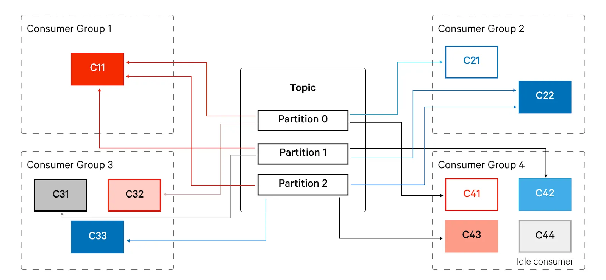

### База
#### Что такое Kafka ? [X]

Apache Kafka — это распределённая потоковая платформа для обработки данных в реальном времени. Она работает как высоконадёжная и масштабируемая система обмена сообщениями, способная обрабатывать огромные объёмы данных с минимальными задержками. 

Kafka используется для:

- Передачи данных между системами (как Message Broker).
- Обработки событий (Event Streaming).
- Хранения и повторного использования потоковых данных.
- Построения data-пайплайнов (интеграция между микросервисами, аналитическими системами и др.).

Компоненты Kafka:

- В кластере Kafka хранятся категории, называемые **Topics**
- Кластер состоит из одного или нескольких серверов, называемых **Brokers**
- Каждый раздел поддерживает **partitioned** журнал
- A **Topic** может содержать множество **partitions**, которые все действуют как юнит параллелизма
- Replicas - это список брокеров, которые реплицируют журнал для этого partition

| **Возможность Kafka**          | **Описание**                                                                                                                                                                                                                                                                  |
| ------------------------------ | ----------------------------------------------------------------------------------------------------------------------------------------------------------------------------------------------------------------------------------------------------------------------------- |
| Высокая пропускная способность | Kafka может обрабатывать огромные объёмы данных с такой же скоростью, как и классические пакетные системы.                                                                                                                                                                    |
| Высокая доступность            | Kafka поддерживает настройку уровня репликации и гарантирует доставку сообщений (как минимум один раз или не более одного раза) "из коробки".                                                                                                                                 |
| Масштабируемость               | Добавление нового брокера Kafka выполняется просто — достаточно указать кворум ZooKeeper/KRaft и запустить процесс Kafka.                                                                                                                                                     |
| Сохранение данных на диск      | Kafka записывает данные на диск и хранит их заданное время или до достижения лимита размера. Это позволяет повторно обрабатывать данные с любого момента.                                                                                                                     |
| Независимые пайплайны          | Можно реализовать разные подходы для одного потока данных:  <br>- Буферизация: использовать Kafka как промежуточное хранилище.  <br>- Fan-in: объединять данные из нескольких источников в один топик.  <br>- Fan-out: отправлять одни и те же данные в несколько приложений. |
| Простота                       | Брокеры Kafka сосредоточены на одной задаче (передаче сообщений), что обеспечивает высокую производительность и отсутствие избыточной сложности.                                                                                                                              |
[More  | en ](https://l-lin.github.io/kafka/kafka-cheatsheet#kafka-cheatsheet)
#### Основные компоненты Kafka ? [X]

- Producer (Производитель) — отправляет данные в Kafka.
- Consumer (Потребитель) — получает данные из Kafka.
- Event (Событие/Сообщение) - это основная единица данных, которая передается и хранится в системе. Состоит из ключа (опционально), значения, заголовков и метки времени.
- Topics (Топики) — логическая сущность, разделяющая данные на каналы. Каждый топик хранит сообщения в порядке их поступления.
- Partitions (Партиции) — подмножества топиков, которые разделяют данные для их распределенного хранения и параллельной обработки. Партиции дают возможность хранить данные на разных серверах.
- Broker (Брокер) — сервер, ответственный за хранение данных в Kafka.
- ZooKeeper — служит для управления и координации брокеров, поддерживает метаданные системы. Однако в новых версиях Kafka можно использовать KRaft (Kafka Raft), который заменяет ZooKeeper.
- Consumer Group (Группа потребителей) — объединение консьюмеров, которые параллельно обрабатывают данные одного топика. Каждый консьюмер в группе обрабатывает разные партиции топика, что улучшает параллельность и производительность.

#### Из чего состоит Record ? []

В Kafka Record (также называемый сообщением) — это основная единица данных, которая передаётся и хранится в топиках. Каждая запись состоит из нескольких частей:

```
Record (Сообщение)
├── Key (опционально)       → Определяет партицию, порядок обработки
├── Value (данные)          → Полезная нагрузка (JSON, Avro и др.)
├── Headers (метаданные)    → Доп. информация (трассировка, теги)
├── Timestamp               → Время создания/отправки
└── Offset                  → Уникальный ID в партиции (назначается брокером)
```

```java
ProducerRecord<String, String> record = new ProducerRecord<>(
    "orders_topic",          // Топик
    "order_12345",           // Key (опционально)
    "{\"user\": \"Alice\"}"  // Value (данные в JSON)
);

// Добавление заголовков
record.headers().add("trace_id", "abc123".getBytes());
record.headers().add("source", "web".getBytes());
```
#### Какие стратегии распределения сообщения по партициям ты знаешь? [X]

| **Strategy**               | **Description**                                                                                                                      |
| -------------------------- | ------------------------------------------------------------------------------------------------------------------------------------ |
| Default partitioner        | Хэш ключа используется для сопоставления сообщений с партициями. Сообщения с null ключом отправляются в партицию через round-robing. |
| Round-robin partitioner    | Сообщения распределяются по кругу начиная с первой по последнюю партицию.                                                            |
| Uniform sticky partitioner | Сообщения привязываются к одном партиции (пока не наберётся batch.size или не истекет linger.ms) чтобы снизить задержку.             |
| Custom partitioner         | Нужно реализовать `Partitioner` интерфейс, переопределить `partition` и описать свою стратегию.                                      |
- [Kafka partition strategy—Tutorial & strategies](https://www.redpanda.com/guides/kafka-tutorial-kafka-partition-strategy)
- [Стратегии отправки сообщений в партиции](../../../_inforage/Kafka/Storage/Kafka%20Producer.md#Стратегии%20отправки%20сообщений%20в%20партиции)
- [Стратегии распределения консюмеров](../../../_inforage/Kafka/Storage/Kafka%20Consumer.md#Стратегии%20распределения%20консюмеров)
#### Какие стратегии распределения партиций по консюмерам ты знаешь? [X]

| **Strategy**             | **Description**                                                                                                                                                                                                                                                                                                                                                                                                         |
| ------------------------ | ----------------------------------------------------------------------------------------------------------------------------------------------------------------------------------------------------------------------------------------------------------------------------------------------------------------------------------------------------------------------------------------------------------------------- |
| Range assignor (default) | (Общее количество партиций) / (Количество партиций) — партиции назначаются каждому потребителю. Цель состоит в том, чтобы разделы были совмещены, то есть одному и тому же потребителю назначался один и тот же номер партици для двух разных топиков (P0 для темы X и P0 для темы Y одному и тому же потребителю). Если он разделится неравномерно, то у первых нескольких потребителей будет дополнительная партиция. |
| Round-robin assignor     | Партиции выбираются по отдельности и распределяются между потребителями (в любом рациональном порядке, например, от первого до последнего). Когда все потребители будут использованы, но некоторые разделы останутся нераспределёнными, они будут распределены заново, начиная с первого потребителя. Цель состоит в том, чтобы максимально увеличить количество используемых потребителей.                             |
| Sticky assignor          | Этот подход похож на циклический распределитель, но при перераспределении разделов сохраняется как можно больше существующих назначений. Цель состоит в том, чтобы сократить или полностью исключить перемещение партиций во время перебалансировки.                                                                                                                                                                    |
| Custom assignor          | Расширяет класс `AbstractPartitionAssignor` и переопределяет метод `assign` с помощью пользовательской логики.                                                                                                                                                                                                                                                                                                          |

#### Как описать свою стратегию распределения сообщений по партицяим ? [X]

Иногда вариант использования не подходит ни к одному из стандартных разделителей. Например, предположим, что мы хотим записать данные журнала транзакций в Kafka, и на одного из пользователей (его зовут “CEO”) приходится более 40% всех транзакций.

Если используется секционирование хэша по умолчанию, записи пользователя “CEO” будут размещены в том же разделе, что и у других пользователей. В результате один раздел будет намного больше остальных, что приведет к нехватке места у брокеров и замедлению обработки. Идеальным решением является предоставление пользователю “CEO” выделенной партции, а затем использование хэш-разбиения для привязки остальных пользователей к оставшимся разделам. Ниже приведена простая реализация для этого варианта использования:

```Java
import org.apache.kafka.clients.producer.Partitioner;
import org.apache.kafka.common.Cluster;
import org.apache.kafka.common.PartitionInfo;
import org.apache.kafka.common.record.InvalidRecordException;
import org.apache.kafka.common.utils.Utils;

public class PowerUserPartitioner implements Partitioner {

 public void configure(Map<String, ?> configs) {}

 public int partition(String topic, Object key, byte[] keyBytes,
 Object value, byte[] valueBytes,Cluster cluster) {

 List<PartitionInfo> partitions = cluster.partitionsForTopic(topic);
 int numPartitions = partitions.size();
 if ((keyBytes == null) || (!(key instanceOf String))) 
      throw new InvalidRecordException("Record must have a valid string key");

 if (((String) key).equals("CEO"))
      return numPartitions - 1; // Сообщения с key “CEO” всегда попадают в последнюю партицию

 // Остальные сообщения при помощи хэша попадут в другие партиции
 return Math.abs(Utils.murmur2(keyBytes)) % (numPartitions - 1);
 }

 public void close() {}

}
```

#### Как описать свою стратегию распределения партиций по консюмерам ? [X]

1. `configure` - настраивает ассигнор через переданную конфигурацию.
2. `name` - возвращает имя ассигнора.
3. `subscription` - подписывает потребителя на топики и передает его приоритет в метаданных.
4. `assign` - распределяет партиции:
    - Сортирует потребителей по приоритету (в порядке убывания).
    - Берет потребителя с наивысшим приоритетом.
    - Формирует список всех партиций для заданных топиков.
    - Назначает все партиции выбранному потребителю, остальным — пустые списки.

```java
public class CustomPartitionAssignor extends AbstractPartitionAssignor implements Configurable {

  @Override
  public void configure(final Map<String, ?> configMap) { 
    // define the configs here
  }

  @Override
  public String name() {
    return "CustomPartitionerAssigner";
  }

 @Override
  public Subscription subscription(final Set<String> topicSet) { 
    return new Subscription(
        new ArrayList<>(topicSet), 
        ByteBuffer.wrap(ByteBuffer.allocate(4).putInt(config.priority()))
     );
  }

  @Override
  Map<String, List<TopicPartition>> assign(
                         Map<String, Integer> partitionsTopicMap,
                         Map<String, Subscription> subscriptionsMap)  {

    Stream<ConsumerPriority> consumerOrdered = subscriptionsMap.entrySet()
        .stream()
        .map(x -> {
            int consumerPriority = x.getValue().data().getInt();
            String consumerId = x.getKey();
            return new ConsumerPriority(consumerId, consumerPriority);
        })
        .sorted(Comparator.reverseOrder());

    ConsumerPriority priority = consumerOrdered.findFirst().get();

    final List<TopicPartition> assignments = partitionsTopicMap
        .entrySet()
        .stream()
        .flatMap(entry -> {
            final String topicName = entry.getKey();
            final int partitionsCount = entry.getValue();
            return IntStream.range(0, partitionsCount).mapToObj( i -> new TopicPartition(topicName, i));
        }).collect(Collectors.toList());

    final Map<String, List<TopicPartition>> assignmentMap = new HashMap<>();
    subscriptionsMap.keySet().forEach(memberId -> assignmentMap.put(memberId, Collections.emptyList()));
    assignmentMap.put(priority.memberId, assignments);
    return assignmentMap;
  }
}
```

#### Что такое consumer group ? [X]

Потребители (Consumers) — это приложения, которые читают данные из Kafka. Обычно у нас есть несколько продюсеров, записывающих сообщения в топик, поэтому один потребитель может не успевать обрабатывать входящие сообщения и начнёт отставать.

Чтобы масштабировать чтение из топиков, в Kafka есть концепция групп потребителей (consumer groups). Как следует из названия, это просто набор потребителей. Когда несколько потребителей в одной группе подписываются на один и тот же топик, каждый из них получает сообщения из своего набора партиций, распределяя данные между собой.

Важное ограничение: одна партиция может быть назначена только одному потребителю. Добавление новых потребителей в группу помогает масштабировать обработку, но если потребителей больше, чем партиций, часть из них останется без работы. Эти "простаивающие" потребители играют роль резервных — если один из активных потребителей выйдет из строя, они быстро возьмут его нагрузку на себя.



#### Когда происходит ребалансировка? Какие есть виды? [X]

Время от времени потребители могут добавляться в группу потребителей или удаляться из нее. При добавлении нового потребителя он начинает получать сообщения из партиций, ранее назначенных другому потребителю. Аналогично, когда потребитель удаляется, его партиции назначаются другому оставшемуся активному потребителю. Такое переназначение и передача права собственности на партиции от одного другому называется перебалансировкой. Перебалансировка имеет решающее значение, поскольку обеспечивает высокую доступность и масштабируемость, позволяя пользователям безопасно добавлять и удалять потребителей.

- Eager Rebalancing (Жадный ребаланс):  В классическом ребалансе Kafka, когда участник присоединяется к группе консьюмеров или выходит из неё, координатор группы инициирует полный ребаланс. Все консьюмеры в группе останавливаются и перезапускаются, что вызывает задержки и неэффективность.
- Cooperative Rebalancing (Кооперативный ребаланс):  Этот новый механизм (появился в Kafka 2.4) позволяет консьюмерам продолжать обрабатывать сообщения во время ребаланса. Перераспределяются только те партиции, которые действительно нужно изменить. Снижает простои и делает переходы при изменении состава группы гладкими.

**Ребалансировка** автоматически запускается после:

- Когда консумер присоединяется к группе консумеров
- Когда консумер покидает группу консумеров
- Когда добавляются новые партиции

Ребалансировка вызовет короткий период дополнительной задержки, пока консумеры прекратят чтение пакетов сообщений и не будут назначены на новые партиции.

При ребалансировке все данные в памяти станут бесполезными, если консумер не будет назначен обратно на ту же партицию. Поэтому консумеры должны реализовать логику повторного распределения, чтобы либо сохранить состояние данных во внешнем хранилище, либо удалить его из своей памяти.

Консумеры могут реализовать интерфейс `org.apache.kafka.clients.consumer.ConsumerRebalanceListener`, который является слушателем, вызываемым при ребалансировке.

#### Как включить Cooperative Rebalancing ? [X]

```java
props.put("partition.assignment.strategy", "org.apache.kafka.clients.consumer.CooperativeStickyAssignor");
```

#### Как Kafka определяет, что консюмер живой [X]

Консумер посылает периодические `poll` запросы и `heartbeat` сигналы для проверки своего состояния в группе консумеров, поддерживая сессию.

Настраивается параметром `heartbeat.interval.ms` (по умолчанию — 3 секунды).

Если консъюмер "умер"?

1. Координатор перестает получать `heartbeat` или вызовы `poll()`.
2. Через время `session.timeout.ms` (по умолчанию — 10 секунд) консъюмер исключается из группы.
3. Запускается ребалланс — перераспределение его партиций между оставшимися консъюмерами.
#### Как реализуется общение Kafka to Kafka, какие есть нюансы ? [O]

Общение Kafka to Kafka обычно реализуется через продюсеров и консумеров, где:
-  Продюсер отправляет сообщения в один Kafka-кластер.
-  Консьюмер в другом Kafka-кластере подписывается на нужные топики и обрабатывает сообщения.

Нюансы:
- Репликация между кластерами: Для передачи данных между кластерами Kafka часто используют MirrorMaker — специальный инструмент для репликации топиков между кластерами Kafka.
- Балансировка нагрузки: При увеличении числа партиций можно увеличить количество консумеров для параллельной обработки сообщений.

#### Что будет если у нас несколько консюмеров и продюсеров, как они будут взаимодействовать [X]

- Продюсеры отправляют сообщения в топики Kafka. Продюсеры могут работать параллельно и писать в одну или несколько партиций.
- Консумеры объединяются в consumer group, и каждая партиция топика назначается одному консумеру из группы. Если партиций больше, чем консумеров, то некоторые консумеры будут обрабатывать несколько партиций.
- Балансировка нагрузки: Kafka автоматически распределяет партиции между консумерами в группе, чтобы избежать дублирования обработки сообщений.
- Обработка сообщений: Если консумеров больше, чем партиций, некоторые консумеры будут простаивать.

#### Какие гарантии доставки есть в Kafka? [X]

- At most once — самое больше один
- At least once — минимум один
- Exactly once — ровно один раз, без дубликатов. 2 phase commit, дедупликация на стороне консюмер (ключ идемпотентности), outbox

![[../../../_res/Pasted image 20240928142055.png]]

[Kafka Consumer](../../../_inforage/Kafka/Storage/Kafka%20Consumer.md)

### Настройки

#### Какие настройки есть со стороны продюсера ? [X]

##### Обязательные настройки

|                     |                                                                              |                                                  |
| ------------------- | ---------------------------------------------------------------------------- | ------------------------------------------------ |
| `bootstrap.servers` | Список брокеров Kafka для первоначального подключения (формат: `host:port`). | `"kafka1:9092,kafka2:9092"`                      |
| `key.serializer`    | Класс для сериализации ключа (должен реализовывать `Serializer`).            | `StringSerializer.class`                         |
| `value.serializer`  | Класс для сериализации значения (аналогично ключу).                          | `StringSerializer.class`, `AvroSerializer.class` |
|                     |                                                                              |                                                  |
##### Настройки надежности доставки

| **Параметр**                            | **Описание**                                                                                                                                                                                                                                | **Рекомендуемые значения**     |
| --------------------------------------- | ------------------------------------------------------------------------------------------------------------------------------------------------------------------------------------------------------------------------------------------- | ------------------------------ |
| `acks`                                  | Определяет, сколько реплик должны подтвердить запись:  <br>- `0` — нет подтверждения (риск потери данных).  <br>- `1` — подтверждение от лидера партиции.  <br>- `all` (`-1`) — подтверждение от всех реплик ISR (максимальная надежность). | `"all"` (для критичных данных) |
| `retries`                               | Число попыток повторной отправки при ошибках.                                                                                                                                                                                               | `3` (или больше)               |
| `enable.idempotence`                    | Включает идемпотентность (гарантирует, что сообщение не будет отправлено дважды).                                                                                                                                                           | `true` (если `acks=all`)       |
| `max.in.flight.requests.per.connection` | Максимальное количество "неподтвержденных" запросов перед блокировкой отправки. При `idempotence=true` должно быть ≤ 5.                                                                                                                     | `5`                            |
##### Настройки производительности

| **Параметр**       | **Описание**                                                                    | **Рекомендуемые значения**          |
| ------------------ | ------------------------------------------------------------------------------- | ----------------------------------- |
| `linger.ms`        | Задержка перед отправкой батча (увеличивает batch.size, но добавляет задержку). | `5` (мс)                            |
| `batch.size`       | Максимальный размер батча (в байтах) перед отправкой.                           | `16384` (16 KB)                     |
| `buffer.memory`    | Общий объем памяти для неотправленных сообщений.                                | `33554432` (32 MB)                  |
| `compression.type` | Сжатие сообщений (`none`, `gzip`, `snappy`, `lz4`, `zstd`).                     | `"snappy"` (баланс скорости/сжатия) |

##### Сериализация и схемы

| **Параметр**          | **Описание**                             | **Пример**                                               |
| --------------------- | ---------------------------------------- | -------------------------------------------------------- |
| `key.serializer`      | Сериализатор для ключа.                  | `org.apache.kafka.common.serialization.StringSerializer` |
| `value.serializer`    | Сериализатор для значения.               | `io.confluent.kafka.serializers.KafkaAvroSerializer`     |
| `schema.registry.url` | URL Schema Registry (для Avro/Protobuf). | `"http://schema-registry:8081"`                          |
##### Обработка ошибок и логирование

| **Параметр**          | **Описание**                                                                             | **Пример**         |
| --------------------- | ---------------------------------------------------------------------------------------- | ------------------ |
| `max.block.ms`        | Максимальное время блокировки при отправке (если буфер полон или метаданные недоступны). | `60000` (1 минута) |
| `request.timeout.ms`  | Таймаут ожидания ответа от брокера.                                                      | `30000` (30 сек)   |
| `metadata.max.age.ms` | Как часто обновлять метаданные о топиках и партициях.                                    | `300000` (5 минут) |
##### Безопасность (Security)

| **Параметр**              | **Описание**                                                              | **Пример**                  |
| ------------------------- | ------------------------------------------------------------------------- | --------------------------- |
| `security.protocol`       | Протокол безопасности (`PLAINTEXT`, `SSL`, `SASL_PLAINTEXT`, `SASL_SSL`). | `"SASL_SSL"`                |
| `sasl.mechanism`          | Механизм аутентификации SASL (`PLAIN`, `SCRAM-SHA-256`, `GSSAPI`).        | `"SCRAM-SHA-256"`           |
| `ssl.truststore.location` | Путь к truststore (для SSL).                                              | `"/path/to/truststore.jks"` |
#### Разница между batch.size и buffer.memory в Kafka Producer [X]

Оба параметра влияют на батчинг (объединение сообщений в группы перед отправкой), но работают на разных уровнях:

| **Параметр**                              | **batch.size**                                                                                 | **buffer.memory**                                                                       |
| ----------------------------------------- | ---------------------------------------------------------------------------------------------- | --------------------------------------------------------------------------------------- |
| **Что контролирует?**                     | Максимальный размер **одного батча** (в байтах) для отправки в одну партицию.                  | Общий объем памяти (в байтах) для **хранения всех неотправленных сообщений** продюсера. |
| **Когда срабатывает?**                    | Когда размер накопленных сообщений для партиции достигает `batch.size`.                        | Когда общий объем данных в буфере превышает `buffer.memory`.                            |
| **Что происходит при достижении лимита?** | Батч отправляется в Kafka.                                                                     | Продюсер блокируется (или выбрасывает исключение, если `max.block.ms` истек).           |
| **Связь с другими параметрами**           | Зависит от `linger.ms` (если батч не заполнен, ждёт указанное время).                          | Зависит от `max.block.ms` (сколько ждать при переполнении буфера).                      |
| **Дефолтное значение**                    | `16384` (16 KB)                                                                                | `33554432` (32 MB)                                                                      |
| **Пример**                                | Если `batch.size=16384`, то каждые 16 KB данных для партиции будут объединяться в один запрос. | Если `buffer.memory=33554432`, продюсер может хранить до 32 MB сообщений                |
1. Продюсер получает сообщение → помещает его в буфер памяти (`buffer.memory`).
2. Для каждой партиции сообщения накапливаются в отдельные батчи (размер контролируется `batch.size`).
3. Когда размер батча достигает `batch.size` или истекает `linger.ms` → батч отправляется в Kafka.
4. Если весь буфер (`buffer.memory`) заполнен → продюсер блокируется (ждёт освобождения места), то есть перестаёт принимать новые сообщения от приложения до тех пор, пока место в буфере не освободится.

#### Что такое idempotence ? [X]

При сетевых сбоях или ошибках брокера продюсер может повторно отправить сообщение, даже если оно уже было дос тавлено. Без идемпотентности это приведёт к дублям в топике. Идемпотентность гарантирует, что даже при повторной отправке брокер сохранит сообщение только один раз.

- Каждому продюсеру присваивается уникальный `Producer ID` (PID).
- Каждое сообщение получает `Sequence Number` (последовательный номер в рамках партиции).
- Брокер запоминает последний `Sequence Number` для каждого `PID` + `Partition` и отбрасывает дубликаты.

#### Что идемпотентность НЕ решает ? [X]

- Логические дубли (дубликаты от приложения)

Если ваше приложение само отправило два одинаковых сообщения (например, из-за ретраев бизнес-логики), Kafka не сможет их отличить (если только они не имеют одинаковый `sequence number` в рамках одного продюсера).

- Глобальную дедупликацию (между разными продюсерами)

Идемпотентность работает только в рамках одного продюсера. Если два разных продюсера отправят сообщение с одинаковым `key` — оба будут сохранены.

#### Как бороться с логическими дублями ? [X]

- Транзакции (Transactional Producer)
	- Позволяют атомарно публиковать сообщения в несколько топиков/партиций.
	- Гарантируют, что сообщения не будут дублироваться даже при перезапуске продюсера.
	- Требуют настройки `transactional.id`:

```java
props.put("enable.idempotence", "true");
props.put("transactional.id", "my-transaction-id");
```
    
- Внешнюю дедупликацию
	- Сохраняйте `key` сообщения (например, `order_id`) в базу или Redis.
	- Перед отправкой проверяйте, не обрабатывался ли этот `key` ранее.

- Дедупликацию на стороне консьюмера
	- Консьюмер может игнорировать сообщения с уже обработанными `key` (например, записывая их в локальный кеш).
#### Какие настройки можно указывать на стороне консюмера ? [X]

##### Обязательные настройки

Эти параметры должны быть заданы для работы консьюмера:

| **Параметр**         | **Описание**                                                                     | **Пример значения**         |
| -------------------- | -------------------------------------------------------------------------------- | --------------------------- |
| `bootstrap.servers`  | Список брокеров Kafka для подключения (формат: `host:port`).                     | `"kafka1:9092,kafka2:9092"` |
| `key.deserializer`   | Класс для десериализации ключа (реализует `Deserializer`).                       | `StringDeserializer.class`  |
| `value.deserializer` | Класс для десериализации значения.                                               | `StringDeserializer.class`  |
| `group.id`           | Идентификатор группы консьюмеров (для распределения партиций между участниками). | `"order-processing-group"`  |
##### Управление офсетами (позицией чтения)

Настройки, определяющие, как консьюмер отслеживает прогресс чтения:

| **Параметр**              | **Описание**                                                                                                                                                                  | **Рекомендуемые значения**          |
| ------------------------- | ----------------------------------------------------------------------------------------------------------------------------------------------------------------------------- | ----------------------------------- |
| `auto.offset.reset`       | Действие при отсутствии сохранённого офсета:  <br>- `earliest`: читать с начала топика.  <br>- `latest`: только новые сообщения.  <br>- `none`: ошибка, если офсет не найден. | `"latest"` (по умолчанию)           |
| `enable.auto.commit`      | Автоматически подтверждать офсеты (если `true`, Kafka будет считать сообщения обработанными после `poll()`).                                                                  | `false` (для exactly-once)          |
| `auto.commit.interval.ms` | Как часто подтверждать офсеты при `enable.auto.commit=true`.                                                                                                                  | `5000` (5 сек)                      |
| `isolation.level`         | Уровень изоляции:  <br>- `read_uncommitted`: читать все сообщения (включая незавершённые транзакции).  <br>- `read_committed`: только подтверждённые транзакции.              | `"read_committed"` (для транзакций) |

##### Настройки производительности

Параметры, влияющие на скорость и эффективность чтения:

| **Параметр**                | **Описание**                                                                                                             | **Рекомендуемые значения** |
| --------------------------- | ------------------------------------------------------------------------------------------------------------------------ | -------------------------- |
| `fetch.min.bytes`           | Минимальный размер данных (в байтах), который брокер отправит за один запрос. Увеличивает задержку, но снижает нагрузку. | `1` (по умолчанию)         |
| `fetch.max.wait.ms`         | Максимальное время ожидания для накопления `fetch.min.bytes`.                                                            | `500` (0.5 сек)            |
| `max.poll.records`          | Максимальное количество сообщений, возвращаемых за один вызов `poll()`.                                                  | `500`                      |
| `max.partition.fetch.bytes` | Максимальный размер данных (в байтах), возвращаемых с одной партиции за запрос.                                          | `1048576` (1 MB)           |

##### Обработка ошибок и отказоустойчивость

| **Параметр**            | **Описание**                                                                          | **Пример**         |
| ----------------------- | ------------------------------------------------------------------------------------- | ------------------ |
| `session.timeout.ms`    | Таймаут, после которого консьюмер считается "мёртвым" (если не отправляет heartbeat). | `10000` (10 сек)   |
| `heartbeat.interval.ms` | Как часто консьюмер отправляет heartbeat брокеру.                                     | `3000` (3 сек)     |
| `max.poll.interval.ms`  | Максимальное время между вызовами `poll()` до исключения консьюмера из группы.        | `300000` (5 минут) |
| `retry.backoff.ms`      | Задержка перед повторной попыткой после ошибки.                                       | `1000` (1 сек)     |
##### Безопасность (Security)

Настройки для подключения к защищённому кластеру:

| **Параметр**              | **Описание**                                                              | **Пример**                  |
| ------------------------- | ------------------------------------------------------------------------- | --------------------------- |
| `security.protocol`       | Протокол безопасности (`PLAINTEXT`, `SSL`, `SASL_PLAINTEXT`, `SASL_SSL`). | `"SASL_SSL"`                |
| `sasl.mechanism`          | Механизм аутентификации SASL (`PLAIN`, `SCRAM-SHA-256`, `GSSAPI`).        | `"SCRAM-SHA-256"`           |
| `ssl.truststore.location` | Путь к truststore (для SSL).                                              | `"/path/to/truststore.jks"` |

##### Пример конфигурации 

```java
Properties props = new Properties();
props.put("bootstrap.servers", "kafka1:9092,kafka2:9092");
props.put("key.deserializer", "org.apache.kafka.common.serialization.StringDeserializer");
props.put("value.deserializer", "org.apache.kafka.common.serialization.StringDeserializer");
props.put("group.id", "order-processing-group");
props.put("auto.offset.reset", "earliest");
props.put("enable.auto.commit", "false");
props.put("isolation.level", "read_committed");

KafkaConsumer<String, String> consumer = new KafkaConsumer<>(props);
consumer.subscribe(List.of("orders"));
```

#### Почему добавление новых Brokers может привести к проблемам ?

Перераспределение партиций требует перемещения данных между Brokers, что увеличивает нагрузку на сеть и CPU. В высоконагруженных кластерах это может вызвать насыщение сети и задержки.

#### Как Kafka обеспечивает долговечность и доступность данных в топике с фактором репликации 3, и какие последствия для настроек acks и min.insync.replicas ?

В Kafka фактор репликации определяет количество копий данных на разных брокерах. Для топика с фактором репликации 3 Kafka может пережить потерю до 2 брокеров, сохраняя при этом долговечность данных.

Долговечность:

Для топика с фактором репликации 3, можно потерять до 2 брокеров и все равно восстановить данные, так как для каждого раздела создаются 3 реплики, и даже при потере 2 брокеров хотя бы одна реплика останется доступной для извлечения данных.

Доступность:

Доступность более сложна и зависит от конфигураций `acks` и `min.insync.replicas`:
1. Чтение:
    - Топик будет доступен для чтения, если хотя бы один раздел будет доступен и считается в синхронизированной реплике (ISR).
2. Запись:
    - **`acks=0` и `acks=1`**: Топик будет доступен для записи, если хотя бы один раздел будет доступен и является частью ISR. Kafka не требует, чтобы больше одного раздела было доступно для записи.
    - **`acks=all`** (наибольшая гарантия долговечности):
        - **`min.insync.replicas=1`** (по умолчанию): Топик должен иметь хотя бы 1 раздел в ISR, что позволяет Kafka пережить потерю **до 2 брокеров**.
        - **`min.insync.replicas=2`**: Топик должен иметь хотя бы 2 раздела в ISR, что позволяет потерять только **1 брокер**. В этом случае каждое записанное сообщение будет реплицировано хотя бы на два брокера.
        - **`min.insync.replicas=3`**: Это требование, чтобы все 3 реплики были в ISR, что делает невозможной потерю **какого-либо брокера**. Такая настройка имеет ограниченную применимость для топиков с фактором репликации 3, так как она не позволяет потерять ни одного брокера.
Вкратце:
С конфигурацией **`acks=all`** и **`min.insync.replicas=M`**, Kafka может пережить потерю **N-M брокеров** (где N — это фактор репликации, а M — количество реплик, требующихся в ISR) для обеспечения доступности топика.

**Популярная конфигурация**:  
Наиболее часто используемая конфигурация — это **`acks=all`** и **`min.insync.replicas=2`**, которая позволяет Kafka пережить потерю **одного брокера**, сохраняя как долговечность данных, так и доступность.

### Аналоги

#### RabbitMQ vs Apache Kafka

**RabbitMQ** и **Apache Kafka** оба являются системами обмена сообщениями, но они используют разные подходы к передаче сообщений.

Модели работы:

- RabbitMQ использует модель **push**, где сервер (RabbitMQ) **отправляет сообщения** консумерам. Это идеально подходит для систем с низкой задержкой и работает хорошо с очередями, используемыми в RabbitMQ.
- Kafka использует модель **pull**, где консумеры **запрашивают сообщения** по определённому смещению. Для предотвращения бесконечных циклов, когда нет сообщений после текущего смещения, Kafka поддерживает **долгий опрос (long-polling)**.

Как работает сообщение в системе:

RabbitMQ:

- Публишеры отправляют сообщения на обменники (exchanges).
- Обменники маршрутизируют сообщения в очереди или другие обменники.
- RabbitMQ отправляет подтверждения получения сообщений публишерам.
- Консумеры поддерживают постоянные TCP-соединения с RabbitMQ и объявляют, какие очереди они потребляют.
- RabbitMQ отправляет сообщения консумерам.
- Консумеры отправляют подтверждения успеха или неудачи.
- Сообщения удаляются из очереди после успешного потребления.

Kafka:

- Kafka — это распределённый, реплицируемый журнал (commit log).
- Kafka не использует концепцию очереди как таковой. Вместо этого сообщения хранятся в партициях, и консумеры извлекают данные из этих партиций по смещению.
- Каждая партиция — это отдельная структура данных, которая гарантирует порядок сообщений только в рамках одной партиции.

Типы доставки:

RabbitMQ:
- RabbitMQ поддерживает “at most once delivery” (не более одного раза) и “at least once delivery” (хотя бы один раз), но не гарантирует “exactly once delivery” (ровно один раз).
Kafka:
- Kafka предоставляет возможность доставки сообщений с гарантией “exactly once” (ровно один раз), что делает её более подходящей для некоторых критически важных приложений.

Типы обменников в RabbitMQ:

- Fanout: Сообщения направляются во все очереди, связанные с обменником.
- Direct: Сообщения маршрутизируются по Routing Key, установленному публишером.
- Topic: Сообщения маршрутизируются по Routing Key, с возможностью использования подстановочных символов (wildcards).
- Header: Сообщения маршрутизируются по значениям заголовков.
- Consistent Hashing: Сообщения маршрутизируются в одну очередь на основе хеширования ключа маршрутизации или заголовка.

Как Kafka обрабатывает данные:

- Kafka — это распределённая система, где данные реплицируются между несколькими серверами.
- Сообщения хранятся в **партиционированных, только добавляемых журналах** (Topics), что позволяет гарантировать порядок сообщений в пределах одной партиции.
- Порядок сообщений гарантируется только в пределах одной партиции, что означает, что одна партиция не может поддерживать несколько конкурирующих консумеров.

Таким образом, RabbitMQ подходит для работы с очередями и низкой задержкой, в то время как Kafka идеально подходит для обработки больших объемов данных с гарантиями порядка и доставки сообщений.
### Остальное

#### Как обеспечить exactly-once семантику?

###### С каким брокером сообщений ты работал? Расскажи про kafka и rebbitmq и их различия?

###### Как отправить одно сообщение нескольким слушателям в rabbitmq?


###### Как отправить одно сообщение нескольким слушателям в kafka?

###### Для чего нужны партиции в kafka?


###### Дублируются в партиции сообщения?

###### Conumers group зачем нужны

###### Offsets зачем нужны

###### Что будет если присвоить сообщениям одинаковые id

###### Что будет, 3 партициии и 4 консьюмера?

###### Мы можем легко увеличивать количество партиций? Уменьшить?


###### Что такое Zookeeper?


###### Какие проблемы решают брокеры сообщений?

###### Какие существуют паттерны работы с очередями?

- **Point-to-Point (P2P)**: Один продюсер, один потребитель. Сообщение читается одним потребителем и удаляется из очереди.
- **Publish-Subscribe (Pub/Sub)**: Один продюсер отправляет сообщение нескольким подписчикам через обменники.
- **Work Queue**: Несколько потребителей обрабатывают сообщения из одной очереди, распределяя нагрузку.
- **Dead Letter Queue (DLQ)**: Очередь для сообщений, которые не удалось обработать.
- **Priority Queue**: Сообщения обрабатываются в зависимости от их приоритета.

###### В каких форматах хранятся данные в кафке, помимо JSON?

###### Какой паттерн используется для прослушки топика Kafka в приложение?

###### Как вычитывать из топика бачами по периодам


###### Паттерны гарантии доставки

###### Проблемы в паттерне transactional outbox с кафкой
###### Что такое “Стримить в Кафку”

###### В чем особенность Kafka Listener

###### Какая дефолтная гарантия доставки сообщений в kafka?

######  Как писать в конкретную партицию?

#### Разница между Kafka и RabbitMQ

- **Модели сообщений**
    - _Kafka_. Сообщения не удаляются после доставки
    - _RabbitMQ_. Сообщения удаляются после доставки
- **Обработка сообщений**
    - _Kafka_. Потребители сами запрашивают сообщения из топиков, читая их по мере необходимости
    - _RabbitMQ_. Сообщения пушатся к потребителям из очереди, когда те готовы их принять (следовательно сервер может лечь, если данных данных слишком много)
- **Производительность**
    - _Kafka_ быстрее и производительнее чем _RabbitMQ_ (за счет partition-ов + горизонтальное масштабирование)

#### Что даст увеличение количества консьюмеров?

1. **Параллельная обработка:**
    - Увеличение числа потребителей в группе позволяет обрабатывать данные параллельно, так как каждый потребитель обрабатывает свои разделы (partitions).
    - Если количество потребителей меньше или равно количеству разделов, это приводит к увеличению производительности.
2. **Ограничения:**
    - Один раздел может быть назначен только одному потребителю в группе.
    - Если количество потребителей превышает количество разделов, “лишние” потребители не будут получать данные, так как разделы не могут быть разделены между несколькими потребителями.
3. **Пример:**
    - Топик с 4 разделами:
        - Если в группе 2 потребителя, то каждый будет обрабатывать 2 раздела.
        - Если в группе 4 потребителя, каждый получит 1 раздел.
        - Если в группе 5 потребителей, один из них останется без работы.

#### На что делится partition?

Раздел (partition) **не делится** дальше, он является минимальной единицей хранения и обработки данных в Kafka. Однако внутри раздела данные организуются следующим образом:
1. **Лог записи:**
    - Сообщения в разделе хранятся в лог-файле и имеют уникальные смещения (**offsets**), которые используются для идентификации и упорядочивания сообщений.
2. **Реплики:**
    - Каждый раздел может иметь одну или несколько копий (реплик) для обеспечения отказоустойчивости.
3. **Лидер и фолловеры:**
    - Один брокер управляет разделом как лидер, а остальные брокеры хранят реплики и выступают как фолловеры.

#### Если каждый консюмер находиться в отденой группе, у каждого свой offset, когда сообщения будут доступны для послед. удаления?

Каждая consumer-группа хранит **собственный offset** (позицию чтения) в топике. Однако **удаление сообщений не зависит от consumer-групп** – оно зависит **только от настроек топика**.

**Консюмер получит ошибку `OFFSET_OUT_OF_RANGE`**, если попытается прочитать удаленные offset'ы.

1. **Увеличить `log.retention.ms`** (например, на 30 дней).
2. **Использовать `retention.bytes`** (если важно хранить больше данных, а не по времени).
3. **Настроить `min.cleanable.dirty.ratio`** (чтобы реже чистились сегменты).
4. **Использовать **`offsets.retention.minutes`** (по умолчанию `7 дней`) – это время, сколько Kafka хранит offset'ы для неактивных consumer-групп.

#### Если консюмер не был активен 8 дней, а потом пришло сообщение

`offsets.retention.minutes`** (по умолчанию `7 дней`) – это время, сколько Kafka хранит offset'ы для неактивных consumer-групп. Если консюмер не активен дольше, его offset может быть удален, и он начнет читать с `latest` или `earliest` (в зависимости от `auto.offset.reset`).

#### Что такое кафка Streams?

Библиотека для обработки потоков данных в Kafka (аналогично стримам в Java).

## Resources

- [RedPanda Understanding Apache Kafka](https://www.redpanda.com/guides/kafka-tutorial-kafka-partition-strategy)
- [Using Spring for Apache Kafka](https://docs.spring.io/spring-kafka/reference/kafka.html)
- [Понимание брокеров сообщений. Изучение механики обмена сообщениями посредством ActiveMQ и Kafka. Глава 3. Kafka](https://habr.com/ru/articles/466585/)
- [Kafka за 20 минут. Ментальная модель и как с ней работать](https://habr.com/ru/companies/kuper/articles/738634/)
- [Kafka cheat sheet | l-lin | eng ](https://l-lin.github.io/kafka/kafka-cheatsheet)