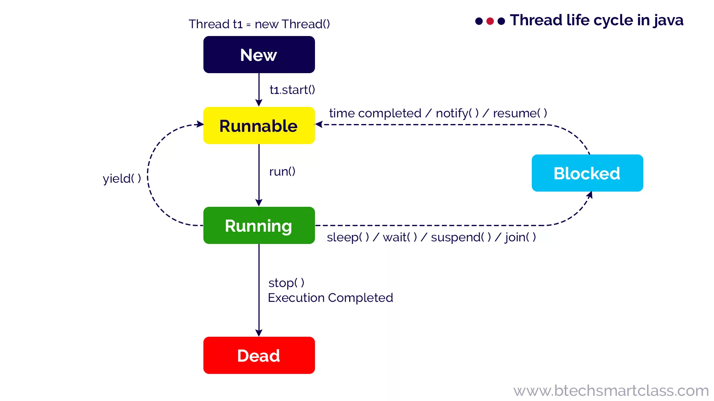

## QA

### QA Junior

###### Чем процесс отличается от потока?

_Процесс_ - это экземпляр программы во время выполнения, независимый объект, которому выделены системные ресурсы

_Поток_ - способ выполнения _процесса_, определяющий последовательность исполнения кода в процессе. _Поток_ всегда создается в контексте какого-либо _процесса_

###### Что такое _«кооперативная многозадачность»_? Какой тип многозадачности использует Java? Чем обусловлен этот выбор?

**Кооперативная многозадачность** - это способ деления процессорного времени между потоками, при котором каждый поток обязан отдавать управление следующему добровольно.

Преимущества такого подхода - простота реализации, меньшие накладные расходы на переключение контекста.

Недостатки - если один поток завис или ведет себя некорректно, то зависает целиком вся система и другие потоки никогда не получат управление.

Java использует **вытесняющую многозадачность**, при которой решение о переключении между потоками процесса принимает операционная система.

В отличие от кооперативной многозадачности управление операционной системе передаётся вне зависимости от состояния работающих приложений, благодаря чему, отдельные зависшие потоки процесса, как правило, не «подвешивают» всю систему целиком. За счёт регулярного переключения между задачами также улучшается отзывчивость приложения и повышается оперативность освобождения ресурсов, которые больше не используются.

В реализации вытесняющая многозадачность отличается от кооперативной, в частности, тем, что требует обработки системного прерывания от аппаратного таймера.

###### Какие основные состояния потоков в Java?

Основные состояния потока: NEW, RUNNABLE, BLOCKED, WAITING, TIMED_WAITING, TERMINATED.

- **Новый (New)**. После создания экземпляра потока, он находится в состоянии Новый до тех пор, пока не вызван метод `start()`. В этом состоянии поток не считается живым.
- **Работоспособный (Runnable)**. Поток переходит в состояние Работоспособный, когда вызывается метод `start()`. Поток может перейти в это состояние также из состояния Работающий или из состояния Блокирован. Когда поток находится в этом состоянии, он считается живым.
- **Работающий (Running)**. Поток переходит из состояния Работоспособный в состояние Работающий, когда Планировщик потоков выбирает его как работающий в данный момент.
- **Живой, но не работоспособный (Alive, but not runnable)**. Поток может быть живым, но не работоспособным по нескольким причинам:
    - **Ожидание (Waiting)**. Поток переходит в состояние Ожидания, вызывая метод `wait()`. Вызов `notify()` или `notifyAll()` может перевести поток из состояния Ожидания в состояние Работоспособный.
    - **Сон (Sleeping)**. Метод `sleep()` переводит поток в состояние Сна на заданный промежуток времени в миллисекундах.
    - **Блокировка (Blocked)**. Поток может перейти в это состояние, в ожидании ресурса, такого как ввод/вывод или из-за блокировки другого объекта. В этом случае поток переходит в состояние Работоспособный, когда ресурс становится доступен.
    - **Мёртвый (Dead)**. Поток считается мёртвым, когда его метод `run()` полностью выполнен. Мёртвый поток не может перейти ни в какое другое состояние, даже если для него вызван метод `start()`.



######  Области памяти в многопоточности?

В Java память разделена на несколько областей, которые управляются JVM и могут влиять на многопоточное программирование. Основные из них:

1. **Heap (Куча)** – общая память для всех потоков. Здесь хранятся объекты и ссылки на них.
2. **Stack (Стек потока)** – отдельная область для каждого потока, где хранятся локальные переменные и вызовы методов.
3. **Метаспейс (Metaspace)** – область для хранения информации о классах.
4. **Рабочая память потока (Thread Working Memory)** – кэш каждого потока, который может отличаться от данных в основной памяти.

💡 **Пример проблемы:**  
Если один поток изменяет объект в `Heap`, а другой читает старые данные из `Thread Working Memory`, может произойти рассинхронизация (data race).

**Как избежать?**

- Использовать `volatile`, чтобы изменения в одной нити были видны другим.
- Применять `synchronized` и `Lock` для атомарных операций.
###### Что такое потокобезопасный класс?

- Во-первых это может быть [[../../../_inforage/Java/Core/Immutable Class]]
- Для mutable классов можно использовать `synchronized` или более гибкие механизмы, такие как `ReadWriteLock`.
- Через гет нужно возвращать копию объекта, к примеру CopyOnWriteArrayList
- Если что-то передаем через конструктор, нужно копировать полученный объект, и только потом внедрять в поле
- Можно использовать Record или @Value от ломбока, сделает класс иммутабельным

###### Чем отличаются методы `Thread.sleep()` и `Thread.yield()`?

Метод `yield()` служит причиной того, что поток переходит из состояния работающий (running) в состояние работоспособный (runnable), давая возможность другим потокам активизироваться. Но следующий выбранный для запуска поток может и не быть другим.

Метод `sleep()` вызывает засыпание текущего потока на заданное время, состояние изменяется с работающий (running) на ожидающий (waiting).

###### Что значит _«приоритет потока»_?

Приоритеты потоков используются планировщиком потоков для принятия решений о том, когда какому из потоков будет разрешено работать. Теоретически высокоприоритетные потоки получают больше времени процессора, чем низкоприоритетные. Практически объем времени процессора, который получает поток, часто зависит от нескольких факторов помимо его приоритета.

Чтобы установить приоритет потока, используется метод класса `Thread`: `final void setPriority(int level)`. Значение `level` изменяется в пределах от `Thread.MIN_PRIORITY = 1` до `Thread.MAX_PRIORITY = 10`. Приоритет по умолчанию - `Thread.NORM_PRlORITY = 5`.

Получить текущее значение приоритета потока можно вызвав метод: `final int getPriority()` у экземпляра класса `Thread`.

###### Что такое _«потоки-демоны»_?

Потоки-демоны работают в фоновом режиме вместе с программой, но не являются неотъемлемой частью программы. Если какой-либо процесс может выполняться на фоне работы основных потоков выполнения и его деятельность заключается в обслуживании основных потоков приложения, то такой процесс может быть запущен как поток-демон с помощью метода `setDaemon(boolean value)`, вызванного у потока до его запуска. Метод `boolean isDaemon()` позволяет определить, является ли указанный поток демоном или нет. Базовое свойство потоков-демонов заключается в возможности основного потока приложения завершить выполнение потока-демона (в отличие от обычных потоков) с окончанием кода метода `main()`, не обращая внимания на то, что поток-демон еще работает.

###### Можно ли сделать основной поток программы демоном?

Нет. Потоки-демоны позволяют описывать фоновые процессы, которые нужны только для обслуживания основных потоков выполнения и не могут существовать без них.

###### Что такое _ThreadLocal-переменная_?

`ThreadLocal` - класс, позволяющий имея одну переменную, иметь различное её значение для каждого из потоков.

У каждого потока - т.е. экземпляра класса `Thread` - есть ассоциированная с ним таблица _ThreadLocal-переменных_. Ключами таблицы являются cсылки на объекты класса `ThreadLocal`, а значениями - ссылки на объекты, «захваченные» ThreadLocal-переменными, т.е. ThreadLocal-переменные отличаются от обычных переменных тем, что у каждого потока свой собственный, индивидуально инициализируемый экземпляр переменной. Доступ к значению можно получить через методы `get()` или `set()`.

Например, если мы объявим ThreadLocal-переменную: `ThreadLocal<Object> locals = new ThreadLocal<Object>();`. А затем, в потоке, сделаем `locals.set(myObject)`, то ключом таблицы будет ссылка на объект `locals`, а значением - ссылка на объект `myObject`. При этом для другого потока существует возможность «положить» внутрь `locals` другое значение.

Следует обратить внимание, что `ThreadLocal` изолирует именно ссылки на объекты, а не сами объекты. Если изолированные внутри потоков ссылки ведут на один и тот же объект, то возможны коллизии.

Так же важно отметить, что т.к. ThreadLocal-переменные изолированы в потоках, то инициализация такой переменной должна происходить в том же потоке, в котором она будет использоваться. Ошибкой является инициализация такой переменной (вызов метода `set()`) в главном потоке приложения, потому как в данном случае значение, переданное в методе `set()`, будет «захвачено» для главного потока, и при вызове метода `get()` в целевом потоке будет возвращен `null`.
###### Что значит _«усыпить»_ поток?

Это значит приостановить его на определенный промежуток времени, вызвав в ходе его выполнения статический метод `Thread.sleep()` передав в качестве параметра необходимое количество времени в миллисекундах. До истечения этого времени поток может быть выведен из состояния ожидания вызовом `interrupt()` с выбрасыванием `InterruptedException`.
###### Чем Thread отличается от Runnable? Когда использовать Thread, а когда Runnable? 

_Thread_ - класс-надстройка над физическим потоком.
_Runnable_ - интерфейс, представляющий абстракцию над выполняемой задачей.

- **Thread**. Используйте, если вам нужно управлять самим потоком
- **Runnable**. Используйте, если нужно просто выполнить задачу в потоке. Он более гибок и позволяет переиспользовать логику задачи в разных потоках

###### Как работает метод `Thread.join()`?

Когда поток вызывает `join()` для другого потока, текущий работающий поток будет ждать, пока другой поток, к которому он присоединяется, не будет завершён:

```java
void join()        
void join(long millis) 
void join(long millis, int nanos) 
```
###### В чем преимущество использования интерфейса Callable по сравнению с Runnable при создании потоков?

`Callable` возвращает результат и может бросить исключение, чего не поддерживает `Runnable`, что делает `Callable` предпочтительным для задач, возвращающих значение.

###### Как реализуется синхронизация?

Синхронизация в Java может быть реализована несколькими способами:

1. Синхронизированные методы: Используйте ключевое слово `synchronized` для объявления методов, которые должны быть выполнены одним потоком в данный момент времени.
2. Синхронизированные блоки: Позволяет синхронизировать только определенные блоки кода внутри метода.
3. `join()` Поток вызвавший этот метод будет ждать до тех пор, пока объект, у которого был вызван этот метод - не закончит свое выполнение
4. Объекты блокировки: Используйте `ReentrantLock` для более гибкой синхронизации, включая возможность принудительного ожидания и тайм-аутов.
5. Синхронизаторы: Phaser, CyclicBarrier, Semaphor, Exchanger, CountDownLatch

###### Что такое монитор? Как реализован в Java? 

_Монитор_ - механизм синхронизации потоков, обеспечивающий доступ к общему ресурсу. В Java реализован с помощью ключевого слова `synchronized`

- Монитор если упрощено это некий флаг, который есть у каждого объекта.
- Он нужен для избегания дата рейса, при блокировки на ключевом флаге/объекте

###### Как проверить, удерживает ли поток монитор определённого ресурса?

Метод `Thread.holdsLock(lock)` возвращает `true`, когда текущий поток удерживает монитор у определённого объекта.

###### Что такое Future?

`Future` — интерфейс, который предоставляет методы для работы с асинхронными результатами. Он используется в комбинации с `ExecutorService` или другими асинхронными API.

###### Что такое CompletableFuture?

`CompletableFuture` — это расширенная реализация интерфейса `Future`, которая добавляет возможность функционального программирования и работы с несколькими асинхронными задачами.

###### Что такое FutureTask? 

_FutureTask_ — это специальный объект в Java, который выполняет задачу в отдельном потоке и позволяет получить результат этой задачи, когда она завершится. Если задача ещё не закончена, попытка получить результат приостановит (заблокирует) выполнение, пока задача не завершится.

`FutureTask` — это реализация интерфейса `RunnableFuture`, который объединяет функциональность интерфейсов `Runnable` и `Future`. Этот класс позволяет выполнять задачу асинхронно, а затем получать её результат или обработать исключения.

###### Сравнение `FutureTask`, `Future` и `CompletableFuture`

|Особенность|FutureTask|Future|CompletableFuture|
|---|---|---|---|
|Асинхронное выполнение|Да|Да|Да|
|Получение результата|`get()`|`get()`|Неблокирующие методы (`thenApply`)|
|Отмена задачи|Да|Да|Да|
|Композиция задач|Нет|Нет|Да (`thenCombine`, `allOf`, `anyOf`)|
|Функциональный стиль|Нет|Нет|Да|
|Сложность|Простая|Простая|Расширенная функциональность|

1. **`FutureTask`**: Комбинация `Runnable` и `Future`, используется для выполнения асинхронных задач вручную.
2. **`Future`**: Интерфейс для асинхронных операций, с базовыми методами (`get`, `cancel`).
3. **`CompletableFuture`**: Современный и мощный инструмент для асинхронного программирования с поддержкой композиции и функционального стиля.

###### Completable Future vs Future

- **Future**: When using `Future`, you submit a task to an `ExecutorService`, and it returns a `Future` object. However, to get the result of the computation, **you must call the `get()` method**, which blocks the calling thread until the task is complete. This can make your application less responsive, as it waits for the computation to finish.  
- **CompletableFuture**: With `CompletableFuture`, you get non-blocking execution. It allows you to define what happens when the computation is done through methods like **`thenApply()`, `thenAccept()`, and** `**thenRun()**`. This makes your application much more responsive, as it doesn't block the main thread while waiting for the result.
- [Difference Between CompletableFuture And Future In Java](https://www.hungrycoders.com/blog/difference-between-completablefuture-and-future-in-java)

```java
// Using Future
Future<String> future = executor.submit(() -> {
    Thread.sleep(2000);
    return "Hello, Future!";
});
String result = future.get();  // Blocks until the result is ready

// Using CompletableFuture
CompletableFuture.supplyAsync(() -> {
    Thread.sleep(2000);
    return "Hello, CompletableFuture!";
}).thenAccept(System.out::println);  // Non-blocking
```
###### Что будет если без создания потоков, вызвать wait или notify?

- IllegalMonitorStateException

###### Как работает ExecutorService?

Он создает фиксированное количество потоков, которые могут быть повторно использованы для выполнения различных задач, что помогает снизить затраты на создание и уничтожение потоков.

###### Способы создания пула потоков

- newSingleThreadPool() - создает пулл с 1 потоком
- newFixedThreadPool(int number) - создает пулл с указанным количеством потоков  
- newCachedThreadPool() - создает динамический пулл потоков
- newScheduledThreadPool() - создает фиксированный пулл потоков, который может выполнять задачки по расписанию  
- newWorkStealingPool() - создает ForkJoinPool

######  Atomic vs Volatile 

**Atomic** — классы (AtomicInteger, AtomicLong, и т.д.), которые предоставляют атомарные операции для работы с примитивами. Они используют внутренние механизмы для обеспечения безопасности при изменении значений без блокировок

**Volatile** — ключевое слово, которое гарантирует, что значение переменной всегда будет читаться из памяти, а не из кэша потока. Каждый поток будет видеть актуальное значение volatile переменной, но если два потока одновременно изменяют переменную, могут возникнуть проблемы

_**Когда что использовать?**_

- **`volatile`**:
    - Когда нужно гарантировать только видимость изменений.
    - Например, для флагов завершения или состояния.
- **`Atomic`**:
    - Когда требуется атомарность (инкремент, сравнение и установка значений).
    - Например, для многопоточных счетчиков, индексов, обновлений.

**Сравнение `volatile` и `Atomic`**

| Характеристика            | **`volatile`**               | **`Atomic`**                               |
| ------------------------- | ---------------------------- | ------------------------------------------ |
| Гарантия видимости        | Да                           | Да                                         |
| Атомарные операции        | Нет                          | Да                                         |
| Использование             | Для простого чтения/записи   | Для сложных операций (инкремент, CAS)      |
| Пример подходящих случаев | Флаги (`boolean isRunning`)  | Счётчики (`AtomicInteger.incrementAndGet`) |
| Производительность        | Выше, так как операции проще | Чуть ниже из-за механизмов синхронизации   |
###### Зачем нужны atomic?

Классы из пакета `java.util.concurrent.atomic` (например, `AtomicInteger`, `AtomicLong`, `AtomicReference`) обеспечивают **безопасные операции над переменными в многопоточной среде** без явной синхронизации.  
Они полезны для:

1. **Операций над примитивами** (инкремент, декремент, сравнение и замена) с гарантией атомарности.
2. **Оптимизации производительности** — вместо блокировок используется низкоуровневая атомарность через аппаратные команды процессора.

###### Что такое CAS операции? (Compare And Swap) 

**CAS (Compare And Swap)** — атомарная операция, которая используется для управления многопоточным доступом к данным без использования блокировок. Есть две переменные текущее, старое и новое значение. Старая это волотайл переменная, а текущее не волотайл, если они равны значит исполнить свап на новое.

1. **Принцип работы:**
    - Проверяется, соответствует ли текущее значение ожидаемому.
    - Если да, то происходит обновление значения.
    - Если нет, операция повторяется.
2. **Этапы:**
    - Сравнение текущего значения с ожидаемым.
    - Обновление значения, если они совпадают.

###### В чём заключаются различия между `java.util.concurrent.Atomic*.compareAndSwap()` и `java.util.concurrent.Atomic*.weakCompareAndSwap()`.

- `weakCompareAndSwap()` не создает _memory barrier_ и не дает гарантии _happens-before_;
- `weakCompareAndSwap()` сильно зависит от кэша/CPU, и может возвращать `false` без видимых причин;
- `weakCompareAndSwap()`, более легкая, но поддерживаемая далеко не всеми архитектурами и не всегда эффективная операция.
###### Зачем нужны volatile?

Ключевое слово **`volatile`** гарантирует, что изменения переменной одним потоком будут **немедленно видны другим потокам**. Это предотвращает проблему с кешированием переменных в потоках.

- **Когда использовать?**  
    Используется для переменных, которые:
    - могут быть изменены несколькими потоками;
    - читаются часто, но синхронизация сложных операций не требуется.

**Ограничения `volatile`:**

1. Не обеспечивает атомарности операций (например, `count++` всё равно небезопасно).
2. Используется для простых флагов или переменных, где достаточно гарантии чтения/записи.
###### Чем CopyOnWriteCollections отличается от обычных?

Это потокобезопасные коллекции (_CopyOnWriteArrayList_, _CopyOnWriteArraySet_).

- Изменение: При каждой операции изменения (например, `add`, `set`, `remove`) создается новая копия массива, в то время как существующий массив остается неизменным для других потоков. Это минимизирует блокировки и обеспечивает безопасность чтения.
- Чтение: Чтение из `CopyOnWriteArrayList` происходит без блокировок, что делает его подходящим для сценариев с большим количеством операций чтения и небольшим количеством операций записи.
- **Стоит использовать, когда в программе много операций чтения**

###### Какие существуют потокобезопасные коллекции, как они взаимодействуют с кучей

- ConcurrentHashMap: Использует сегментированные блокировки для обеспечения безопасности потоков и повышения производительности.
- CopyOnWriteArrayList: Создает копии внутреннего массива при каждом изменении, что делает его подходящим для частого чтения.
- BlockingQueue: Предоставляет потокобезопасные операции для добавления и удаления элементов, с блокировкой при выполнении операций.

###### Как осуществляется обработка ошибок в многопоточности?

Если упал один поток, он положил по Error всю программу, потому что потоки выполняются массивом потоков.

###### Что такое shutdown в ExecutorService?

- `shutdown()`: Останавливает прием новых задач и ожидает завершения уже запущенных.
- `shutdownNow()`: Прерывает текущие задачи и возвращает список ожидающих задач.

###### Какие преимущества и недостатки использования ExecutorService для управления потоками?

`ExecutorService` упрощает управление потоками, позволяя повторно использовать их из пула, что экономит ресурсы. Недостаток — необходимость корректного завершения, чтобы избежать утечек ресурсов.

15. Какие стратегии и подходы используются для оптимизации производительности при работе с потоками?

Оптимизация потоков включает использование пулов, минимизацию блокировок, замену синхронизации атомарными операциями и профилирование для выявления узких мест.

16. Как можно реализовать механизм ожидания завершения нескольких потоков?

Можно использовать `CountDownLatch` или `CyclicBarrier` для ожидания завершения нескольких потоков

###### Как можно создать поток, используя лямбда-выражения?

Поток можно создать с помощью лямбда-выражения, например, `new Thread(() -> { /* код */ }).start();`. Потому что Thread реализуется Runnable с одним абстрактным методом.

###### Как реализовать паттерн Producer-Consumer с использованием многопоточности в Java?

В паттерне Producer-Consumer можно использовать `BlockingQueue`, где один поток производит данные, а другой их потребляет.
###### Можно ли создавать новые экземпляры класса, пока выполняется `static synchronized` метод?

Да, можно создавать новые экземпляры класса, так как статические поля не принадлежат к экземплярам класса.
###### Как работает метод interrupt() и в каких случаях он используется?

`interrupt()` прерывает поток, посылая ему сигнал прерывания. Используется, чтобы остановить поток корректно, например, при длительном ожидании.

###### Как реализовать безопасное взаимодействие между потоками при использовании общих ресурсов?

Для безопасного взаимодействия можно использовать синхронизацию, атомарные классы или блокировки (`ReentrantLock`) для избежания состояния гонки.

###### Каким образом можно реализовать паттерн «один производитель - много потребителей» в многопоточной программе на Java?

Для реализации паттерна «один производитель - много потребителей» можно использовать `BlockingQueue` или `ExecutorService` с несколькими потребителями.

###### Какой интерфейс из пакета java.util.concurrent представляет собой фреймворк, который упрощает выполнение асинхронных задач?

`CompletableFuture` — интерфейс из `java.util.concurrent` для асинхронных задач, который упрощает работу с потоками и их результатами.

###### В чем основное преимущество использования классов из пакета java.util.concurrent по сравнению с традиционным способом работы с потоками в Java?

Классы из `java.util.concurrent` предлагают более гибкие и высокоуровневые механизмы, чем `Thread` и `synchronized`, что упрощает разработку многопоточных приложений.

###### Какой класс из пакета java.util.concurrent используется для блокировок, которые позволяют более гибкое управление, чем синхронизированные блоки или методы?

`ReentrantLock` — класс, который предоставляет гибкую альтернативу для синхронизированных блоков, позволяя более точное управление блокировками.

###### Как работает ConcurrentHashMap и в чем его основное отличие от Hashtable и synchronizedMap?

`ConcurrentHashMap` обеспечивает лучшую производительность в многопоточной среде, сегментируя данные, в отличие от полной блокировки в `Hashtable` или `synchronizedMap`.
- [HashMap и ConcurrentHashMap популярные вопросы на собеседованиях](https://javarush.com/groups/posts/713-hashmap-i-concurrenthashmap-populjarnihe-voprosih-na-sobesedovanijakh)

32. Потокобезопасные коллекции

[Concurrent Collections](../../../_inforage/Java/Многопоточка/Коллекции/Concurrent%20Collections.md)

###### Как остановить поток?

На данный момент в Java принят уведомительный порядок остановки потока (хотя JDK 1.0 и имеет несколько управляющих выполнением потока методов, например `stop()`, `suspend()` и `resume()` - в следующих версиях JDK все они были помечены как `deprecated` из-за потенциальных угроз взаимной блокировки).

Для корректной остановки потока можно использовать метод класса `Thread` - `interrupt()`. Этот метод выставляет некоторый внутренний флаг-статус прерывания. В дальнейшем состояние этого флага можно проверить с помощью метода `isInterrupted()` или `Thread.interrupted()` (для текущего потока). Метод `interrupt()` также способен вывести поток из состояния ожидания или спячки. Т.е. если у потока были вызваны методы `sleep()` или `wait()` – текущее состояние прервется и будет выброшено исключение `InterruptedException`. Флаг в этом случае не выставляется.

Схема действия при этом получается следующей:

- Реализовать поток.
- В потоке периодически проводить проверку статуса прерывания через вызов `isInterrupted()`.
- Если состояние флага изменилось или было выброшено исключение во время ожидания/спячки, следовательно поток пытаются остановить извне.
- Принять решение – продолжить работу (если по каким-то причинам остановиться невозможно) или освободить заблокированные потоком ресурсы и закончить выполнение.

Возможная проблема, которая присутствует в этом подходе – блокировки на потоковом вводе-выводе. Если поток заблокирован на чтении данных - вызов `interrupt()` из этого состояния его не выведет. Решения тут различаются в зависимости от типа источника данных. Если чтение идет из файла – долговременная блокировка крайне маловероятна и тогда можно просто дождаться выхода из метода `read()`. Если же чтение каким-то образом связано с сетью – стоит использовать неблокирующий ввод-вывод из Java NIO.

Второй вариант реализации метода остановки (а также и приостановки) – сделать собственный аналог `interrupt()`. Т.е. объявить в классе потока флаги – на остановку и/или приостановку и выставлять их путем вызова заранее определённых методов извне. Методика действия при этом остаётся прежней – проверять установку флагов и принимать решения при их изменении. Недостатки такого подхода. Во-первых, потоки в состоянии ожидания таким способом не «оживить». Во-вторых, выставление флага одним потоком совсем не означает, что второй поток тут же его увидит. Для увеличения производительности виртуальная машина использует кеш данных потока, в результате чего обновление переменной у второго потока может произойти через неопределенный промежуток времени (хотя допустимым решением будет объявить переменную-флаг как `volatile`).

###### Почему не рекомендуется использовать метод `Thread.stop()`?

При принудительной остановке (приостановке) потока, `stop()` прерывает поток в недетерменированном месте выполнения, в результате становится совершенно непонятно, что делать с принадлежащими ему ресурсами. Поток может открыть сетевое соединение - что в таком случае делать с данными, которые еще не вычитаны? Где гарантия, что после дальнейшего запуска потока (в случае приостановки) он сможет их дочитать? Если поток блокировал разделяемый ресурс, то как снять эту блокировку и не переведёт ли принудительное снятие к нарушению консистентности системы? То же самое можно расширить и на случай соединения с базой данных: если поток остановят посередине транзакции, то кто ее будет закрывать? Кто и как будет разблокировать ресурсы?

###### Что происходит, когда в потоке выбрасывается исключение?

- Если исключение не поймано – поток «умирает» (переходит в состяние мёртв (dead)).
- Если установлен обработчик непойманных исключений, то он возьмёт управление на себя. `Thread.UncaughtExceptionHandler` – интерфейс, определённый как вложенный интерфейс для других обработчиков, вызываемых, когда поток внезапно останавливается из-за непойманного исключения. В случае, если поток собирается остановиться из-за непойманного исключения, JVM проверяет его на наличие `UncaughtExceptionHandler`, используя `Thread.getUncaughtExceptionHandler()`, и если такой обработчик найдет, то вызовет у него метод `uncaughtException()`, передав этот поток и исключение в виде аргументов.
###### Что такое JMM (Java Memory Model) и принцип Happens-Before?

- An unlock action on monitor `m` _happens-before_ all subsequent lock actions on `m`
- A write to a volatile variable `v` happens-before all subsequent reads of `v` by any thread
- The final action in a thread `T1` _happens-before_ any action in another thread `T2` that detects that `T1` has terminated.
- An action that starts a thread _happens-before_ the first action in the thread it starts.
- If thread `T1` interrupts thread `T2`, the interrupt by `T1` _happens-before_ any point where any other thread (including `T2`) determines that `T2` has been interrupted (by having an `InterruptedException` thrown or by invoking `Thread.interrupted` or `Thread.isInterrupted`).
- The write of the default value (`zero`, `false`, or `null`) to each variable _happens-before_ the first action in every thread.

- В рамках одного потока любая операция happens-before любой операцией, следующей за ней в исходном коде;
- Освобождение монитора (unlock) happens-before захват того же монитора (lock);
- Выход из `synchronized` блока/метода happens-before вход в `synchronized` блок/метод на том же мониторе;
- Запись `volatile` поля happens-before чтение того же самого `volatile` поля;
- Завершение метода `run()` экземпляра класса `Thread` happens-before выход из метода `join()` или возвращение `false` методом `isAlive()` экземпляром того же потока;
- Вызов метода `start()` экземпляра класса `Thread` happens-before начало метода `run()` экземпляра того же потока;
- Завершение конструктора happens-before начало метода `finalize()` этого класса;
- Вызов метода `interrupt()` на потоке happens-before обнаружению потоком факта, что данный метод был вызван либо путем выбрасывания исключения `InterruptedException`, либо с помощью методов `isInterrupted()` или `interrupted()`.
- Связь happens-before транзитивна, т.е. если _X_ happens-before _Y_, а _Y_ happens-before _Z_, то _X_ happens-before _Z_.
- Освобождение/захват монитора и запись/чтение в `volatile` переменную связаны отношением happens-before, только если операции проводятся над одним и тем же экземпляром объекта.
- В отношении happens-before участвуют только два потока, о поведении остальных потоков ничего сказать нельзя, пока в каждом из них не наступит отношение happens-before с другим потоком.
###### Какие методы атомиков знаешь?

| метод                                                 | описание                                                                                                         |
| ----------------------------------------------------- | ---------------------------------------------------------------------------------------------------------------- |
| int addAndGet (int delta)                             | Добавляет определенное значение к текущему значению.                                                             |
| boolean compareAndSet (ожидаемое int, обновление int) | Устанавливает значение для данного обновленного значения, если текущее значение совпадает с ожидаемым значением. |
| int decrementAndGet ()                                | Уменьшает на единицу текущее значение.                                                                           |
| int getAndAdd (int delta)                             | Добавляет данное значение к текущему значению.                                                                   |
| int getAndDecrement ()                                | Уменьшает на единицу текущее значение.                                                                           |
| int getAndIncrement ()                                | Увеличивает на единицу текущее значение.                                                                         |
| int getAndSet (int newValue)                          | Устанавливает заданное значение и возвращает старое значение.                                                    |
| int incrementAndGet ()                                | Увеличивает на единицу текущее значение.                                                                         |
| lazySet (int newValue)                                | В конце-концов устанавливается на заданное значение.                                                             |
| boolean weakCompareAndSet (ожидаемое, обновление int) | Устанавливает значение для данного обновленного значения, если текущее значение совпадает с ожидаемым значением. 
###### Что такое deadlock?

Когда два и более потоков вечно ожидают друг друга. _Deadlock имеет место быть, тогда и только тогда, когда диаграмма Холта, отражающая состояния процессов и ресурсов, **содержит цикл**._ Это ситуация, когда два или более потока навсегда блокируются, ожидая ресурсы, которые уже захвачены другими потоками (**Thread A** ожидает **Thread B**, а **Thread B** ожидает **Thread A**)

1. взаимного исключения: по крайней мере один ресурс занят в режиме неделимости и, следовательно, только один поток может использовать ресурс в любой данный момент времени.
2. удержания и ожидания: поток удерживает как минимум один ресурс и запрашивает дополнительные ресурсов, которые удерживаются другими потоками.
3. отсутствия предочистки: операционная система не переназначивает ресурсы: если они уже заняты, они должны отдаваться удерживающим потокам сразу же.
4. цикличного ожидания: поток ждёт освобождения ресурса, другим потоком, который в свою очередь ждёт освобождения ресурса заблокированного первым потоком.

Простейший способ избежать взаимной блокировки – не допускать цикличного ожидания. Этого можно достичь, получая мониторы разделяемых ресурсов в определённом порядке и освобождая их в обратном порядке.


How to Prevent Deadlocks

1. **Lock Ordering**: Always acquire locks in the same order.
2. **Timeouts**: Instead of waiting indefinitely, use timeouts.
3. **Thread Management**: Regularly monitor and manage thread activity to detect potential deadlocks.

###### Что такое livelock?

Livelock заключается в том, что потоки внешне как бы живут, но при этом не могут ничего сделать, т.к. условие, по которым они пытаются продолжить свою работу, не могут выполниться. По сути Livelock похож на deadlock, но только потоки не "зависают" на системном ожидании монитора, а что-то вечно делают.

Вы делаете телефонный звонок, но человек на другом конце тоже пытается вам позвонить. Вы оба повесите трубку и попробуйте снова через одно и то же время, что снова создаст такую же ситуацию. Это может продолжаться вечность.

How to Avoid Livelock

1. **Use Random Backoff**: Introduce randomness in decision making, allowing for one thread to proceed while the other waits.
2. **Resource Fairness**: Implement algorithms that guarantee all threads will acquire resources eventually.
###### Что такое Starvation?

От блокировок это явление отличается тем, что потоки не заблокированы, а им просто не хватает ресурсов на всех. Поэтому пока одни потоки на себя берут всё время выполнения, другие не могут выполниться. Starvation — это любая ситуация, когда параллельный процесс не может получить все ресурсы, необходимые для выполнения его работы.

У нас будет два работника. Один жадный(`greedyWorker`), другой вежливый(`politeWorker`). Обоим дается одинаковое кол-во времени на их полезную работу — спать по 3 наносекунде.

`greedyWorker` жадно удерживает общий ресурс(`sharedLock`) на протяжении всего цикла работы, тогда как politeWorker пытается блокировать его только тогда, когда это необходимо.

1. **Fair Scheduling**: Use synchronization mechanisms that ensure fair access to resources.
2. **Thread Prioritization**: Balance thread priority levels, avoiding scenarios where low-priority threads are completely overlooked.
3. **Resource Limits**: Establish limits for how long threads can hold resources.

###### Что такое race condition?

При работе с многопоточностью есть такое понятие, как "состояние гонки". Это явление заключается в том, что потоки делят между собой некоторый ресурс и код написан таким образом, что не предусматривает корректную работу в таком случае.

Это ситуация, при которой результат выполнения программы зависит от порядка выполнения потоков. Возникает, когда несколько потоков одновременно обращаются к разделяемым ресурсам, и результат работы зависит от того, какой поток первым выполнит операции

###### Что такое _«фреймворк Fork/Join»_?

Фреймворк Fork/Join, представленный в JDK 7, - это набор классов и интерфейсов позволяющих использовать преимущества многопроцессорной архитектуры современных компьютеров. Он разработан для выполнения задач, которые можно рекурсивно разбить на маленькие подзадачи, которые можно решать параллельно.

- Этап Fork: большая задача разделяется на несколько меньших подзадач, которые в свою очередь также разбиваются на меньшие. И так до тех пор, пока задача не становится тривиальной и решаемой последовательным способом.
- Этап Join: далее (опционально) идёт процесс «свёртки» - решения подзадач некоторым образом объединяются пока не получится решение всей задачи.

Решение всех подзадач (в т.ч. и само разбиение на подзадачи) происходит параллельно.

> Для решения некоторых задач этап Join не требуется. Например, для параллельного QuickSort — массив рекурсивно делится на всё меньшие и меньшие диапазоны, пока не вырождается в тривиальный случай из 1 элемента. Хотя в некотором смысле Join будет необходим и тут, т.к. всё равно остаётся необходимость дождаться пока не закончится выполнение всех подзадач.

Ещё одно замечательное преимущество этого фреймворка заключается в том, что он использует work-stealing алгоритм: потоки, которые завершили выполнение собственных подзадач, могут «украсть» подзадачи у других потоков, которые всё ещё заняты.
### QA Middle
###### Что такое CountDownLatch

Wait на стероидах. Мы можем поставить на паузу работу какого потока, пока не выполняться другие потоки, сколько мы указали в CountDownLatch

###### CyclicBarrier

Позволяет внедрить wait в Runnable, к примеру мы можем ожидать пока 3 потока дойдут до определенной строки кода, затем пускать их дальше. 

Представьте, что у вас есть несколько потоков, каждый из которых выполняет часть вычислений. После того как все потоки завершат свои этапы, они должны синхронизироваться перед переходом к следующей фазе вычислений.

###### Что такое Semapthor

Ограничение одновременного доступа к какому-то ресурсу.

```java
semaphore.acquire();
```

###### Что такое Exchanger

Если двум потокам нужно обменяться данными

###### Что такое Phaser?

Более гибкий барьер чем CyclycBarier - можно разделять барьер по фазам, можно менять динамически кол-во участников барьера.

###### Расскажи про синхронное и асинхронное взаимодействие, и когда нужно выбирать тот или иной подход?


###### В чем заключаются различия между `CyclicBarrier` и `CountDownLatch`?

`CountDownLatch` (замок с обратным отсчетом) предоставляет возможность любому количеству потоков в блоке кода ожидать до тех пор, пока не завершится определенное количество операций, выполняющихся в других потоках, перед тем как они будут «отпущены», чтобы продолжить свою деятельность. В конструктор `CountDownLatch(int count)` обязательно передается количество операций, которое должно быть выполнено, чтобы замок «отпустил» заблокированные потоки.

> Примером `CountDownLatch` из жизни может служить сбор экскурсионной группы: пока не наберется определенное количество человек, экскурсия не начнется.

`CyclicBarrier` реализует шаблон синхронизации «Барьер». Циклический барьер является точкой синхронизации, в которой указанное количество параллельных потоков встречается и блокируется. Как только все потоки прибыли, выполняется опционное действие (или не выполняется, если барьер был инициализирован без него), и, после того, как оно выполнено, барьер ломается и ожидающие потоки «освобождаются». В конструкторы барьера `CyclicBarrier(int parties)` и `CyclicBarrier(int parties, Runnable barrierAction)` обязательно передается количество сторон, которые должны «встретиться», и, опционально, действие, которое должно произойти, когда стороны встретились, но перед тем когда они будут «отпущены».

> `CyclicBarrier` является альтернативой метода `join()`, который «собирает» потоки только после того, как они выполнились.

`CyclicBarrier` похож на `CountDownLatch`, но главное различие между ними в том, что использовать «замок» можно лишь единожды - после того, как его счётчик достигнет нуля, а «барьер» можно использовать неоднократно, даже после того, как он «сломается».

###### Как получить дамп потока?

Среды исполнения Java на основе HotSpot генерируют только дамп в формате HPROF. В распоряжении разработчика имеется несколько интерактивных методов генерации дампов и один метод генерации дампов на основе событий.

Интерактивные методы:

- Использование Ctrl+Break: если для исполняющегося приложения установлена опция командной строки `-XX:+HeapDumpOnCtrlBreak`, то дамп формата HPROF генерируется вместе с дампом потока при наступлении события `Ctrl+Break` или `SIGQUIT` (обычно генерируется с помощью _kill -3_), которое инициируется посредством консоли. Эта опция может быть недоступна в некоторых версиях. В этом случае можно попытаться использовать следующую опцию: `-Xrunhprof:format=b,file=heapdump.hprof`
- Использование инструмента _jmap_: утилита _jmap_, поставляемая в составе каталога `/bin/` комплекта JDK, позволяет запрашивать дамп HPROF из исполняющегося процесса.
- Использование операционной системы: Для создания файла ядра можно воспользоваться неразрушающей командой _gcore_ или разрушающими командами _kill -6_ или _kill -11_. Затем извлечь дамп кучи из файла ядра с помощью утилиты _jmap_.
- Использование инструмента _JConsole_. Операция `dumpHeap` предоставляется в _JConsole_ как MBean-компонент `HotSpotDiagnostic`. Эта операция запрашивает генерацию дампа в формате HPROF.

Метод на основе событий:

- Событие `OutOfMemoryError`: Если для исполняющегося приложения установлена опция командной строки `-XX:+HeapDumpOnOutOfMemoryError`, то при возникновении ошибки `OutOfMemoryError` генерируется дамп формата HPROF. Это идеальный метод для «production» систем, поскольку он практически обязателен для диагностирования проблем памяти и не сопровождается постоянными накладными расходами с точки зрения производительности. В старых выпусках сред исполнения Java на базе HotSpot для этого события не устанавливается предельное количество дампов кучи в пересчете на одну JVM; в более новых выпусках допускается не более одного дампа кучи для этого события на каждый запуск JVM.
###### Что такое _double checked locking Singleton_?

**double checked locking Singleton** - это один из способов создания потокобезопасного класса реализующего шаблон Одиночка. Данный метод пытается оптимизировать производительность, блокируясь только случае, когда экземпляр одиночки создаётся впервые.

```java
class DoubleCheckedLockingSingleton {
    private static volatile DoubleCheckedLockingSingleton instance;

    static DoubleCheckedLockingSingleton getInstance() {
        DoubleCheckedLockingSingleton current = instance;
        if (current == null) {
            synchronized (DoubleCheckedLockingSingleton.class) {
                current = instance;

                if (current == null) {
                    instance = current = new DoubleCheckedLockingSingleton();
                }
            }
        }
        return current;
    }
}
```

Следует заметить, что требование `volatile` обязательно. Проблема Double Checked Lock заключается в модели памяти Java, точнее в порядке создания объектов, когда возможна ситуация, при которой другой поток может получить и начать использовать (на основании условия, что указатель не нулевой) не полностью сконструированный объект. Хотя эта проблема была частично решена в JDK 1.5, однако рекомендация использовать `volatile` для Double Cheсked Lock остаётся в силе.

###### Как создать потокобезопасный Singleton?

- **Static field**

```java
public class Singleton {
	public static final Singleton INSTANCE = new Singleton();
}
```

- **Enum**

```java
public enum Singleton {
	INSTANCE;
}
```

- **Synchronized Accessor**

```java
public class Singleton {
	private static Singleton instance;
	
	public static synchronized Singleton getInstance() {
		if (instance == null) {
			instance = new Singleton();
		}
		return instance;
	}
}
```

- **Double Checked Locking & `volatile`**

```java
public class Singleton {
        private static volatile Singleton instance;
	
        public static Singleton getInstance() {
		Singleton localInstance = instance;
		if (localInstance == null) {
			synchronized (Singleton.class) {
				localInstance = instance;
				if (localInstance == null) {
					instance = localInstance = new Singleton();
				}
			}
		}
		return localInstance;
	}
}
```

- **On Demand Holder Idiom**

```java
public class Singleton {
		
	public static class SingletonHolder {
		public static final Singleton HOLDER_INSTANCE = new Singleton();
	}
		
	public static Singleton getInstance() {
		return SingletonHolder.HOLDER_INSTANCE;
	}
}
```

###### Перечислите принципы, которым вы следуете в многопоточном программировании?

При написании многопоточных программ следует придерживаться определённых правил, которые помогают обеспечить достойную производительность приложения в сочетании с удобной отладкой и простотой дальнейшей поддержки кода.

- Всегда давайте значимые имена своим потокам. Процесс отладки, нахождения ошибок или отслеживание исключения в многопоточном коде – довольно сложная задача. `OrderProcessor`, `QuoteProcessor` или `TradeProcessor` намного информативнее, чем `Thread1`, `Thread2` и `Thread3`. Имя должно отражать задачу, выполняемую данным потоком.
- Избегайте блокировок или старайтесь уменьшить масштабы синхронизации. Блокировка затратна, а переключение контекста ещё более ресурсоёмко. Пытайтесь избегать синхронизации и блокировки насколько это возможно, и организуйте критическую секцию в минимально необходимом объёме. Поэтому синхронизированный блок всегда предпочительней синхронизированного метода, дополнительно наделяя возможностью абсолютного контроля над масштабом блокировки.
- Обрабатывайте прерывание потока с особой тщательностью. Нет ничего хуже оставшегося заблокированным ресурса или системы в неконстистентном, по причине неподтверждённой транзакции, состоянии.
- Помните об обработке исключений. Выброшенные `InterruptedException` должны быть адекватно обработаны, а не просто подавлены. Так же не стоит пренебрегать `Thread.UncaughtExceptionHandler`. При использовании пула потоков необходимо помнить, что он зачастую просто «проглатывает» исключения. Так, если вы отправили на выполнение `Runnable` нужно обязательно поместить код выполнения задачи внутрь блока `try-catch`. Если в очередь пула помещается `Callable`, необходимо удостоверится, что результат выполнения всегда изымается помощью блокирующего `get()`, чтобы в случае возникновения существовала возможность заново выбросить произошедшее исключение.
- Между синхронизаторами и `wait()` и `notify()` следует выбирать синхронизаторы. Во-первых, синхронизаторы, типа `CountDownLatch`, `Semaphore`, `CyclicBarrier` или `Exchanger` упрощают написание кода. Очень сложно реализовывать комплексный управляющий поток, используя `wait()` и `notify()`. Во-вторых, эти классы написаны и поддерживаются настоящими мастерами своего дела и есть шанс, что в последующих версиях JDK они будут оптимизированы изнутри или заменены более производительной внешней реализацией.
- Почти всегда использование Concurrent сollection выгоднее использования Synchronized сollection, т.к. первые более современны (используют все доступные на момент их написания новшества языка) и масштабируемы, чем их синхронизированые аналоги.
### QA Senior

###### @Async


###### А если volatile использовать на Long - он станет атомарным?


###### В чем преимущества вирутальных потоков?


###### NIO - рассказать для чего оно используется и чем отличается от обычного блокирующего ввода-вывода?


###### Как в плане запроса понять, используется ли индекс?


###### Приходилось ли работать с представлениями бд?


###### Для чего нужны ключевые слова volatile и synchronized?


###### Разница между ConcurrentHashMap и SynchronizedHashMap?

###### ConcurrentSkipListMap vs ConcurrentHashMap?
## Resources

- [JDK concurrent package](https://habr.com/ru/articles/187854/)
- [Deadlocks, Livelocks и Starvation](https://ubiklab.net/posts/deadlocks-livelocks-starvation/)
- [Understanding Deadlock, Livelock, and Starvation in Java Concurrency](https://procodebase.com/article/understanding-deadlock-livelock-and-starvation-in-java-concurrency)
- [Difference Between CompletableFuture And Future In Java](https://www.hungrycoders.com/blog/difference-between-completablefuture-and-future-in-java)
- [Хабрахабр - Многопоточность в Java](https://habrahabr.ru/post/164487/)
- [IBM DeveloperWorks - Выполнение задач в многопоточном режиме](https://www.ibm.com/developerworks/ru/library/l-java_universe_multithreading_tasks/)
- [Записки трезвого практика](http://www.skipy.ru/technics/synchronization.html)
- [IBM DeveloperWorks - SCJP](https://www.ibm.com/developerworks/ru/edu/j-scjp/section8.html)
- [JavaRush](http://info.javarush.ru/KapChook/2015/02/15/%D0%9F%D0%B5%D1%80%D0%B5%D0%B2%D0%BE%D0%B4-%D0%A2%D0%BE%D0%BF-50-%D0%B8%D0%BD%D1%82%D0%B5%D1%80%D0%B2%D1%8C%D1%8E-%D0%B2%D0%BE%D0%BF%D1%80%D0%BE%D1%81%D0%BE%D0%B2-%D0%BF%D0%BE-%D0%BD%D0%B8%D1%82%D1%8F%D0%BC-%D0%A7%D0%B0%D1%81%D1%82%D1%8C-1-.html)
- [Хабрахабр - Справочник по синхронизаторам `java.util.concurrent.*`](https://habrahabr.ru/post/277669/)
- [Блог сурового челябинского программиста](http://samolisov.blogspot.ru/2011/04/threadlocal.html)
- [IBM DeveloperWorks - Более гибкая, масштабируемая блокировка в JDK 5.0](http://www.ibm.com/developerworks/ru/library/j-jtp10264/)
- [Хабрахабр - Правильный Singleton в Java](https://habrahabr.ru/post/129494/)
- [duct-tape-architect.ru](http://www.duct-tape-architect.ru/?p=294#3__171_187___Java_HotSpot_JVM6)