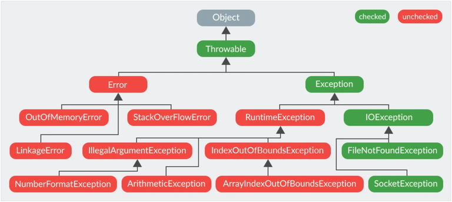

#### Опишите иерархию исключений


#### Какое исключение выбрасывается при возникновении ошибки в блоке инициализации класса?

- Если возникшее исключение – наследник Error:
	- для статических блоков инициализации будет выброшено java.lang.ExceptionInInitializerError;
	- для нестатических будет проброшено исключение-источник.
- Если возникшее исключение – наследник Error, то в обоих случаях будет выброшено java.lang.Error.
- Если исключение java.lang.ThreadDeath (смерть потока), то в этом случае никакое исключение выброшено не будет.
#### Можно ли перехватывать Throwable?

- Можно перехватывать `Throwable`, но это не рекомендуется из-за потенциальных последствий и нарушения лучших практик
- Перехват `Throwable` может маскировать критические ошибки, такие как `OutOfMemoryError`, `StackOverflowError`, `AssertionError` и другие.
- Перехват `Throwable` затрудняет отладку, так как все исключения и ошибки будут обрабатываться одинаково.
#### Расскажите про обрабатываемые и необрабатываемые исключения

Проверяемые исключения должны быть явно пойманы в теле метода или объявлены в секции throws метода. Непроверяемые исключения вызваны проблемами, которые не могут быть решены, такими как деление на 0, нулевой указатель и т.п. Проверяемые исключения особенно важны потому, что от других разработчиков, использующих ваше API, вы ожидаете, что они будут знать, как обращаться с исключениями.

#### Когда может понадобиться отловить Error?

Отлавливать Error следует только в редких случаях, таких как логирование или освобождение ресурсов.

#### Почему Double.parseDouble(null) и Integer.parseInt(null) вызывают разные исключения?

Это проблема JDK. Они просто были разработаны разными людьми, и не стоит всерьёз заморачиваться над этим.

```java
Integer.parseInt(null); // вызывает java.lang.NumberFormatException: null 

Double.parseDouble(null); // вызывает java.lang.NullPointerException
```

#### Можно ли поймать несколько исключений в одном блоке catch?

Ответ - ДА. Пока классы этих исключений можно отследить вверх по иерархии наследования классов до одного и того же суперкласса, можно использовать только этот суперкласс.

#### Какие есть способы обработки исключений в лябмда-выражениях и стрим апи?

Исключения можно обрабатывать с помощью `try-catch` внутри лямбда-выражений, либо использовать обёртки для лямбд, которые позволяют перехватывать исключения.

```java
list.stream()
    .map(item -> {
        try {
            return someMethod(item);
        } catch (Exception e) {
            e.printStackTrace();
            return null;
        }
    })
    .collect(Collectors.toList());
```

#### Какие существуют _unchecked exception_?

Наиболее часто встречающиеся: `ArithmeticException`, `ClassCastException`, `ConcurrentModificationException`, `IllegalArgumentException`, `IllegalStateException`, `IndexOutOfBoundsException`, `NoSuchElementException`, `NullPointerException`, `UnsupportedOperationException`.


#### Что вы знаете о `OutOfMemoryError`?

`OutOfMemoryError` выбрасывается, когда виртуальная машина Java не может создать (разместить) объект из-за нехватки памяти, а сборщик мусора не может высвободить достаточное её количество.

Область памяти, занимаемая java процессом, состоит из нескольких частей. Тип `OutOfMemoryError` зависит от того, в какой из них не хватило места:

- `java.lang.OutOfMemoryError: Java heap space`: Не хватает места в куче, а именно, в области памяти в которую помещаются объекты, создаваемые в приложении программно. Обычно проблема кроется в утечке памяти. Размер задается параметрами `-Xms` и `-Xmx`.
- `java.lang.OutOfMemoryError: PermGen space`: (до версии Java 8) Данная ошибка возникает при нехватке места в _Permanent_ области, размер которой задается параметрами `-XX:PermSize` и `-XX:MaxPermSize`.
- `java.lang.OutOfMemoryError: GC overhead limit exceeded`: Данная ошибка может возникнуть как при переполнении первой, так и второй областей. Связана она с тем, что памяти осталось мало и сборщик мусора постоянно работает, пытаясь высвободить немного места. Данную ошибку можно отключить с помощью параметра `-XX:-UseGCOverheadLimit`.
- `java.lang.OutOfMemoryError: unable to create new native thread`: Выбрасывается, когда нет возможности создавать новые потоки.
###### Предположим, есть метод, который может выбросить `IOException` и `FileNotFoundException` в какой последовательности должны идти блоки `catch`? Сколько блоков `catch` будет выполнено?

Общее правило: обрабатывать исключения нужно от «младшего» к старшему. Т.е. нельзя поставить в первый блок `catch(Exception ex) {}`, иначе все дальнейшие блоки `catch()` уже ничего не смогут обработать, т.к. любое исключение будет соответствовать обработчику `catch(Exception ex)`.

Таким образом, исходя из факта, что `FileNotFoundException extends IOException` сначала нужно обработать `FileNotFoundException`, а затем уже `IOException`:

```java
void method() {
    try {
        //...
    } catch (FileNotFoundException ex) {
        //...
    } catch (IOException ex) {
        //...
    }
}
```

#### Какая ошибка при изменении коллекции от List.of() 
UnsupportedOperationException

#### Можно ли создать параметризированные исключения

```java
class MyException<T> extends Exception {
	T t;
}
```

Каждое catch выражение в try-catch проверяет тип полученного исключения во время выполнения программы (что равносильно instanceof),  соответственно, тип должен быть Reifiable. Поэтому Throwable и его подтипы не могут быть параметризованы.

#### Что тако try with resourse и autoClosable интерфейс

- **AutoClosable** — интерфейс с методом `close()`, который должен быть реализован объектами, которые нужно закрывать (например, потоки).
- **try-with-resources** — синтаксическая конструкция, которая автоматически закрывает ресурсы (класс, реализующий AutoClosable) после использования.

#### Почему использование try with recourses лучше чем finally?

Если мы захотим закрыть ресурс в finally, для закрытия тоже необходимо будет обработать ошибку. TWR делает это за нас.
## Recourses

- [Исключения в Java (Java Exception)](https://javarush.com/groups/posts/isklyucheniya-java)
