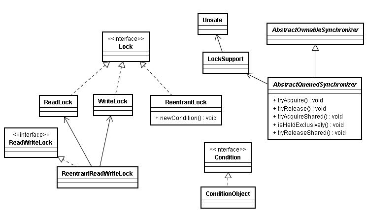
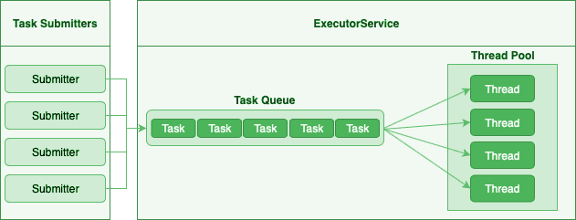

### Железо

#### Что такое — Планировщик потоков? Предположите алгоритм работы

Планировщик потоков - программа на уровне операционной системы, которой по прерыванию управление через определенные промежутки времени. Ее задача - распределять процессорное время между процессами, выполняющимся в системе.

- Заводится кольцевой буфер;
- Когда процесс начинает работу, он добавляется в буфер;
- Когда заканичивает - удаляется;
- Планировщик выбирает процесс с головы буфера;
- Голова буфера сдвигается к следующему процессу;
- Процесс выполняет свой квант времени;
- Текущий процесс прерывается;
- Управление передается процессу в голове буфера

#### Расскажите про иерархию кэшей L1/L2/L3? Что вызвало ее появление

L1/L2/L3 - кэши данных, которыми оперирует процессор.

- L1 - кэш на ядре процессора с скоростью доступа порядка 1 нс. Размер обычно около 32 КБ.
- L2 - более крупный и менее быстрый кэш. Скорость доступа порядка 5 нс. Размер порядка 256 КБ.
- L3 - кэш на процессоре, общий для всех ядер. Скорость доступа порядка 20 нс. Может быть достаточно большим (8-32 MB).

Появление кэшей вызывало тот факт, что скорость работы процессора начала становится намного больше скорости доступа к памяти. Поэтому для того, чтобы избежать огромных задержек по доступу к данным из основной памяти (порядка 60 нс), производителями процессоров были добавлены кэши на процессорах для быстрого выполнения операций над "горячими" данными.

#### Что такое Memory Hierarchy?

_Memory Hierarchy_ - термин для описания производительности систем хранения данных. Чем ниже уровень иерархии, тем дешевле цена системы хранения и больше время доступа к ней. Обычно выделяют 4 уровня:

- Регистры и кэши процессора (скорость доступа порядка 100-500 Гб/c)
- Оперативная память (скорость доступа порядка 1-10 Гб/c)
- Диски (скорость доступа порядка 100-500 Мб/c)
- Третичные хранилища (скорость доступа порядка 10-100 Мб/c)

#### Что такое Cache line? В виде каких эффектов проявляется?

_Cache line_ - блок данных(обычно 64 байт), в котором передаются данные между процессором и оперативной памятью. Когда процессору нужно прочитать данные по конкретному адресу из опертивной памяти, он вместо 1 байта читает сразу блок данных и кладет этот блок в кэш. Такая оптимизация хорошо работает в случае, если данные, над которыми работает процессор, обладают хорошей локальностью. Тогда при следующем чтении данные уже будут в кэше и процессору не нужно будет делать дорогой запрос в оперативную память.

#### Что такое False sharing? Плохо это или хорошо? Как с этим бороться?

_False sharing_ - эффект при котором данные, не связанные с друг другом, попадают в одну кэш-линию. В итоге когда изменяется одна из частей данных в кэш-линии, вся линия инвалидируется. Это плохой эффект, так как он может вызывать трешинг (thrashing) - постоянную подгрузку и инвалидацую данных их кэша. Например, часто читаемые данные могут попать на одну линию с часто записываемыми. При каждой записи линия будет инвалидироваться из кэша вместе с часто читаемыми данными, хотя сами данные не менялись. Бороться можно с помощью техники паддинга (padding). Часто читаемые данные выравниваются по модулю длины кэш-линии с помощью фиктивных байтов. В итоге исключается вариант, когда вместе с ними на кэш-линию попадают "случайные" данные.

### Что такое Memory padding?

Memory padding - это техника выравнивая структуры данных по границам читаемого процессором размера слова. Она позволяет быть уверенным, что данные всегда попадут на одну кэш-линию и займут ее экслюзивно. Это позволяет избежать трешинга кэша, в случае, если на линию попадают не соотносящиеся друг с другом данные.

#### Что такое Cache pollution? Плохо это или хорошо? Как с этим бороться?

Cache pollution - эффект при котором, происходит трешинг кэшей из-за того, что активные данные не имеют локальности. Если данные на находятся на одной кэш-линии, то при чередующем обращении к 1-му и 2-му набору данных, кэш будет постоянно инвалидировать и подгружать данные. Это плохой эффект, так как он может привести к заметному падению производительности приложения без видимой для программиста причины. Бороться можно изменением подхода к обработке данных. Идея заключается в том, чтобы в один период времени работать только с "горячими" данными в кэше и начинать работу со следующим набором данных только после того, как первый больше не нужен.

#### Что такое Cache miss? Плохо это или хорошо? Как с этим бороться?

Cache miss - ситуация, когда запрашиваемого блока данных нет в кэше. В общем случае, это не является плохим эффектом, так если данные запрашиваются первый раз, то они все равно должны быть загружены в кэш. Процессоры часто спекулируют о паттернах доступа данных и вместе с запрашиваемым блоком данных кэшируют больший блок данных, полагаясь на локальность данных. Поэтому для близко лежащих данных промахов не будет. Проблема возникает, когда промахов становится очень много. Это значит, что данные не локальны и кэш не может эффективно предпогружать данные. Бороться с промахами можно с помощью изменения расположения данных в памяти (большая локальность), изменением патернов доступа к данным (избегать трешинга), тюнингом размера кэша.

#### В чем разница между Multicore и Multisocket?

- Multicore - это один процессор с несколькими ядрами.
- Multisocket - это несколько одноядерных процессоров.

Multisocket системы дороже, чем Multicore (нужен отдельный сокет на каждый процессор. А каждый процессор в свою очередь является чипом). Они лучшеработают, если процессоры сильно не зависимы от друг друга (обрабатывают разный набор данных). Тогда можно избежать трешинга L3-кэшей, так как они у процессоров раздельные. В общем случае Multicore системы работают лучше, так как программы обычно не настолько требовательны к ресурсам, чтобы потреблять всю вычислительную мощность ядра/процессора. При этом засчет L3 кэша переключение программ с ядро на ядро в multicore-процессорах происходит быстрее.

#### Что такое Thread affinity? Можно ли сделать в Java?

_Thread affinity_ - это возможность привязать выполнение потока к определенному ядру. Это является оптимизацией производительности в мультипроцессорных системах. Ее цель - увеличить процент "попадания" в кэш при доступе к данным. Смысл оптимизации в извлечении пользы из наблюдения о том, что большинство потоков обычно работают с одним и тем же набором данных. То есть после того как поток прервется планировщиком и заново получит квант времени, ему лучше выполнится на том же ядре, так как скорее всего оно уже будет содержать нужные данные в своем кэше. Из Java напрямую сделать нельзя, но есть возможность сделать через JNA/JNI, если известна целевая платформа.

#### Что такое Inter Thread Parallelism? Task Parallelism?

Честно говоря, термины мне не известны. Возможно, имеется ввиду _hyper threading_?

Это технология симуляции нескольких процессоров для операционной системы засчет дублирования вычислительных регистров. Операционная система планирует 2 потока на "виртуальные" процессоры, и кладет данные в регистры. Процессор же в свою очередь выполняет инструкции последовательно. Идея в том, чтобы уменьшить цену переключения потоков, передавая сразу 2 потока инструкций на процессор. Процессор, имея больше информации о потоке инструкций, может делать больше спекулятивных оптимизаций.

#### Что такое Branch Prediction?

Branch Prediction - это предсказание процессором перехода на определенную ветку выполнения кода. Так как современные процессоры работают конвеером и переходят к следующей инструкции до ее выполнения, то очень неэффективно ждать, пока определится результат условия. Поэтому процессоры спекулятивно выполняют одну из веток и только потом определяют, была догадка правильной или нет. В случае, если процессор не угадывает ветку выполнения, то он возвращается назад и начинает конвеер сначала.

#### Что такое Speculative Execution?

Speculative Execution - это оптимизация, при которой выполняется некоторая часть кода до проверки необходимости ее выполнения. Идея заключается в наблюдении о том, что многие условия на практике перенаправляют выполнению на одну ветку, и очень редко на другую. Пример - проверка кода ошибки. В большинстве случаев операция завершится успешно. Если процессор не делал бы спекулятивное выполнение, то он бы вынужден был всегда ждать выполнения последней команды перед условием. А так он может сразу переходить к ветке с успешным выполнением, не дожидаясь конца выполнения операции. В редком случае ошибки процессор просто вернется к условию и выполнит ветку обработки ошибки.

#### Сравните с точки зрения программиста — машину с четырехядерным процессором и двумя двухядерными процессорами*

В общем, для программиста нет никакой разницы. ОС в обоих случаях будет показывать 4 доступных процессора. Единственный случай - это если имеется 2 большие независимые программы. Тогда имеет смысл запустить их на разных физических процессорах, чтобы избежать трешинга L1-L2 кэша.
### Base
#### Расскажите о модели памяти Java? [X]

Модель памяти Java (Java Memory Model, JMM) описывает поведение потоков в среде исполнения Java. Это часть семантики языка Java, набор правил, описывающий выполнение многопоточных программ и правил, по которым потоки могут взаимодействовать друг с другом посредством основной памяти.

Формально модель памяти определяет набор действий межпоточного взаимодействия (эти действия включают в себя, в частности, чтение и запись переменной, захват и освобождений монитора, чтение и запись volatile переменной, запуск нового потока), а также модель памяти определяет отношение между этими действиями -_happens-before_ - абстракции обозначающей, что если операция _X_ связана отношением happens-before с операцией _Y_, то весь код следуемый за операцией _Y_, выполняемый в одном потоке, видит все изменения, сделанные другим потоком, до операции _X_.

Можно выделить несколько основных областей, имеющих отношение к модели памяти:

Видимость (visibility). Один поток может в какой-то момент временно сохранить значение некоторых полей не в основную память, а в регистры или локальный кэш процессора, таким образом второй поток, выполняемый на другом процессоре, читая из основной памяти, может не увидеть последних изменений поля. И наоборот, если поток на протяжении какого-то времени работает с регистрами и локальными кэшами, читая данные оттуда, он может сразу не увидеть изменений, сделанных другим потоком в основную память.

К вопросу видимости имеют отношение следующие ключевые слов языка Java: `synchronized`, `volatile`, `final`.

С точки зрения Java все переменные (за исключением локальных переменных, объявленных внутри метода) хранятся в главной памяти, которая доступна всем потокам. Кроме этого, каждый поток имеет локальную—рабочую—память, где он хранит копии переменных, с которыми он работает, и при выполнении программы поток работает только с этими копиями. Надо отметить, что это описание не требование к реализации, а всего лишь модель, которая объясняет поведение программы, так, в качестве локальной памяти не обязательно выступает кэш память, это могут быть регистры процессора или потоки могут вообще не иметь локальной памяти.

При входе в `synchronized` метод или блок поток обновляет содержимое локальной памяти, а при выходе из `synchronized` метода или блока поток записывает изменения, сделанные в локальной памяти, в главную. Такое поведение `synchronized` методов и блоков следует из правил для отношения «происходит раньше»: так как все операции с памятью происходят раньше освобождения монитора и освобождение монитора происходит раньше захвата монитора, то все операции с памятью, которые были сделаны потоком до выхода из `synchronized` блока должны быть видны любому потоку, который входит в `synchronized` блок для того же самого монитора. Очень важно, что это правило работает только в том случае, если потоки синхронизируются, используя один и тот же монитор!

Что касается `volatile` переменных, то запись таких переменных производится в основную память, минуя локальную. и чтение `volatile` переменной производится также из основной памяти, то есть значение переменной не может сохраняться в регистрах или локальной памяти потока и операция чтения этой переменной гарантированно вернёт последнее записанное в неё значение.

Также модель памяти определяет дополнительную семантику ключевого слова `final`, имеющую отношение к видимости: после того как объект был корректно создан, любой поток может видеть значения его `final` полей без дополнительной синхронизации. «Корректно создан» означает, что ссылка на создающийся объект не должна использоваться до тех пор, пока не завершился конструктор объекта. Наличие такой семантики для ключевого слова `final` позволяет создание неизменяемых (immutable) объектов, содержащих только `final` поля, такие объекты могут свободно передаваться между потоками без обеспечения синхронизации при передаче.

Есть одна проблема, связанная с `final` полями: реализация разрешает менять значения таких полей после создания объекта (это может быть сделано, например, с использованием механизма reflection). Если значение `final` поля—константа, чьё значение известно на момент компиляции, изменения такого поля могут не иметь эффекта, так-как обращения к этой переменной могли быть заменены компилятором на константу. Также спецификация разрешает другие оптимизации, связанные с `final` полями, например, операции чтения `final` переменной могут быть переупорядочены с операциями, которые потенциально могут изменить такую переменную. Так что рекомендуется изменять `final` поля объекта только внутри конструктора, в противном случае поведение не специфицировано.

Reordering (переупорядочивание). Для увеличения производительности процессор/компилятор могут переставлять местами некоторые инструкции/операции. Вернее, с точки зрения потока, наблюдающего за выполнением операций в другом потоке, операции могут быть выполнены не в том порядке, в котором они идут в исходном коде. Тот же эффект может наблюдаться, когда один поток кладет результаты первой операции в регистр или локальный кэш, а результат второй операции попадает непосредственно в основную память. Тогда второй поток, обращаясь к основной памяти может сначала увидеть результат второй операции, и только потом первой, когда все регистры или кэши синхронизируются с основной памятью. Еще одна причина reordering, может заключаться в том, что процессор может решить поменять порядок выполнения операций, если, например, сочтет что такая последовательность выполнится быстрее.

Вопрос reordering также регулируется набором правил для отношения «происходит раньше» и у этих правил есть следствие, касающееся порядка операций, используемое на практике: операции чтения и записи `volatile` переменных не могут быть переупорядочены с операциями чтения и записи других `volatile` и не-`volatile` переменных. Это следствие делает возможным использование `volatile` переменной как флага, сигнализирующем об окончании какого-либо действия. В остальном правила, касающиеся порядка выполнения операций, гарантируют упорядоченность операций для конкретного набора случаев (таких как, например, захват и освобождение монитора), во всех остальных случаях оставляя компилятору и процессору полную свободу для оптимизаций.

#### Что такое принцип Happens-Before? Какие гарантии знаешь? [X]

- An unlock action on monitor `m` happens-before all subsequent lock actions on `m`
- A write to a volatile variable `v` happens-before all subsequent reads of `v` by any thread
- The final action in a thread `T1` happens-before any action in another thread `T2` that detects that `T1` has terminated.
- An action that starts a thread happens-before the first action in the thread it starts.
- If thread `T1` interrupts thread `T2`, the interrupt by `T1` happens-before any point where any other thread (including `T2`) determines that `T2` has been interrupted (by having an `InterruptedException` thrown or by invoking `Thread.interrupted` or `Thread.isInterrupted`).
- The write of the default value (`zero`, `false`, or `null`) to each variable happens-before the first action in every thread.

- В рамках одного потока любая операция happens-before любой операцией, следующей за ней в исходном коде;
- Освобождение монитора (unlock) happens-before захват того же монитора (lock);
- Выход из synchronized блока/метода happens-before вход в synchronized блок/метод на том же мониторе;
- Запись volatile поля happens-before чтение того же самого volatile поля;
- Завершение метода run() экземпляра класса Thread happens-before выход из метода join() или возвращение false методом isAlive() экземпляром того же потока;
- Вызов метода start() экземпляра класс Thread happens-before начало метода run() экземпляра того же потока;
- Вызов метода interrupt() на потоке happens-before обнаружению потоком факта, что данный метод был вызван либо путем выбрасывания исключения InterruptedException, либо с помощью методов isInterrupted() или interrupted().
- Связь happens-before транзитивна, т.е. если X happens-before Y, а Y happens-before Z, то X happens-before Z.
- Запись в volatile переменную happens before последующим чтением.

#### Что такое частичный порядок?

Частичный порядок - это математическое концепция, которая описывает отношение, которое обладает свойствами рефлексивности, антисимметричности и транзитивности.

- Рефлексивность означает, что отношение, примененное к одинаковым аргументам, является истинным.
    
- Антисимметричность означает, что отношение не симметрично. То есть отношение, примененное к неодинаковым аргументам, поменняными местами, будет ложным.
    
- Транзитивность означает, что если отношение истинно для аргументов _A_ и _B_ и для аргументов _A_ и _C_, то оно истинно для аргументов _A_ и _C_.
    

Примером отношения частичного порядка является отношение "быть делителем".

#### Что такое «потокобезопасность»? [X]

Потокобезопасность – свойство объекта или кода, которое гарантирует, что при исполнении или использовании несколькими потоками, код будет вести себя, как предполагается. Например потокобезопасный счётчик не пропустит ни один счёт, даже если один и тот же экземпляр этого счётчика будет использоваться несколькими потоками.

#### В чём разница между «конкуренцией» и «параллелизмом»? [X]

Конкуренция — это способ одновременного решения множества задач.

Признаки:

- Наличие нескольких потоков управления (например _Thread_ в Java, _корутина_ в Kotlin), если поток управления один, то конкурентного выполнения быть не может
- Недетерминированный результат выполнения. Результат зависит от случайных событий, реализации и того как была проведена синхронизация. Даже если каждый поток полностью детерминированный, итоговый результат будет недетерминированным

Параллелизм — это способ выполнения разных частей одной задачи параллельно.

Признаки:

- Необязательно имеет несколько потоков управления
- Может приводить к детерминированному результату, так, например, результат умножения каждого элемента массива на число, не изменится, если умножать его по частям параллельно.

#### Что такое «кооперативная многозадачность»? Какой тип многозадачности использует Java? Чем обусловлен этот выбор? [X]

Кооперативная многозадачность - это способ деления процессорного времени между потоками, при котором каждый поток обязан отдавать управление следующему добровольно.

Преимущества такого подхода - простота реализации, меньшие накладные расходы на переключение контекста.

Недостатки - если один поток завис или ведет себя некорректно, то зависает целиком вся система и другие потоки никогда не получат управление.

Java использует вытесняющую многозадачность, при которой решение о переключении между потоками процесса принимает операционная система.

В отличие от кооперативной многозадачности управление операционной системе передаётся вне зависимости от состояния работающих приложений, благодаря чему, отдельные зависшие потоки процесса, как правило, не «подвешивают» всю систему целиком. За счёт регулярного переключения между задачами также улучшается отзывчивость приложения и повышается оперативность освобождения ресурсов, которые больше не используются.

В реализации вытесняющая многозадачность отличается от кооперативной, в частности, тем, что требует обработки системного прерывания от аппаратного таймера.
#### Чем процесс отличается от потока? [X]

Процесс - это экземпляр программы во время выполнения, независимый объект, которому выделены системные ресурсы

Поток - способ выполнения процесса, определяющий последовательность исполнения кода в процессе. Поток всегда создается в контексте какого-либо процесса

#### Что такое «зелёные потоки» и есть ли они в Java? [X]

Зелёные (легковесные) потоки (green threads) - потоки эмулируемые виртуальной машиной или средой исполнения. Создание зелёного потока не подразумевает под собой создание реального потока ОС.

Виртуальная машина Java берёт на себя заботу о переключении между разными green threads, а сама машина работает как один поток ОС. Это даёт несколько преимуществ. Потоки ОС относительно дороги в большинстве POSIX-систем. Кроме того, переключение между native threads гораздо медленнее, чем между green threads.

Это всё означает, что в некоторых ситуациях green threads гораздо выгоднее, чем native threads. Система может поддерживать гораздо большее количество green threads, чем потоков ОС. Например, гораздо практичнее запускать новый green thread для нового HTTP-соединения к веб-серверу, вместо создания нового native thread.

Однако есть и недостатки. Самый большой заключается в том, что вы не можете исполнять два потока одновременно. Поскольку существует только один native thread, только он и вызывается планировщиком ОС. Даже если у вас несколько процессоров и несколько green threads, только один процессор может вызывать green thread. И всё потому, что с точки зрения планировщика заданий ОС всё это выглядит одним потоком.

Начиная с версии 1.2 Java поддерживает native threads, и с тех пор они используются по умолчанию.


#### Какие основные состояния потоков в Java? [X]

Основные состояния потока: NEW, RUNNABLE, BLOCKED, WAITING, TIMED_WAITING, TERMINATED. Состояния перечислены в Thread.State.

- Новый (New). После создания экземпляра потока, он находится в состоянии Новый до тех пор, пока не вызван метод `start()`. В этом состоянии поток не считается живым.
- Работоспособный (Runnable). Поток переходит в состояние Работоспособный, когда вызывается метод `start()`. Поток может перейти в это состояние также из состояния Работающий или из состояния Блокирован. Когда поток находится в этом состоянии, он считается живым.
- Работающий (Running). Поток переходит из состояния Работоспособный в состояние Работающий, когда Планировщик потоков выбирает его как работающий в данный момент.
- Живой, но не работоспособный (Alive, but not runnable). Поток может быть живым, но не работоспособным по нескольким причинам:
    - Ожидание (Waiting). Поток переходит в состояние Ожидания, вызывая метод `wait()`. Вызов `notify()` или `notifyAll()` может перевести поток из состояния Ожидания в состояние Работоспособный.
    - Сон (Sleeping). Метод `sleep()` переводит поток в состояние Сна на заданный промежуток времени в миллисекундах.
    - Блокировка (Blocked). Поток может перейти в это состояние, в ожидании ресурса, такого как ввод/вывод или из-за блокировки другого объекта. В этом случае поток переходит в состояние Работоспособный, когда ресурс становится доступен.
    - Мёртвый (Dead). Поток считается мёртвым, когда его метод `run()` полностью выполнен. Мёртвый поток не может перейти ни в какое другое состояние, даже если для него вызван метод `start()`.


#### Что такое ordering, as-if-serial semantics, sequential consistency, visibility, atomicity, happens-before, mutual exclusion, safe publication? [X]

ordering механизм, который определяет, когда один поток может увидеть _out-of-order_ (неверный) порядок исполнения инструкций другого потока. CPU для для повышения производительности может переупорядочивать процессорные инструкции и выполнять их в произвольном порядке до тех пор пока для потока внутри не будет видно никаких отличий. Гарантия предоставляемая этим механизмом называется **as-if-serial semantics**.

sequential consistency - то же что и _as-if-serial semantics_, гарантия того, что в рамках одного потока побочные эффекты от всех операций будут такие, как будто все операции выполняются последовательно.

visibility определяет, когда действия в одном потоке становятся видны из другого потока.

happens-before - логическое ограничение на порядок выполнения инструкций программы. Если указывается, что запись в переменную и последующее ее чтение связаны через эту зависимость, то как бы при выполнении не переупорядочивались инструкции, в момент чтения все связанные с процессом записи результаты уже зафиксированы и видны.

atomicity — атомарность операций. Атомарная операция выглядит единой и неделимой командой процессора, которая может быть или уже выполненной или ещё невыполненной.

mutual exclusion (взаимоисключающая блокировка, семафор с одним состоянием) - механизм, гарантирующий потоку исключительный доступ к ресурсу. Используется для предотвращения одновременного доступа к общему ресурсу. В каждый момент времени таким ресурсом может владеть только один поток. Простейший пример: `synchronized(obj) { … }`.

safe publication? - показ объектов другим потокам из текущего, не нарушая ограничений _visibility_. Способы такой публикации в Java:

- `static{}` инициализатор;
- `volatile` переменные;
- `atomic` переменные;
- сохранение в разделяемой переменной, корректно защищенной с использованием `synchronized()`, синхронизаторов или других конструкций, создающих _read/write memory barrier_;
- `final` переменные в разделяемом объекте, который был корректно проинициализирован.
#### Каким образом можно создать поток? [X]

- Создать потомка класса `Thread` и переопределить его метод `run()`;
- Создать объект класса `Thread`, передав ему в конструкторе экземпляр класса, реализующего интерфейс `Runnable`. Эти интерфейс содержит метод `run()`, который будет выполняться в новом потоке. Поток закончит выполнение, когда завершится его метод `run()`.
- Вызвать метод `submit()` у экземпляра класса реализующего интерфейс `ExecutorService`, передав ему в качестве параметра экземпляр класса реализующего интерфейс `Runnable` или `Callable` (содержит метод `call()`, в котором описывается логика выполнения).

#### В чём заключается разница между методами start() и run()? [X]

Несмотря на то, что `start()` вызывает метод `run()` внутри себя, это не то же самое, что просто вызов `run()`. Если `run()` вызывается как обычный метод, то он вызывается в том же потоке и никакой новый поток не запускается, как это происходит, в случае, когда вы вызываете метод `start()`.

Помимо того, что `Runnable` помогает разрешить проблему множественного наследования, несомненный плюс от его использования состоит в том, что он позволяет логически отделить логику выполнения задачи от непосредственного управления потоком.
#### Как принудительно запустить поток? [X]

Никак. В Java не существует абсолютно никакого способа принудительного запуска потока. Это контролируется JVM и Java не предоставляет никакого API для управления этим процессом.
#### Что такое «монитор» в Java?

Монитор, мьютекс (mutex) – это средство обеспечения контроля за доступом к ресурсу. У монитора может быть максимум один владелец в каждый текущий момент времени. Следовательно, если кто-то использует ресурс и захватил монитор для обеспечения единоличного доступа, то другой, желающий использовать тот же ресурс, должен подождать освобождения монитора, захватить его и только потом начать использовать ресурс.

Удобно представлять монитор как id захватившего его потока. Если этот id равен 0 – ресурс свободен. Если не 0 – ресурс занят. Можно встать в очередь и ждать его освобождения.

В Java у каждого экземпляра объекта есть монитор, который контролируется непосредственно виртуальной машиной. Используется он так: любой нестатический `synchronized`-метод при своем вызове прежде всего пытается захватить монитор того объекта, у которого он вызван (на который он может сослаться как на `this`). Если это удалось – метод исполняется. Если нет – поток останавливается и ждет, пока монитор будет отпущен.

#### Дайте определение понятию «синхронизация» [X]

Синхронизация это процесс, который позволяет выполнять потоки параллельно.

В Java все объекты имеют одну блокировку, благодаря которой только один поток одновременно может получить доступ к критическому коду в объекте. Такая синхронизация помогает предотвратить повреждение состояния объекта. Если поток получил блокировку, ни один другой поток не может войти в синхронизированный код, пока блокировка не будет снята. Когда поток, владеющий блокировкой, выходит из синхронизированного кода, блокировка снимается. Теперь другой поток может получить блокировку объекта и выполнить синхронизированный код. Если поток пытается получить блокировку объекта, когда другой поток владеет блокировкой, поток переходит в состояние Блокировки до тех пор, пока блокировка не снимется.

#### Какие существуют способы синхронизации в Java? [X]

- Системная синхронизация с использованием `wait()`/`notify()`. Поток, который ждет выполнения каких-либо условий, вызывает у этого объекта метод `wait()`, предварительно захватив его монитор. На этом его работа приостанавливается. Другой поток может вызвать на этом же самом объекте метод `notify()` (опять же, предварительно захватив монитор объекта), в результате чего, ждущий на объекте поток «просыпается» и продолжает свое выполнение. В обоих случаях монитор надо захватывать в явном виде, через `synchronized`-блок, потому как методы `wait()`/`notify()` не синхронизированы!
- Системная синхронизация с использованием `join()`. Метод `join()`, вызванный у экземпляра класса `Thread`, позволяет текущему потоку остановиться до того момента, как поток, связанный с этим экземпляром, закончит работу.
- Использование классов из пакета `java.util.concurrent`, который предоставляет набор классов для организации межпоточного взаимодействия. Примеры таких классов - `Lock`, `Semaphore` и пр.. Концепция данного подхода заключается в использовании атомарных операций и переменных.

#### В чем отличие встроенных блокировок от явных блокировок в Java?

В многочисленном программировании, когда код должен быть синхронизирован, мы будем использовать блокировку. Java предоставляет нам встроенную блокировку (`synchronized`) И явную блокировку (`ReentrantLock`) Два способа синхронизации. Явная блокировка была введена JDK 1.5.

Встроенная блокировка используется через синхронизированное ключевое слово. Ее можно использовать для обеспечения синхронизации на блоке или методе.

Встроенная блокировка очень удобна в использовании, нет необходимости явно получать и выпускать блокировку, и любой объект может использоваться в качестве встроенной блокировки. Использование встроенных замков может решить большинство сценариев синхронизации.

Встроенная блокировка так проста в использовании, зачем вам что еще? Потому что есть некоторые вещи, которые нельзя сделать в замке, например:

1. Мы хотим добавить время ожидания в замок и сдаться до получения тайм -аута, чтобы не ждать бесконечно;
2. Мы хотим поддерживать несколько очередей ожидания для замков, таких как очередь производителей, очередь потребителей, одновременно повышая эффективность замков.

ReentrantLock был создан для обеспечения более гибкого управления блокировками, чем встроенные synchronized-блоки. Его название ("Re-entrant" - повторно входимый) означает, что поток может повторно захватывать одну и ту же блокировку без взаимоблокировки самого себя.

| Характеристика     | synchronized | ReentrantLock                                                                                             |
| ------------------ | ------------ | --------------------------------------------------------------------------------------------------------- |
| Таймаут блокировки | Нет          | `tryLock(long timeout, TimeUnit unit)` - возвращает false, если блокировка не получена за указанное время |
| Прерываемость      | Нет          | `lockInterruptibly()` - позволяет прервать ожидание блокировки                                            |
| Очереди условий    | Одна         | Множественные (через `newCondition()`)                                                                    |
#### В чем разница между Thread.sleep() и Thread.yeild()?

Это совершенно разные действия.

- `Thread.sleep` переводит поток в состояние `TIMED_WAITING` и блокирует его до окончания времени сна.
- `Thread.yeild` всего лишь является подсказкой планировщику о том, что у потока можно забрать квант времени. Поток при этом остается в состоянии `RUNNABLE`. Реализации JVM вольны игнорировать вызовы `Thread.yeild()` и практическая ценность этого метода довольно сомнительна.

#### Расскажите о взаимодействии synchronized/Object.wait()/.notify()/.notifyAll()

Каждый монитор имеет механизм ожидания и пробуждения. После того как поток захватил монитор, он может обнаружить, что условие для продолжения работы еще не наступило (скажем, данные еще не готовы). В этом случае хочется не постоянно проверять условие (при этом отпуская и захватывая монитор, чтобы дать другому потоку шанс изменить состояние условия), а уснуть, отдать монитор и получить нотификацию, когда условие будет выполнено. 

Эта функциональность достигается с помощью методов `wait`, `notify` и `notifyAll`. После того как поток захватил монитор и вошел в критическую секцию, организованную с помощью `synchronized`, он может вызывать метод `wait`. В этом случае он перейдет в wait-set монитора и отпустит монитор. При этом поток заблокируется и перейдет в состояние _WAITING_. Другой поток может захватить монитор и войти в критическую секцию, выполнить определенные действия и вызвать метод `notify` или `notifyAll`. 

После того как один из этих методов вызван, поток ждущий на событие, удаляется из wait-set монитора и переходит в состояние _BLOCKING_ и пытается захватить монитор. После того, как поток, который вызвал `notify` освобождает монитор, блокирующий поток захватывает монитор и переходит в состояние _RUNNABLE_. `notify` от `notifyAll` отличается тем, что первый пробуждает один из потоков в списке ожидания, в тоже время как последний пробуждает все потоки. Почти всегда более разумно всегда вызывать `notifyAll`, т.к. вызов этого метода дает шанс всем потокам получить монитор и он работает правильно в независимости от количества потоков в списке ожидания.

#### Что такое потокобезопасный класс? [X]

- Это чаще всего может быть immutable class, чтобы внутренне состояние было как можно меньше подвержено изменениям
- Либо класс покрытый синхронизацией.

#### Чем отличаются методы Thread.sleep() и Thread.yield()? [X]

Метод `yield()` служит причиной того, что поток переходит из состояния работающий (running) в состояние работоспособный (runnable), давая возможность другим потокам активизироваться. Но следующий выбранный для запуска поток может и не быть другим.

Метод `sleep()` вызывает засыпание текущего потока на заданное время, состояние изменяется с работающий (running) на ожидающий (waiting).

#### Что значит «приоритет потока»? [X]

Приоритеты потоков используются планировщиком потоков для принятия решений о том, когда какому из потоков будет разрешено работать. Теоретически высокоприоритетные потоки получают больше времени процессора, чем низкоприоритетные. Практически объем времени процессора, который получает поток, часто зависит от нескольких факторов помимо его приоритета.

Чтобы установить приоритет потока, используется метод класса `Thread`: `final void setPriority(int level)`. Значение `level` изменяется в пределах от `Thread.MIN_PRIORITY = 1` до `Thread.MAX_PRIORITY = 10`. Приоритет по умолчанию - `Thread.NORM_PRIORITY = 5`.

Получить текущее значение приоритета потока можно вызвав метод: `final int getPriority()` у экземпляра класса `Thread`.

#### Что такое «потоки-демоны»? [X]

Потоки-демоны работают в фоновом режиме вместе с программой, но не являются неотъемлемой частью программы. Если какой-либо процесс может выполняться на фоне работы основных потоков выполнения и его деятельность заключается в обслуживании основных потоков приложения, то такой процесс может быть запущен как поток-демон с помощью метода `setDaemon(boolean value)`, вызванного у потока до его запуска. Метод `boolean isDaemon()` позволяет определить, является ли указанный поток демоном или нет. Базовое свойство потоков-демонов заключается в возможности основного потока приложения завершить выполнение потока-демона (в отличие от обычных потоков) с окончанием кода метода `main()`, не обращая внимания на то, что поток-демон еще работает.

#### Можно ли сделать основной поток программы демоном? [X]

Нет. Потоки-демоны позволяют описывать фоновые процессы, которые нужны только для обслуживания основных потоков выполнения и не могут существовать без них.

#### Что такое ThreadLocal-переменная? [X]

`ThreadLocal` - класс, позволяющий имея одну переменную, иметь различное её значение для каждого из потоков.

У каждого потока - т.е. экземпляра класса `Thread` - есть ассоциированная с ним таблица _ThreadLocal-переменных_. Ключами таблицы являются cсылки на объекты класса `ThreadLocal`, а значениями - ссылки на объекты, «захваченные» ThreadLocal-переменными, т.е. ThreadLocal-переменные отличаются от обычных переменных тем, что у каждого потока свой собственный, индивидуально инициализируемый экземпляр переменной. Доступ к значению можно получить через методы `get()` или `set()`.

Например, если мы объявим ThreadLocal-переменную: `ThreadLocal<Object> locals = new ThreadLocal<Object>();`. А затем, в потоке, сделаем `locals.set(myObject)`, то ключом таблицы будет ссылка на объект `locals`, а значением - ссылка на объект `myObject`. При этом для другого потока существует возможность «положить» внутрь `locals` другое значение.

Следует обратить внимание, что `ThreadLocal` изолирует именно ссылки на объекты, а не сами объекты. Если изолированные внутри потоков ссылки ведут на один и тот же объект, то возможны коллизии.

Так же важно отметить, что т.к. ThreadLocal-переменные изолированы в потоках, то инициализация такой переменной должна происходить в том же потоке, в котором она будет использоваться. Ошибкой является инициализация такой переменной (вызов метода `set()`) в главном потоке приложения, потому как в данном случае значение, переданное в методе `set()`, будет «захвачено» для главного потока, и при вызове метода `get()` в целевом потоке будет возвращен `null`.
#### Что значит «усыпить» поток? [X]

Это значит приостановить его на определенный промежуток времени, вызвав в ходе его выполнения статический метод `Thread.sleep()` передав в качестве параметра необходимое количество времени в миллисекундах. До истечения этого времени поток может быть выведен из состояния ожидания вызовом `interrupt()` с выбрасыванием `InterruptedException`.

#### Что такое InterruptedException?

По своей сути, `InterruptedException` сигнализирует о том, что поток просят завершить его работу. При этом вас не просят _немедленно_ завершить свою работу. Вас просят _корректно_ завершить работу. На это может понадобится некоторое время.

Прерывание потока осуществляется при помощи метода [Thread.interrupt()](http://java.sun.com/javase/6/docs/api/java/lang/Thread.html#interrupt%28%29). Существует два способа которыми JVM уведомляет поток о том, что его прерывают. Первый — это собственно `InterruptedException`. Второй — это флаг потока `INTERRUPT`, который может быть получен при помощи метода `Thread.isInterrupted()`. Игнорирование второго метода сигнализирования о прерывании и является типичной ошибкой.

### Перечислите все причины по которым может выскочить InterruptedException*

- Поток прерван во время ожидания на мониторе
- Поток прерван во время засыпания
- Поток прерван во время захвата `ReentrantLock` через `lockInterruptibly`
- Поток прерван во время ожидания в `CountDownLatch` через `await`
- Поток прерван во время ожидания в `CyclicBarrier` через `await`
- Поток прерван во время ожидания в `Condition` через `await`
- Поток прерван во время захвата попытки в `Semaphore` через `acquireUninterruptibly`
- Поток прерван во время получения значения в `Future` через `get`
- Поток прерван во время обмена значения в `Exchanger` через `exchange`
- Поток прерван во время блокирующих операций с `BlockingQueue`
- Поток прерван во время работы с I/O через `InterruptableChannel`

В общем, почти любой блокирующий метод выбрасывает это исключение.
#### Как обработать InterruptedException?

[How to Handle InterruptedException in Java](https://www.baeldung.com/java-interrupted-exception)
#### Зачем при отлове InterruptedException, мы передаем дальше Thread.currentThread().interrupt()

Флаг прерывания сбрасывается при выбросе исключения.
Thread.currentThread().interrupt() восстанавливает флаг для корректной обработки выше.
Игнорирование этого — риск потерять прерывание.
#### Чем различаются Thread и Runnable? [X]

Thread - класс-надстройка над физическим потоком.
Runnable - интерфейс, представляющий абстракцию над выполняемой задачей.

- Thread. Используйте, если вам нужно управлять самим потоком
- Runnable. Используйте, если нужно просто выполнить задачу в потоке. Он более гибок и позволяет переиспользовать логику задачи в разных потоках

#### Как работает метод Thread.join()? [X]

Когда поток вызывает `join()` для другого потока, текущий работающий поток будет ждать, пока другой поток, к которому он присоединяется, не будет завершён:

```java
void join()        
void join(long millis) 
void join(long millis, int nanos) 
```
#### В чем преимущество использования интерфейса Callable по сравнению с Runnable при создании потоков? [X]

1. Callable vs Runnable:
- `Callable<V>` возвращает результат типа `V` (через метод `call()`)
- `Runnable` не возвращает результат (метод `run()` возвращает `void`)
2. Исключения:
    - `Callable.call()` может выбрасывать проверяемые исключения (объявленные в `throws`)
    - `Runnable.run()` не может выбрасывать проверяемые исключения (но может выбрасывать непроверяемые, например, `RuntimeException`)
3. Предпочтительность:
    - `Callable` действительно предпочтительнее, когда вам нужно:
        - Возвращать результат из задачи
        - Обрабатывать проверяемые исключения внутри задачи
        - Использовать с `ExecutorService` (например, `submit()` возвращает `Future`)

```java
Callable<Integer> task = () -> {
    if (someCondition) throw new IOException("Checked exception");
    return 42;
};

// В отличие от Runnable, который не может так:
Runnable task = () -> {
    // Не может вернуть значение или бросить проверяемое исключение
};
```
#### Как реализуется синхронизация? [X]

Синхронизация в Java может быть реализована несколькими способами:

1. Синхронизированные методы: Используйте ключевое слово `synchronized` для объявления методов, которые должны быть выполнены одним потоком в данный момент времени.
2. Синхронизированные блоки: Позволяет синхронизировать только определенные блоки кода внутри метода.
3. `join()` Поток вызвавший этот метод будет ждать до тех пор, пока объект, у которого был вызван этот метод - не закончит свое выполнение
4. Объекты блокировки: Используйте `ReentrantLock` для более гибкой синхронизации, включая возможность принудительного ожидания и тайм-аутов.
5. Синхронизаторы: Phaser, CyclicBarrier, Semaphor, Exchanger, CountDownLatch

#### Что такое монитор? Как реализован в Java?  [X]

Монитор — это механизм синхронизации, который гарантирует, что только один поток в момент времени может выполнять критическую секцию кода.

- Каждый объект в Java имеет скрытый монитор (внутренний `lock`).
- Синхронизация достигается через:
    - `synchronized` методы (блокируется монитор всего объекта)
    - `synchronized(obj)` блоки (блокируется монитор указанного объекта)
- Монитор — это "флаг" (lock), который поток захватывает (`acquire`), когда заходит в `synchronized` блок/метод.
	- Другие потоки ждут, пока монитор не освободится (`release`).
	- Это предотвращает гонку данных (data race).

#### Как проверить, удерживает ли поток монитор определённого ресурса? [X]

Метод `Thread.holdsLock(lock)` возвращает `true`, когда текущий поток удерживает монитор у определённого объекта.

#### Что такое Future? [X]

Future — интерфейс, который предоставляет методы для работы с асинхронными результатами. Он используется в комбинации с `ExecutorService` или другими асинхронными API.

#### Что такое CompletableFuture? [X]

CompletableFuture — это расширенная реализация интерфейса Future, которая добавляет возможность функционального программирования и работы с несколькими асинхронными задачами.

Несколько полезных методов CF:

- `thenApply()` – преобразует результат (`Function<T, R>`).
- `thenAccept()` – выполняет действие с результатом (`Consumer<T>`).
- `thenRun()` – выполняет `Runnable` после завершения.
- `thenCompose()` – объединяет два `CompletableFuture` (аналог `flatMap`).
- `thenCombine()` – комбинирует два независимых `CF` (`BiFunction`).
- `allOf()` – ждёт завершения **всех** переданных `CF`.
- `anyOf()` – возвращает первый завершённый `CF`.
- `exceptionally()` – обработка исключений (`Function<Throwable, T>`).
- `handle()` – обработка и результата, и исключения (`BiFunction<T, Throwable, R>`).
- `completeOnTimeout()` – завершает `CF` с default-значением при таймауте.
- `orTimeout()` – завершает `CF` с `TimeoutException` по таймауту.

Пример цепочки:

```java
CompletableFuture.supplyAsync(() -> fetchData())
    .thenApply(data -> process(data))
    .thenAccept(result -> System.out.println(result))
    .exceptionally(ex -> { logError(ex); return null; });
```
#### Что такое FutureTask? 

```java
public class FutureTask<V> implements RunnableFuture<V> {
public interface RunnableFuture<V> extends Runnable, Future<V> {
```

FutureTask — это специальный объект в Java, который выполняет задачу в отдельном потоке и позволяет получить результат этой задачи, когда она завершится. Если задача ещё не закончена, попытка получить результат приостановит (заблокирует) выполнение, пока задача не завершится.

FutureTask — это реализация интерфейса RunnableFuture, который объединяет функциональность интерфейсов Runnable и Future. Этот класс позволяет выполнять задачу асинхронно, а затем получать её результат или обработать исключения.

```java
Callable<Integer> task = () -> {
    Thread.sleep(1000);
    return 42;
};
FutureTask<Integer> futureTask = new FutureTask<>(task);
new Thread(futureTask).start();
int result = futureTask.get();
```

#### Сравнение FutureTask, Future и CompletableFuture [X]

| Особенность            | FutureTask | Future  | CompletableFuture                    |
| ---------------------- | ---------- | ------- | ------------------------------------ |
| Асинхронное выполнение | Да         | Да      | Да                                   |
| Получение результата   | `get()`    | `get()` | Неблокирующие методы (`thenApply`)   |
| Отмена задачи          | Да         | Да      | Да                                   |
| Композиция задач       | Нет        | Нет     | Да (`thenCombine`, `allOf`, `anyOf`) |
| Функциональный стиль   | Нет        | Нет     | Да                                   |
| Сложность              | Простая    | Простая | Расширенная функциональность         |

1. `FutureTask`: Комбинация `Runnable` и `Future`, используется для выполнения асинхронных задач вручную.
2. `Future`: Интерфейс для асинхронных операций, с базовыми методами (`get`, `cancel`).
3. `CompletableFuture`: Инструмент для асинхронного программирования с поддержкой композиции и функционального стиля.

#### Completable Future vs Future [X]

Future:
- При использовании Future вы передаете задачу в ExecutorService, и он возвращает объект Future.
- Чтобы получить результат, нужно вызвать get(), который блокирует поток до завершения задачи.
- Это может снизить отзывчивость приложения, так как поток ожидает завершения.
CompletableFuture:
- Позволяет выполнять задачи без блокировки.
- Можно указать действия после завершения через thenApply(), thenAccept(), thenRun().
- Приложение остается отзывчивым, так как основной поток не блокируется.
Разница:
- Future: "Дай результат, но жди пока он будет готов"
- CompletableFuture: "Сделай в фоне, а потом выполни указанные действия"
- [Difference Between CompletableFuture And Future In Java](https://www.hungrycoders.com/blog/difference-between-completablefuture-and-future-in-java)

```java
// Using Future
Future<String> future = executor.submit(() -> {
    Thread.sleep(2000);
    return "Hello, Future!";
});
String result = future.get();  // Blocks until the result is ready

// Using CompletableFuture
CompletableFuture.supplyAsync(() -> {
    Thread.sleep(2000);
    return "Hello, CompletableFuture!";
}).thenAccept(System.out::println);  // Non-blocking
```
#### Что будет если вне синхронизации, вызвать wait или notify? [X]

- IllegalMonitorStateException: current thread is not owner

#### Как работает ExecutorService? [X]

Он создает фиксированное количество потоков, которые могут быть повторно использованы для выполнения различных задач, что помогает снизить затраты на создание и уничтожение потоков.

Какие пуллы можно получить при помощи Executors

- FixedThreadPool (`newFixedThreadPool(n)`)
    - `n` потоков, не больше.
    - Очередь неограниченная (`LinkedBlockingQueue`).
    - Подходит для фиксированного количества задач.
- CachedThreadPool (`newCachedThreadPool()`)
    - `0` начальных потоков, создаёт новый при необходимости.
    - `max = Integer.MAX_VALUE`, если задачи приходят одновременно.
    - Потоки удаляются через 60 сек бездействия.
    - Подходит для многочисленных коротких задач.
- SingleThreadExecutor (`newSingleThreadExecutor()`)
    - Один поток, задачи выполняются по очереди.
    - Очередь неограниченная.
    - Подходит, если важен порядок выполнения.
- ScheduledThreadPool (`newScheduledThreadPool(n)`)
    - `n` потоков, задачи по расписанию.
    - Методы: `schedule()`, `scheduleAtFixedRate()`, `scheduleWithFixedDelay()`.
    - Подходит для периодических задач.
- WorkStealingPool (`newWorkStealingPool()`)
    - Основан на `ForkJoinPool`, использует адаптивное распределение.
    - Количество потоков = числу CPU (`Runtime.getRuntime().availableProcessors()`).
    - Подходит для параллельных вычислений.


#### Зачем нужен volatile? [X]

volatile — это ключевое слово, которое гарантирует две вещи:

- Видимость изменений: если один поток записал значение в volatile-переменную, другие потоки сразу увидят это изменение (а не старое значение из своего кэша).
- Запрет переупорядочивания операций: компилятор и процессор не могут переставить операции чтения/записи volatile-переменной относительно других операций (это часть модели памяти Java).

Когда мы говорим о кэшировании в контексте `volatile`, речь идет о кэше процессора (CPU cache), а не о кэше потоков Java.

Как это работает без `volatile`:
- Каждый поток работает с копией данных в кэше своего CPU (L1/L2/L3-кэш).
- Если поток изменяет переменную, она может долго оставаться в его кэше, и другие потоки не увидят это изменение (пока кэш не синхронизируется с RAM).
С `volatile`:
- Запись в `volatile`-переменную сразу сбрасывается в основную память (RAM).
- Чтение `volatile`-переменной всегда берёт значение из RAM (и обновляет кэш CPU).
- Это предотвращает ситуацию, когда потоки работают с устаревшими данными из своих кэшей.

#### Атомарно ли ++ для volatile переменной?

Нет, так как в реальности ++ представляет из себя 3 инструкции: чтение, инкремент и запись. volatile гарантирует только атомарность одиночной записи (мы не увидим шум внутри поля), но не атомарность набора операций. То есть никто не запрещает 2 процессам прочитать одинаковое значение переменной, сделать инкремент и записать его в память. В этом случае мы получим "потерянную запись".

#### Atomic vs Volatile [X]

Atomic — классы (AtomicInteger, AtomicLong, и т.д.), которые предоставляют атомарные операции для работы с примитивами. Они используют внутренние механизмы для обеспечения безопасности при изменении значений без блокировок

Volatile — ключевое слово, которое гарантирует, что значение переменной всегда будет читаться из памяти, а не из кэша потока. Каждый поток будет видеть актуальное значение volatile переменной, но если два потока одновременно изменяют переменную, могут возникнуть проблемы

Когда что использовать?

- volatile:
    - Когда нужно гарантировать только видимость изменений.
    - Например, для флагов завершения или состояния.
- atomic:
    - Когда требуется атомарность (инкремент, сравнение и установка значений).
    - Например, для многопоточных счетчиков, индексов, обновлений.

Сравнение `volatile` и `Atomic`

| Характеристика            | **`volatile`**               | **`Atomic`**                               |
| ------------------------- | ---------------------------- | ------------------------------------------ |
| Гарантия видимости        | Да                           | Да                                         |
| Атомарные операции        | Нет                          | Да                                         |
| Использование             | Для простого чтения/записи   | Для сложных операций (инкремент, CAS)      |
| Пример подходящих случаев | Флаги (`boolean isRunning`)  | Счётчики (`AtomicInteger.incrementAndGet`) |
| Производительность        | Выше, так как операции проще | Чуть ниже из-за механизмов синхронизации   |
|                           |                              |                                            |
#### Зачем нужны классы из пакета java.util.concurrent.atomic? [X]

Классы из пакета `java.util.concurrent.atomic` (например, `AtomicInteger`, `AtomicLong`, `AtomicReference`) обеспечивают безопасные операции над переменными в многопоточной среде без явной синхронизации. 

Они полезны для:
1. Операций над примитивами (инкремент, декремент, сравнение и замена) с гарантией атомарности.
2. Оптимизации производительности — вместо блокировок используется низкоуровневая атомарность через аппаратные команды процессора.

#### Что такое CAS операции? (Compare And Swap)  [X]

CAS (Compare And Swap) — атомарная операция, которая используется для управления многопоточным доступом к данным без использования блокировок (Lock-free). Есть две переменные текущее, старое и новое значение. Старая это волотайл переменная, а текущее не волотайл, если они равны значит исполнить свап на новое.

1. Принцип работы:
    - Проверяется, соответствует ли текущее значение ожидаемому.
    - Если да, то происходит обновление значения.
    - Если нет, операция повторяется.
2. Этапы:
    - Сравнение текущего значения с ожидаемым.
    - Обновление значения, если они совпадают.

В Java реализации есть 3 переменные, благодаря которым реализуется CAS:

1. Unsafe U - это внутренний класс Java, который дает доступ к низкоуровневым атомарным операциям. Нужен для выполнения CAS напрямую.
2. long VALUE - это смещение (offset) поля value в памяти. Нужен Unsafe, чтобы точно знать, где в памяти находится поле value для атомарных операций.
3. volatile int value - само хранимое значение. Volatile гарантирует видимость изменений для всех потоков, но не обеспечивает атомарность сложных операций.

Вместе они работают так:
- volatile обеспечивает видимость изменений
- Unsafe через смещение VALUE выполняет атомарные операции над value
- Без Unsafe нельзя было бы делать атомарные increment/decrement
- Без volatile изменения не были бы видны другим потокам сразу

Упрощенный псевдо код:

```java
public int incrementAndGet() {
    while (true) {
        int current = this.value;  // Читаем текущее значение (volatile read)
        int next = current + 1;   // Вычисляем новое
        
        // Пытаемся атомарно заменить current на next:
        if (compareAndSwap(this, VALUE_OFFSET, current, next)) {
            return next;  // Успешно - возвращаем новое значение
        }
        // Если не получилось (значение изменилось другим потоком) - повторяем
    }
}
```

#### В чём заключаются различия между compareAndSwap() и weakCompareAndSwap() ? [X]

- Обычный CAS (`compareAndSwap`):  
    Создает полный memory barrier (как `volatile`), обеспечивая строгий порядок операций (happens-before).  Поддерживается всеми платформами, надежен, но может быть чуть медленнее из-barrier.
    Пример: Если поток A изменил значение через CAS, поток B гарантированно увидит изменения.
- Weak CAS (`weakCompareAndSwap`):  
    Не создает memory barrier. Нет гарантий happens-before — другие потоки могут не сразу увидеть изменения. Работает не на всех CPU (например, некоторые ARM-процессоры не поддерживают). Легче (меньше накладных расходов), но менее предсказуем.
    Пример: Поток B может прочитать старое значение даже после успешного weak CAS в потоке A.

#### Какие методы атомиков знаешь? [X]

| метод                                                 | описание                                                                                                         |
| ----------------------------------------------------- | ---------------------------------------------------------------------------------------------------------------- |
| int addAndGet (int delta)                             | Добавляет определенное значение к текущему значению.                                                             |
| boolean compareAndSet (ожидаемое int, обновление int) | Устанавливает значение для данного обновленного значения, если текущее значение совпадает с ожидаемым значением. |
| int decrementAndGet ()                                | Уменьшает на единицу текущее значение.                                                                           |
| int getAndAdd (int delta)                             | Добавляет данное значение к текущему значению.                                                                   |
| int getAndDecrement ()                                | Уменьшает на единицу текущее значение.                                                                           |
| int getAndIncrement ()                                | Увеличивает на единицу текущее значение.                                                                         |
| int getAndSet (int newValue)                          | Устанавливает заданное значение и возвращает старое значение.                                                    |
| int incrementAndGet ()                                | Увеличивает на единицу текущее значение.                                                                         |
| lazySet (int newValue)                                | В конце-концов устанавливается на заданное значение.                                                             |
| boolean weakCompareAndSet (ожидаемое, обновление int) | Устанавливает значение для данного обновленного значения, если текущее значение совпадает с ожидаемым значением. 

#### Чем CopyOnWrite* коллекции отличаются от обычных? [X]

Это потокобезопасные коллекции (CopyOnWriteArrayList, CopyOnWriteArraySet).

- Изменение: При каждой операции изменения (например, `add`, `set`, `remove`) создается новая копия массива, в то время как существующий массив остается неизменным для других потоков. Поэтому в отличие от стандартной реализации, увеличение внутреннего массива будет происходить всегда при операции добавления. При операции удаления, наоборот сужаться.

```java
public boolean add(E e) {  
    synchronized (lock) {  
        Object[] es = getArray();  
        int len = es.length;  
        es = Arrays.copyOf(es, len + 1);  
        es[len] = e;  
        setArray(es);  
        return true;  
    }  
}
```

- Чтение: Чтение из `CopyOnWriteArrayList` происходит без блокировок, что делает его подходящим для сценариев с большим количеством операций чтения и небольшим количеством операций записи.

```java
public E get(int index) {  
    return elementAt(getArray(), index);  
}
```

- Стоит использовать, когда в программе много операций чтения.

#### Какие существуют потокобезопасные коллекции? [X]

Queue
├─ BlockingQueue  
│  ├─ ArrayBlockingQueue  
│  ├─ LinkedBlockingQueue  
│  ├─ PriorityBlockingQueue  
│  ├─ DelayQueue  
│  ├─ SynchronousQueue  
│  └─ TransferQueue  
│     └─ LinkedTransferQueue  
├─ ConcurrentLinkedQueue  

Deque  
├─ BlockingDeque  
│  └─ LinkedBlockingDeque  
└─ ConcurrentLinkedDeque  

Map  
├─ ConcurrentMap  
│  ├─ ConcurrentHashMap  
│  └─ ConcurrentNavigableMap  
│     └─ ConcurrentSkipListMap  

Set  
├─ ConcurrentSkipListSet  
└─ CopyOnWriteArraySet  

List  
└─ CopyOnWriteArrayList  

#### Что такое ConcurrentSkipListMap? [X]

`ConcurrentSkipListMap` — это потокобезопасная реализация интерфейса `SortedMap` (или `ConcurrentNavigableMap`), основанная на структуре данных skip-list.

Потокобезопасность — безопасна для многопоточных операций (в отличие от `TreeMap`).  
- Сортировка — элементы всегда хранятся в отсортированном порядке (в отличие от `ConcurrentHashMap`).  
- Логарифмическая сложность — `O(log n)` для `get()`, `put()`, `remove()`.  
- Дополнительные методы — `firstKey()`, `lastKey()`, `ceilingKey()`, `floorKey()` и др. (наследует от `NavigableMap`).  
- Не поддерживает `null` — ни ключи, ни значения не могут быть `null`.

Внутренняя реализация (skip-list):
- Основана на иерархии связанных списков с "пропусками" для ускорения поиска.
- Аналог балансированных деревьев (как `TreeMap`), но проще в многопоточной среде.    
- Вероятностная структура: высота уровней элементов определяется рандомно.

Пример:
Уровень 3: 1 ----------------------------> 9  
Уровень 2: 1 --------> 5 --------> 9  
Уровень 1: 1 -> 3 -> 5 -> 7 -> 9  
Уровень 0: 1, 2, 3, 4, 5, 6, 7, 8, 9  

Поиск числа `7`:
- Начинаем с верхнего уровня (3), переходим на `1` → `9` (7 нет, спускаемся).
- На уровне 2: `1` → `5` → `9` (между 5 и 9, спускаемся).
- На уровне 1: `5` → `7` (нашли!).

#### Как осуществляется обработка ошибок в многопоточности? [X]

Если в потоке возникает необработанное исключение, по умолчанию оно не влияет на другие потоки. Однако критические ошибки (например, `OutOfMemoryError`) могут завершить всю JVM. Потоки выполняются независимо, если не разделяют общие ресурсы.

#### Что такое shutdown в ExecutorService? [X]

- `shutdown()`: Останавливает прием новых задач и ожидает завершения уже запущенных.
- `shutdownNow()`: Прерывает текущие задачи и возвращает список ожидающих задач.

#### Какие преимущества и недостатки использования ExecutorService для управления потоками? [X]

`ExecutorService` упрощает управление потоками, позволяя повторно использовать их из пула, что экономит ресурсы. Недостаток — необходимость корректного завершения, чтобы избежать утечек ресурсов.

#### Какие стратегии и подходы используются для оптимизации производительности при работе с потоками? [X]

Оптимизация потоков включает использование пулов, минимизацию блокировок, замену синхронизации атомарными операциями и профилирование для выявления узких мест.

#### Как можно реализовать механизм ожидания завершения нескольких потоков? [X]

Можно использовать `CountDownLatch` или `CyclicBarrier` для ожидания завершения нескольких потоков

#### Можно ли сделать поток daemon в программе? [X]

Да, любой поток можно сделать daemon-потоком до его запуска, вызвав метод `setDaemon(true)`. Это делает поток фоновым, и JVM завершит его автоматически, если все недаэмонские потоки завершены. Но сделать его обслуживающим может стать вопросом, наверное.

#### Что такое lock stripping [X]

Lock striping — это оптимизация многопоточных структур данных, при которой вместо одной глобальной блокировки используется несколько мелких (по сегментам данных). Это снижает конкуренцию потоков, если они работают с разными сегментами. Пример: `ConcurrentHashMap` в Java.

#### Как работает ConcurrentHashMap? [X]

В Java 7 `ConcurrentHashMap` использовал фиксированные 16 сегментов с `ReentrantLock`, что ограничивало параллелизм. В Java 8 его переделали: теперь блокируется только бакет (через `synchronized`), а число бакетов динамически растёт, как в `HashMap`. Это дало больше параллелизма и меньшие накладные расходы.

#### В чем разница между sleep и yield [X]

- sleep(long millis): Приостанавливает выполнение текущего потока на указанный период времени. Поток остается в состоянии `sleep` и не может быть пробужден до истечения времени. Создания пауз в выполнении потоков, например, для снижения нагрузки на процессор.
- yield(): Указывает текущему потоку, что он готов уступить своё время другим потокам, которые могут быть готовы к выполнению. Поток остается в состоянии RUNNABLE , но может временно уступить процессорное время другим потокам.

#### Как реализовать паттерн Producer-Consumer с использованием многопоточности в Java? [X]

Для реализации паттерна «один производитель - много потребителей» можно использовать `BlockingQueue` или `ExecutorService` с несколькими потребителями.
#### Можно ли создавать новые экземпляры класса, пока выполняется static synchronized метод? [X]

Да, можно создавать новые экземпляры класса, так как статические поля не принадлежат к экземплярам класса.

#### Какой класс из пакета java.util.concurrent используется для блокировок, которые позволяют более гибкое управление, чем синхронизированные блоки или методы? [X]

`ReentrantLock` — класс, который предоставляет гибкую альтернативу для синхронизированных блоков, позволяя более точное управление блокировками.

#### В чем разница между interrupted() и isInterrupted()? [X]

Механизм прерывания работы потока в Java реализован с использованием внутреннего флага, известного как статус прерывания. Прерывание потока вызовом `Thread.interrupt()` устанавливает этот флаг. Методы `Thread.interrupted()` и `isInterrupted()` позволяют проверить, является ли поток прерванным.

Когда прерванный поток проверяет статус прерывания, вызывая статический метод `Thread.interrupted()`, статус прерывания сбрасывается.

Нестатический метод `mythread.isInterrupted()` используется одним потоком для проверки статуса прерывания у другого потока, не изменяя флаг прерывания.
#### Как остановить поток? [X]

[How do you kill a Thread in Java?](https://stackoverflow.com/questions/671049/how-do-you-kill-a-thread-in-java)

На данный момент в Java принят уведомительный порядок остановки потока (хотя JDK 1.0 и имеет несколько управляющих выполнением потока методов, например `stop()`, `suspend()` и `resume()` - в следующих версиях JDK все они были помечены как `deprecated` из-за потенциальных угроз взаимной блокировки).

Для корректной остановки потока можно использовать метод класса `Thread` - `interrupt()`. Этот метод выставляет некоторый внутренний флаг-статус прерывания. В дальнейшем состояние этого флага можно проверить с помощью метода `isInterrupted()` или `Thread.interrupted()` (для текущего потока). Метод `interrupt()` также способен вывести поток из состояния ожидания или спячки. Т.е. если у потока были вызваны методы `sleep()` или `wait()` – текущее состояние прервется и будет выброшено исключение `InterruptedException`. Флаг в этом случае не выставляется.

Схема действия при этом получается следующей:

- Реализовать поток.
- В потоке периодически проводить проверку статуса прерывания через вызов `isInterrupted()`.
- Если состояние флага изменилось или было выброшено исключение во время ожидания/спячки, следовательно поток пытаются остановить извне.
- Принять решение – продолжить работу (если по каким-то причинам остановиться невозможно) или освободить заблокированные потоком ресурсы и закончить выполнение.

Второй вариант реализации метода остановки (а также и приостановки) – сделать собственный аналог `interrupt()`. Т.е. объявить в классе потока флаги – на остановку и/или приостановку и выставлять их путем вызова заранее определённых методов извне. Методика действия при этом остаётся прежней – проверять установку флагов и принимать решения при их изменении. Недостатки такого подхода. Во-первых, потоки в состоянии ожидания таким способом не «оживить». Во-вторых, выставление флага одним потоком совсем не означает, что второй поток тут же его увидит. Для увеличения производительности виртуальная машина использует кеш данных потока, в результате чего обновление переменной у второго потока может произойти через неопределенный промежуток времени (хотя допустимым решением будет объявить переменную-флаг как `volatile`).

#### Почему не рекомендуется использовать метод Thread.stop()? [X]

При принудительной остановке (приостановке) потока, `stop()` прерывает поток в недетерменированном месте выполнения, в результате становится совершенно непонятно, что делать с принадлежащими ему ресурсами. Поток может открыть сетевое соединение - что в таком случае делать с данными, которые еще не вычитаны? Где гарантия, что после дальнейшего запуска потока (в случае приостановки) он сможет их дочитать? Если поток блокировал разделяемый ресурс, то как снять эту блокировку и не переведёт ли принудительное снятие к нарушению консистентности системы? То же самое можно расширить и на случай соединения с базой данных: если поток остановят посередине транзакции, то кто ее будет закрывать? Кто и как будет разблокировать ресурсы?

#### Что происходит, когда в потоке выбрасывается исключение? [X]

- Если исключение не поймано – поток «умирает» (переходит в состояние мёртв (dead)).
- Если установлен обработчик непойманных исключений, то он возьмёт управление на себя. `Thread.UncaughtExceptionHandler` – интерфейс, определённый как вложенный интерфейс для других обработчиков, вызываемых, когда поток внезапно останавливается из-за непойманного исключения. В случае, если поток собирается остановиться из-за непойманного исключения, JVM проверяет его на наличие `UncaughtExceptionHandler`, используя `Thread.getUncaughtExceptionHandler()`, и если такой обработчик найдет, то вызовет у него метод `uncaughtException()`, передав этот поток и исключение в виде аргументов.

#### Как прервать поток, который ожидает операцию I/O?

- Timeout на сам socket -> socket.setSoTimeout(1000);
- Через Future через некоторое время -> future.cancel(true);
- Закрытие сокет через timeout;
- Вызвать interrupt и правильно обрабатывать InterruptedException;
- 
#### Как работает ThreadPoolExecutor и какие у него основные параметры? [X]

`ThreadPoolExecutor` — это гибкий пул потоков с настраиваемыми параметрами, то что возвращает Executors. Параметры:

- corePoolSize: Минимальное количество потоков.
- maximumPoolSize: Максимальное количество потоков.
- keepAliveTime: Время, которое избыточные потоки ожидают новые задачи перед завершением.
- workQueue: Очередь задач.
- threadFactory: Фабрика для создания потоков.
- handler: Обработчик для задач, которые не могут быть выполнены из-за ограничений.

Executors:

- `newCachedThreadPool()` - если есть свободный поток, то задача выполняется в нем, иначе добавляется новый поток в пул. Потоки не используемые больше минуты завершаются и удаляются и кэша. Размер пула неограничен. Предназначен для выполнения множество небольших асинхронных задач;
- `newCachedThreadPool(ThreadFactory threadFactory)` - аналогично предыдущему, но с собственной фабрикой потоков;
- `newFixedThreadPool(int nThreads)` - создает пул на указанное число потоков. Если новые задачи добавлены, когда все потоки активны, то они будут сохранены в очереди для выполнения позже. Если один из потоков завершился из-за ошибки, на его место будет запущен другой поток. Потоки живут до тех пор, пока пул не будет закрыт явно методом `shutdown()`.
- `newFixedThreadPool(int nThreads, ThreadFactory threadFactory)` - аналогично предыдущему, но с собственной фабрикой потоков;
- `newSingleThreadScheduledExecutor()` - однопотоковый пул с возможностью выполнять задачу через указанное время или выполнять периодически. Если поток был завершен из-за каких-либо ошибок, то для выполнения следующей задачи будет создан новый поток.
- `newSingleThreadScheduledExecutor(ThreadFactory threadFactory)` - аналогично предыдущему, но с собственной фабрикой потоков;
- `newScheduledThreadPool(int corePoolSize)` - пул для выполнения задач через указанное время или периодически;
- `newScheduledThreadPool(int corePoolSize, ThreadFactory threadFactory)` - аналогично предыдущему, но с собственной фабрикой потоков;
- `unconfigurableExecutorService(ExecutorService executor)` - обертка на пул, запрещающая изменять его конфигурацию;

#### В чём заключается различие между методами submit() и execute() у пула потоков? [X]

Оба метода являются способами подачи задачи в пул потоков, но между ними есть небольшая разница.

`execute(Runnable command)` определён в интерфейсе `Executor` и выполняет поданную задачу и ничего не возвращает.

`submit()` – перегруженный метод, определённый в интерфейсе `ExecutorService`. Способен принимать задачи типов `Runnable` и `Callable` и возвращать объект `Future`, который можно использовать для контроля и управления процессом выполнения, получения его результата.

#### Как поделиться данными между двумя потоками? [X]

Данными между потоками возможно делиться, используя общий объект или параллельные структуры данных, например `BlockingQueue`. Или использовать `Exchanger`.

#### Что такое «блокирующий метод»? [X]

Блокирующий метод – метод, который блокируется, до тех пор, пока задача не выполнится, например метод `accept()` у `ServerSocket` блокируется в ожидании подключения клиента. Здесь блокирование означает, что контроль не вернётся к вызывающему методу до тех пор, пока не выполнится задание. Так же существуют асинхронные или неблокирующиеся методы, которые могут завершится до выполнения задачи.

#### Что такое synchronized?

Это простой способ избежать гонки данных в многопоточной среде. Используйте его для критических секций, где важен порядок доступа к ресурсу/блоку кода.

#### Что такое Lock

Lock — это интерфейс из пакета java.util.concurrent.locks, предоставляющий более гибкий механизм синхронизации, чем synchronized.

#### Что такое condition?

Класс `Condition` из пакета `java.util.concurrent.locks` предоставляет более гибкий и надежный механизм управления потоками по сравнению со стандартными `wait()`, `notify()` и `notifyAll()`.

#### Какие преимущества у Condition над стандартным механизмом wait, notify, notifyAll?

Проблема `wait/notify`:

- Все потоки используют одну очередь ожидания (монитор объекта);
- Невозможно разбудить только определенные потоки (например, только читателей или только писателей);
- Ложное пробуждение, нужен while;
- 

 Решение через `Condition`:
- Можно создать несколько условий (`Condition`) для одной блокировки.
- `signal()` будит только один поток из очереди, связанной с конкретным `Condition`.
- `signalAll()` будит все потоки, но только для указанного условия.
- Реализация `Condition` в современных JVM минимизирует ложные пробуждения.

wait/notify - synchronized
condition - lock
#### Назовите различия между synchronized и ReentrantLock? [X]

В Java 5 появился интерфейс `Lock` предоставляющий возможности более эффективного и тонкого контроля блокировки ресурсов. `ReentrantLock` – распространённая реализация `Lock`, которая предоставляет `Lock` с таким же базовым поведением и семантикой, как у `synchronized`, но расширенными возможностями, такими как опрос о блокировании (lock polling), ожидание блокирования заданной длительности и прерываемое ожидание блокировки. Кроме того, он предлагает гораздо более высокую эффективность функционирования в условиях жесткой состязательности.

Что понимается под блокировкой с повторным входом (reentrant)? Просто то, что есть подсчет сбора данных, связанный с блокировкой, и если поток, который удерживает блокировку, снова ее получает, данные отражают увеличение, и тогда для реального разблокирования нужно два раза снять блокировку. Это аналогично семантике synchronized; если поток входит в синхронный блок, защищенный монитором, который уже принадлежит потоку, потоку будет разрешено дальнейшее функционирование, и блокировка не будет снята, когда поток выйдет из второго (или последующего) блока synchronized, она будет снята только когда он выйдет из первого блока synchronized, в который он вошел под защитой монитора.

```java
Lock lock = new ReentrantLock();

lock.lock();
try {
  // update object state
}
finally {
  lock.unlock();
}
```

- Реализация `ReentrantLock` гораздо более масштабируема в условиях состязательности, чем реализация `synchronized`. Это значит, что когда много потоков соперничают за право получения блокировки, общая пропускная способность обычно лучше у `ReentrantLock`, чем у `synchronized`. JVM требуется меньше времени на установление очередности потоков и больше времени на непосредственно выполнение.
- У `ReentrantLock` (как и у других реализаций `Lock`) блокировка должна обязательно сниматься в `finally` блоке (иначе, если бы защищенный код выбросил исключение, блокировка не была бы снята). Используя синхронизацию, JVM гарантирует, что блокировка автоматически снимаются.

Резюмируя можно сказать, что когда состязания за блокировку нет либо оно очень мало, то `synchronized` возможно будет быстрее. Если присутствует заметное состязание за доступ к ресурсу, то скорее всего `ReentrantLock` даст некое преимущество.

#### Что такое ReentrantReadWriteLock?

Содержит два вида блокировок:

- **`ReadLock`** (неэксклюзивный) — для операций чтения.
- **`WriteLock`** (эксклюзивный) — для операций записи.

| Ситуация                  | `ReadLock`  | `WriteLock` |
| ------------------------- | ----------- | ----------- |
| Нет активных блокировок   | Можно взять | Можно взять |
| Кто-то держит `ReadLock`  | Можно взять | Нельзя      |
| Кто-то держит `WriteLock` | Нельзя      | Нельзя      |

```
Время | Поток 1 (Write)      | Поток 2 (Read)       | Поток 3 (Read)
------|----------------------|----------------------|----------------
 1    | lock.writeLock()     |                      |
 2    | balance += 100       | lock.readLock()      | → Блокировка!
 3    |                      | (ждёт)               | (ждёт)
 4    | unlock.writeLock()   |                      |
 5    |                      | lock.readLock() OK   | lock.readLock() OK
 6    |                      | return balance       | return balance
```

#### В чем разница между ReentrantLock и ReentrantReadWriteLock? [X]

- В отличие от syncronized блокировок, `ReentrantLock`  позволяет более гибко выбирать моменты снятия и получения блокировки т.к. использует обычные Java вызовы. Также `ReentrantLock` позволяет получить информацию о текущем состоянии блокировки, разрешает «ожидать» блокировку в течение определенного времени. Поддерживает правильное рекурсивное получение и освобождение блокировки для одного потока. Если вам необходимы честные блокировки (соблюдающие очередность при захвате монитора) — `ReentrantLock` также снабжен этим механизмом.

- ReentrantReadWriteLock Дополняет свойства `ReentrantLock` возможностью захватывать множество блокировок на чтение и блокировку на запись. Блокировка на запись может быть «опущена» до блокировки на чтение, если это необходимо.




#### Что такое StampedLock?

Использует состояние в одном `long`-числе (stamp)
- Бит 1: флаг записи
- Бит 2: флаг чтения
- Остальные биты: счетчики и версии
Оптимистичные чтения
- Читатель получает "версию" данных (`stamp`)
- Проверяет позже, не изменились ли они
- Не блокирует писателей!
Нереентерабельный
- Один поток не может повторно захватить тот же лок
- Риск deadlock при неправильном использовании
Нет условий (Condition)
- Не поддерживает `await()`/`signal()`
Использует CAS-операции

#### Разница между read write lock и StampledLock?

| Аспект             | ReadWriteLock                        | StampedLock                                   |
| ------------------ | ------------------------------------ | --------------------------------------------- |
| Блокировка записи  | Полная (блокирует всех)              | Полная (блокирует всех)                       |
| Блокировка чтения  | Пессимистичная (блокирует писателей) | Оптимистичная (не блокирует) + пессимистичная |
| Состояние          | Два отдельных лока                   | Одно число (`long stamp`)                     |
| Очереди            | AQS (тяжеловесные)                   | CAS (легковесные)                             |
| Потокобезопасность | Реентерабельная                      | Нереентерабельная                             |
| Методы             | `readLock()`, `writeLock()`          | `tryOptimisticRead()`, `validate()`           |
|                    |                                      |                                               |

ReadWriteLock лучше, когда:

- Нужна реентерабельность
- Требуются `Condition` для сложной синхронизации
- Простота важнее максимальной производительности

StampedLock лучше, когда:

- Очень много операций чтения
- Критична производительность
- Можно пожертвовать реентерабельностью
- Готовы работать с оптимистичными чтениями

#### Что такое deadlock?

Когда два и более потоков вечно ожидают друг друга. Deadlock имеет место быть, тогда и только тогда, когда диаграмма Холта, отражающая состояния процессов и ресурсов, содержит цикл. Это ситуация, когда два или более потока навсегда блокируются, ожидая ресурсы, которые уже захвачены другими потоками (Thread A ожидает Thread B, а Thread B ожидает Thread A)

1. взаимного исключения: по крайней мере один ресурс занят в режиме неделимости и, следовательно, только один поток может использовать ресурс в любой данный момент времени.
2. удержания и ожидания: поток удерживает как минимум один ресурс и запрашивает дополнительные ресурсов, которые удерживаются другими потоками.
3. отсутствия предочистки: операционная система не переназначивает ресурсы: если они уже заняты, они должны отдаваться удерживающим потокам сразу же.
4. цикличного ожидания: поток ждёт освобождения ресурса, другим потоком, который в свою очередь ждёт освобождения ресурса заблокированного первым потоком.

Простейший способ избежать взаимной блокировки – не допускать цикличного ожидания. Этого можно достичь, получая мониторы разделяемых ресурсов в определённом порядке и освобождая их в обратном порядке.


How to Prevent Deadlocks

1. **Lock Ordering**: Always acquire locks in the same order.
2. **Timeouts**: Instead of waiting indefinitely, use timeouts.
3. **Thread Management**: Regularly monitor and manage thread activity to detect potential deadlocks.

#### Какие существуют способы избежать взаимных блокировок?

- Всегда блокировать ресурсы в строго определенном порядке (например, по сортируем хэш-коду, id объекта).

```java
public void transfer(Account from, Account to, int amount) {
    // Определяем порядок блокировки
    Account first = from.getId() < to.getId() ? from : to;
    Account second = from.getId() < to.getId() ? to : from;

    synchronized (first) {  // Сначала меньший ID
        synchronized (second) {
            from.withdraw(amount);
            to.deposit(amount);
        }
    }
}
```

- Использовать `tryLock()` с таймаутом вместо бесконечного ожидания.
- Реструктурировать код, чтобы не требовать нескольких блокировок одновременно.

```java
// Плохо: вложенные synchronized
synchronized (account1) {
    synchronized (account2) {
        // ...
    }
}

// Хорошо: атомарные операции
public void deposit(int amount) {
    synchronized (this) {
        balance += amount;
    }
}

public void withdraw(int amount) {
    synchronized (this) {
        balance -= amount;
    }
}
```

- Замена `synchronized` на `AtomicInteger`, `AtomicReference` и т.д.
- Неизменяемые (immutable) объекты не требуют блокировок.

```java
public final class ImmutableAccount {
    private final int balance; // Поле final

    public ImmutableAccount(int balance) {
        this.balance = balance;
    }

    public ImmutableAccount deposit(int amount) {
        return new ImmutableAccount(balance + amount); // Новый объект
    }
}
```

#### Что такое livelock? [X]

Livelock заключается в том, что потоки внешне как бы живут, но при этом не могут ничего сделать, т.к. условие, по которым они пытаются продолжить свою работу, не могут выполниться. По сути Livelock похож на deadlock, но только потоки не "зависают" на системном ожидании монитора, а что-то вечно делают.

Вы делаете телефонный звонок, но человек на другом конце тоже пытается вам позвонить. Вы оба повесите трубку и попробуйте снова через одно и то же время, что снова создаст такую же ситуацию. Это может продолжаться вечность.

How to Avoid Livelock

1. **Use Random Backoff**: Introduce randomness in decision making, allowing for one thread to proceed while the other waits.
2. **Resource Fairness**: Implement algorithms that guarantee all threads will acquire resources eventually.
#### Что такое Starvation? [X]

От блокировок это явление отличается тем, что потоки не заблокированы, а им просто не хватает ресурсов на всех. Поэтому пока одни потоки на себя берут всё время выполнения, другие не могут выполниться. Starvation — это любая ситуация, когда параллельный процесс не может получить все ресурсы, необходимые для выполнения его работы.

У нас будет два работника. Один жадный(`greedyWorker`), другой вежливый(`politeWorker`). Обоим дается одинаковое кол-во времени на их полезную работу — спать по 3 наносекунде.

`greedyWorker` жадно удерживает общий ресурс(`sharedLock`) на протяжении всего цикла работы, тогда как politeWorker пытается блокировать его только тогда, когда это необходимо.

1. Справедливое планирование : Используйте механизмы синхронизации, которые обеспечивают справедливый доступ к ресурсам.
2. Приоритизация потоков : Балансируйте уровни приоритетов потоков, избегая ситуаций, когда потоки с низким приоритетом полностью игнорируются.
3. Ограничения на ресурсы : Установите ограничения на то, как долго потоки могут удерживать ресурсы.

#### Что такое race condition? [X]

Это явление заключается в том, что потоки делят между собой некоторый ресурс и код написан таким образом, что не предусматривает корректную работу в таком случае. К примеру не атомарный счетчик метрик.
#### Что такое «фреймворк Fork/Join»? [X]

Фреймворк Fork/Join, представленный в JDK 7, - это набор классов и интерфейсов позволяющих использовать преимущества многопроцессорной архитектуры современных компьютеров. Он разработан для выполнения задач, которые можно рекурсивно разбить на маленькие подзадачи, которые можно решать параллельно.

- Этап Fork: большая задача разделяется на несколько меньших подзадач, которые в свою очередь также разбиваются на меньшие. И так до тех пор, пока задача не становится тривиальной и решаемой последовательным способом.
- Этап Join: далее (опционально) идёт процесс «свёртки» - решения подзадач некоторым образом объединяются пока не получится решение всей задачи.

Решение всех подзадач (в т.ч. и само разбиение на подзадачи) происходит параллельно.

> Для решения некоторых задач этап Join не требуется. Например, для параллельного QuickSort — массив рекурсивно делится на всё меньшие и меньшие диапазоны, пока не вырождается в тривиальный случай из 1 элемента. Хотя в некотором смысле Join будет необходим и тут, т.к. всё равно остаётся необходимость дождаться пока не закончится выполнение всех подзадач.

Ещё одно замечательное преимущество этого фреймворка заключается в том, что он использует work-stealing алгоритм: потоки, которые завершили выполнение собственных подзадач, могут «украсть» подзадачи у других потоков, которые всё ещё заняты.

#### Какие классы нужно создать и реализовать для собственного Fork/Join пула? [X]

- Класс задачи должен быть унаследован от `RecursiveTask<V>` (если задача возвращает результат) или `RecursiveAction` (если задача не возвращает результат).
- В этом классе необходимо реализовать метод `compute()`, который определяет логику выполнения задачи:
    - Разбиение задачи на подзадачи (этап Fork).
    - Выполнение тривиальных задач.
    - Объединение результатов подзадач (этап Join).
#### Что такое CountDownLatch [X]

`CountDownLatch` — это синхронизатор в Java, который позволяет одному или нескольким потокам ожидать завершения определённого количества операций, выполняемых другими потоками. Это мощный инструмент для координации работы между потоками и часто называют "улучшенной версией `wait()`", так как он предоставляет более гибкий механизм управления состоянием потоков.

```java
CountDownLatch latch = new CountDownLatch(3);
latch.countDown();
latch.await();
```

#### CyclicBarrier [X]

CyclicBarrier реализует шаблон синхронизации [Барьер](https://ru.wikipedia.org/wiki/%D0%91%D0%B0%D1%80%D1%8C%D0%B5%D1%80%D0%BD%D0%B0%D1%8F_%D1%81%D0%B8%D0%BD%D1%85%D1%80%D0%BE%D0%BD%D0%B8%D0%B7%D0%B0%D1%86%D0%B8%D1%8F). Циклический барьер является точкой синхронизации, в которой указанное количество параллельных потоков встречается и блокируется. Как только все потоки прибыли, выполняется опционное действие (или не выполняется, если барьер был инициализирован без него), и, после того, как оно выполнено, барьер ломается и ожидающие потоки «освобождаются». В конструктор барьера (`CyclicBarrier(int parties)` и `CyclicBarrier(int parties, Runnable barrierAction)`) обязательно передается количество сторон, которые должны «встретиться», и, опционально, действие, которое должно произойти, когда стороны встретились, но перед тем когда они будут «отпущены».  
  
Барьер похож на CountDownLatch, но главное различие между ними в том, что вы не можете заново использовать «замок» после того, как его счётчик достигнет нуля, а барьер вы можете использовать снова, даже после того, как он сломается. CyclicBarrier является альтернативой метода `join()`, который «собирает» потоки только после того, как они выполнились.  
  
#### Что такое Semapthor? [X]

Ограничение одновременного доступа к какому-то ресурсу.

```java
Semaphore semaphore = new Semaphore(3);
semaphore.acquire();
semaphore.release(); // Освобождение одного разрешения
int available = semaphore.availablePermits();
```

#### Что такое Exchanger? [X]

Если двум потокам нужно обменяться данными

#### Что такое Phaser? [X]

Более гибкий барьер чем CyclycBarier - можно разделять барьер по фазам, можно менять динамически кол-во участников барьера.

#### В чем заключаются различия между CyclicBarrier и CountDownLatch?

`CountDownLatch` (замок с обратным отсчетом) предоставляет возможность любому количеству потоков в блоке кода ожидать до тех пор, пока не завершится определенное количество операций, выполняющихся в других потоках, перед тем как они будут «отпущены», чтобы продолжить свою деятельность. В конструктор `CountDownLatch(int count)` обязательно передается количество операций, которое должно быть выполнено, чтобы замок «отпустил» заблокированные потоки.

> Примером `CountDownLatch` из жизни может служить сбор экскурсионной группы: пока не наберется определенное количество человек, экскурсия не начнется.

`CyclicBarrier` реализует шаблон синхронизации «Барьер». Циклический барьер является точкой синхронизации, в которой указанное количество параллельных потоков встречается и блокируется. Как только все потоки прибыли, выполняется опционное действие (или не выполняется, если барьер был инициализирован без него), и, после того, как оно выполнено, барьер ломается и ожидающие потоки «освобождаются». В конструкторы барьера `CyclicBarrier(int parties)` и `CyclicBarrier(int parties, Runnable barrierAction)` обязательно передается количество сторон, которые должны «встретиться», и, опционально, действие, которое должно произойти, когда стороны встретились, но перед тем когда они будут «отпущены».

> `CyclicBarrier` является альтернативой метода `join()`, который «собирает» потоки только после того, как они выполнились.

`CyclicBarrier` похож на `CountDownLatch`, но главное различие между ними в том, что использовать «замок» можно лишь единожды - после того, как его счётчик достигнет нуля, а «барьер» можно использовать неоднократно, даже после того, как он «сломается».

#### Как получить дамп потока?

Среды исполнения Java на основе HotSpot генерируют только дамп в формате HPROF. В распоряжении разработчика имеется несколько интерактивных методов генерации дампов и один метод генерации дампов на основе событий.

Интерактивные методы:

- Использование Ctrl+Break: если для исполняющегося приложения установлена опция командной строки `-XX:+HeapDumpOnCtrlBreak`, то дамп формата HPROF генерируется вместе с дампом потока при наступлении события `Ctrl+Break` или `SIGQUIT` (обычно генерируется с помощью _kill -3_), которое инициируется посредством консоли. Эта опция может быть недоступна в некоторых версиях. В этом случае можно попытаться использовать следующую опцию: `-Xrunhprof:format=b,file=heapdump.hprof`
- Использование инструмента _jmap_: утилита _jmap_, поставляемая в составе каталога `/bin/` комплекта JDK, позволяет запрашивать дамп HPROF из исполняющегося процесса.
- Использование операционной системы: Для создания файла ядра можно воспользоваться неразрушающей командой _gcore_ или разрушающими командами _kill -6_ или _kill -11_. Затем извлечь дамп кучи из файла ядра с помощью утилиты _jmap_.
- Использование инструмента _JConsole_. Операция `dumpHeap` предоставляется в _JConsole_ как MBean-компонент `HotSpotDiagnostic`. Эта операция запрашивает генерацию дампа в формате HPROF.

Метод на основе событий:

- Событие `OutOfMemoryError`: Если для исполняющегося приложения установлена опция командной строки `-XX:+HeapDumpOnOutOfMemoryError`, то при возникновении ошибки `OutOfMemoryError` генерируется дамп формата HPROF. Это идеальный метод для «production» систем, поскольку он практически обязателен для диагностирования проблем памяти и не сопровождается постоянными накладными расходами с точки зрения производительности. В старых выпусках сред исполнения Java на базе HotSpot для этого события не устанавливается предельное количество дампов кучи в пересчете на одну JVM; в более новых выпусках допускается не более одного дампа кучи для этого события на каждый запуск JVM.
#### Что такое double check locking? [X]

**Блокировка с двойной проверкой** ([англ.](https://ru.wikipedia.org/wiki/%D0%90%D0%BD%D0%B3%D0%BB%D0%B8%D0%B9%D1%81%D0%BA%D0%B8%D0%B9_%D1%8F%D0%B7%D1%8B%D0%BA "Английский язык") double-checked locking) — [параллельный](https://ru.wikipedia.org/wiki/%D0%A8%D0%B0%D0%B1%D0%BB%D0%BE%D0%BD%D1%8B_%D0%BF%D0%B0%D1%80%D0%B0%D0%BB%D0%BB%D0%B5%D0%BB%D1%8C%D0%BD%D0%BE%D0%B3%D0%BE_%D0%BF%D1%80%D0%BE%D0%B3%D1%80%D0%B0%D0%BC%D0%BC%D0%B8%D1%80%D0%BE%D0%B2%D0%B0%D0%BD%D0%B8%D1%8F "Шаблоны параллельного программирования") [шаблон проектирования](https://ru.wikipedia.org/wiki/%D0%A8%D0%B0%D0%B1%D0%BB%D0%BE%D0%BD%D1%8B_%D0%BF%D1%80%D0%BE%D0%B5%D0%BA%D1%82%D0%B8%D1%80%D0%BE%D0%B2%D0%B0%D0%BD%D0%B8%D1%8F "Шаблоны проектирования"), предназначающийся для уменьшения накладных расходов, связанных с получением блокировки. Сначала проверяется условие блокировки без какой-либо синхронизации; поток делает попытку получить блокировку, только если результат проверки говорит о том, что получение блокировки необходимо.
 
double check locking Singleton - это один из способов создания потокобезопасного класса реализующего шаблон Одиночка. Данный метод пытается оптимизировать производительность, блокируясь только случае, когда экземпляр одиночки создаётся впервые.

```java
class DoubleCheckedLockingSingleton {
    private static volatile DoubleCheckedLockingSingleton instance;

    static DoubleCheckedLockingSingleton getInstance() {
        DoubleCheckedLockingSingleton current = instance;
        if (current == null) {
            synchronized (DoubleCheckedLockingSingleton.class) {
                current = instance;

                if (current == null) {
                    instance = current = new DoubleCheckedLockingSingleton();
                }
            }
        }
        return current;
    }
}
```

Следует заметить, что требование `volatile` обязательно. Проблема Double Checked Lock заключается в модели памяти Java, точнее в порядке создания объектов, когда возможна ситуация, при которой другой поток может получить и начать использовать (на основании условия, что указатель не нулевой) не полностью сконструированный объект. Хотя эта проблема была частично решена в JDK 1.5, однако рекомендация использовать `volatile` для Double Cheсked Lock остаётся в силе.

#### Как создать потокобезопасный Singleton? [X]

- Static field

```java
public class Singleton {
	public static final Singleton INSTANCE = new Singleton();
}
```

- Enum

```java
public enum Singleton {
	INSTANCE;
}
```

- Synchronized Accessor

```java
public class Singleton {
	private static Singleton instance;
	
	public static synchronized Singleton getInstance() {
		if (instance == null) {
			instance = new Singleton();
		}
		return instance;
	}
}
```

- Double Checked Locking & `volatile`

```java
public class Singleton {
    private static volatile Singleton instance;
	
    public static Singleton getInstance() {
		Singleton localInstance = instance;
		if (localInstance == null) {
			synchronized (Singleton.class) {
				localInstance = instance;
				if (localInstance == null) {
					instance = localInstance = new Singleton();
				}
			}
		}
		return localInstance;
	}
}
```

- On Demand Holder Idiom

```java
public class Singleton {
		
	public static class SingletonHolder {
		public static final Singleton HOLDER_INSTANCE = new Singleton();
	}
		
	public static Singleton getInstance() {
		return SingletonHolder.HOLDER_INSTANCE;
	}
}
```

#### Перечислите принципы, которым вы следуете в многопоточном программировании? [X]

При написании многопоточных программ следует придерживаться определённых правил, которые помогают обеспечить достойную производительность приложения в сочетании с удобной отладкой и простотой дальнейшей поддержки кода.

- Всегда давайте значимые имена своим потокам. Процесс отладки, нахождения ошибок или отслеживание исключения в многопоточном коде – довольно сложная задача. `OrderProcessor`, `QuoteProcessor` или `TradeProcessor` намного информативнее, чем `Thread1`, `Thread2` и `Thread3`. Имя должно отражать задачу, выполняемую данным потоком.
- Избегайте блокировок или старайтесь уменьшить масштабы синхронизации. Блокировка затратна, а переключение контекста ещё более ресурсоёмко. Пытайтесь избегать синхронизации и блокировки насколько это возможно, и организуйте критическую секцию в минимально необходимом объёме. Поэтому синхронизированный блок всегда предпочительней синхронизированного метода, дополнительно наделяя возможностью абсолютного контроля над масштабом блокировки.
- Обрабатывайте прерывание потока с особой тщательностью. Нет ничего хуже оставшегося заблокированным ресурса или системы в неконстистентном, по причине неподтверждённой транзакции, состоянии.
- Помните об обработке исключений. Выброшенные `InterruptedException` должны быть адекватно обработаны, а не просто подавлены. Так же не стоит пренебрегать `Thread.UncaughtExceptionHandler`. При использовании пула потоков необходимо помнить, что он зачастую просто «проглатывает» исключения. Так, если вы отправили на выполнение `Runnable` нужно обязательно поместить код выполнения задачи внутрь блока `try-catch`. Если в очередь пула помещается `Callable`, необходимо удостоверится, что результат выполнения всегда изымается помощью блокирующего `get()`, чтобы в случае возникновения существовала возможность заново выбросить произошедшее исключение.
- Между синхронизаторами и `wait()` и `notify()` следует выбирать синхронизаторы. Во-первых, синхронизаторы, типа `CountDownLatch`, `Semaphore`, `CyclicBarrier` или `Exchanger` упрощают написание кода. Очень сложно реализовывать комплексный управляющий поток, используя `wait()` и `notify()`. Во-вторых, эти классы написаны и поддерживаются настоящими мастерами своего дела и есть шанс, что в последующих версиях JDK они будут оптимизированы изнутри или заменены более производительной внешней реализацией.
- Почти всегда использование Concurrent сollection выгоднее использования Synchronized сollection, т.к. первые более современны (используют все доступные на момент их написания новшества языка) и масштабируемы, чем их синхронизированые аналоги.

#### Что такое ConcurrentLinkedQueue?

- Не блокирует потоки при добавлении/удалении элементов.
- Использует CAS (Compare-And-Swap) для атомарных операций. Только ссылки (`head`, `tail`, `next`) обновляются атомарно.
- Подходит для многопоточных producer-consumer сценариев.
- Неизменяемые значения узлов

An unbounded thread-safe [queue](https://docs.oracle.com/javase/7/docs/api/java/util/Queue.html "interface in java.util") based on linked nodes. This queue orders elements FIFO (first-in-first-out). The _head_ of the queue is that element that has been on the queue the longest time. The _tail_ of the queue is that element that has been on the queue the shortest time. New elements are inserted at the tail of the queue, and the queue retrieval operations obtain elements at the head of the queue. A `ConcurrentLinkedQueue` is an appropriate choice when many threads will share access to a common collection. Like most other concurrent collection implementations, this class does not permit the use of `null` elements.

Шаги работы `offer()` с CAS:

1. Создаём новый узел с данными.
2. Находим последний узел (`tail`).
3. Пытаемся атомарно привязать новый узел к `tail.next` через CAS.
4. Если CAS успешен — обновляем `tail`.
5. Если CAS провален (другой поток уже изменил `tail.next`) — повторяем процесс.

Шаги работы `poll()` с CAS:

1. Находим первый узел (`head`).
2. Пытаемся атомарно "отвязать" его от очереди через CAS.
3. Если CAS успешен — возвращаем данные и обновляем `head`.
4. Если CAS провален — повторяем процесс.

#### Чем отличается ConcurrentLinkedQueue от LinkedBlockingQueue?

| ConcurrentLinkedQueue           | LinkedBlockingQueue                        |
| ------------------------------- | ------------------------------------------ |
| Не блокирует потоки (CAS)       | Блокирует потоки при пустой/полной очереди |
| Нет ограничения размера         | Может иметь фиксированную емкость          |
| Быстрее при высокой конкуренции | Медленнее, но проще для ожидания элементов |
#### Что такое SynchronousQueue?

это блокирующая очередь, которая не имеет внутренней емкости (capacity). Она используется для передачи элемента напрямую от одного потока к другому без промежуточного хранения. Основные характеристики:

- Прямой обмен : Producer блокируется при put, пока consumer поток не вызовет take() и не примет объект. В обратную сторону также, consumer блокируется до тех пор пока кто не передаст значение в put().
- Отсутствие хранения : Внутри `SynchronousQueue` нет места для хранения элементов. Если один поток пытается поместить элемент, а другой поток еще не готов его забрать, первый поток будет заблокирован до тех пор, пока второй поток не выполнит операцию получения.

A queue that only holds one element at a time.  
`SynchronousQueue` it has zero capacity and requires an element to be taken immediately when put.  You’ll find it useful in direct hand-off scenarios between threads. It’s commonly used in thread pools and scenarios where you want to ensure immediate handling.

#### Что такое «рандеву»? При помощи каких классов в Java его можно организовать?

«Рандеву» - механизм синхронизации, который позволяет двум потокам синхронизироваться и обменяться данными. Один поток публикует данные и ждет пока второй их не заберет. В Java можно организовать с помощью `Exchanger`, `SynchronousQueue`, `LinkedTransferQueue`.

#### Почему TransferQueue НЕ BlockingQueue?

Вообще-то `TransferQueue` является `BlockingQueue`, потому что наследует этот интерфейс. Если вопрос про различия, то `TransferQueue` позволяет не просто положить элемент в очередь, а также заставить потока-поставщика подождать, пока не появится свободный потребитель. Также есть метод `tryTransfer`, который позволяет не класть элемент в очередь, если нет свободного потребителя.

#### Что такое LinkedBlockingQueue и ArrayBlockingQueue?

Блокирующие очереди. 

LinkedBlockingQueue - содержит две блолокировки putLock и takeLock, основанные на связанных нодах. Одновременно один поток может записывать, а другой читать. Можно оставлять с динамическим, так и фиксированным размером.

ArrayBlockingQueue - одна общая блокировка (ReentrantLock) для всех операций, содержит внутренний массив, фиксированный размер. Основана на circular buffer. This implementation offers predictable performance characteristics and is ideal **when you need** a fixed-size buffer

Все операции используют общий `lock`, но есть два условия (Condition):
- `notEmpty` — сигналит, когда очередь не пуста (для `take`).
- `notFull` — сигналит, когда очередь не заполнена (для `put`).

```
queue.put(1); // Захватывает lock, но если очередь полна — ждет notFull
queue.take(); // Захватывает тот же lock, но если очередь пуста — ждет notEmpty
```

#### Что такое PriorityBlockingQueue?

`BlockingQueue` implementation that orders elements according to their natural order or a custom Comparator.  
You’ll find it useful when you need to process elements based on priority rather than FIFO order.

Considerations for using `PriorityBlockingQueue` include understanding that it’s unbounded and will grow as needed.  
You should implement Comparable interface or provide [a Comparator](https://codippa.com/comparator-interface-in-java/ "Comparator interface"):

```java
PriorityBlockingQueue queue = new PriorityBlockingQueue<>(100, (t1, t2) -> 
                                         t1.getPriority() - t2.getPriority());
```

#### Что такое DelayQueue?

`DelayQueue` provides you with a unique blocking queue implementation where elements can only be taken when their delay has expired.  
It’s perfect for implementing scheduling tasks or delayed processing requirements.

`PriorityBlockingQueue` serves as the underlying implementation of `DelayQueue`, ensuring that the elements with expired delays are processed first.  
You can use it like this:

```java
DelayQueue queue = new DelayQueue<>(); 
queue.put(new DelayedElement(1000)); // delay of 1 second
```

#### Как устроен ExecutorService?



Here’s what happens **when we submit a new task to the executor**:

1. If one of the threads is available, it processes the task.
2. Otherwise, the executor adds the new task to its queue.
3. When a thread finishes the current task, it picks up another one from the queue.

Пуллы могут иметь разные очереди, которые хранят задачи ожидающиея выполнения потоком.

|                                       |                                |                                                         |                                                              |
| ------------------------------------- | ------------------------------ | ------------------------------------------------------- | ------------------------------------------------------------ |
| `Executors.newFixedThreadPool(n)`     | `ThreadPoolExecutor`           | `LinkedBlockingQueue` (неограниченная)                  | Фиксированное число потоков, задачи накапливаются            |
| `Executors.newCachedThreadPool()`     | `ThreadPoolExecutor`           | `SynchronousQueue` (размер = 0)                         | Много коротких задач, потоки создаются/удаляются динамически |
| `Executors.newSingleThreadExecutor()` | `ThreadPoolExecutor` (1 поток) | `LinkedBlockingQueue` (неограниченная)                  | Последовательное выполнение задач                            |
| `Executors.newScheduledThreadPool(n)` | `ScheduledThreadPoolExecutor`  | `DelayedWorkQueue` (спец. очередь для отложенных задач) | Периодические/отложенные задачи                              |
| `Executors.newWorkStealingPool(n)`    | `ForkJoinPool`                 | Внутренние очереди (не `BlockingQueue`)                 | Параллельные задачи (Fork-Join)                              |
#### При каких условиях Executors.newCachedThreadPool(), создает новый поток?

1. Принимает новую задачу → ищет бездействующий поток (который завершил предыдущую задачу и не был убит из-за таймаута).
2. Если нет свободных потоков → создает новый поток (без ограничения сверху, кроме системных ресурсов).
3. Таймаут бездействия → если поток не получает задач 60 секунд, он уничтожается.

#### Что будет если в пуле потоков закончилось место для задач?

| Тип пула                    | При переполнении                                                                                                                      |
| --------------------------- | ------------------------------------------------------------------------------------------------------------------------------------- |
| `newFixedThreadPool(n)`     | Задачи попадают в неограниченную очередь (`LinkedBlockingQueue`), что может привести к `OutOfMemoryError`.                            |
| `newSingleThreadExecutor()` | Аналогично `FixedThreadPool(1)`.                                                                                                      |
| `newScheduledThreadPool(n)` | Использует `DelayedWorkQueue` с фиксированной емкостью (переполнение → `RejectedExecutionException`).                                 |
| `ThreadPoolExecutor`        | Зависит от `BlockingQueue`:  <br>- `LinkedBlockingQueue` → растет до OOM.  <br>- `ArrayBlockingQueue` → `RejectedExecutionException`. |
| `newCachedThreadPool()`     | максимальное число потоков = `Integer.MAX_VALUE`, на практике упрется в системные лимиты                                              |
#### Что такое ThreadPoolExecutor?

```java
public ThreadPoolExecutor(
  int corePoolSize,
  int maximumPoolSize,
  long keepAliveTime,
  TimeUnit unit,
  BlockingQueue<Runnable> workQueue,
  RejectedExecutionHandler handler
)
```

#### Как работает `RejectedExecutionHandler` в `ThreadPoolExecutor`

RejectedExecutionHandler — это механизм обработки задач, которые не могут быть приняты пулом потоков из-за переполнения очереди или недоступности ресурсов.

Условия для отклонения задачи:

1. Пул завершен (`executor.shutdown()`).
2. Достигнут `maximumPoolSize`, и очередь переполнена.

```java
class ThreadPoolExecutor {
    BlockingQueue<Runnable> workQueue;  // Очередь задач
    int corePoolSize;                   // Минимальное число потоков
    int maxPoolSize;                    // Максимальное число потоков
    RejectedExecutionHandler handler;   // Обработчик отказа

    void execute(Runnable task) {
        if (isShutdown()) {
            // Если пул завершен, всегда отклоняем задачу
            handler.rejectedExecution(task, this);
            return;
        }

        // 1. Попытка использовать свободный поток из corePool
        if (activeThreads < corePoolSize) {
            if (addNewThread(task)) {  // Создаем новый поток для задачи
                return;
            }
        }

        // 2. Попытка добавить задачу в очередь
        if (workQueue.offer(task)) {
            return;
        }

        // 3. Попытка создать поток сверх corePool (до maxPoolSize)
        if (activeThreads < maxPoolSize) {
            if (addNewThread(task)) {
                return;
            }
        }

        // 4. Все варианты исчерпаны → вызываем обработчик отказа
        handler.rejectedExecution(task, this);
    }

    boolean addNewThread(Runnable task) {
        if (activeThreads >= maxPoolSize) {
            return false;
        }
        // Запускаем поток, который берет задачи из workQueue
        new Thread(() -> {
            while (!isShutdown()) {
                Runnable nextTask = workQueue.take();
                nextTask.run();
            }
        }).start();
        activeThreads++;
        return true;
    }
}
```

#### Какие policy RejectedExecutionHandler знаешь?

- AbortPolicy - не позволяет добавить новую задачу, при этом выбрасывает исключение
- DiscardPolicy - также как и AbortPolicy не позволяет добавить новую задачу, но не выбрасывает никакого исключения, т.е. делает это тихо
- CallerRunsPolicy - поток, вызывающий добавление задачи, сам будет выполнять эту задачу
- При желании вы можете реализовать свою политику, создав экземпляр класса RejectedExecutionHandler (например чтобы добавить собственную метрику переполнения очереди задач)


### QA Senior

###### @Async


###### А если volatile использовать на Long - он станет атомарным?


###### В чем преимущества вирутальных потоков?


###### NIO - рассказать для чего оно используется и чем отличается от обычного блокирующего ввода-вывода?


###### Как в плане запроса понять, используется ли индекс?


###### Приходилось ли работать с представлениями бд?


###### Для чего нужны ключевые слова volatile и synchronized?


###### Разница между ConcurrentHashMap и SynchronizedHashMap?

###### ConcurrentSkipListMap vs ConcurrentHashMap?


## Resources

- [JDK concurrent package](https://habr.com/ru/articles/187854/)
- [Deadlocks, Livelocks и Starvation](https://ubiklab.net/posts/deadlocks-livelocks-starvation/)
- [Understanding Deadlock, Livelock, and Starvation in Java Concurrency](https://procodebase.com/article/understanding-deadlock-livelock-and-starvation-in-java-concurrency)
- [Difference Between CompletableFuture And Future In Java](https://www.hungrycoders.com/blog/difference-between-completablefuture-and-future-in-java)
- [Хабрахабр - Многопоточность в Java](https://habrahabr.ru/post/164487/)
- [IBM DeveloperWorks - Выполнение задач в многопоточном режиме](https://www.ibm.com/developerworks/ru/library/l-java_universe_multithreading_tasks/)
- [Записки трезвого практика](http://www.skipy.ru/technics/synchronization.html)
- [IBM DeveloperWorks - SCJP](https://www.ibm.com/developerworks/ru/edu/j-scjp/section8.html)
- [JavaRush](http://info.javarush.ru/KapChook/2015/02/15/%D0%9F%D0%B5%D1%80%D0%B5%D0%B2%D0%BE%D0%B4-%D0%A2%D0%BE%D0%BF-50-%D0%B8%D0%BD%D1%82%D0%B5%D1%80%D0%B2%D1%8C%D1%8E-%D0%B2%D0%BE%D0%BF%D1%80%D0%BE%D1%81%D0%BE%D0%B2-%D0%BF%D0%BE-%D0%BD%D0%B8%D1%82%D1%8F%D0%BC-%D0%A7%D0%B0%D1%81%D1%82%D1%8C-1-.html)
- [Хабрахабр - Справочник по синхронизаторам `java.util.concurrent.*`](https://habrahabr.ru/post/277669/)
- [Блог сурового челябинского программиста](http://samolisov.blogspot.ru/2011/04/threadlocal.html)
- [IBM DeveloperWorks - Более гибкая, масштабируемая блокировка в JDK 5.0](http://www.ibm.com/developerworks/ru/library/j-jtp10264/)
- [Хабрахабр - Правильный Singleton в Java](https://habrahabr.ru/post/129494/)
- [duct-tape-architect.ru](http://www.duct-tape-architect.ru/?p=294#3__171_187___Java_HotSpot_JVM6)
- [Многопоточность Java. ](https://habr.com/ru/articles/693244/)
- [Memory Fences и volatile в Java: низкоуровневые гарантии порядка памяти](https://habr.com/ru/companies/otus/articles/843394/)
- https://sky.pro/wiki/java/vybor-ocheredi-v-java-concurrent-linked-queue-i-drugie/
- https://www.bazhenov.me/blog/2009/09/04/interrupted-exception.html#:~:text=InterruptedException%20—%20это%20checked%20exception%20генерируемый,операции%20над%20каналами%20и%20другие
- https://www.baeldung.com/java-rejectedexecutionhandler
- https://habr.com/ru/articles/802113/
- https://habr.com/ru/companies/nordavind/articles/176541/
- https://itsobes.com/ru/java/kak-ustroeny-atomiki/
 - https://metanit.com/java/tutorial/8.10.php
- 