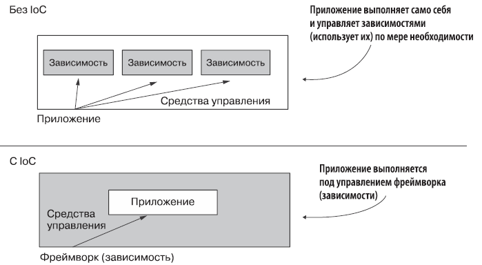
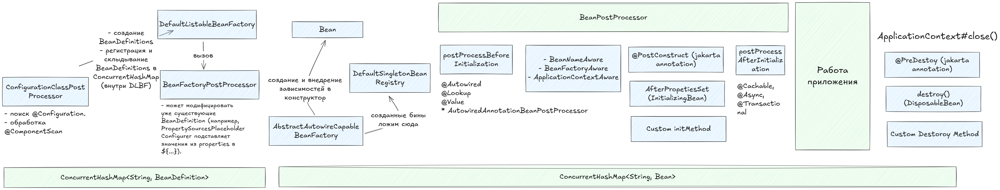

#### Зачем нам Spring?

- DI (Dependency Injection) - управление зависимостями
- Обеспечение слабой связанности
- Есть много компонентов, которые ускоряют работу

#### Что такое IoC?

Spring работает по принципу инверсии управления (inversion of control, IoC): вместо того чтобы приложение само контролировало свое выполнение, управление передается некоторому другому программному обеспечению — в данном случае фреймворку Spring. Посредством системы настроек мы предоставляем фреймворку инструкции о том, как распоряжаться написанным нами кодом, что и определяет логику работы приложения. Именно это и подразумевается под «инверсией» в аббревиатуре IoC: мы не позволяем приложению управлять собственным выполнением посредством его же кода или использовать зависимости.

Ниже можно увидеть, что мы "**инвертируем зависимости**", ранее зависимостями управляло само приложение, а также занималось исполнением самого себя  - теперь за это отвечает фреймворк, то есть управлением приложением и зависимостями занимается он. 


#### Что такое внедрение зависимостей(DI) и в чем его преимущества?

Внедрение зависимостей (DI) — это метод, который помогает уменьшить количество связей между компонентами в Spring. При использовании DI, создание объектов для зависимостей передается на фабрику или внешнему источнику. Это означает, что вам не нужно беспокоиться о создании этих объектов самостоятельно, вы просто используете их.

#### Какая разница между IoC и DI? Как IoC реализована в Spring Framework

DI - **реализация** Inversion of Control (IoC).

- Dependency Injection (DI): Spring внедряет зависимости (например, через конструкторы, сеттеры или поля), которые автоматически создаются контейнером.
- IoC контейнер создает и управляет всеми объектами и их зависимостями, что освобождает разработчика от необходимости вручную управлять зависимостями.

###### Почему IoC(Инверсия контроля) лучше чем Service Locator

- **IoC (Dependency Injection)**
- Контейнер _автоматически_ внедряет зависимости.
- Классы не знают о контейнере
- public OrderService(PaymentGateway gateway, UserRepository repo) {}
- **Service Locator**
- Код _явно запрашивает_ зависимости у контейнера.
- Классы зависят от Service Locator
- this.gateway = ServiceLocator.get("paymentGateway");
###### Spring Boot vs Spring

- В Spring boot есть встроенный TomCat
- Несет авто конфигурацию. Автоматически конфигурирует некоторые компоненты 
- В @SpringBootApplication уже встроены другие аннотации - @SpringBootConfiguration, @EnableAutoConfiguration, @CompnentScan
- Достаточно настраивать при помощи application.propeties
- Имеет starter зависимости
###### В чем разница IoC и ApplicationContext? Что такое BeanFactory?

- IoC - Принцип проектирования, при котором управление зависимостями и созданием объектов передается контейнеру, а не объектам.
- ApplicationContext - Это контейнер Spring, расширяющий `BeanFactory`, с дополнительными функциями, такими как поддержка событий и профилей. Он управляет бинами и их зависимостями.
- BeanFactory - Базовый контейнер для управления бинами в Spring, предоставляющий минимальные возможности для инверсии управления.
###### Какие реализации ApplicationContext есть?

- ClassPathXmlApplicationContext: Загружает конфигурацию бинов из XML-файлов в classpath.
- FileSystemXmlApplicationContext: Загружает XML-файлы из файловой системы.
- AnnotationConfigApplicationContext: Используется для конфигурации Spring с помощью аннотаций и Java классов вместо XML.
- WebApplicationContext: Специализированная версия ApplicationContext для веб-приложений.
###### Что является базовым компонентом Spring

Базовым компонентом Spring является **Bean**. Бины — это объекты, управляемые Spring IoC контейнером. Бины создаются, настраиваются и управляются в контейнере, и они могут быть связаны через механизм зависимости.

###### Опишите свойства аннотации @Bean

- `destroyMethod` — указывает на метод обратного вызова. Метод находится в бине.
- `initMethod` — указывает на метод обратного вызова. Метод находится в бине.
- `name` — имя бина. По умолчанию именем бина является имя метода.
- `value` — алиас для name()

###### Какие алгоритмы используются при инициализации ApplicationContext?

- Загрузка конфигурации (XML, аннотации или Java классы).
- Построение бинов: Создаются объекты (бины) на основе конфигурации.
- Внедрение зависимостей: Выполняется внедрение зависимостей (DI).
- Инициализация бинов: Вызываются методы инициализации бинов, такие как `@PostConstruct` или `init-method`.
- Пост-обработка: Выполняются процессы, такие как применение **BeanPostProcessor** или BeanFactoryPostProcessor для дополнительной конфигурации бинов
###### Что такое application context?

В Spring Framework интерфейс `org.springframework.factory.BeanFactory` предоставляет фабрику для бинов, которая в то же время является IoC контейнером приложения.

Интерфейс `org.springframework.context.ApplicationContext` — это обертка над bean factory, предоставляющая некоторые дополнительные возможности, например AOP, транзакции, безопасность, i18n, и т.п.

###### Что такое контейнер?

Основа Spring Framework — контейнер, и наши объекты "живут" в этом контейнере.  
Контейнер обычно создает множество объектов на основе их конфигураций и управляет их жизненным циклом от создания объекта до уничтожения.

Контейнер — это объект, реализующий интерфейс ApplicationContext, посути содержит CuncurrentHashMap в которой лежат бины. 
###### Можете ли вы описать жизненный цикл бина?

1. **Создание ApplicationContext**: Например, AnnotationConfigApplicationContext. Внутри него создается BeanFactory (чаще всего DefaultListableBeanFactory), который и будет хранить определения бинов (BeanDefinition). Этот BeanFactory также реализует интерфейс BeanDefinitionRegistry.
2. **Начальная регистрация BeanDefinition**:
    - Конфигурационные классы (например, переданные в конструктор AnnotationConfigApplicationContext или через register()) регистрируются как BeanDefinition.
    - Spring регистрирует несколько внутренних (инфраструктурных) BeanFactoryPostProcessor'ов, **самый важный из которых - ConfigurationClassPostProcessor**. Он сам регистрируется как бин (и его BeanDefinition).
3. **Вызов BeanDefinitionRegistryPostProcessor (BDRPP)**:
    - Контейнер находит все бины, реализующие интерфейс BeanDefinitionRegistryPostProcessor. **ConfigurationClassPostProcessor - один из них!**
    - Вызывается метод postProcessBeanDefinitionRegistry() у каждого BDRPP.
    - **Именно на этом этапе ConfigurationClassPostProcessor делает основную работу:**
        - Находит классы, аннотированные @Configuration.
        - Обрабатывает @ComponentScan: сканирует указанные пакеты на наличие компонентов (@Component, @Service, @Repository, @Controller и т.д.) и создает для них BeanDefinition.
        - **Все найденные и созданные BeanDefinition регистрируются в BeanDefinitionRegistry (т.е. в нашем DefaultListableBeanFactory).** Внутри DefaultListableBeanFactory для хранения этих определений используется ConcurrentHashMap<String, BeanDefinition>.
4. **Вызов BeanFactoryPostProcessor (BFPP)**:
    - Вызывается метод postProcessBeanFactory() у каждого BFPP. Эти процессоры могут модифицировать уже существующие BeanDefinition (например, PropertySourcesPlaceholderConfigurer подставляет значения из properties в ${...}). Они обычно не добавляют новые определения (хотя технически могут), для добавления предназначен BDRPP.
5. Создение бинов, если нужно происходит - внедрение в конструкторы
6. BeanPostProcessor postProcessBeforeInitialization()
7. Внедрение **SpEL, @Value и @Autowired** выполняется в `AutowiredAnnotationBeanPostProcessor` и `CommonAnnotationBeanPostProcessor`
8. **Если бин реализует `BeanNameAware` → вызывается `setBeanName()`** (передается ID бина).
9. **Если бин реализует `BeanFactoryAware` → вызывается `setBeanFactory()`**.
10. **Если бин реализует `ApplicationContextAware` → вызывается `setApplicationContext
11. @PostConstruct (jakarta annotation)
12. AfterPropetiesSet (InitializingBean)
13. Custom initMethod или стандартная инициализация
14. BeanPostProcessor postProcessAfterInitialization(). Создание проксей для @Cachable, @Async, @Transactional
15. ApplicationListener
16. Теперь бин готов к использованию. Его можно получить с помощью метода `ApplicationContext#getBean()`.
17. После того как контекст будет закрыт(метод `close()` из ApplicationContext), бин уничтожается.
18. @PreDestoy (jakarta annotation)
19. destroy() (DisposableBean)
20. Custom Destoroy Method



###### Почему для создания Spring beans рекомендуются интерфейсы?

- Улучшенное тестирование. В тестах бин может быть заменен специальным объектом(mock или stub), который реализует интерфейс бина.  
- Позволяет скрывать реализацию
###### Как получить ApplicationContext в интеграционном тесте?

Если вы используете JUnit 5, то вам нужно указать 2 аннотации:
- @ExtendWith(TestClass.class) — используется для указания тестового класса  
- @ContextConfiguration(classes = JavaConfig.class) — загружает java/xml конфигурацию для создания контекста в тесте  

Можно использовать аннотацию [`@SpringJUnitConfig`](https://docs.spring.io/spring-framework/docs/current/javadoc-api/org/springframework/test/context/junit/jupiter/SpringJUnitConfig.html), которая сочетает обе эти аннотации. Для теста веб-слоя можно использовать аннотацию [`@SpringJUnitWebConfig`](https://docs.spring.io/spring-framework/docs/current/javadoc-api/org/springframework/test/context/junit/jupiter/web/SpringJUnitWebConfig.html).

###### Как завершить работу контекста в приложении?

Если это не веб-приложение, то есть 2 способа:

- Регистрация shutdown-hook с помощью вызова метода `registerShutdownHook()`, он также реализован в классе AbstractApplicationContext. Это предпочтительный способ.
- Можно вызвать метод `close()` из класса AbstractApplicationContext.

Spring Boot самостоятельно зарегистрирует shutdown-hook за вас.

###### Основные компоненты Spring

- Spring Data / JPA - выполняем запросы, транзакции, ORM
- Spring MVC/Web - controllers, управление запросами
- AOP - логирование, нотификации. Сквозная логика, упрощает добавление сквозного функционала

###### Что такое Java-конфигурация? Как она применяется?

Чтобы создать класс с конфигурацией на основе Java-кода, нужно аннотировать его с помощью  `@Configuration`.  Этот класс будет содержать фабричные методы для создания бинов в контейнере.  Эти методы должны быть аннотированы аннотацией `@Bean`.

###### Что такое stereotypes(аннотации-стереотипы)?

Стереотипы — это аннотации, обозначающие специальную функциональность.  
Все стереотипы включают в себя аннотацию `@Component`.

|   |   |
|---|---|
|[Component](https://habr.com/ru/users/component/)|Корневая аннотация, которая помечает класс как кандидат для автовнедрения|
|[Controller](https://habr.com/ru/users/controller/)|Указывает, что класс является контроллером для отправления данных на фронт.|
|@RestController|Указывает, что класс является контроллером для REST.   <br>Содержит аннотации [Controller](https://habr.com/ru/users/controller/) и @ResponseBody|
|[Service](https://habr.com/ru/users/service/)|Указывает, что класс является сервисом для выполнения бизнес-логики|
|[Repository](https://habr.com/ru/users/repository/)|Указывает, что класс является репозиторием для работы с бд|
|@Configuration|Указывает, что класс содержит Java-конфигурацию(@Bean-методы)|
###### Различия компонентах аннотаций

- Все наследуются от @Component
- @Repository добавляет обработку exceptions. Работает с Spring Data, оборачивает ошибки связанные с бд, в runtime exceptions. Отрабатывает PersistenceExceptionTranslationPostProcessor,  adding a corresponding [`PersistenceExceptionTranslationAdvisor`](https://docs.spring.io/spring-framework/docs/current/javadoc-api/org/springframework/dao/annotation/PersistenceExceptionTranslationAdvisor.html "class in org.springframework.dao.annotation") to the exposed proxy. PersistenceExceptionTranslationPostProcessor это специальный пост-процессор, который интегрируется с Spring контейнером и автоматически переводит исключения, возникающие в слоях доступа к данным, в более абстрактные и стандартные исключения Spring, такие как `DataAccessException`, к примеру `SQLException`, `HibernateException`.
- @Controller работает с DispacherServlet 
- @Service - текущий класс для бизнес - логики

###### Как реализовать управление prototype бинами?

- Переопределить методы BeanPostProcessor складывая в другую мапу, потому можно пройтись и вызвать дестрой методы 

###### Ложаться ли прототайпы в мапу (Io контейнер) при жизненном цикле бина

- Нет. Каждый раз, когда запрашивается prototype-бин, Spring создаёт новый экземпляр.
- Это означает, что для каждого вызова `getBean()` или инжекции через `@Autowired` создаётся новый объект.
###### Как создаются бины: сразу или лениво? Как изменить это поведение?

- Singleton-бины обычно создаются сразу при сканировании и добавлении в мапу 
- Prototype-бины обычно создаются только после запроса.

Чтобы указать способ инициализации, можно использовать аннотацию `@Lazy`.   
Она ставится на @Bean-методы, на @Configuration-классы, или на @Component-классы.  
В зависимости от параметра(true или false), который принимает аннотация, инициализация будет или ленивая, или произойдет сразу. По умолчанию(т.е. без указания параметра) используется true.

###### Что такое BeanFactoryPostProcessor и когда он используется?

Семантика этого интерфейса аналогична семантике `BeanPostProcessor`, с одним существенным отличием: `BeanFactoryPostProcessor` работает с конфигурационными метаданными бина. То есть IoC-контейнер Spring позволяет `BeanFactoryPostProcessor` считывать конфигурационные метаданные и потенциально изменять их _до того, как_ контейнер создаст экземпляры каких-либо бинов, помимо экземпляров `BeanFactoryPostProcessor`.

###### Как определяется порядок/очередь создания бинов?

- Spring строит граф зависимостей (какой бин от какого зависит).
- Начинает с тех, у кого **нет зависимостей**.
- Затем создает бины, которым нужны уже созданные.
- @DependsOn("a") - Можно явно указать, что один бин должен создаваться перед другим.
- `@Lazy` говорит Spring'у создавать бин **только при первом использовании**.
###### Зачем вам может понадобится static @Bean-метод?

Для того чтобы использовать кастомный BFPP. Вы можете переопределить механизм получения данных из метафайлов.

Кейс: Автоматическая подмена класса-реализации для интерфейса. Допустим, у нас есть **интерфейс `PaymentService`** и **две реализации**:

- `CardPaymentService` – для платежей картой
- `CryptoPaymentService` – для платежей в криптовалюте

Мы хотим **автоматически подменять реализацию** в зависимости от конфигурации, без изменения кода приложения.

```java
public class PaymentConfig {

    @Bean
    public static BeanFactoryPostProcessor paymentServiceSelector() {
        return beanFactory -> {
            String method = System.getProperty("payment.method", "card"); // Берем из system properties
            System.out.println("Выбран метод оплаты: " + method);

            // Получаем BeanDefinition для PaymentProcessor
            BeanDefinition processorDef = beanFactory.getBeanDefinition("paymentProcessor");

            // Меняем зависимость в зависимости от payment.method
            if ("crypto".equalsIgnoreCase(method)) {
                processorDef.getPropertyValues().add("paymentService", new RuntimeBeanReference("cryptoPaymentService"));
            } else {
                processorDef.getPropertyValues().add("paymentService", new RuntimeBeanReference("cardPaymentService"));
            }
        };
    }
}
```

###### Что такое BeanPostProcessor и чем он отличается от BeanFactoryPostProcessor?

- BPP работает с экземплярами бинов, т.е. контейнер создает бин, а затем начинает работать BPP.
-  `BeanFactoryPostProcessor` работает с конфигурационными метаданными бина, позволяя изменять их до создания экземпляров бинов, в то время как `BeanPostProcessor` предназначен для изменения уже созданных экземпляров бинов

| `BeanFactoryPostProcessor`                                       | `BeanPostProcessor`                                                 |
| ---------------------------------------------------------------- | ------------------------------------------------------------------- |
| Срабатывает **до создания бина**                                 | Срабатывает **после создания бина**, но до его использования        |
| Работает с **метаданными (`BeanDefinition`)**                    | Работает с **самим объектом бина**                                  |
| Можно **изменять свойства, класс, зависимости до создания бина** | Можно **изменять или проксировать сам бин после создания**          |
| Используется для **глобальных изменений конфигурации**           | Используется для **логирования, AOP, транзакций и других аспектов** |
| Пример: **изменение значения поля перед созданием бина**         | Пример: **логирование всех созданных бинов**                        |
###### Что такое callback methods и как их использовать?

- `@PreDestroy` и `@PostConstruct`
- Параметры `initMethod` и `destroyMethod` в аннотации `@Bean`, указывающие на методы в классе бина
- Переопределенные `InitializingBean#afterPropertiesSet()` и `DisposableBean#destroy()`. Для переопределения этих методов нужно имплементировать соответствующие интерфейсы.

###### Почему Autowired плохо?

-  через конструктор считается самым лучшим способом, т.к. для него не надо использовать рефлексию, а также он не имеет недостатков DI через сеттер.  
- через поле не рекомендуется использовать, т.к. для этого применяется рефлексия, снижающая производительность.  AutowiredBeanPostProcessor использует рефлексию. Когда инжекция выполняется напрямую в поле, это может привести к более слабой инкапсуляции — зависимость вводится скрыто, без явного указания в конструкторе или сеттере.
- через сеттер решает циклические зависимости конструктора, либо использовать ленивую инициализацию бинов
- Сложно мокировать или подменять. Если ты захочешь заменить зависимости на фейковые или моки, тебе придётся использовать фреймворки вроде ReflectionTestUtils или писать дополнительный код для доступа к приватным полям. При использовании инжекции через конструктор такие проблемы не возникают, потому что зависимости передаются явно.
- Spring создаёт и инжектирует зависимости в поля после создания объекта. Это может привести к тому, что если ты попытаешься использовать зависимость в конструкторе (до того, как Spring выполнит инжекцию), ты получишь `NullPointerException`.
- В immutable-классе все зависимости должны быть установлены через конструктор, инициализироваться один раз, и не изменяться.

###### Опишите поведение аннотации, когда несколько кандидатов на внедерение @Autowired

1. Контейнер определяет тип объекта для внедрения
2. Контейнер ищет бины в контексте(он же контейнер), которые соответствуют нужному типу
3. Если есть несколько кандидатов, и один из них помечен как `@Primary`, то внедряется он
4. Если используется аннотации `@Autowire` + `Qualifier`, то контейнер будет использовать информацию из `@Qualifier`, чтобы понять, какой компонент внедрять
5. В противном случае контейнер попытается внедрить компонент, основываясь на его имени или ID
6. Если ни один из способов не сработал, то будет выброшено исключение

Кратко варианты решения: 
- @Qualifier
- @Primary
- @Profile
- Переопределить BeanPostProcessor
- Toggle и FactoryBean
###### Что такое прокси-объекты и какие типы прокси-объектов может создавать Spring?

Копия настоящего объекта, с созданной оберткой, добавляющей дополнительную функциональность.

- Dynamic proxy JDK-proxy — динамическое прокси. Interface based
- CGLib proxy — не встроен в JDK. Subclass based

###### Как внедряется singleton-бин?

Если в контейнере нет экземпляра бина, то вызывается @Bean-метод. Если экземпляр бина есть, то возвращается уже созданный бин.

###### Что такое профили? Какие у них причины использования?

При использовании Java-конфигурации вы можете использовать аннотацию [`@Profile`](https://www.baeldung.com/spring-profiles).  
Она позволяет использовать разные настройки для Spring в зависимости от указанного профиля.  Ее можно ставить на @Configuration и Component классы, а также на Bean методы.

###### Как внедрить простые значения в свойства в Spring?

Для этого можно использовать аннотацию `@Value`.  Такие значения можно получать из property файлов, из бинов, и т.п

###### Что такое Spring Data

Все крутиться вокруг репозиториев
Чтобы создать репозиторий нужна Entity

###### Что такое Spring Data Specification

![[../../../_res/Pasted image 20240926135057.png]]


###### Чем отличает конфигурация от компонента ?

- Конфигурация тоже является компонентом
- Используется для создания других объектов
- Используется CGlib

###### Что в ходит в Transactional?

1. propagation:

- (default) REQUIRED - требует, чтобы все выполнялось в транзакции, если нету, она будет создана
- SUPPORTS - если нету транзакции, просто выполнит вне транзакции
- MANDATORY - обязательно транзакция, если нету выбросит исключение
- REQUIRES_NEW - останавливает текущую транзакцию если она есть, и исполняет следующие инструкции в отдельной транзакции
- NOT_SUPPORTED - останавливает текущую транзакцию если она есть, выполняет без транзакции
- NEVER - нигде не должно быть транзакции
- NESTED - используется savepoints, при вызове исключений, возвращается к savepoint

2. isolation
3. readOnly
4. rollbackFor
5. notRollbackFor
6. timeout

[[../../../_inforage/Spring/Annotations/@Transactional]]
[[../../../_inforage/Spring/Annotations/@Transactional. Основы работы с транзакциями]]

###### А что если вызвать транзакцию внутри класса, в другом методе.

- Транзакция не выполнится
- Бин транзакции оборачивается в proxy, поэтому на этапе вызова в том же классе, еще не было добавлено логики транзакции

###### Что такое Programmatic Transaction Template / Transaction Manager

- С помощью метода execute можно выполнить определенную логику транзакции

```java
        transactionTemplate.execute(status -> {
            try {
                doSomeDatabaseOperations();
                return null;
            } catch (Exception e) {
                status.setRollbackOnly();
                throw new RuntimeException("Error during transaction", e);
            }
        });
```

[[../../../_inforage/Spring/TransactionTemplate]]

###### Что представляет из себя Spring MVC

- Model View Controller

![[../../../_res/Pasted image 20240926141242.png]]

###### @Controller vs @RestController

- Если мы хотим серилизовать какой-то объект в примеру json, то мы также должны использовать @ResponseBody в методе
- @RestController - уже имеет @ResponseBody

###### Spring Boot vs Spring

- В Spring boot есть встроенный TomCat
- Несет авто конфигурацию. Автоматически конфигурирует некоторые компоненты 
- В @SpringBootApplication уже встроены другие аннотации - @SpringBootConfiguration, @EnableAutoConfiguration, @CompnentScan
- Достаточно настраивать при помощи application.propeties
- Имеет starter зависимости

###### Назови 15 аннотаций 

- [[../../../_inforage/Spring/Аннотации Spring]]

###### Почему в Spring Singleton не потокобезопасен?

Spring-синглтон может быть не потокобезопасным, потому что, хотя объект создаётся один раз и используется всеми потоками, Spring не синхронизирует доступ к бину по умолчанию. Если бин содержит изменяемое состояние (переменные, которые могут изменяться), несколько потоков могут одновременно пытаться его изменить, что приведёт к гонкам потоков. Решением может быть либо использование синхронизации, либо создание объектов без состояния (stateless), чтобы избежать необходимости синхронизации.

###### Какие аннотации используют proxy?

`@Transactional`, `@Cacheable`, `@Retryable`, `@Validated`, `@Async`

###### Как решить циклические зависимости

- Внедрять бины через сеттеры
- Аннотация @Lazy
- @PostConstruct
- ApplicationContextAware and InitializingBean
- Создать другой класс, который будет Фасадом, сочетать вызов двух логик
- `Supplier<T> tSupplier` () -> new A();
- `ObjectProvider<T> tProvider` getIfAvailable();
- [Circular Dependencies in Spring](https://www.baeldung.com/circular-dependencies-in-spring)
###### Что такое АОП (AOP) в Spring?

- **Аспекты (Aspects)**: Это модули, которые содержат функциональность, которая применяется к различным частям программы. 
```java
@Aspect @Component public class LoggingAspect { }
```
- **Join Point**: Это точка в выполнении программы, на которой может быть применен аспект. Место на котором происходит срез и перехват для встройки функционала
```java
"execution(* by.bob.service.*.*(..))"
```
- **Pointcut**: Pointcut — это выражение, которое определяет, какие join points должны быть перехвачены аспектом. Например, можно указать, что аспект должен работать только для методов определённого класса или для методов с конкретной аннотацией. В Spring это часто делается с использованием аннотаций, таких как `@Pointcut`.
```java
@Pointcut("execution(* by.bob.service.*.*(..))") public void serviceMethods() { }
```
- **Advice**: Advice — это код, который выполняется в определённой точке (join point) программы. Advice определяет, что должно быть сделано, когда срабатывает pointcut. 
```java
@Before("serviceMethods()") 
public void logBefore(JoinPoint joinPoint) { System.out.println("Перед вызовом: " + joinPoint.getSignature().getName()); }

@AfterReturning("serviceMethods()") 
public void logAfter(JoinPoint joinPoint) { System.out.println("После успешного вызова: " + joinPoint.getSignature().getName()); }

@AfterThrowing("serviceMethods()") 
public void logException(JoinPoint joinPoint) { System.out.println("Ошибка в методе: " + joinPoint.getSignature().getName()); }

@Around("serviceMethods()") 
public Object measureTime(ProceedingJoinPoint pjp) throws Throwable { long start = System.currentTimeMillis(); Object result = pjp.proceed(); System.out.println("Время выполнения: " + (System.currentTimeMillis() - start) + "ms"); return result; }

```

###### Как работает аннотация @Cacheable?

```java
@Cacheable(value = "products", key = "#productId")

// condition: Определяет условие, при котором кэширование будет происходить. Например, кэшировать только, если параметр метода больше 10
@Cacheable(value = "products", condition = "#productId > 10")

// unless: Этот параметр указывает условие, при котором результат не будет кэшироваться. Например, если метод вернул `null`, результат не будет сохранён в кэш
@Cacheable(value = "products", unless = "#result == null")
```

###### Как создать собственный стартер в Spring Boot 3?

###### Какая ошибка если несколько имплементаций интерфейса без @Qualifier @Primary

```
org.springframework.beans.factory.NoUniqueBeanDefinitionException: No qualifying bean of type '<interface>' available: expected single matching bean but found <n> candidates
```

###### Что делать если нужно все реализации этого интерфейса?

- Закинуть в коллекцию
###### Есть огромная dto с более 200 полями, но для вызова определенного метода тебе надо только пару полей из этого dto, как бы ты передавал эти поля в вызываемый метод?

- Создание нового Partial DTO и замапил
###### Плохо ли передавать много параметров в метод?

###### Встречается ли где-то chain of responsibility в spring?

- Filter
###### Bean Scopes. Какие существуют области видимости у бинов? Какая у них видимость по умолчанию?

- Singleton - область видимости по умолчанию. В контейнере находится всего 1 экземпляр бина.
- Prototype - в контейнере может находится любое количество экземпляров бина.
- Request - область видимости — 1 HTTP запрос. На каждый запрос создается новый бин
- Session - область видимости — 1 сессия. На каждую сессию создается новый бин
- Application - область видимости — жизненный цикл ServletContext
- WebSocket - область видимости — жизненный цикл WebSocket

###### В каких случаях может понадобится прототип?

- Когда объект должен быть уникальным для каждого запроса или действия
- Когда объект имеет внутреннее состояние, которое не должно сохраняться между вызовами

###### Атрибуты аннотации @Autowired

```java
@Target({ElementType.CONSTRUCTOR, ElementType.METHOD, ElementType.PARAMETER, ElementType.FIELD, ElementType.ANNOTATION_TYPE})

// Если установить `required = false`, то зависимость становится необязательной, и если бин не найден, Spring не выбросит исключение, а просто оставит поле или свойство равным `null`.
@Autowired(required = false) 
```
###### Писал стартер? В чём отличия стартера от библиотеки?


###### У меня есть свой код он затрагивает сервисный слой моих коллег, я в нем разбираться не хочу и даже открывать. Мне нужно написать кастомный експшен и ловить его у себя, я могу это как-то сделать чтобы не 100%-но трогать код моих коллег, чтобы он ловился только на моем уровне?


###### Использует ли spring proxy и если использует, то где?

- @Transactional
- @Cacheable
- @Async
- @Service, @Component ???

###### Почему плохо использовать внедрение через сеттеров?

- Самое явное, другой разработчик может это не знать
- Поле можно перезаписать в любой момент, что рискованно в многопоточной среде
- Можно забыть вызвать и код упадёт с `NullPointerException`
###### Как можно решить проблему зависимостей бинов?

 - Вспомнить о сортировки бинов по зависимостям
- Выделить бины в отдельный сервис и вызывать оттуда
- Использовать self inject @Lazy

###### Кто отвечает за @Lazy? в жизненном цикле бина?

- `DefaultListableBeanFactory`
###### @Transactional - как работает

###### Сигнатуры методов BeanPostProcessor

```java
@Component
public class CustomBeanPostProcessor implements BeanPostProcessor {

    @Override
    public Object postProcessBeforeInitialization(Object bean, String beanName) {
        if (bean instanceof Auditable) {
            System.out.println("Auditing bean: " + beanName);
        }
        return bean;
    }

    @Override
    public Object postProcessAfterInitialization(Object bean, String beanName) {
        return bean; // Можно вернуть прокси или оригинал
    }
}
```
###### C какими фреймворками работал?


###### Есть два метода аннотированные @Transaction, находятся в одном класса. Если один метод вызывает другой метод сколько транзакций будет открыто и почему?

- Прокси создается на уровне класса (не метода) в `AbstractAutoProxyCreator` (это `BeanPostProcessor`).
- Spring создает **один прокси-класс** для `Service`.
- При вызове `methodA()` извне:
    - Прокси перехватывает вызов → открывает транзакцию.
    - Внутри `methodA` вызов `methodB` происходит **напрямую** (без прокси) → транзакция не создается.
###### Что такое @Controller, @ResponseBody, @ResponseEntity

- **`@Controller` + `@ResponseBody`** = `@RestController` (упрощает REST).
- **`ResponseEntity`** — когда нужны статусы и заголовки.
###### Что такое bean, и почему нужно работать с бинами так, как это делает спринг (IoC контейнер)

- Бины получают зависимости **автоматически**, а не через `new`:
###### Как внедрить Prototype в Синглтоне:

- плохой вариант через ApplicationContext (требуется целый контекст)
- @Lookup
- API -интерфейс javax.inject
- Интерфейс ObjectFactory
- ObjectProvider ???
- @Scope(value = ConfigurableBeanFactory.SCOPE_PROTOTYPE, proxyMode=TARGET_CLASS)

###### У нас есть аннотация @Transactional. Каким образом добавляется код который транзакцию открывает/закрывает/комитит?

```java
public class TransactionInterceptor extends TransactionAspectSupport implements MethodInterceptor {
    @Override
    public Object invoke(MethodInvocation invocation) throws Throwable {
        // Получаем атрибуты транзакции для метода
        TransactionAttribute txAttr = getTransactionAttributeSource().getTransactionAttribute(
            invocation.getMethod(), invocation.getThis().getClass()
        );

        // Управление транзакцией
        TransactionInfo txInfo = createTransactionIfNecessary(txAttr, invocation.getMethod(), invocation.getArguments());
        try {
            Object result = invocation.proceed(); // Вызов оригинального метода
            commitTransactionAfterReturning(txInfo);
            return result;
        } catch (Exception ex) {
            completeTransactionAfterThrowing(txInfo, ex);
            throw ex;
        }
    }
}
```
###### Какие вещи в java или в spring можно было бы изменить или улучшить

###### Как в spring реализуется dependency injection?

###### IoC(Инверсия контроля) Довольно детально просят рассказать


###### Приходилось работать с поднятием Bean по условию?

- **`@Profile`** — создание бинов в зависимости от активного профиля.
- **`@Conditional`** — условное создание бинов на основе пользовательских условий (реализация интерфейса `Condition`).
- **`@Value`** — условное создание бинов на основе значений из конфигурации (`application.properties`). Feature Toggle
- PropertiesClass
- **Методы в `@Configuration`** — логика внутри метода для условного создания бинов.

###### Какие знаешь Conditional?

- @ConditionalOnProperty
- @ConditionalOnClass
- @ConditionalOnMissingBean
- @ConditionalOnBean
- @ConditionalOnResource
- @ConditionalOnExpression
- @ConditionalOnJava
- @ConditionalOnCloudPlatform
- @ConditionalOnWebApplication
- Своей класс Condition: cоздаёшь класс, реализующий интерфейс `Condition`, в котором реализуется метод `matches()`. В этом методе ты определяешь логику, которая будет проверять условие.

###### Какие бывают контексты у spring? 

- **Основной контекст** (`ApplicationContext`) — для сервисов, репозиториев, компонентов, которые не зависят от веб-среды.
- **Контекст веб-приложения** (`WebApplicationContext`) — для бинов, специфичных для веб-приложений, таких как контроллеры и фильтры.
- **TestContext** - это контекст, который предоставляет инфраструктуру для тестирования Spring-приложений. Он позволяет создавать тесты, которые загружают конфигурацию Spring и проверяют работу бинов в изолированном окружении.

ApplicationContext бывает:

- **`AnnotationConfigApplicationContext`**: Используется для конфигурации приложения на основе аннотаций, например, для классов, помеченных аннотацией `@Configuration`.
- **`GenericWebApplicationContext`**: Используется для веб-приложений в Spring, например, в приложениях на Spring Boot.
- **`ClassPathXmlApplicationContext`**: Используется для конфигурации Spring через XML.
- **`GenericApplicationContext`**: Используется для создания контекста с минимальной настройкой и поддержкой как Java-конфигурации, так и XML-конфигурации.

###### Бины хранящиеся в разных контекстах для приложения они в одном месте хранятся или в разных? Одинаковая ли область видимости?

- **Бины хранятся в разных местах** в зависимости от контекста. Бины в разных контекстах не пересекаются напрямую, если только это не было специально настроено.
###### Какой из этих контекстов поддерживает Autowired?

**`@Autowired`** работает только в контексте, который является частью **контейнера Spring**, то есть, если контекст не является экземпляром `ApplicationContext` (например, простой `BeanFactory`), автоматическое внедрение зависимостей не будет работать.

###### Как мы можем создать свой бин, который будет отрабатывать до старта сервера? Есть ли в spring какой-то способ создать бины, которые отработают до полного старта приложения?

- **`CommandLineRunner`**: Выполняется после того, как контекст Spring будет загружен, но до запуска веб-сервера (если это Spring Boot приложение).
- **`ApplicationRunner`**: Подобен `CommandLineRunner`, но предоставляет более удобный доступ к аргументам командной строки.

###### Для чего нужен readOnly и как он устроен под капотом?

###### Не избыточно ли поднимать весь контекст для интеграционных тестов? Если ты хочешь протестировать только сервисный слов и репозитории, то зачем поднимать контроллеры?

- Для тестирования только репозиториев в Spring Data JPA есть специальная аннотация — `@DataJpaTest`. Репозитории и базу данных, к примеру H2
- `@WebMvcTest` для тестирования только контроллеров
- @ContextConfiguration

###### Есть ли разница между dependency inversion и dependency injection?

**Dependency Injection** помогает реализовать принцип **Dependency Inversion** на практике. Внедряя зависимости через абстракции (например, интерфейсы), можно следовать принципу **Dependency Inversion**, а **Dependency Injection** будет использоваться для того, чтобы передать зависимости в объект через конструкторы или другие методы.

###### Порядок выполнения @Value, @Autowired, @PostConstruct

- AutowiredAnnotationBeanPostProcessor занимается внедрением Value и Autowired
- **`@Autowired`** (внедрение зависимостей) — выполняется первым
- **`@Value`** (внедрение значений) 
- **`@PostConstruct`** (инициализация)

###### Чем отличается BeanFactory от FactoryBean?

- **`BeanFactory`** — контейнер, который управляет бинами в приложении.
- **`FactoryBean`** — механизм для кастомного создания бинов с дополнительной логикой.
###### У тебя есть JPA репозиторий, и ты хочешь прикрутить к нему кастомную логику, отличную от дефолтных методов. Каким образом будешь это делать?

- Новый метод в репозитории по сигнатере
- Написание нативных запросов над методом
- Внедрение EntityManager entityManager и работа с ним


###### За внедрение чего отвечает AutowiredAnnotationBeanPostProcessor

- @Lookup Methods
- @Autowired Methods, Fields, Constructors
- @Value

###### Библиотека vs фреймворк

