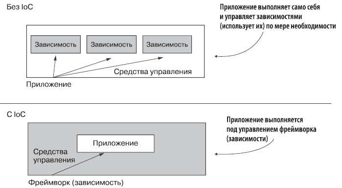
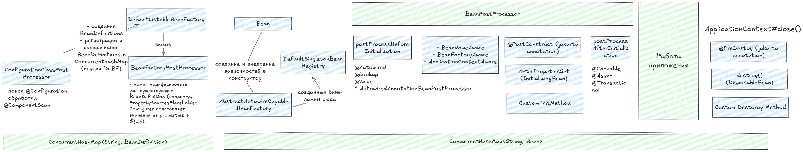

#### Зачем нам Spring? [X]

- DI (Dependency Injection) - управление зависимостями
- Обеспечение слабой связанности
- Есть много компонентов (стартеров), которые ускоряют работу

#### Что такое IoC? [X]

Spring работает по принципу инверсии управления (inversion of control, IoC): вместо того чтобы приложение само контролировало свое выполнение, управление передается некоторому другому программному обеспечению — в данном случае фреймворку Spring. Посредством системы настроек мы предоставляем фреймворку инструкции о том, как распоряжаться написанным нами кодом, что и определяет логику работы приложения. Именно это и подразумевается под «инверсией» в аббревиатуре IoC: мы не позволяем приложению управлять собственным выполнением посредством его же кода или использовать зависимости.

Ниже можно увидеть, что мы "инвертируем зависимости", ранее зависимостями управляло само приложение, а также занималось исполнением самого себя  - теперь за это отвечает фреймворк, то есть управлением приложением и зависимостями занимается он. 


#### Что такое внедрение зависимостей(DI) и в чем его преимущества? [X]

Внедрение зависимостей (DI) — это метод, который помогает уменьшить количество связей между компонентами в Spring. При использовании DI, создание объектов для зависимостей передается на фабрику или внешнему источнику. Это означает, что вам не нужно беспокоиться о создании этих объектов самостоятельно, вы просто используете их.

#### Какая разница между IoC и DI? [X]

DI - реализация Inversion of Control (IoC).

- Dependency Injection (DI): Spring внедряет зависимости (например, через конструкторы, сеттеры или поля), которые автоматически создаются контейнером.
- IoC контейнер создает и управляет всеми объектами и их зависимостями, что освобождает разработчика от необходимости вручную управлять зависимостями.

#### Почему IoC(Инверсия контроля) лучше чем Service Locator [X]

- IoC (Dependency Injection)
- Контейнер автоматически внедряет зависимости.
- Классы не знают о контейнере
- public OrderService(PaymentGateway gateway, UserRepository repo) {}

- Service Locator
- Код явно запрашивает зависимости у контейнера.
- Классы зависят от Service Locator
- this.gateway = ServiceLocator.get("paymentGateway");

#### Есть ли разница между dependency inversion и dependency injection? [X]

Dependency Injection помогает реализовать принцип Dependency Inversion на практике. Внедряя зависимости через абстракции (например, интерфейсы), можно следовать принципу Dependency Inversion, а Dependency Injection будет использоваться для того, чтобы передать зависимости в объект через конструкторы или другие методы.
#### Spring Boot vs Spring [X]

- В Spring boot есть встроенный TomCat
- Несет авто конфигурацию. Автоматически конфигурирует некоторые компоненты 
- В @SpringBootApplication уже встроены другие аннотации - @SpringBootConfiguration, @EnableAutoConfiguration, @CompnentScan
- Достаточно настраивать при помощи application.propeties
- Имеет starter зависимости
#### В чем разница IoC и ApplicationContext? Что такое BeanFactory? [X]

- IoC - Принцип проектирования, при котором управление зависимостями и созданием объектов передается контейнеру, а не объектам.
- ApplicationContext - Это контейнер Spring, расширяющий `BeanFactory`, с дополнительными функциями, такими как поддержка событий и профилей. Он управляет бинами и их зависимостями.
- BeanFactory - Базовый контейнер для управления бинами в Spring, предоставляющий минимальные возможности для инверсии управления.
#### Какие реализации ApplicationContext есть? [X]

- ClassPathXmlApplicationContext: Загружает конфигурацию бинов из XML-файлов в classpath.
- FileSystemXmlApplicationContext: Загружает XML-файлы из файловой системы.
- AnnotationConfigApplicationContext: Используется для конфигурации Spring с помощью аннотаций и Java классов вместо XML.
- WebApplicationContext: Специализированная версия ApplicationContext для веб-приложений.
#### Что является базовым компонентом Spring [X]

Базовым компонентом Spring является Bean. Бины — это объекты, управляемые Spring IoC контейнером. Бины создаются, настраиваются и управляются в контейнере, и они могут быть связаны через механизм зависимости.

#### Опишите свойства аннотации @Bean [X]

- `destroyMethod` — указывает на метод обратного вызова. Метод находится в бине.
- `initMethod` — указывает на метод обратного вызова. Метод находится в бине.
- `name` — имя бина. По умолчанию именем бина является имя метода.
- `value` — алиас для name()

#### Что такое application context? [X]

В Spring Framework интерфейс `org.springframework.factory.BeanFactory` предоставляет фабрику для бинов, которая в то же время является IoC контейнером приложения.

Интерфейс `org.springframework.context.ApplicationContext` — это обертка над bean factory, предоставляющая некоторые дополнительные возможности, например AOP, транзакции, безопасность, i18n, и т.п.

#### Какие алгоритмы используются при инициализации ApplicationContext? [X]

- Загрузка конфигурации (XML, аннотации или Java классы).
- Построение бинов: Создаются объекты (бины) на основе конфигурации.
- Внедрение зависимостей: Выполняется внедрение зависимостей (DI).
- Инициализация бинов: Вызываются методы инициализации бинов, такие как `@PostConstruct` или `init-method`.
- Пост-обработка: Выполняются процессы, такие как применение BeanPostProcessor или BeanFactoryPostProcessor для дополнительной конфигурации бинов

#### Что такое контейнер? [X]

Основа Spring Framework — контейнер, и наши объекты "живут" в этом контейнере. Контейнер обычно создает множество объектов на основе их конфигураций и управляет их жизненным циклом от создания объекта до уничтожения.

Контейнер — это объект, реализующий интерфейс ApplicationContext, посути содержит ConcurrentHashMap в которой лежат бины. 
#### Можете ли вы описать жизненный цикл бина? [O]

1. Создание ApplicationContext: Например, AnnotationConfigApplicationContext. Внутри него создается BeanFactory (чаще всего **DefaultListableBeanFactory**), который и будет хранить определения бинов (BeanDefinition). Этот BeanFactory также реализует интерфейс BeanDefinitionRegistry.
2. Начальная регистрация BeanDefinition:
    - Конфигурационные классы (например, переданные в конструктор AnnotationConfigApplicationContext или через register()) регистрируются как BeanDefinition.
    - Spring регистрирует несколько внутренних (инфраструктурных) BeanFactoryPostProcessor'ов, самый важный из которых - **ConfigurationClassPostProcessor**. Он сам регистрируется как бин (и его BeanDefinition).
3. Вызов BeanDefinitionRegistryPostProcessor (BDRPP):
    - Контейнер находит все бины, реализующие интерфейс BeanDefinitionRegistryPostProcessor. ConfigurationClassPostProcessor - один из них!
    - Вызывается метод postProcessBeanDefinitionRegistry() у каждого BDRPP.
    - Именно на этом этапе ConfigurationClassPostProcessor делает основную работу:
        - Находит классы, аннотированные @Configuration.
        - Обрабатывает @ComponentScan: сканирует указанные пакеты на наличие компонентов (@Component, @Service, @Repository, @Controller и т.д.) и создает для них BeanDefinition.
        - Все найденные и созданные BeanDefinition регистрируются в BeanDefinitionRegistry (т.е. в нашем DefaultListableBeanFactory). Внутри DefaultListableBeanFactory для хранения этих определений используется ConcurrentHashMap<String, BeanDefinition>.
4. Вызов BeanFactoryPostProcessor (BFPP):
    - Вызывается метод postProcessBeanFactory() у каждого BFPP. Эти процессоры могут модифицировать уже существующие BeanDefinition (например, PropertySourcesPlaceholderConfigurer подставляет значения из properties в ${...}). Они обычно не добавляют новые определения (хотя технически могут), для добавления предназначен BDRPP.
5. Создение бинов, если нужно происходит - внедрение в конструкторы
6. BeanPostProcessor postProcessBeforeInitialization()
7. Внедрение SpEL, @Value и @Autowired выполняется в `AutowiredAnnotationBeanPostProcessor` и `CommonAnnotationBeanPostProcessor`
8. Если бин реализует `BeanNameAware` → вызывается `setBeanName()` (передается ID бина).
9. Если бин реализует `BeanFactoryAware` → вызывается `setBeanFactory()`.
10. Если бин реализует `ApplicationContextAware` → вызывается `setApplicationContext
11. @PostConstruct (jakarta annotation)
12. AfterPropetiesSet (InitializingBean)
13. Custom initMethod или стандартная инициализация
14. BeanPostProcessor postProcessAfterInitialization(). Создание проксей для @Cachable, @Async, @Transactional
15. ApplicationListener
16. Теперь бин готов к использованию. Его можно получить с помощью метода `ApplicationContext#getBean()`.
17. После того как контекст будет закрыт(метод `close()` из ApplicationContext), бин уничтожается.
18. @PreDestoy (jakarta annotation)
19. destroy() (DisposableBean)
20. Custom Destoroy Method



#### Почему для создания Spring beans рекомендуются интерфейсы? [X]

- Улучшенное тестирование. В тестах бин может быть заменен специальным объектом(mock или stub), который реализует интерфейс бина.  
- Позволяет скрывать реализацию
#### Как получить ApplicationContext в интеграционном тесте? [X]

Если вы используете JUnit 5, то вам нужно указать 2 аннотации:
- @ExtendWith(TestClass.class) — используется для указания тестового класса  
- @ContextConfiguration(classes = JavaConfig.class) — загружает java/xml конфигурацию для создания контекста в тесте  

Можно использовать аннотацию [`@SpringJUnitConfig`](https://docs.spring.io/spring-framework/docs/current/javadoc-api/org/springframework/test/context/junit/jupiter/SpringJUnitConfig.html), которая сочетает обе эти аннотации. Для теста веб-слоя можно использовать аннотацию [`@SpringJUnitWebConfig`](https://docs.spring.io/spring-framework/docs/current/javadoc-api/org/springframework/test/context/junit/jupiter/web/SpringJUnitWebConfig.html).

#### Как завершить работу контекста в приложении? [X]

Если это не веб-приложение, то есть 2 способа:

- Регистрация shutdown-hook с помощью вызова метода `registerShutdownHook()`, он также реализован в классе AbstractApplicationContext. Это предпочтительный способ.
- Можно вызвать метод `close()` из класса AbstractApplicationContext.

Spring Boot самостоятельно зарегистрирует shutdown-hook за вас.

#### Основные компоненты Spring [X]

- Spring Data / JPA - выполняем запросы, транзакции, ORM
- Spring MVC/Web - controllers, управление запросами
- Spring Security
- AOP - логирование, нотификации. Сквозная логика, упрощает добавление сквозного функционала

#### Что такое Java-конфигурация? Как она применяется? [X]

Чтобы создать класс с конфигурацией на основе Java-кода, нужно аннотировать его с помощью  `@Configuration`.  Этот класс будет содержать фабричные методы для создания бинов в контейнере.  Эти методы должны быть аннотированы аннотацией `@Bean`.

#### Что такое stereotypes(аннотации-стереотипы)? [X]

Стереотипы — это аннотации, обозначающие специальную функциональность.  
Все стереотипы включают в себя аннотацию @Component.

|                                                     |                                                                                                                                                   |
| --------------------------------------------------- | ------------------------------------------------------------------------------------------------------------------------------------------------- |
| [Component](https://habr.com/ru/users/component/)   | Корневая аннотация, которая помечает класс как кандидат для автовнедрения                                                                         |
| [Controller](https://habr.com/ru/users/controller/) | Указывает, что класс является контроллером для отправления данных на фронт.                                                                       |
| @RestController                                     | Указывает, что класс является контроллером для REST.   <br>Содержит аннотации [Controller](https://habr.com/ru/users/controller/) и @ResponseBody |
| [Service](https://habr.com/ru/users/service/)       | Указывает, что класс является сервисом для выполнения бизнес-логики                                                                               |
| [Repository](https://habr.com/ru/users/repository/) | Указывает, что класс является репозиторием для работы с бд                                                                                        |
| @Configuration                                      | Указывает, что класс содержит Java-конфигурацию(@Bean-методы)                                                                                     |
#### Различия основных аннотаций бинов в Spring [X]

- Все включают @Component

```java
@Target(TYPE)
@Retention(RUNTIME)
@Documented
@Component
public @interface Service
```

- @Repository добавляет обработку exceptions. Работает с Spring Data, оборачивает ошибки связанные с бд, в runtime exceptions. Отрабатывает PersistenceExceptionTranslationPostProcessor,  adding a corresponding [`PersistenceExceptionTranslationAdvisor`](https://docs.spring.io/spring-framework/docs/current/javadoc-api/org/springframework/dao/annotation/PersistenceExceptionTranslationAdvisor.html "class in org.springframework.dao.annotation") to the exposed proxy. PersistenceExceptionTranslationPostProcessor это специальный пост-процессор, который интегрируется с Spring контейнером и автоматически переводит исключения, возникающие в слоях доступа к данным, в более абстрактные и стандартные исключения Spring, такие как `DataAccessException`, к примеру `SQLException`, `HibernateException`.
- @Controller работает с DispacherServlet 
- @Service - текущий класс для бизнес - логики

#### Как реализовать управление prototype бинами? [X]

- Переопределить методы BeanPostProcessor или инит мтеоды складывая в кастомную мапу, потом можно пройтись и вызвать дестрой методы 

#### Ложаться ли прототайпы в мапу (Io контейнер) при жизненном цикле бина? [X]

- Нет. Каждый раз, когда запрашивается prototype-бин, Spring создаёт новый экземпляр.
- Это означает, что для каждого вызова `getBean()` или инжекции через `@Autowired` создаётся новый объект.

#### Отработают ли методы инициализации у prototype бинов? [X]

Да, методы инициализации (`@PostConstruct`, `InitializingBean.afterPropertiesSet()`, кастомные `init-method`) вызываются каждый раз при создании нового экземпляра prototype-бина, то есть при каждом вызове `applicationContext.getBean()` или инжекции в зависимый бин.

Для prototype-бинов Spring:

1. Создает новый экземпляр при каждом запросе (через `getBean()` или инжекцию).
2. Вызывает методы инициализации для каждого нового экземпляра.

#### Как создаются бины: сразу или лениво? Как изменить это поведение? [X]

- Singleton-бины обычно создаются сразу при сканировании и добавлении в мапу 
- Prototype-бины обычно создаются только после запроса.

Чтобы указать способ инициализации, можно использовать аннотацию `@Lazy`.   
Она ставится на @Bean-методы, на @Configuration-классы, или на @Component-классы.  
В зависимости от параметра(true или false), который принимает аннотация, инициализация будет или ленивая, или произойдет сразу. По умолчанию(т.е. без указания параметра) используется true.

#### Что такое BeanFactoryPostProcessor и когда он используется? [X]

Семантика этого интерфейса аналогична семантике `BeanPostProcessor`, с одним существенным отличием: `BeanFactoryPostProcessor` работает с конфигурационными метаданными бина. То есть IoC-контейнер Spring позволяет `BeanFactoryPostProcessor` считывать конфигурационные метаданные и потенциально изменять их _до того, как_ контейнер создаст экземпляры каких-либо бинов, помимо экземпляров `BeanFactoryPostProcessor`.

#### Как определяется порядок/очередь создания бинов при внедрение? [X]

- Spring строит граф зависимостей (какой бин от какого зависит).
- Начинает с тех, у кого нет зависимостей.
- Затем создает бины, которым нужны уже созданные.
- @DependsOn("a") - Можно явно указать, что один бин должен создаваться перед другим.
- `@Lazy` говорит Spring'у создавать бин только при первом использовании.
#### Зачем вам может понадобится static @Bean-метод?

Для того чтобы использовать кастомный BFPP. Вы можете переопределить механизм получения данных из метафайлов.

Кейс: Автоматическая подмена класса-реализации для интерфейса. Допустим, у нас есть интерфейс PaymentService и две реализации:

- CardPaymentService – для платежей картой
- CryptoPaymentService – для платежей в криптовалюте

Мы хотим автоматически подменять реализацию в зависимости от конфигурации, без изменения кода приложения.

```java
public class PaymentConfig {

    @Bean
    public static BeanFactoryPostProcessor paymentServiceSelector() {
        return beanFactory -> {
            String method = System.getProperty("payment.method", "card"); // Берем из system properties
            System.out.println("Выбран метод оплаты: " + method);

            // Получаем BeanDefinition для PaymentProcessor
            BeanDefinition processorDef = beanFactory.getBeanDefinition("paymentProcessor");

            // Меняем зависимость в зависимости от payment.method
            if ("crypto".equalsIgnoreCase(method)) {
                processorDef.getPropertyValues().add("paymentService", new RuntimeBeanReference("cryptoPaymentService"));
            } else {
                processorDef.getPropertyValues().add("paymentService", new RuntimeBeanReference("cardPaymentService"));
            }
        };
    }
}
```

#### Что такое BeanPostProcessor и чем он отличается от BeanFactoryPostProcessor? [X]

- BPP работает с экземплярами бинов, т.е. контейнер создает бин, а затем начинает работать BPP.
-  BeanFactoryPostProcessor работает с конфигурационными метаданными бина, позволяя изменять их до создания экземпляров бинов, в то время как BeanPostProcessor предназначен для изменения уже созданных экземпляров бинов

| `BeanFactoryPostProcessor`                                       | `BeanPostProcessor`                                                 |
| ---------------------------------------------------------------- | ------------------------------------------------------------------- |
| Срабатывает **до создания бина**                                 | Срабатывает **после создания бина**, но до его использования        |
| Работает с **метаданными (`BeanDefinition`)**                    | Работает с **самим объектом бина**                                  |
| Можно **изменять свойства, класс, зависимости до создания бина** | Можно **изменять или проксировать сам бин после создания**          |
| Используется для **глобальных изменений конфигурации**           | Используется для **логирования, AOP, транзакций и других аспектов** |
| Пример: **изменение значения поля перед созданием бина**         | Пример: **логирование всех созданных бинов**                        |
#### Что такое callback methods и как их использовать? [X]

Callback-методы (методы обратного вызова) в Spring — это хуки жизненного цикла бина, которые позволяют выполнять код на определённых этапах создания и уничтожения бина. Они используются для инициализации ресурсов, валидации, освобождения памяти и других задач.

- `@PreDestroy` и `@PostConstruct`
- Параметры `initMethod` и `destroyMethod` в аннотации `@Bean`, указывающие на методы в классе бина
- Переопределенные `InitializingBean#afterPropertiesSet()` и `DisposableBean#destroy()`. Для переопределения этих методов нужно имплементировать соответствующие интерфейсы.

#### Почему Autowired плохо? [X]

- через поле не рекомендуется использовать, т.к. для этого применяется рефлексия, снижающая производительность.  AutowiredBeanPostProcessor использует рефлексию. Когда инжекция выполняется напрямую в поле, это может привести к более слабой инкапсуляции — зависимость вводится скрыто, без явного указания в конструкторе или сеттере.
- Сложно мокировать или подменять. Если ты захочешь заменить зависимости на фейковые или моки, тебе придётся использовать фреймворки вроде ReflectionTestUtils или писать дополнительный код для доступа к приватным полям. При использовании инжекции через конструктор такие проблемы не возникают, потому что зависимости передаются явно.
- Spring создаёт и инжектирует зависимости в поля после создания объекта (postProcessBeforeInitialization). Это может привести к тому, что если ты попытаешься использовать зависимость в конструкторе (до того, как Spring выполнит инжекцию), ты получишь `NullPointerException`.
- В immutable-классе все зависимости должны быть установлены через конструктор, инициализироваться один раз, и не изменяться.

#### Опишите поведение аннотации, когда несколько кандидатов на внедрение [X]

1. Контейнер ищет бины в контексте(он же контейнер), которые соответствуют нужному типу
2. Если есть несколько кандидатов, и один из них помечен как `@Primary`, то внедряется он
3. Если используется аннотации `@Autowire` + `Qualifier`, то контейнер будет использовать информацию из `@Qualifier`, чтобы понять, какой компонент внедрять
4. В противном случае контейнер попытается внедрить компонент, основываясь на его имени или ID
5. Если ни один из способов не сработал, то будет выброшено исключение

Кратко варианты решения: 
- @Qualifier
- @Primary
- @Profile
- Переопределить BeanFactoryPostProcessor (Toggle + FactoryBean)
#### Что такое прокси-объекты и какие типы прокси-объектов может создавать Spring? [X]

Копия настоящего объекта, с созданной оберткой, добавляющей дополнительную функциональность.

- Dynamic proxy JDK-proxy — динамическое прокси. Interface based
- CGLib proxy — не встроен в JDK. Subclass based

#### Как выбирается бин между @Bean vs @Component ? [X]

Если бин зарегистрирован и через @Component, и через @Bean, побеждает @Bean (ручная конфигурация переопределяет автоматическую). Метод @Bean вызывается только если бин нужен (ленивая инициализация по умолчанию).

#### Что такое профили? Какие у них причины использования? [X]

При использовании Java-конфигурации вы можете использовать аннотацию [`@Profile`](https://www.baeldung.com/spring-profiles).  
Она позволяет использовать разные настройки для Spring в зависимости от указанного профиля, к примеру разные настройки БД, API-ключей, URL для dev/test/prod. Ее можно ставить на @Configuration и Component классы, а также на Bean методы.

```java
@Configuration
@Profile("dev")
public class DevConfig {
    @Bean
    public DataSource dataSource() {
        return new EmbeddedDatabaseBuilder()
            .setType(EmbeddedDatabaseType.H2)
            .build();
    }
}

@Configuration
@Profile("prod")
public class ProdConfig {
    @Bean
    public DataSource dataSource() {
        return DataSourceBuilder.create()
            .url("jdbc:postgresql://prod-db:5432/app")
            .username("admin")
            .password("secret")
            .build();
    }
}
```

#### Как внедрить простые значения в поля? [X]

Для этого можно использовать аннотацию @Value.  Такие значения можно получать из property файлов, из бинов, и т.п


#### Чем отличается конфигурация от компонента ? [X]

- В Spring конфигурация (класс, помеченный @Configuration) — это разновидность компонента (@Component). Она также регистрируется в контексте приложения, как и обычные компоненты.
- Обычные компоненты (@Component, @Service, @Repository) содержат бизнес-логику.
- Классы с @Configuration предназначены для определения бинов (методы с @Bean) и настройки приложения.

#### Назови 15 аннотаций из Spring [X]
  
1. @Component - Определяет класс как компонент Spring. Это базовая аннотация для создания бина.  
2. @Service -  Специальный стереотип для бизнес-логики, часто используемый для обозначения сервисных классов.  
3. @Repository - Специальный стереотип для работы с данными (DAO), обычно используемый для классов, которые взаимодействуют с базой данных. Работает с Spring Data, оборачивает ошибки связанные с бд, в runtime exceptions.  
4. @Controller - Определяет класс как контроллер в веб-приложении, который обрабатывает HTTP-запросы.  
5. @RestController - Сочетает `@Controller` и `@ResponseBody`, делая класс контроллером RESTful веб-сервиса. Возвращает value, к примеру json.  
6. @Autowired - Автоматическое внедрение зависимостей. Можно использовать для полей, сеттеров или конструкторов.  
7.  @Qualifier Уточняет, какой конкретно бин следует использовать при внедрении, если есть несколько бинов одного типа.  
7. @Value - Внедрение значений из конфигурационных файлов (например, application.properties).  
8. @Configuration - Определяет класс, содержащий методы для конфигурации бинов. Эти методы помечаются аннотацией @Bean.  
9. @Bean - Используется в конфигурационных классах для определения методов, которые создают и настраивают бины.  
10. @RequestMapping - Определяет URL-шаблон, по которому будет доступен метод контроллера (используется в Spring MVC).  
11. @ResponseBody - Указывает, что метод возвращает данные напрямую в теле ответа (используется в RESTful контроллерах).  
12. @PathVariable -  Извлечение значений из URI шаблона в контроллерах.  
13. @RequestParam - Извлечение параметров запроса из URL.  
14. @Lookup - Используется для внедрения бина из контекста приложения, при этом каждый вызов метода, помеченного этой аннотацией, будет возвращать новый экземпляр бина. Это особенно полезно для получения прототипных бинов из синглтон-бина.  
15. SpringBootApplication - Содержит в себе: @Configuration, @EnableAutoConfiguration, @ComponentScan  
16. Scheduled - Метод запускается переодически  
17. @EnableScheduling - Включает спринговый таск планировщик  
18. ConfigurationProperties - Импортирует настройки из проперти файла  
19. @Transactional  
20. @Cacheable - The simplest way to enable caching behavior for a method is to demarcate it with @Cacheable, and parameterize it with the name of the cache where the results would be stored

- [Больше](../../../_inforage/Spring/Annotation_Spring)

#### Почему в Spring Singleton не потокобезопасен? [X]

Spring-синглтон может быть не потокобезопасным, потому что, хотя объект создаётся один раз и используется всеми потоками, Spring не синхронизирует доступ к бину по умолчанию. Если бин содержит изменяемое состояние (переменные, которые могут изменяться), несколько потоков могут одновременно пытаться его изменить, что приведёт к гонкам потоков. Решением может быть либо использование синхронизации, либо создание объектов без состояния (stateless), чтобы избежать необходимости синхронизации. 

Также @Component может подразумевать какое-то состояние, @Service должен быть stateless.

#### Какие аннотации используют proxy? [X]

@Transactional, @Cacheable, @Retryable, @Validated, @Async

#### Как решить циклические зависимости [X]

- Внедрять бины через сеттеры
- Аннотация @Lazy
- @PostConstruct
- ApplicationContextAware and InitializingBean
- Создать другой класс, который будет Фасадом, сочетать вызов двух логик
- `Supplier<T> tSupplier` () -> new A();
- `ObjectProvider<T> tProvider` getIfAvailable();
- [Circular Dependencies in Spring](https://www.baeldung.com/circular-dependencies-in-spring)

#### Как работает аннотация @Cacheable? [O]

```java
@Cacheable(value = "products", key = "#productId")

// condition: Определяет условие, при котором кэширование будет происходить. Например, кэшировать только, если параметр метода больше 10
@Cacheable(value = "products", condition = "#productId > 10")

// unless: Этот параметр указывает условие, при котором результат не будет кэшироваться. Например, если метод вернул `null`, результат не будет сохранён в кэш
@Cacheable(value = "products", unless = "#result == null")
```

#### Какая ошибка если несколько имплементаций интерфейса без @Qualifier @Primary [X]

```
org.springframework.beans.factory.NoUniqueBeanDefinitionException: No qualifying bean of type '<interface>' available: expected single matching bean but found <n> candidates
```

#### Что делать если нужно все реализации этого интерфейса? [X]

- Закинуть в коллекцию, к примеру `List<PaymentService>`
- Также в Map, где ключом имя бина, значение сам бин
#### Встречается ли где-то chain of responsibility в spring? [O]

- Filter
#### Bean Scopes. Какие существуют области видимости у бинов? [X]

- Singleton - область видимости по умолчанию. В контейнере находится всего 1 экземпляр бина.
- Prototype - в контейнере может находится любое количество экземпляров бина.
- Request - область видимости — 1 HTTP запрос. На каждый запрос создается новый бин
- Session - область видимости — 1 сессия. На каждую сессию создается новый бин
- Application - область видимости — жизненный цикл ServletContext
- WebSocket - область видимости — жизненный цикл WebSocket

#### В каких случаях может понадобится прототип? [X]

- Когда объект должен быть уникальным для каждого запроса или действия
- Когда объект имеет внутреннее состояние, которое не должно сохраняться между вызовами

#### Атрибуты аннотации @Autowired

```java
@Target({ElementType.CONSTRUCTOR, ElementType.METHOD, ElementType.PARAMETER, ElementType.FIELD, ElementType.ANNOTATION_TYPE})

// Если установить `required = false`, то зависимость становится необязательной, и если бин не найден, Spring не выбросит исключение, а просто оставит поле или свойство равным `null`.
@Autowired(required = false) 
```

#### Почему плохо использовать внедрение через сеттеров? [X]

- Самое явное, другой разработчик может это не знать
- Поле можно перезаписать в любой момент, что рискованно в многопоточной среде
- Можно забыть вызвать и код упадёт с `NullPointerException`

#### Разница внедрения через поле и конструктор [X]

- Внедрение через поле: Зависимость внедряется напрямую в поле класса с помощью аннотации @Autowired. Не требует конструктора, но может быть менее предпочтительным из-за сложности тестирования и отсутствия явного указания обязательных зависимостей.  
- Внедрение через конструктор: Зависимости передаются через конструктор. Это предпочтительный способ, так как он делает зависимости явными, упрощает тестирование и обеспечивает неизменяемость объекта после создания.
#### Кто отвечает за @Lazy? в жизненном цикле бина? [X]

- DefaultListableBeanFactory – основной класс, управляющий созданием и хранением бинов.
    - При обработке зависимостей (DependencyDescriptor) проверяет, есть ли аннотация @Lazy.
    - Если @Lazy присутствует, вместо реального бина подставляется ленивый прокси-объект.
- AbstractAutowireCapableBeanFactory – отвечает за инстанциирование бинов. Если бин помечен как `@Lazy`, его создание откладывается до первого реального вызова.

#### Сигнатуры методов BeanPostProcessor [X]

```java
@Component
public class CustomBeanPostProcessor implements BeanPostProcessor {

    @Override
    public Object postProcessBeforeInitialization(Object bean, String beanName) {
        if (bean instanceof Auditable) {
            System.out.println("Auditing bean: " + beanName);
        }
        return bean;
    }

    @Override
    public Object postProcessAfterInitialization(Object bean, String beanName) {
        return bean; // Можно вернуть прокси или оригинал
    }
}
```

#### Есть два метода аннотированные @Transaction, находятся в одном класса b один метод вызывает другой метод, сколько транзакций будет открыто и почему? [X]

- Прокси создается на уровне класса (не метода) в AbstractAutoProxyCreator (это BeanPostProcessor).
- Spring создает один прокси-класс для Service.
- При вызове methodA() извне:
    - Прокси перехватывает вызов → открывает транзакцию.
    - Внутри methodA вызов methodB происходит напрямую (без прокси) → транзакция не создается.
#### Что такое @Controller, @ResponseBody, @ResponseEntity [X]

- @ResponseBody  - говорит Spring, что возвращаемое значение метода должно быть сериализовано (в JSON/XML) и записано в тело HTTP-ответа.
- Без @ResponseBody Spring попытается найти View с именем "John" (если возвращается String) или выбросит ошибку.
- @Controller + @ResponseBody = @RestController (упрощает REST).
- ResponseEntity — когда нужны статусы и заголовки.
#### Как внедрить Prototype в Синглтоне [O]

- плохой вариант через ApplicationContext (требуется целый контекст)
- @Lookup
- API -интерфейс javax.inject.Provider
- Интерфейс ObjectFactory
- FactoryBean
- @Scope(value = ConfigurableBeanFactory.SCOPE_PROTOTYPE, proxyMode=TARGET_CLASS)

#### @Transactional. Каким образом добавляется код который транзакцию открывает/закрывает/комитит? [X]

```java
public class TransactionInterceptor extends TransactionAspectSupport implements MethodInterceptor {
    @Override
    public Object invoke(MethodInvocation invocation) throws Throwable {
        // Получаем атрибуты транзакции для метода
        TransactionAttribute txAttr = getTransactionAttributeSource().getTransactionAttribute(
            invocation.getMethod(), invocation.getThis().getClass()
        );

        // Управление транзакцией
        TransactionInfo txInfo = createTransactionIfNecessary(txAttr, invocation.getMethod(), invocation.getArguments());
        try {
            Object result = invocation.proceed(); // Вызов оригинального метода
            commitTransactionAfterReturning(txInfo);
            return result;
        } catch (Exception ex) {
            completeTransactionAfterThrowing(txInfo, ex);
            throw ex;
        }
    }
}
```
#### Как работать с созданием Bean по условию? [X]

- @Profile — создание бинов в зависимости от активного профиля.
- @Conditional — условное создание бинов на основе пользовательских условий (реализация интерфейса Condition).
- @Value — условное создание бинов на основе значений из конфигурации (application.properties). Feature Toggle. ConfigurationProperties
- PropertiesClass
- Методы в @Configuration — логика внутри метода для условного создания бинов.

#### Какие знаешь Conditional? [X]

- @ConditionalOnProperty
- @ConditionalOnClass
- @ConditionalOnMissingBean
- @ConditionalOnBean
- @ConditionalOnResource
- @ConditionalOnExpression
- @ConditionalOnJava
- @ConditionalOnCloudPlatform
- @ConditionalOnWebApplication
- Своей класс Condition: cоздаёшь класс, реализующий интерфейс Condition, в котором реализуется метод matches(). В этом методе ты определяешь логику, которая будет проверять условие.

#### Какие бывают контексты у spring? [X]

- Основной контекст (ApplicationContext) — для сервисов, репозиториев, компонентов, которые не зависят от веб-среды.
- Контекст веб-приложения (WebApplicationContext) — для бинов, специфичных для веб-приложений, таких как контроллеры и фильтры.
- TestContext - это контекст, который предоставляет инфраструктуру для тестирования Spring-приложений. Он позволяет создавать тесты, которые загружают конфигурацию Spring и проверяют работу бинов в изолированном окружении.

ApplicationContext бывает:

- AnnotationConfigApplicationContext: Используется для конфигурации приложения на основе аннотаций, например, для классов, помеченных аннотацией @Configuration.
- GenericWebApplicationContext: Используется для веб-приложений в Spring, например, в приложениях на Spring Boot.
- ClassPathXmlApplicationContext: Используется для конфигурации Spring через XML.
- GenericApplicationContext: Используется для создания контекста с минимальной настройкой и поддержкой как Java-конфигурации, так и XML-конфигурации.

#### Как мы можем создать свой бин, который будет отрабатывать до старта сервера? [X]

- CommandLineRunner: Выполняется после того, как контекст Spring будет загружен, но до запуска веб-сервера (если это Spring Boot приложение).
- ApplicationRunner: Подобен CommandLineRunner, но предоставляет более удобный доступ к аргументам командной строки.

###### Для чего нужен readOnly и как он устроен под капотом?


#### Порядок выполнения @Value, @Autowired, @PostConstruct

- AutowiredAnnotationBeanPostProcessor занимается внедрением Value и Autowired
- @Autowired (внедрение зависимостей) — выполняется первым
- @Value (внедрение значений) 
- @PostConstruct (инициализация)

#### Чем отличается BeanFactory от FactoryBean?

- BeanFactory — контейнер, который управляет бинами в приложении. - ApplicationContext наследует BeanFactory, добавляя - поддержку AOP, i18n, события, загрузку ресурсов.
- FactoryBean — механизм для кастомного создания бинов с дополнительной логикой.

#### За внедрение чего отвечает AutowiredAnnotationBeanPostProcessor [X]

- @Lookup Methods
- @Autowired Methods, Fields, Constructors
- @Value


#### Какие существуют способы передачи пропертей в Spring? [X]

- Через аннотацию @Value.
- Через Environment API.
- Через @ConfigurationProperties.
- Через аргументы командной строки или переменные окружения.

#### Для чего используется аннотация @Lazy при self-injection в Spring? [X]

@Lazy используется для отложенной инициализации бина. При self-injection (когда бин ссылается на себя) это помогает избежать циклических зависимостей и уменьшить нагрузку на старте приложения.


#### Что такое BindingResult в Spring?

BindingResult — это объект Spring MVC, который хранит результаты валидации данных формы или DTO. Он:
- Содержит ошибки валидации (например, от аннотаций `@NotNull`, `@Size`).
- Позволяет проверить, есть ли ошибки, без выбрасывания исключений.
- Используется вместе с `@Valid` или `@Validated`.

```java
@PostMapping("/users")
public String createUser(
    @Valid @RequestBody UserDto userDto,
    BindingResult bindingResult  // Должен идти сразу после валидируемого объекта!
) {
    if (bindingResult.hasErrors()) {
        return "validation_failed";
    }
    return "success";
}
```

#### Как обрабатывать ошибки валидации через @ExceptionHandler?

```java
@ControllerAdvice
public class GlobalExceptionHandler {

    @ExceptionHandler(MethodArgumentNotValidException.class)
    public ResponseEntity<Map<String, String>> handleValidationExceptions(
        MethodArgumentNotValidException ex
    ) {
        Map<String, String> errors = new HashMap<>();
        ex.getBindingResult().getAllErrors().forEach(error -> {
            String fieldName = ((FieldError) error).getField();
            String message = error.getDefaultMessage();
            errors.put(fieldName, message);
        });
        return ResponseEntity.badRequest().body(errors);
    }
}
```

#### Что такое MultipartFile?

MultipartFile — это интерфейс в Spring, представляющий загруженный файл из HTTP-запроса (например, форма с `enctype="multipart/form-data"`). Используется для обработки файлов, загружаемых через веб-формы или REST API.

Основные полезные методы MultipartFile

|Метод|Описание|
|---|---|
|**`String getName()`**|Возвращает имя поля формы, из которого был загружен файл.|
|**`String getOriginalFilename()`**|Имя исходного файла на клиенте (например, `document.pdf`).|
|**`String getContentType()`**|MIME-тип файла (например, `image/jpeg`, `application/pdf`).|
|**`boolean isEmpty()`**|Проверяет, пустой ли файл (размер = 0).|
|**`long getSize()`**|Размер файла в байтах.|
|**`byte[] getBytes()`**|Возвращает содержимое файла в виде массива байтов.|
|**`InputStream getInputStream()`**|Поток для чтения содержимого файла.|
|**`void transferTo(File dest)`**|Сохраняет файл в указанное место на диске (`dest` — путь к файлу).|

```java
@RestController
public class FileUploadController {

    @PostMapping("/upload")
    public ResponseEntity<String> uploadFile(
        @RequestParam("file") MultipartFile file  // Параметр должен совпадать с именем поля формы (`name="file"`)
    ) {
        if (file.isEmpty()) {
            return ResponseEntity.badRequest().body("File is empty!");
        }

        try {
            // Сохранение файла на сервер
            String uploadDir = "/uploads/";
            File uploadPath = new File(uploadDir);
            if (!uploadPath.exists()) {
                uploadPath.mkdirs();
            }
            String filePath = uploadDir + file.getOriginalFilename();
            file.transferTo(new File(filePath));

            return ResponseEntity.ok("File uploaded: " + file.getOriginalFilename());
        } catch (IOException e) {
            return ResponseEntity.internalServerError().body("Upload failed: " + e.getMessage());
        }
    }
}
```


### Resources

- [Custom @Bean conditional registration](https://www.logicbig.com/tutorials/spring-framework/spring-core/bean-conditional-registration.html)
- [How to handle MethodArgumentNotValidException in Spring Boot](https://www.geekyhacker.com/how-to-handle-methodargumentnotvalidexception-in-spring-boot/)
- [Uploading Files | MultipartFile](https://spring.io/guides/gs/uploading-files)
- [Spring Boot File Upload Tutorial (Upload and Display Images)](https://www.codejava.net/frameworks/spring-boot/spring-boot-file-upload-tutorial)
- 