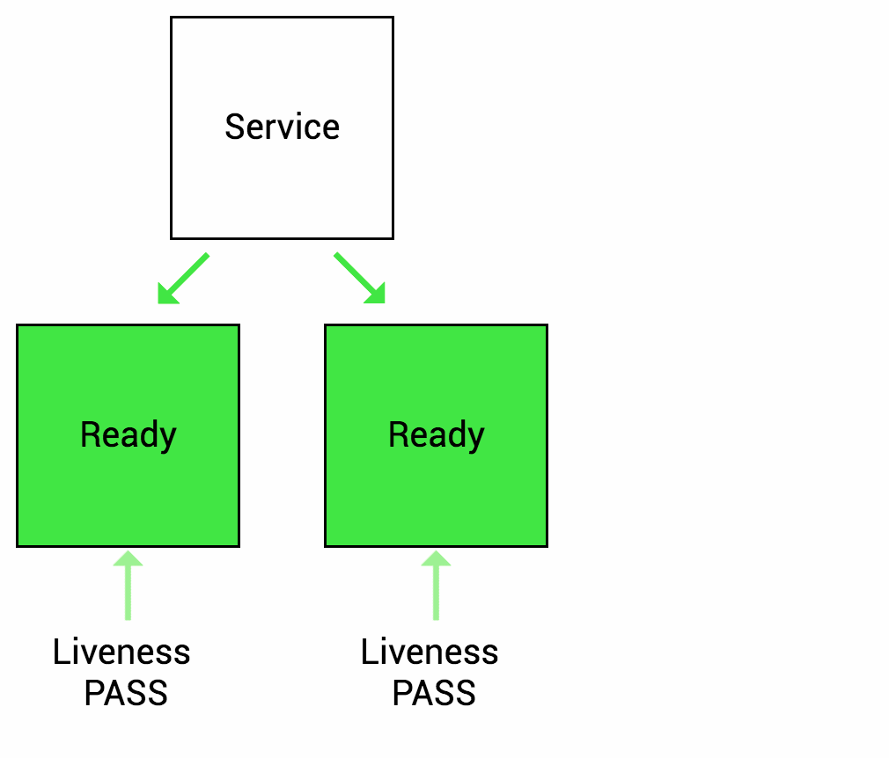
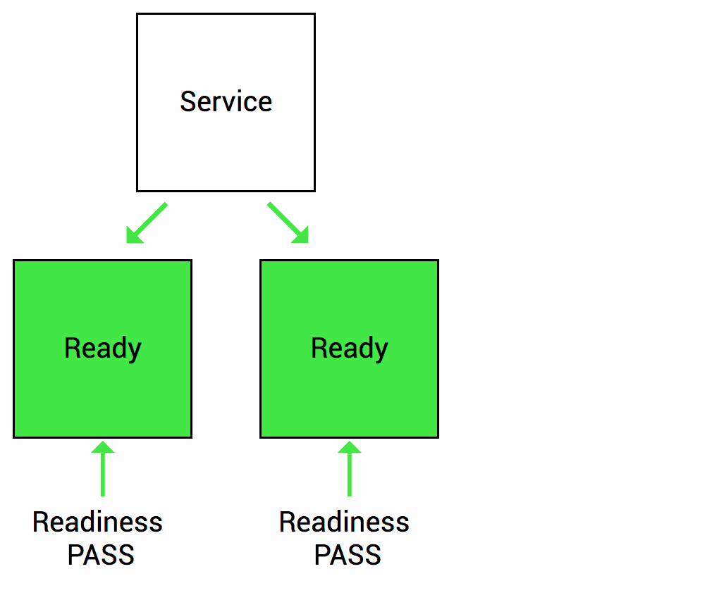

### Liveness Probe

Liveness-проба помогает контролировать состояние приложения: показывает, работает ли под с запущенным приложением или нет. Проверки выполняются периодически. В случае, если под не пройдет проверку Liveness-пробы, Kubernetes автоматически перезапустит под с приложением. Если же под с приложением запущен, проверка Liveness-пробы игнорируется.

Liveness-пробы не должны быть ресурсоемкими. Если вызывать их каждую секунду, кластер Kubernetes будет расходовать дополнительные ресурсы, а это плохое решение.

Важно грамотно использовать Liveness-пробы: их неправильная настройка может существенно навредить работоспособности приложения. Бывают случаи, когда при неправильной настройке такой пробы запущенные поды начинают хаотично перезапускаться. В качестве проверки для Liveness-пробы никогда не используйте подключения к сторонним службам, например к веб-серверу.

Many applications run for a long time, or encounter some kind of error and enter a deadlock state that cannot be recovered unless restarted. So k8s provides Liveness Probe to find and recover this state. Of course, when Liveness Probe detects an error, kubelet will take a restart action on the Pod to recover the application.

Если проба не находит живой контейнер, автоматически выполняется политика **перезапуска** контейнера.



### Readiness Probe

Readiness-проба помогает проверить, готов ли под с запущенным приложением принимать сетевой трафик. Важная особенность Readiness-пробы в том, что если проверка будет неуспешной (в нашем случае — если приложение не сможет принимать сетевой трафик), то под с приложением будет исключен из балансировки. Это значит, что новые запросы перестанут на него поступать, но сам под продолжит работу и не будет принудительно завершен. Такую особенность можно использовать, чтобы «освободить» приложение от потока поступающего сетевого трафика. Как только приложение возобновит прием трафика, под вернется обратно в балансировку.

Readiness-проба полезна больше всего, когда приложение работает со сбоями и временно не может принимать входящий трафик. Она сообщает Kubernetes, что приложение находится на этапе запуска, прежде чем начнет получать и обрабатывать сетевой трафик.

Также Readiness-пробы широко используются при первоначальном запуске: при старте масштабных приложений им может потребоваться некоторое время на запуск. Readiness-проба гарантирует, что Kubernetes не будет отправлять трафик до тех пор, пока приложение полностью не запустится.

Sometimes the application may temporarily fail to provide network services to the outside world, for example, when the load is relatively high is even, or when the application starts up it may need to load a lot of data or do some initialization actions, and needs some time to prepare to provide services to the outside world. In such cases, when the system detects that the application instance is not available, it should not kill the application restart, but should allocate traffic and not send requests to that instance (by configuring the service load). Therefore, k8s provides readiness detection to find and handle this situation. When the container in the Pod is found to be ready, the service (k8s resource pair line) of the application is set to remove the Endpoint (service endpoint) of the instance, making the traffic flow over the unavailable service instance, and then add its endpoint back to the corresponding service after the readiness is detected. Of course, if the application is started for the first time, it will wait for a successful readiness probe before adding it to the service endpoint.

Если не готово, **IP pod’а** удаляется из списка конечных точек сервиса.



kubelet производит с pod’ом три типа действия:

1. Выполняет команду в контейнере.
2. Проверяет состояние определённого порта в контейнере.
3. Выполняет запрос GET к IP-адресу контейнера.

### Startup Probe

Startup-проба проверяет, что приложение на запуске прошло инициализацию и готово принимать запросы. Когда под с приложением запущен, Kubernetes считает, что приложение в нем работает и может принимать запросы.

Однако некоторые приложения могут долго запускаться. Если Kubernetes попытается отправить запрос до запуска, они не обработаются. Предотвратить такие ситуации помогают Startup-пробы, которые сообщают кластеру Kubernetes о готовности приложения к работе. Только после этого Kubernetes будет считать, что они работают.

### Kubernetes probing methods

How does the system detect the health status of the container? k8s supports the configuration of three detection methods: Execute Command, TCP, HTTP.

All three methods can be applied to live and ready probes.

#### Execute Commands

The state of the container is determined by executing commands inside the container. If the command returns a value of 0, the container is considered healthy; if the return value is non-zero, the container is considered unhealthy. This approach is generally used in cases where the container is running an application that does not provide HTTP services and does not have any TCP ports started to provide services, and a command can be run to determine whether the application is healthy.

Here is the command to configure a Pod to use.

```
livenessProbe:
  exec:
    command:
    - sh
    - /tmp/status_check.sh
  initialDelaySeconds: 10
  periodSeconds: 5
```

```yaml
apiVersion: v1
kind: Pod
metadata:
 name: app
spec:
  containers:
    - image: example/app:v1
      name: app
      livenessProbe:
        exec:
          command:
          - cat
          - /tmp/healthy
             initialDelaySeconds: 5
```

#### HTTP

If the application is an HTTP service (or implements an HTTP service API to report health status), the probing can be done by configuring HTTP.

**HTTP-запрос для пробы работоспособности**

```
livenessProbe:
  httpGet:
    path: /health
    port: 8080
 initialDelaySeconds: 5
 periodSeconds: 3
```

```yml
apiVersion: v1
kind: Pod
metadata:
 name: app
spec:
 containers:
   - image: exmaple/app:v1
     name: app
     ports:
       - containerPort: 8080
         protocol: TCP
     livenessProbe:
       httpGet:
         path: /
         port: 3000
       initialDelaySeconds: 5
       periodSeconds: 20
```

```yaml
ports:
- name: liveness-port
  containerPort: 8080
  hostPort: 8080


livenessProbe:
  httpGet:
    path: /healthz
    port: liveness-port
  failureThreshold: 1
  periodSeconds: 10


startupProbe:
  httpGet:
    path: /healthz
    port: liveness-port
  failureThreshold: 30
  periodSeconds: 10
```

## Настройка проб

В пробах можно настроить несколько значений:

1. **initialDelaySeconds**: через сколько секунд после запуска контейнера начинаются пробы работоспособности или готовности.  
    По умолчанию — 0 секунд. Минимальное значение — 0.
2. **periodSeconds**: сколько секунд проходит между пробами.  
    По умолчанию — 10 секунд. Минимальное значение — 1.
3. **timeoutSeconds**: через сколько секунд истекает время ожидания пробы.По умолчанию — 1 секунда. Минимальное значение — 1.
4. **successThreshold**: сколько проб подряд должно завершиться успехом, чтобы проверка считалась успешной после проваленной пробы.  
    По умолчанию — 1. Для пробы работоспособности должно быть 1. Минимальное значение — 1.
5. **failureThreshold**: сколько проб должно провалиться, чтобы пришлось перезапускать контейнер (или pod был помечен как неготовый, если речь о проверке готовности). По умолчанию — 3. Минимальное значение — 1.


## Развёртывание Nginx

```
apiVersion: apps/v1
kind: Deployment
metadata:
  name: nginx-webserver
  labels:
    app: webserver
spec:
  replicas: 1
  template:
    metadata:
      labels:
        app: webserver
    spec:
      containers:
        - name: webserver
          image: nginx
          imagePullPolicy: Always
          ports:
            - containerPort: 80
          livenessProbe:
            httpGet:
              path: /
              port: 80
            initialDelaySeconds: 5
            periodSeconds: 3
          readinessProbe:
            httpGet:
              path: /
              port: 80
            initialDelaySeconds: 5
            periodSeconds: 3
```

**Для HTTP get можно настроить дополнительные параметры:**

1. path: путь для доступа на HTTP-сервере.
2. port: имя или номер порта для доступа к контейнеру. Номер должен находиться в диапазоне от 1 до 65535.
3. host: имя хоста для подключения; по умолчанию — IP pod’а. Можно задать хост в заголовках HTTP.
4. httpHeaders: кастомные заголовки для запроса. HTTP разрешает повторяющиеся заголовки.
5. scheme: схема для подключения к хосту (HTTP или HTTPS). По умолчанию — HTTP.

## Resources

- [Проверки работоспособности в Kubernetes](https://habr.com/ru/companies/slurm/articles/692450/)
- [K8S Best Practices - Health Check](https://www.sobyte.net/post/2022-05/k8s-health-checks/)
- [Configure Liveness, Readiness and Startup Probes](https://kubernetes.io/docs/tasks/configure-pod-container/configure-liveness-readiness-startup-probes/)
- 