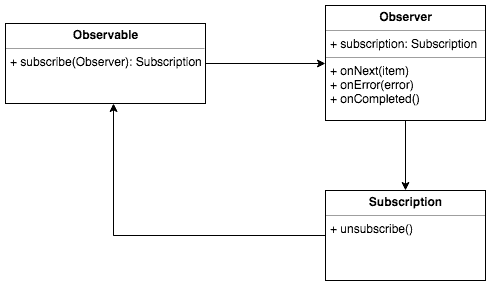

In contrast to a synchronous procedure call, where parameters are passed to the procedure, and the program flow doesn’t continue until the procedure returns the result, the caller doesn’t wait for the result in asynchronous communication. Instead, the caller registers a callback procedure that is called when the result is available. The caller can continue his work, and the callback procedure is called when the result is available. In other words, the caller passes to the asynchronous procedure also “what should happen in the future when the result is available”.

The callback pattern is usually implemented in object-oriented programming using the Observer pattern. In the observer pattern, the return value of the asynchronous procedure call is called the _Observable_, and the callback procedure is called the _Observer_:

## Resources

- [What Is Reactive Programming?](https://www.baeldung.com/cs/reactive-programming)
- 