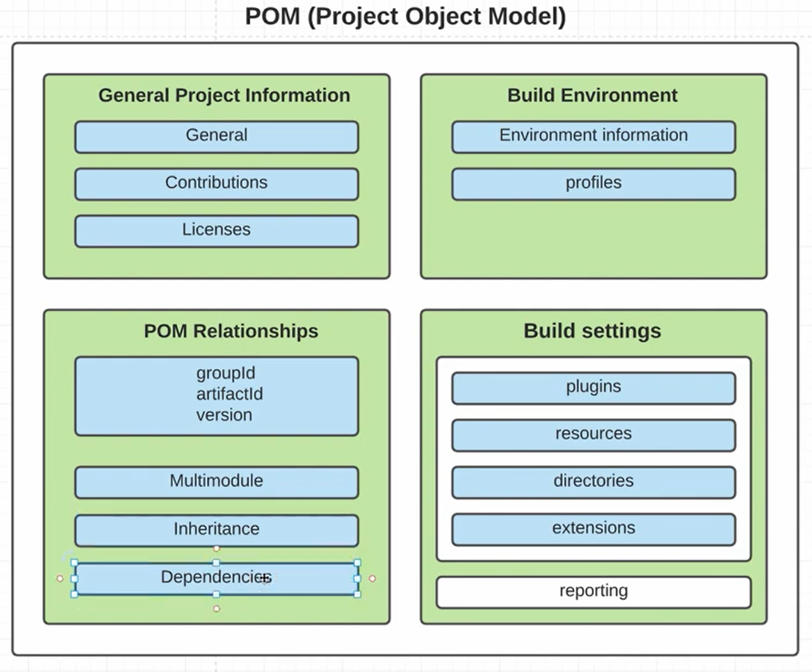

Maven - совокупность плагинов

Goal - Mojo класс, который реализует метод `execute()`, наследуя класс AbstractMojo, который имплементит интерфейс Mojo который содержит - execute, setLog, getLog

Каждый плагин содержит хотя бы help goal - `mvn compiler:help`

#### Goal archetype:generate

[Maven Quickstart Archetype](https://maven.apache.org/archetypes/maven-archetype-quickstart/)

#### Default goals

#### Pom

[Introduction to the POM](https://maven.apache.org/guides/introduction/introduction-to-the-pom.html#Super_POM)

#### [Super Pom](https://maven.apache.org/ref/3.9.9/maven-model-builder/super-pom.html)

Родитель всех pom в мавен

#### Dependency Managment

## Resources

- Курс по Maven от DM dev
- 